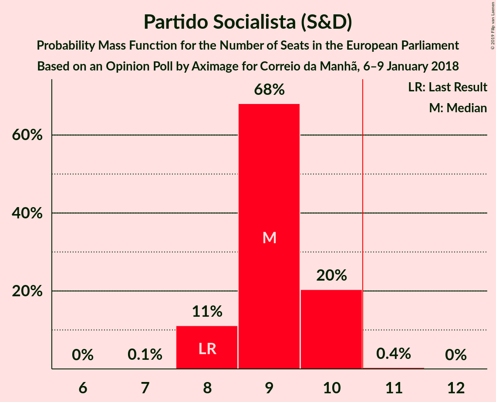
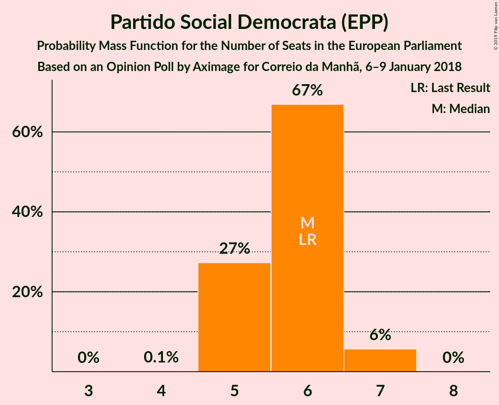
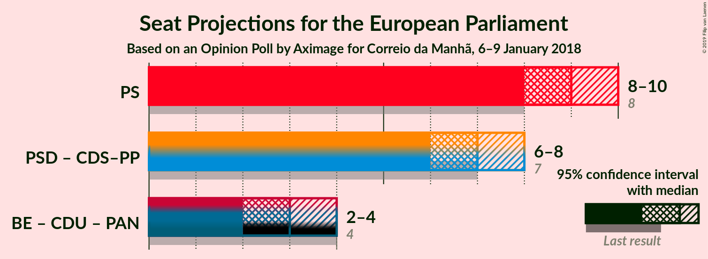

# Opinion Poll by Aximage for Correio da Manhã, 6–9 January 2018

<a href="#voting-intentions">Voting Intentions</a> | <a href="#seats">Seats</a> | <a href="#coalitions">Coalitions</a> | <a href="#technical-information">Technical Information</a>

## Voting Intentions

### Confidence Intervals

| Party | Last Result | Poll Result | 80% Confidence Interval | 90% Confidence Interval | 95% Confidence Interval | 99% Confidence Interval |
|:-----:|:-----------:|:-----------:|:-----------------------:|:-----------------------:|:-----------------------:|:-----------------------:|
| Partido Socialista (S&D) | 31.5% | 40.2% | 37.6–42.8% |36.9–43.5% |36.3–44.2% |35.1–45.4% |
| Partido Social Democrata (EPP) | 27.7% | 26.2% | 24.0–28.6% |23.3–29.2% |22.8–29.8% |21.8–31.0% |
| Bloco de Esquerda (GUE/NGL) | 4.6% | 9.2% | 7.8–10.9% |7.4–11.3% |7.1–11.8% |6.5–12.6% |
| Coligação Democrática Unitária (Greens/EFA) | 12.7% | 6.8% | 5.7–8.3% |5.3–8.8% |5.1–9.1% |4.6–9.9% |
| CDS–Partido Popular (EPP) | 27.7% | 6.2% | 5.1–7.6% |4.8–8.0% |4.5–8.4% |4.0–9.1% |

*Note:* The poll result column reflects the actual value used in the calculations. Published results may vary slightly, and in addition be rounded to fewer digits.

## Seats

### Confidence Intervals

| Party | Last Result | Median | 80% Confidence Interval | 90% Confidence Interval | 95% Confidence Interval | 99% Confidence Interval |
|:-----:|:-----------:|:------:|:-----------------------:|:-----------------------:|:-----------------------:|:-----------------------:|
| <a href="#partido-socialista-(s&d)">Partido Socialista (S&D)</a> | 8 | 10 | 9–10 |9–10 |9–10 |8–10 |
| <a href="#partido-social-democrata-(epp)">Partido Social Democrata (EPP)</a> | 6 | 6 | 5–6 |4–6 |4–7 |4–7 |
| <a href="#bloco-de-esquerda-(gue/ngl)">Bloco de Esquerda (GUE/NGL)</a> | 1 | 2 | 1–2 |1–2 |1–2 |1–3 |
| <a href="#coligação-democrática-unitária-(greens/efa)">Coligação Democrática Unitária (Greens/EFA)</a> | 3 | 1 | 0–2 |0–2 |0–2 |0–2 |
| <a href="#cds–partido-popular-(epp)">CDS–Partido Popular (EPP)</a> | 1 | 1 | 0–1 |0–1 |0–2 |0–2 |

### Partido Socialista (S&D)

*For a full overview of the results for this party, see the [Partido Socialista (S&D)](party-partidosocialistasd.html) page.*

| Number of Seats | Probability | Accumulated | Special Marks |
|:---------------:|:-----------:|:-----------:|:-------------:|
| 7 | 0.1% | 100% |  |
| 8 | 2% | 99.9% | Last Result |
| 9 | 20% | 98% |  |
| 10 | 78% | 78% | Median |
| 11 | 0.1% | 0.1% | Majority |
| 12 | 0% | 0% |  |

### Partido Social Democrata (EPP)

*For a full overview of the results for this party, see the [Partido Social Democrata (EPP)](party-partidosocialdemocrataepp.html) page.*

| Number of Seats | Probability | Accumulated | Special Marks |
|:---------------:|:-----------:|:-----------:|:-------------:|
| 4 | 9% | 100% |  |
| 5 | 26% | 91% |  |
| 6 | 60% | 65% | Last Result, Median |
| 7 | 5% | 5% |  |
| 8 | 0% | 0% |  |

### Bloco de Esquerda (GUE/NGL)

*For a full overview of the results for this party, see the [Bloco de Esquerda (GUE/NGL)](party-blocodeesquerdaguengl.html) page.*

| Number of Seats | Probability | Accumulated | Special Marks |
|:---------------:|:-----------:|:-----------:|:-------------:|
| 1 | 17% | 100% | Last Result |
| 2 | 80% | 83% | Median |
| 3 | 2% | 2% |  |
| 4 | 0% | 0% |  |

### Coligação Democrática Unitária (Greens/EFA)

*For a full overview of the results for this party, see the [Coligação Democrática Unitária (Greens/EFA)](party-coligaçãodemocráticaunitáriagreensefa.html) page.*

| Number of Seats | Probability | Accumulated | Special Marks |
|:---------------:|:-----------:|:-----------:|:-------------:|
| 0 | 19% | 100% |  |
| 1 | 60% | 81% | Median |
| 2 | 21% | 21% |  |
| 3 | 0% | 0% | Last Result |

### CDS–Partido Popular (EPP)

*For a full overview of the results for this party, see the [CDS–Partido Popular (EPP)](party-cds–partidopopularepp.html) page.*

| Number of Seats | Probability | Accumulated | Special Marks |
|:---------------:|:-----------:|:-----------:|:-------------:|
| 0 | 49% | 100% |  |
| 1 | 48% | 51% | Last Result, Median |
| 2 | 3% | 3% |  |
| 3 | 0% | 0% |  |

## Coalitions

### Confidence Intervals

| Coalition | Last Result | Median | Majority? | 80% Confidence Interval | 90% Confidence Interval | 95% Confidence Interval | 99% Confidence Interval |
|:---------:|:-----------:|:------:|:---------:|:-----------------------:|:-----------------------:|:-----------------------:|:-----------------------:|
| Partido Socialista (S&D) | 8 | 10 | 0.1% | 9–10 | 9–10 | 9–10 | 8–10 |
| Partido Social Democrata (EPP) – CDS–Partido Popular (EPP) | 7 | 6 | 0% | 5–7 | 5–7 | 5–8 | 5–8 |
| Coligação Democrática Unitária (Greens/EFA) | 3 | 1 | 0% | 0–2 | 0–2 | 0–2 | 0–2 |

### Partido Socialista (S&D)

| Number of Seats | Probability | Accumulated | Special Marks |
|:---------------:|:-----------:|:-----------:|:-------------:|
| 7 | 0.1% | 100% |  |
| 8 | 2% | 99.9% | Last Result |
| 9 | 20% | 98% |  |
| 10 | 78% | 78% | Median |
| 11 | 0.1% | 0.1% | Majority |
| 12 | 0% | 0% |  |

### Partido Social Democrata (EPP) – CDS–Partido Popular (EPP)

| Number of Seats | Probability | Accumulated | Special Marks |
|:---------------:|:-----------:|:-----------:|:-------------:|
| 5 | 20% | 100% |  |
| 6 | 50% | 80% |  |
| 7 | 25% | 30% | Last Result, Median |
| 8 | 5% | 5% |  |
| 9 | 0% | 0% |  |

### Coligação Democrática Unitária (Greens/EFA)

| Number of Seats | Probability | Accumulated | Special Marks |
|:---------------:|:-----------:|:-----------:|:-------------:|
| 0 | 19% | 100% |  |
| 1 | 60% | 81% | Median |
| 2 | 21% | 21% |  |
| 3 | 0% | 0% | Last Result |

## Technical Information

### Opinion Poll

+ **Polling firm:** Aximage
+ **Commissioner(s):** Correio da Manhã
+ **Fieldwork period:** 6–9 January 2018

### Calculations

+ **Sample size:** 600
+ **Simulations done:** 1,024
+ **Error estimate:** 5.15%

