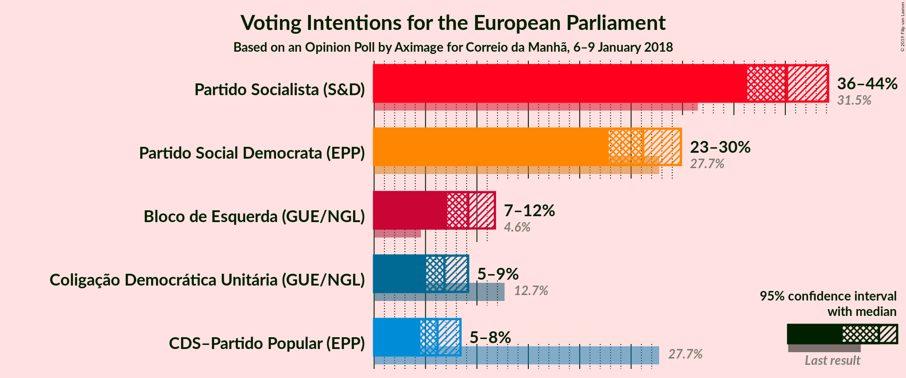

# Opinion Poll by Aximage for Correio da Manhã, 6–9 January 2018

<a href="#voting-intentions">Voting Intentions</a> | <a href="#seats">Seats</a> | <a href="#coalitions">Coalitions</a> | <a href="#technical-information">Technical Information</a>

## Voting Intentions

### Confidence Intervals

| Party | Last Result | Poll Result | 80% Confidence Interval | 90% Confidence Interval | 95% Confidence Interval | 99% Confidence Interval |
|:-----:|:-----------:|:-----------:|:-----------------------:|:-----------------------:|:-----------------------:|:-----------------------:|
| Partido Socialista (S&D) | 31.5% | 40.2% | 37.6–42.8% |36.9–43.5% |36.3–44.2% |35.1–45.4% |
| Partido Social Democrata (EPP) | 27.7% | 26.2% | 24.0–28.6% |23.3–29.2% |22.8–29.8% |21.8–31.0% |
| Bloco de Esquerda (GUE/NGL) | 4.6% | 9.2% | 7.8–10.9% |7.4–11.3% |7.1–11.8% |6.5–12.6% |
| Coligação Democrática Unitária (GUE/NGL) | N/A | 6.8% | 5.7–8.3% |5.3–8.8% |5.1–9.1% |4.6–9.9% |
| CDS–Partido Popular (EPP) | 27.7% | 6.2% | 5.1–7.6% |4.8–8.0% |4.5–8.4% |4.0–9.1% |

*Note:* The poll result column reflects the actual value used in the calculations. Published results may vary slightly, and in addition be rounded to fewer digits.

## Seats

### Confidence Intervals

| Party | Last Result | Median | 80% Confidence Interval | 90% Confidence Interval | 95% Confidence Interval | 99% Confidence Interval |
|:-----:|:-----------:|:------:|:-----------------------:|:-----------------------:|:-----------------------:|:-----------------------:|
| <a href="#partido-socialista-(s&d)">Partido Socialista (S&D)</a> | 8 | 9 | 8–10 |8–10 |8–10 |8–10 |
| <a href="#partido-social-democrata-(epp)">Partido Social Democrata (EPP)</a> | 6 | 6 | 5–6 |5–7 |5–7 |5–7 |
| <a href="#bloco-de-esquerda-(gue/ngl)">Bloco de Esquerda (GUE/NGL)</a> | 1 | 2 | 1–2 |1–2 |1–2 |1–3 |
| <a href="#coligação-democrática-unitária-(gue/ngl)">Coligação Democrática Unitária (GUE/NGL)</a> | N/A | 1 | 1 |1–2 |1–2 |1–2 |
| <a href="#cds–partido-popular-(epp)">CDS–Partido Popular (EPP)</a> | 1 | 1 | 1 |1 |1–2 |0–2 |

