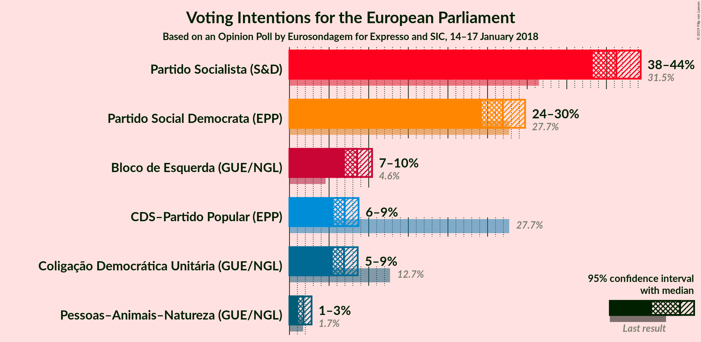

# Opinion Poll by Eurosondagem for Expresso and SIC, 14–17 January 2018

<a href="#voting-intentions">Voting Intentions</a> | <a href="#seats">Seats</a> | <a href="#coalitions">Coalitions</a> | <a href="#technical-information">Technical Information</a>

## Voting Intentions

### Confidence Intervals

| Party | Last Result | Poll Result | 80% Confidence Interval | 90% Confidence Interval | 95% Confidence Interval | 99% Confidence Interval |
|:-----:|:-----------:|:-----------:|:-----------------------:|:-----------------------:|:-----------------------:|:-----------------------:|
| Partido Socialista (S&D) | 31.5% | 41.3% | 39.3–43.3% |38.7–43.8% |38.3–44.3% |37.3–45.3% |
| Partido Social Democrata (EPP) | 27.7% | 26.9% | 25.2–28.8% |24.7–29.3% |24.3–29.7% |23.5–30.6% |
| Bloco de Esquerda (GUE/NGL) | 4.6% | 8.5% | 7.5–9.8% |7.2–10.1% |7.0–10.4% |6.5–11.1% |
| CDS–Partido Popular (EPP) | 27.7% | 7.0% | 6.1–8.1% |5.8–8.4% |5.6–8.7% |5.2–9.3% |
| Coligação Democrática Unitária (GUE/NGL) | N/A | 6.9% | 6.0–8.0% |5.7–8.3% |5.5–8.6% |5.1–9.2% |
| Pessoas–Animais–Natureza (GUE/NGL) | 1.7% | 1.8% | 1.3–2.4% |1.2–2.6% |1.1–2.8% |0.9–3.1% |

*Note:* The poll result column reflects the actual value used in the calculations. Published results may vary slightly, and in addition be rounded to fewer digits.

## Seats

### Confidence Intervals

| Party | Last Result | Median | 80% Confidence Interval | 90% Confidence Interval | 95% Confidence Interval | 99% Confidence Interval |
|:-----:|:-----------:|:------:|:-----------------------:|:-----------------------:|:-----------------------:|:-----------------------:|
| <a href="#partido-socialista-(s&d)">Partido Socialista (S&D)</a> | 8 | 10 | 9–10 |9–10 |9–11 |9–11 |
| <a href="#partido-social-democrata-(epp)">Partido Social Democrata (EPP)</a> | 6 | 6 | 6–7 |6–7 |5–7 |5–7 |
| <a href="#bloco-de-esquerda-(gue/ngl)">Bloco de Esquerda (GUE/NGL)</a> | 1 | 2 | 1–2 |1–2 |1–2 |1–2 |
| <a href="#cds–partido-popular-(epp)">CDS–Partido Popular (EPP)</a> | 1 | 1 | 1 |1–2 |1–2 |1–2 |
| <a href="#coligação-democrática-unitária-(gue/ngl)">Coligação Democrática Unitária (GUE/NGL)</a> | N/A | 1 | 1 |1–2 |1–2 |1–2 |
| <a href="#pessoas–animais–natureza-(gue/ngl)">Pessoas–Animais–Natureza (GUE/NGL)</a> | 0 | 0 | 0 |0 |0 |0 |

