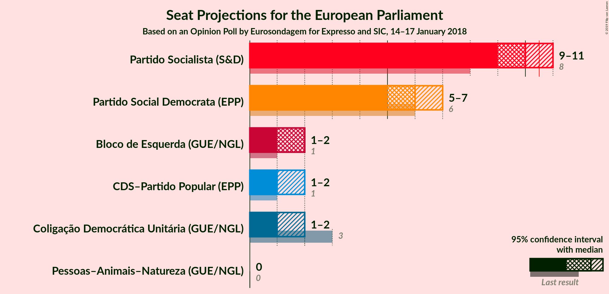
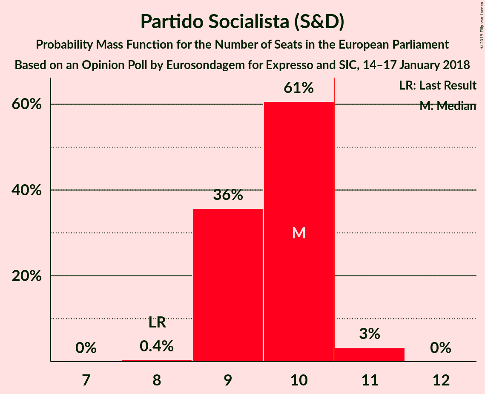
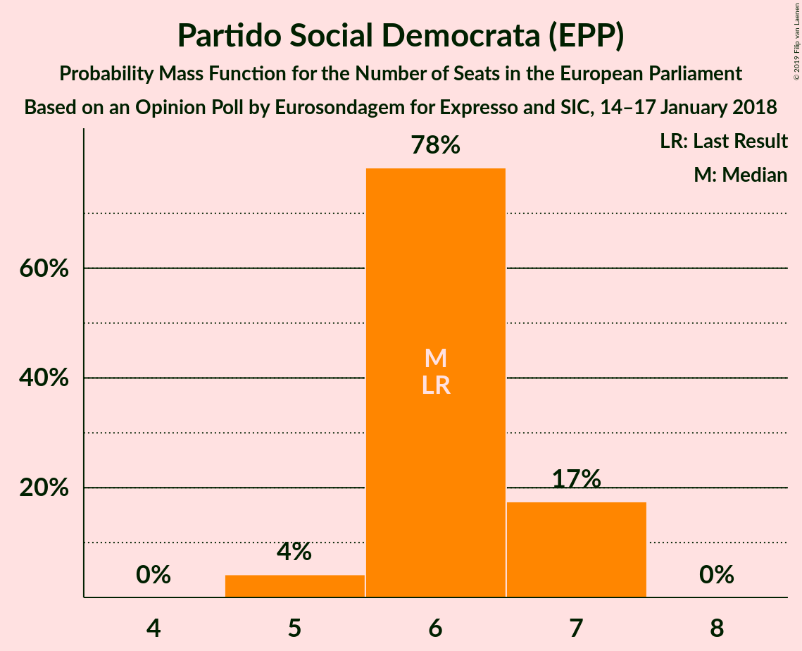
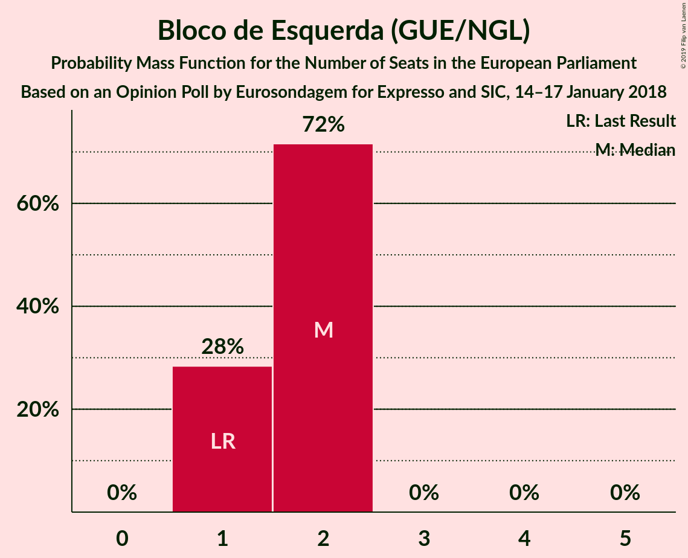
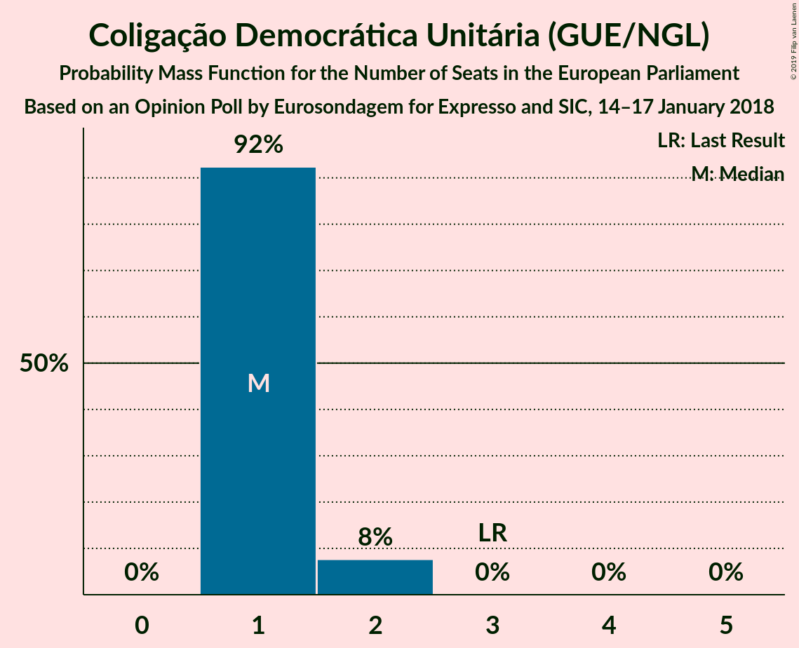
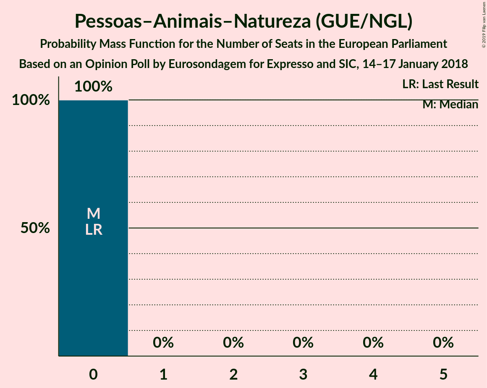
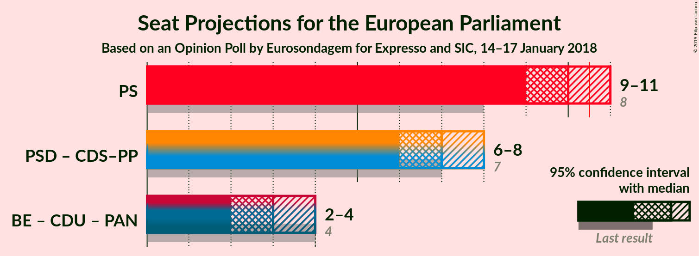

# Opinion Poll by Eurosondagem for Expresso and SIC, 14–17 January 2018

<a href="#voting-intentions">Voting Intentions</a> | <a href="#seats">Seats</a> | <a href="#coalitions">Coalitions</a> | <a href="#technical-information">Technical Information</a>

## Voting Intentions

### Confidence Intervals

| Party | Last Result | Poll Result | 80% Confidence Interval | 90% Confidence Interval | 95% Confidence Interval | 99% Confidence Interval |
|:-----:|:-----------:|:-----------:|:-----------------------:|:-----------------------:|:-----------------------:|:-----------------------:|
| Partido Socialista (S&D) | 31.5% | 41.3% | 39.3–43.3% |38.7–43.8% |38.3–44.3% |37.3–45.3% |
| Partido Social Democrata (EPP) | 27.7% | 26.9% | 25.2–28.8% |24.7–29.3% |24.3–29.7% |23.5–30.6% |
| Bloco de Esquerda (GUE/NGL) | 4.6% | 8.5% | 7.5–9.8% |7.2–10.1% |7.0–10.4% |6.5–11.1% |
| CDS–Partido Popular (EPP) | 27.7% | 7.0% | 6.1–8.1% |5.8–8.4% |5.6–8.7% |5.2–9.3% |
| Coligação Democrática Unitária (GUE/NGL) | 12.7% | 6.9% | 6.0–8.0% |5.7–8.3% |5.5–8.6% |5.1–9.2% |
| Pessoas–Animais–Natureza (GUE/NGL) | 1.7% | 1.8% | 1.3–2.4% |1.2–2.6% |1.1–2.8% |0.9–3.1% |

*Note:* The poll result column reflects the actual value used in the calculations. Published results may vary slightly, and in addition be rounded to fewer digits.

## Seats

### Confidence Intervals

| Party | Last Result | Median | 80% Confidence Interval | 90% Confidence Interval | 95% Confidence Interval | 99% Confidence Interval |
|:-----:|:-----------:|:------:|:-----------------------:|:-----------------------:|:-----------------------:|:-----------------------:|
| <a href="#partido-socialista-(s&d)">Partido Socialista (S&D)</a> | 8 | 10 | 9–10 |9–10 |9–11 |9–11 |
| <a href="#partido-social-democrata-(epp)">Partido Social Democrata (EPP)</a> | 6 | 6 | 6–7 |6–7 |5–7 |5–7 |
| <a href="#bloco-de-esquerda-(gue/ngl)">Bloco de Esquerda (GUE/NGL)</a> | 1 | 2 | 1–2 |1–2 |1–2 |1–2 |
| <a href="#cds–partido-popular-(epp)">CDS–Partido Popular (EPP)</a> | 1 | 1 | 1 |1–2 |1–2 |1–2 |
| <a href="#coligação-democrática-unitária-(gue/ngl)">Coligação Democrática Unitária (GUE/NGL)</a> | 3 | 1 | 1 |1–2 |1–2 |1–2 |
| <a href="#pessoas–animais–natureza-(gue/ngl)">Pessoas–Animais–Natureza (GUE/NGL)</a> | 0 | 0 | 0 |0 |0 |0 |

### Partido Socialista (S&D)

*For a full overview of the results for this party, see the [Partido Socialista (S&D)](party-partidosocialistasd.html) page.*

| Number of Seats | Probability | Accumulated | Special Marks |
|:---------------:|:-----------:|:-----------:|:-------------:|
| 8 | 0.4% | 100% | Last Result |
| 9 | 35% | 99.6% |  |
| 10 | 61% | 64% | Median |
| 11 | 3% | 3% | Majority |
| 12 | 0% | 0% |  |

### Partido Social Democrata (EPP)

*For a full overview of the results for this party, see the [Partido Social Democrata (EPP)](party-partidosocialdemocrataepp.html) page.*

| Number of Seats | Probability | Accumulated | Special Marks |
|:---------------:|:-----------:|:-----------:|:-------------:|
| 5 | 4% | 100% |  |
| 6 | 79% | 96% | Last Result, Median |
| 7 | 17% | 17% |  |
| 8 | 0% | 0% |  |

### Bloco de Esquerda (GUE/NGL)

*For a full overview of the results for this party, see the [Bloco de Esquerda (GUE/NGL)](party-blocodeesquerdaguengl.html) page.*

| Number of Seats | Probability | Accumulated | Special Marks |
|:---------------:|:-----------:|:-----------:|:-------------:|
| 1 | 27% | 100% | Last Result |
| 2 | 73% | 73% | Median |
| 3 | 0% | 0% |  |

### CDS–Partido Popular (EPP)

*For a full overview of the results for this party, see the [CDS–Partido Popular (EPP)](party-cds–partidopopularepp.html) page.*

| Number of Seats | Probability | Accumulated | Special Marks |
|:---------------:|:-----------:|:-----------:|:-------------:|
| 1 | 91% | 100% | Last Result, Median |
| 2 | 9% | 9% |  |
| 3 | 0% | 0% |  |

### Coligação Democrática Unitária (GUE/NGL)

*For a full overview of the results for this party, see the [Coligação Democrática Unitária (GUE/NGL)](party-coligaçãodemocráticaunitáriaguengl.html) page.*

| Number of Seats | Probability | Accumulated | Special Marks |
|:---------------:|:-----------:|:-----------:|:-------------:|
| 1 | 93% | 100% | Median |
| 2 | 7% | 7% |  |
| 3 | 0% | 0% | Last Result |

### Pessoas–Animais–Natureza (GUE/NGL)

*For a full overview of the results for this party, see the [Pessoas–Animais–Natureza (GUE/NGL)](party-pessoas–animais–naturezaguengl.html) page.*

| Number of Seats | Probability | Accumulated | Special Marks |
|:---------------:|:-----------:|:-----------:|:-------------:|
| 0 | 100% | 100% | Last Result, Median |

## Coalitions

### Confidence Intervals

| Coalition | Last Result | Median | Majority? | 80% Confidence Interval | 90% Confidence Interval | 95% Confidence Interval | 99% Confidence Interval |
|:---------:|:-----------:|:------:|:---------:|:-----------------------:|:-----------------------:|:-----------------------:|:-----------------------:|
| Partido Socialista (S&D) | 8 | 10 | 3% | 9–10 | 9–10 | 9–11 | 9–11 |
| Partido Social Democrata (EPP) – CDS–Partido Popular (EPP) | 7 | 7 | 0% | 7–8 | 7–8 | 6–8 | 6–9 |
| Bloco de Esquerda (GUE/NGL) – Coligação Democrática Unitária (GUE/NGL) – Pessoas–Animais–Natureza (GUE/NGL) | 4 | 3 | 0% | 2–3 | 2–3 | 2–4 | 2–4 |

### Partido Socialista (S&D)

| Number of Seats | Probability | Accumulated | Special Marks |
|:---------------:|:-----------:|:-----------:|:-------------:|
| 8 | 0.4% | 100% | Last Result |
| 9 | 35% | 99.6% |  |
| 10 | 61% | 64% | Median |
| 11 | 3% | 3% | Majority |
| 12 | 0% | 0% |  |

### Partido Social Democrata (EPP) – CDS–Partido Popular (EPP)

| Number of Seats | Probability | Accumulated | Special Marks |
|:---------------:|:-----------:|:-----------:|:-------------:|
| 6 | 3% | 100% |  |
| 7 | 73% | 97% | Last Result, Median |
| 8 | 23% | 24% |  |
| 9 | 0.6% | 0.6% |  |
| 10 | 0% | 0% |  |

### Bloco de Esquerda (GUE/NGL) – Coligação Democrática Unitária (GUE/NGL) – Pessoas–Animais–Natureza (GUE/NGL)

| Number of Seats | Probability | Accumulated | Special Marks |
|:---------------:|:-----------:|:-----------:|:-------------:|
| 2 | 24% | 100% |  |
| 3 | 72% | 76% | Median |
| 4 | 4% | 4% | Last Result |
| 5 | 0% | 0% |  |

## Technical Information

### Opinion Poll

+ **Polling firm:** Eurosondagem
+ **Commissioner(s):** Expresso and SIC
+ **Fieldwork period:** 14–17 January 2018

### Calculations

+ **Sample size:** 1018
+ **Simulations done:** 524,288
+ **Error estimate:** 1.60%

