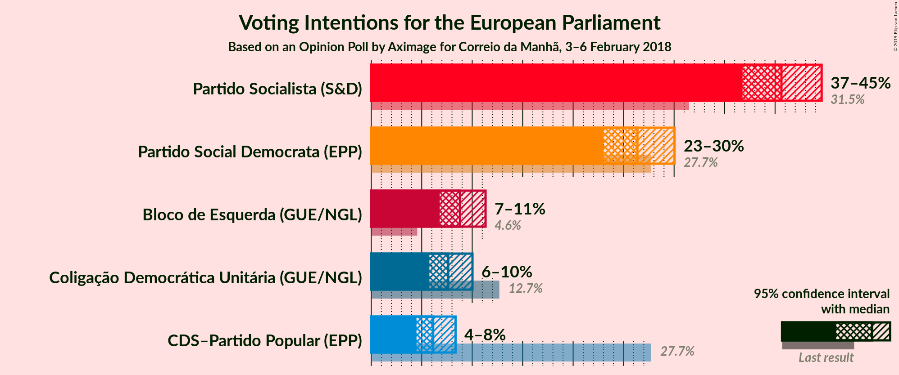
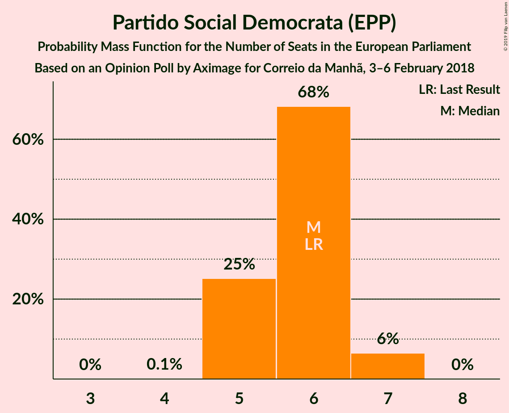
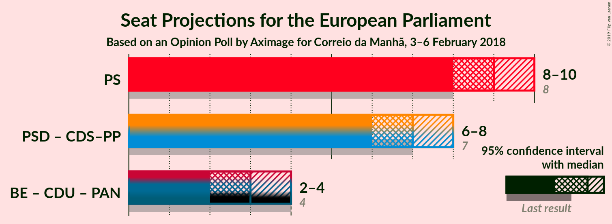

# Opinion Poll by Aximage for Correio da Manhã, 3–6 February 2018

<a href="#voting-intentions">Voting Intentions</a> | <a href="#seats">Seats</a> | <a href="#coalitions">Coalitions</a> | <a href="#technical-information">Technical Information</a>

## Voting Intentions

### Confidence Intervals

| Party | Last Result | Poll Result | 80% Confidence Interval | 90% Confidence Interval | 95% Confidence Interval | 99% Confidence Interval |
|:-----:|:-----------:|:-----------:|:-----------------------:|:-----------------------:|:-----------------------:|:-----------------------:|
| Partido Socialista (S&D) | 31.5% | 40.6% | 38.1–43.2% |37.4–44.0% |36.8–44.6% |35.6–45.9% |
| Partido Social Democrata (EPP) | 27.7% | 26.4% | 24.2–28.8% |23.5–29.4% |23.0–30.0% |22.0–31.2% |
| Bloco de Esquerda (GUE/NGL) | 4.6% | 8.8% | 7.5–10.4% |7.1–10.9% |6.8–11.3% |6.2–12.2% |
| Coligação Democrática Unitária (Greens/EFA) | 12.7% | 7.6% | 6.4–9.2% |6.1–9.6% |5.8–10.0% |5.2–10.8% |
| CDS–Partido Popular (EPP) | 27.7% | 6.1% | 5.0–7.6% |4.7–8.0% |4.5–8.4% |4.0–9.1% |

*Note:* The poll result column reflects the actual value used in the calculations. Published results may vary slightly, and in addition be rounded to fewer digits.

## Seats

### Confidence Intervals

| Party | Last Result | Median | 80% Confidence Interval | 90% Confidence Interval | 95% Confidence Interval | 99% Confidence Interval |
|:-----:|:-----------:|:------:|:-----------------------:|:-----------------------:|:-----------------------:|:-----------------------:|
| <a href="#partido-socialista-(s&d)">Partido Socialista (S&D)</a> | 8 | 9 | 9–10 |8–10 |8–10 |8–11 |
| <a href="#partido-social-democrata-(epp)">Partido Social Democrata (EPP)</a> | 6 | 6 | 5–6 |5–7 |5–7 |5–7 |
| <a href="#bloco-de-esquerda-(gue/ngl)">Bloco de Esquerda (GUE/NGL)</a> | 1 | 2 | 1–2 |1–2 |1–2 |1–2 |
| <a href="#coligação-democrática-unitária-(greens/efa)">Coligação Democrática Unitária (Greens/EFA)</a> | 3 | 1 | 1–2 |1–2 |1–2 |1–2 |
| <a href="#cds–partido-popular-(epp)">CDS–Partido Popular (EPP)</a> | 1 | 1 | 1 |1 |1–2 |0–2 |

### Partido Socialista (S&D)

*For a full overview of the results for this party, see the [Partido Socialista (S&D)](party-partidosocialistasd.html) page.*

| Number of Seats | Probability | Accumulated | Special Marks |
|:---------------:|:-----------:|:-----------:|:-------------:|
| 8 | 9% | 100% | Last Result |
| 9 | 63% | 91% | Median |
| 10 | 28% | 28% |  |
| 11 | 0.7% | 0.7% | Majority |
| 12 | 0% | 0% |  |

### Partido Social Democrata (EPP)

*For a full overview of the results for this party, see the [Partido Social Democrata (EPP)](party-partidosocialdemocrataepp.html) page.*

| Number of Seats | Probability | Accumulated | Special Marks |
|:---------------:|:-----------:|:-----------:|:-------------:|
| 4 | 0.1% | 100% |  |
| 5 | 25% | 99.9% |  |
| 6 | 68% | 75% | Last Result, Median |
| 7 | 6% | 6% |  |
| 8 | 0% | 0% |  |

### Bloco de Esquerda (GUE/NGL)

*For a full overview of the results for this party, see the [Bloco de Esquerda (GUE/NGL)](party-blocodeesquerdaguengl.html) page.*

| Number of Seats | Probability | Accumulated | Special Marks |
|:---------------:|:-----------:|:-----------:|:-------------:|
| 1 | 33% | 100% | Last Result |
| 2 | 67% | 67% | Median |
| 3 | 0.2% | 0.2% |  |
| 4 | 0% | 0% |  |

### Coligação Democrática Unitária (Greens/EFA)

*For a full overview of the results for this party, see the [Coligação Democrática Unitária (Greens/EFA)](party-coligaçãodemocráticaunitáriagreensefa.html) page.*

| Number of Seats | Probability | Accumulated | Special Marks |
|:---------------:|:-----------:|:-----------:|:-------------:|
| 1 | 74% | 100% | Median |
| 2 | 26% | 26% |  |
| 3 | 0% | 0% | Last Result |

### CDS–Partido Popular (EPP)

*For a full overview of the results for this party, see the [CDS–Partido Popular (EPP)](party-cds–partidopopularepp.html) page.*

| Number of Seats | Probability | Accumulated | Special Marks |
|:---------------:|:-----------:|:-----------:|:-------------:|
| 0 | 1.0% | 100% |  |
| 1 | 96% | 99.0% | Last Result, Median |
| 2 | 3% | 3% |  |
| 3 | 0% | 0% |  |

## Coalitions

### Confidence Intervals

| Coalition | Last Result | Median | Majority? | 80% Confidence Interval | 90% Confidence Interval | 95% Confidence Interval | 99% Confidence Interval |
|:---------:|:-----------:|:------:|:---------:|:-----------------------:|:-----------------------:|:-----------------------:|:-----------------------:|
| Partido Socialista (S&D) | 8 | 9 | 0.7% | 9–10 | 8–10 | 8–10 | 8–11 |
| Partido Social Democrata (EPP) – CDS–Partido Popular (EPP) | 7 | 7 | 0% | 6–7 | 6–8 | 6–8 | 6–8 |
| Coligação Democrática Unitária (Greens/EFA) | 3 | 1 | 0% | 1–2 | 1–2 | 1–2 | 1–2 |

### Partido Socialista (S&D)

| Number of Seats | Probability | Accumulated | Special Marks |
|:---------------:|:-----------:|:-----------:|:-------------:|
| 8 | 9% | 100% | Last Result |
| 9 | 63% | 91% | Median |
| 10 | 28% | 28% |  |
| 11 | 0.7% | 0.7% | Majority |
| 12 | 0% | 0% |  |

### Partido Social Democrata (EPP) – CDS–Partido Popular (EPP)

| Number of Seats | Probability | Accumulated | Special Marks |
|:---------------:|:-----------:|:-----------:|:-------------:|
| 5 | 0.2% | 100% |  |
| 6 | 25% | 99.8% |  |
| 7 | 68% | 75% | Last Result, Median |
| 8 | 8% | 8% |  |
| 9 | 0.1% | 0.1% |  |
| 10 | 0% | 0% |  |

### Coligação Democrática Unitária (Greens/EFA)

| Number of Seats | Probability | Accumulated | Special Marks |
|:---------------:|:-----------:|:-----------:|:-------------:|
| 1 | 74% | 100% | Median |
| 2 | 26% | 26% |  |
| 3 | 0% | 0% | Last Result |

## Technical Information

### Opinion Poll

+ **Polling firm:** Aximage
+ **Commissioner(s):** Correio da Manhã
+ **Fieldwork period:** 3–6 February 2018

### Calculations

+ **Sample size:** 603
+ **Simulations done:** 1,048,576
+ **Error estimate:** 0.49%

