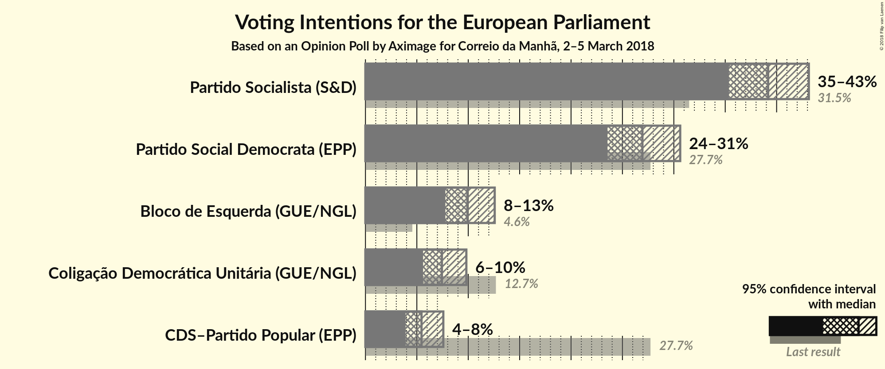
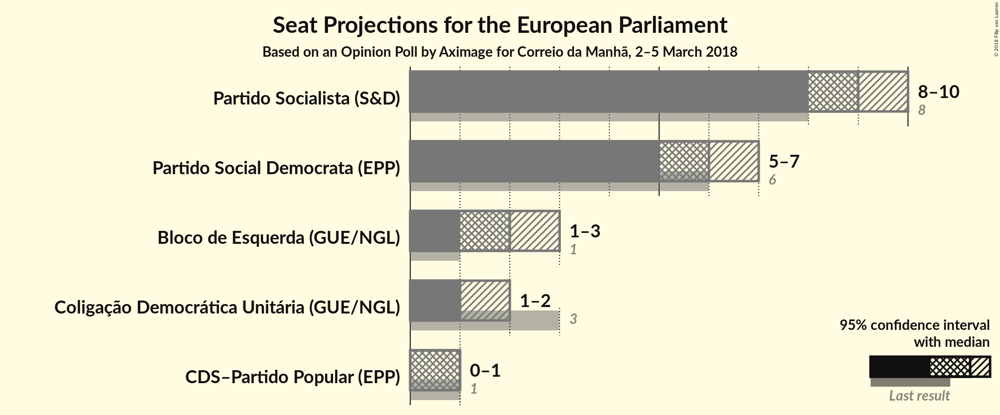
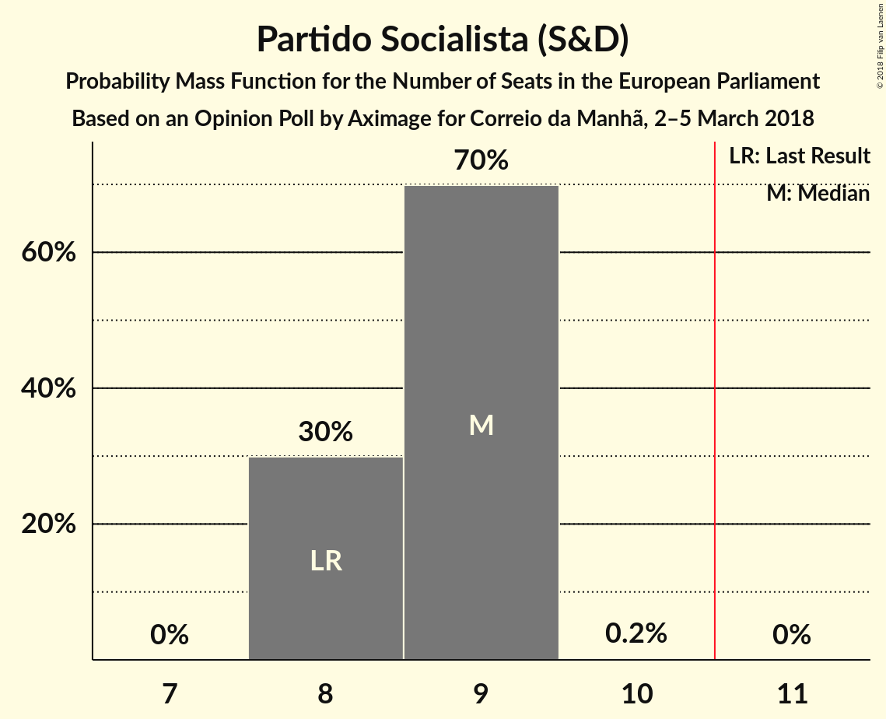
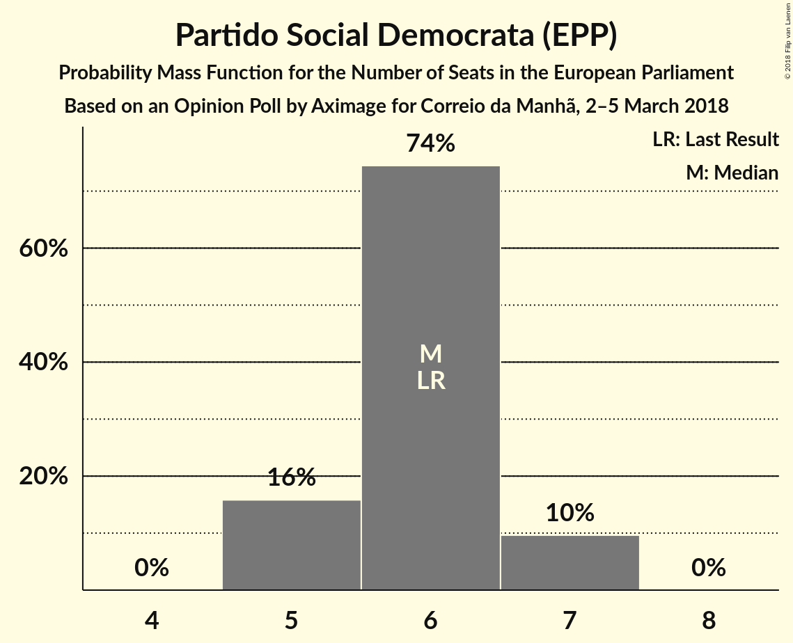
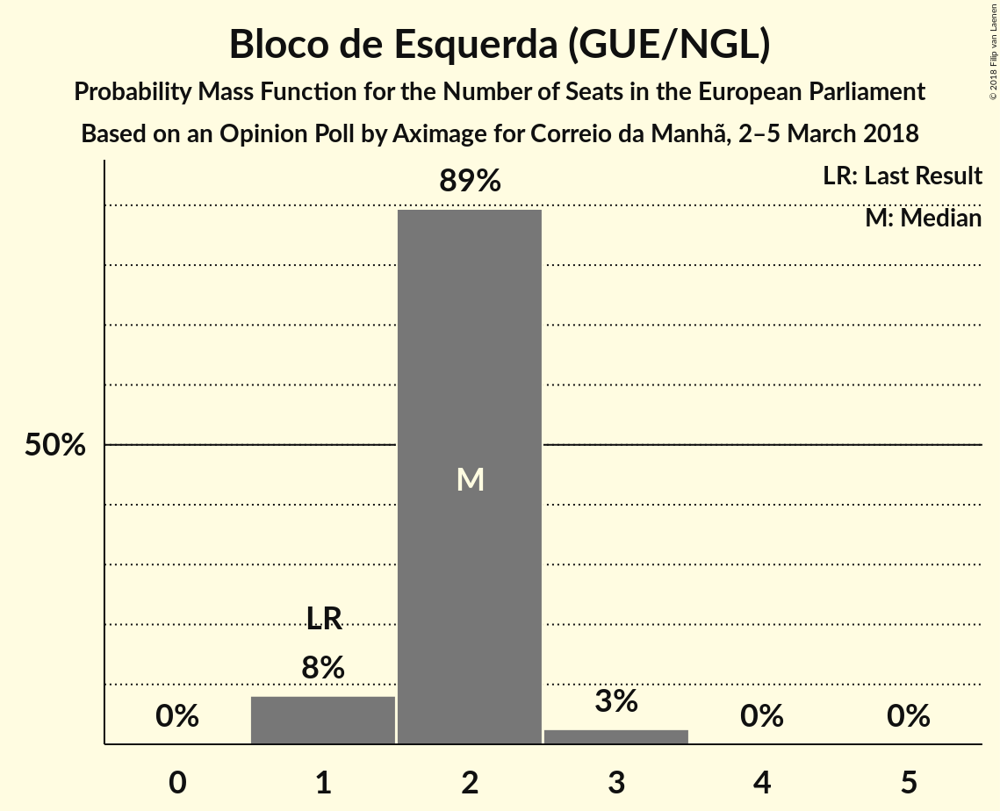
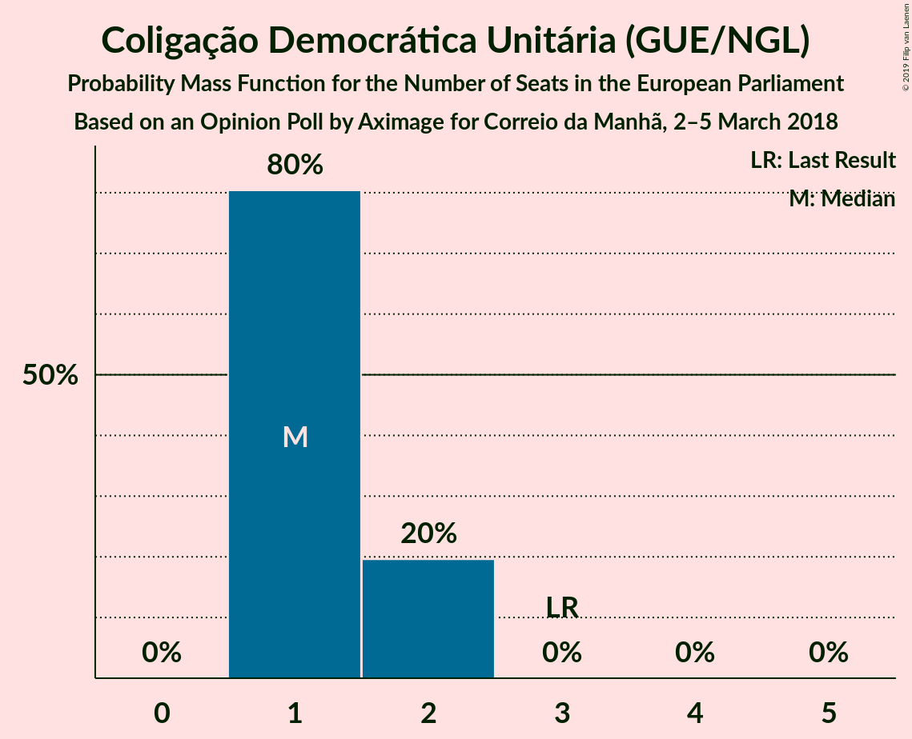
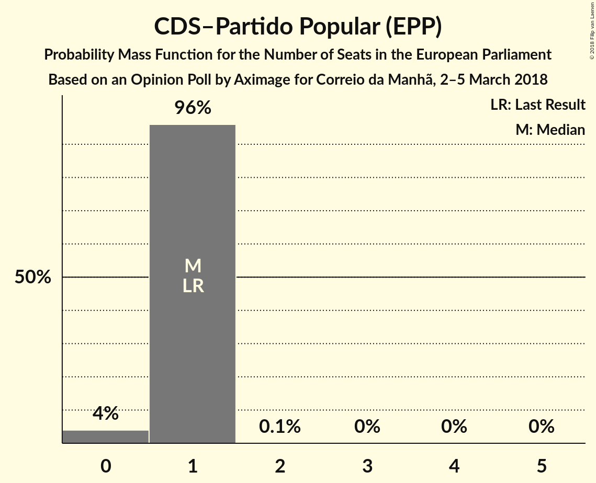
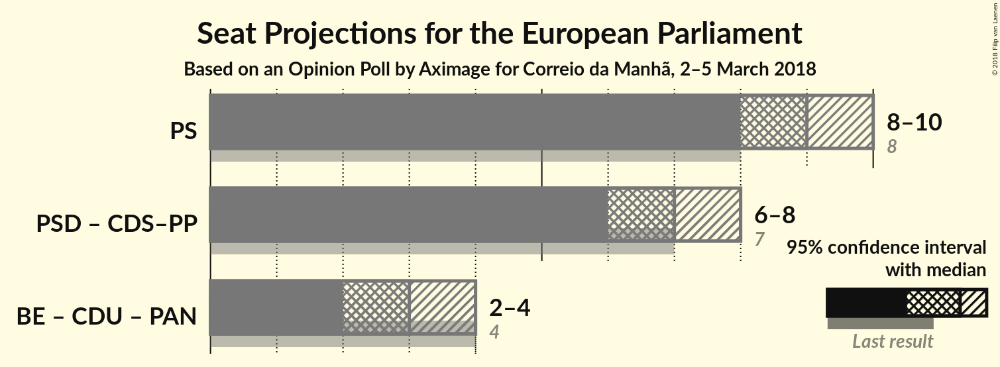

# Opinion Poll by Aximage for Correio da Manhã, 2–5 March 2018

<a href="#voting-intentions">Voting Intentions</a> | <a href="#seats">Seats</a> | <a href="#coalitions">Coalitions</a> | <a href="#technical-information">Technical Information</a>

## Voting Intentions

### Confidence Intervals

| Party | Last Result | Poll Result | 80% Confidence Interval | 90% Confidence Interval | 95% Confidence Interval | 99% Confidence Interval |
|:-----:|:-----------:|:-----------:|:-----------------------:|:-----------------------:|:-----------------------:|:-----------------------:|
| Partido Socialista (S&D) | 31.5% | 39.2% | 36.7–41.8% |36.0–42.5% |35.4–43.1% |34.2–44.4% |
| Partido Social Democrata (EPP) | 27.7% | 26.9% | 24.7–29.4% |24.1–30.0% |23.5–30.6% |22.5–31.8% |
| Bloco de Esquerda (GUE/NGL) | 4.6% | 9.9% | 8.5–11.6% |8.1–12.1% |7.8–12.6% |7.1–13.4% |
| Coligação Democrática Unitária (GUE/NGL) | 12.7% | 7.4% | 6.2–9.0% |5.9–9.4% |5.6–9.8% |5.1–10.6% |
| CDS–Partido Popular (EPP) | 27.7% | 5.5% | 4.4–6.8% |4.1–7.2% |3.9–7.6% |3.5–8.3% |

*Note:* The poll result column reflects the actual value used in the calculations. Published results may vary slightly, and in addition be rounded to fewer digits.

## Seats

### Confidence Intervals

| Party | Last Result | Median | 80% Confidence Interval | 90% Confidence Interval | 95% Confidence Interval | 99% Confidence Interval |
|:-----:|:-----------:|:------:|:-----------------------:|:-----------------------:|:-----------------------:|:-----------------------:|
| <a href="#partido-socialista-(s&d)">Partido Socialista (S&D)</a> | 8 | 9 | 8–9 |8–10 |8–10 |8–10 |
| <a href="#partido-social-democrata-(epp)">Partido Social Democrata (EPP)</a> | 6 | 6 | 5–6 |5–7 |5–7 |5–7 |
| <a href="#bloco-de-esquerda-(gue/ngl)">Bloco de Esquerda (GUE/NGL)</a> | 1 | 2 | 2 |1–2 |1–3 |1–3 |
| <a href="#coligação-democrática-unitária-(gue/ngl)">Coligação Democrática Unitária (GUE/NGL)</a> | 3 | 1 | 1–2 |1–2 |1–2 |1–2 |
| <a href="#cds–partido-popular-(epp)">CDS–Partido Popular (EPP)</a> | 1 | 1 | 1 |0–1 |0–1 |0–1 |

### Partido Socialista (S&D)

*For a full overview of the results for this party, see the [Partido Socialista (S&D)](party-partidosocialistasd.html) page.*

| Number of Seats | Probability | Accumulated | Special Marks |
|:---------------:|:-----------:|:-----------:|:-------------:|
| 7 | 0.4% | 100% |  |
| 8 | 23% | 99.6% | Last Result |
| 9 | 68% | 76% | Median |
| 10 | 8% | 9% |  |
| 11 | 0.1% | 0.1% | Majority |
| 12 | 0% | 0% |  |

### Partido Social Democrata (EPP)

*For a full overview of the results for this party, see the [Partido Social Democrata (EPP)](party-partidosocialdemocrataepp.html) page.*

| Number of Seats | Probability | Accumulated | Special Marks |
|:---------------:|:-----------:|:-----------:|:-------------:|
| 5 | 16% | 100% |  |
| 6 | 74% | 84% | Last Result, Median |
| 7 | 10% | 10% |  |
| 8 | 0% | 0% |  |

### Bloco de Esquerda (GUE/NGL)

*For a full overview of the results for this party, see the [Bloco de Esquerda (GUE/NGL)](party-blocodeesquerdaguengl.html) page.*

| Number of Seats | Probability | Accumulated | Special Marks |
|:---------------:|:-----------:|:-----------:|:-------------:|
| 1 | 8% | 100% | Last Result |
| 2 | 89% | 92% | Median |
| 3 | 3% | 3% |  |
| 4 | 0% | 0% |  |

### Coligação Democrática Unitária (GUE/NGL)

*For a full overview of the results for this party, see the [Coligação Democrática Unitária (GUE/NGL)](party-coligaçãodemocráticaunitáriaguengl.html) page.*

| Number of Seats | Probability | Accumulated | Special Marks |
|:---------------:|:-----------:|:-----------:|:-------------:|
| 1 | 80% | 100% | Median |
| 2 | 20% | 20% |  |
| 3 | 0% | 0% | Last Result |

### CDS–Partido Popular (EPP)

*For a full overview of the results for this party, see the [CDS–Partido Popular (EPP)](party-cds–partidopopularepp.html) page.*

| Number of Seats | Probability | Accumulated | Special Marks |
|:---------------:|:-----------:|:-----------:|:-------------:|
| 0 | 5% | 100% |  |
| 1 | 94% | 95% | Last Result, Median |
| 2 | 0.4% | 0.4% |  |
| 3 | 0% | 0% |  |

## Coalitions

### Confidence Intervals

| Coalition | Last Result | Median | Majority? | 80% Confidence Interval | 90% Confidence Interval | 95% Confidence Interval | 99% Confidence Interval |
|:---------:|:-----------:|:------:|:---------:|:-----------------------:|:-----------------------:|:-----------------------:|:-----------------------:|
| Partido Socialista (S&D) | 8 | 9 | 0.1% | 8–9 | 8–10 | 8–10 | 8–10 |
| Partido Social Democrata (EPP) – CDS–Partido Popular (EPP) | 7 | 7 | 0% | 6–7 | 6–8 | 6–8 | 6–8 |

### Partido Socialista (S&D)

| Number of Seats | Probability | Accumulated | Special Marks |
|:---------------:|:-----------:|:-----------:|:-------------:|
| 7 | 0.4% | 100% |  |
| 8 | 23% | 99.6% | Last Result |
| 9 | 68% | 76% | Median |
| 10 | 8% | 9% |  |
| 11 | 0.1% | 0.1% | Majority |
| 12 | 0% | 0% |  |

### Partido Social Democrata (EPP) – CDS–Partido Popular (EPP)

| Number of Seats | Probability | Accumulated | Special Marks |
|:---------------:|:-----------:|:-----------:|:-------------:|
| 5 | 0.4% | 100% |  |
| 6 | 19% | 99.6% |  |
| 7 | 72% | 81% | Last Result, Median |
| 8 | 9% | 9% |  |
| 9 | 0% | 0% |  |

## Technical Information

### Opinion Poll

+ **Polling firm:** Aximage
+ **Commissioner(s):** Correio da Manhã
+ **Fieldwork period:** 2–5 March 2018

### Calculations

+ **Sample size:** 605
+ **Simulations done:** 1,048,576
+ **Error estimate:** 0.41%

