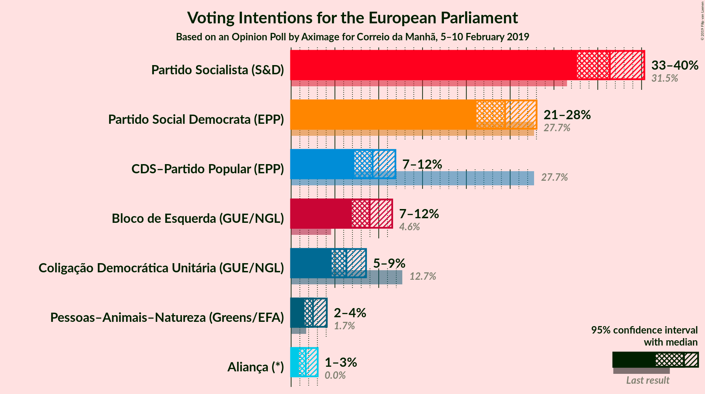
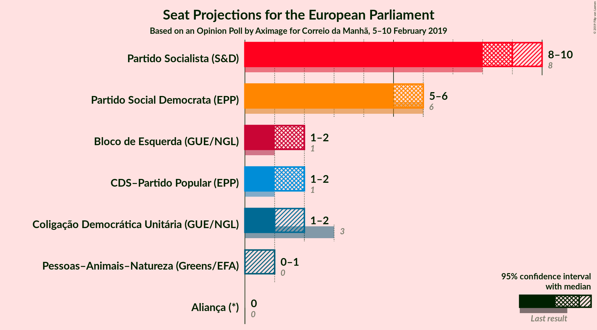

# Opinion Poll by Aximage for Correio da Manhã, 5–10 February 2019

<a href="#voting-intentions">Voting Intentions</a> | <a href="#seats">Seats</a> | <a href="#coalitions">Coalitions</a> | <a href="#technical-information">Technical Information</a>

## Voting Intentions

### Confidence Intervals

| Party | Last Result | Poll Result | 80% Confidence Interval | 90% Confidence Interval | 95% Confidence Interval | 99% Confidence Interval |
|:-----:|:-----------:|:-----------:|:-----------------------:|:-----------------------:|:-----------------------:|:-----------------------:|
| Partido Socialista (S&D) | 31.5% | 36.0% | 33.6–38.6% |32.9–39.3% |32.3–40.0% |31.2–41.2% |
| Partido Social Democrata (EPP) | 27.7% | 26.2% | 24.0–28.6% |23.4–29.3% |22.9–29.9% |21.9–31.1% |
| Bloco de Esquerda (GUE/NGL) | 4.6% | 9.6% | 8.2–11.4% |7.8–11.8% |7.5–12.3% |6.9–13.1% |
| Coligação Democrática Unitária (GUE/NGL) | 12.7% | 8.8% | 7.5–10.5% |7.1–10.9% |6.8–11.3% |6.2–12.2% |
| CDS–Partido Popular (EPP) | 27.7% | 8.6% | 7.3–10.3% |7.0–10.7% |6.6–11.2% |6.1–12.0% |
| Aliança (*) | 0.0% | 1.8% | 1.3–2.7% |1.1–3.0% |1.0–3.2% |0.8–3.7% |
| Pessoas–Animais–Natureza (GUE/NGL) | N/A | 1.5% | 1.0–2.3% |0.9–2.6% |0.8–2.8% |0.6–3.3% |

*Note:* The poll result column reflects the actual value used in the calculations. Published results may vary slightly, and in addition be rounded to fewer digits.

## Seats

### Confidence Intervals

| Party | Last Result | Median | 80% Confidence Interval | 90% Confidence Interval | 95% Confidence Interval | 99% Confidence Interval |
|:-----:|:-----------:|:------:|:-----------------------:|:-----------------------:|:-----------------------:|:-----------------------:|
| <a href="#partido-socialista-(s&d)">Partido Socialista (S&D)</a> | 8 | 8 | 7–9 |7–9 |7–9 |7–10 |
| <a href="#partido-social-democrata-(epp)">Partido Social Democrata (EPP)</a> | 6 | 6 | 6–7 |6–7 |5–7 |5–7 |
| <a href="#bloco-de-esquerda-(gue/ngl)">Bloco de Esquerda (GUE/NGL)</a> | 1 | 2 | 2 |2 |2 |2–3 |
| <a href="#coligação-democrática-unitária-(gue/ngl)">Coligação Democrática Unitária (GUE/NGL)</a> | 3 | 2 | 2 |1–2 |1–2 |1–2 |
| <a href="#cds–partido-popular-(epp)">CDS–Partido Popular (EPP)</a> | 1 | 1 | 1–2 |1–2 |1–2 |1–3 |
| <a href="#aliança-(*)">Aliança (*)</a> | 0 | 0 | 0 |0 |0 |0 |
| <a href="#pessoas–animais–natureza-(gue/ngl)">Pessoas–Animais–Natureza (GUE/NGL)</a> | N/A | 0 | 0 |0 |0 |0 |

