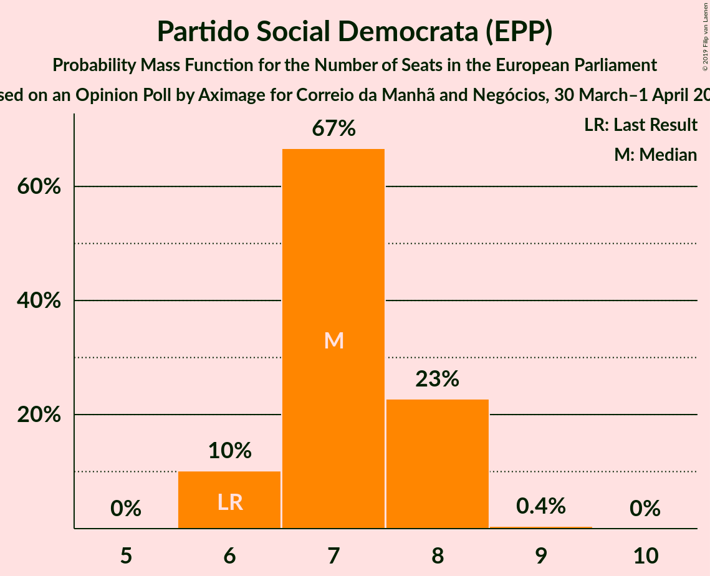
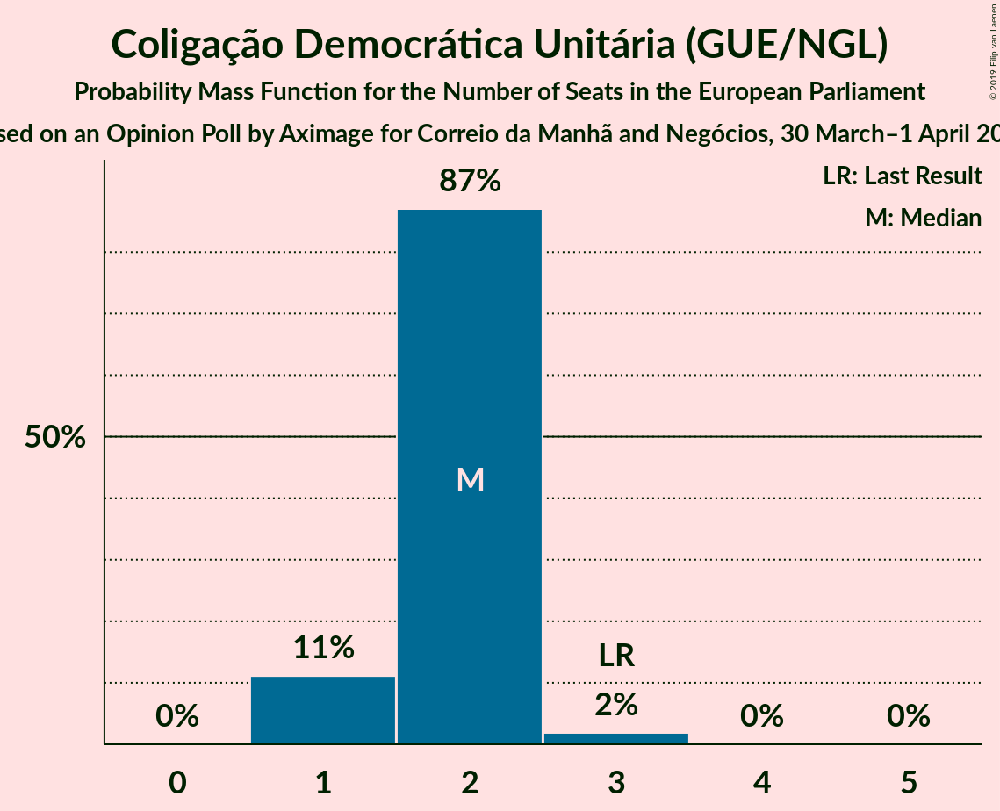
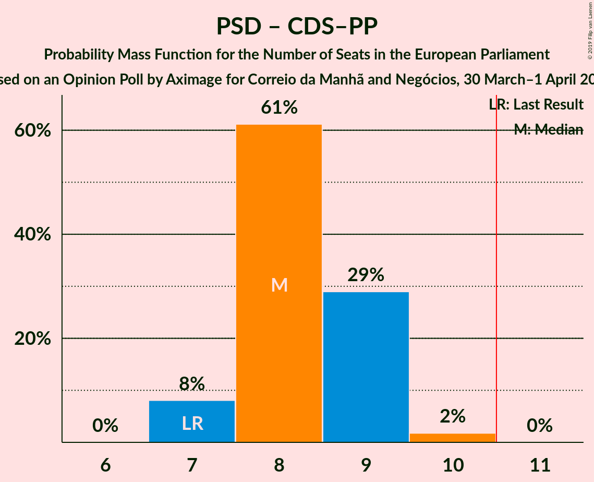
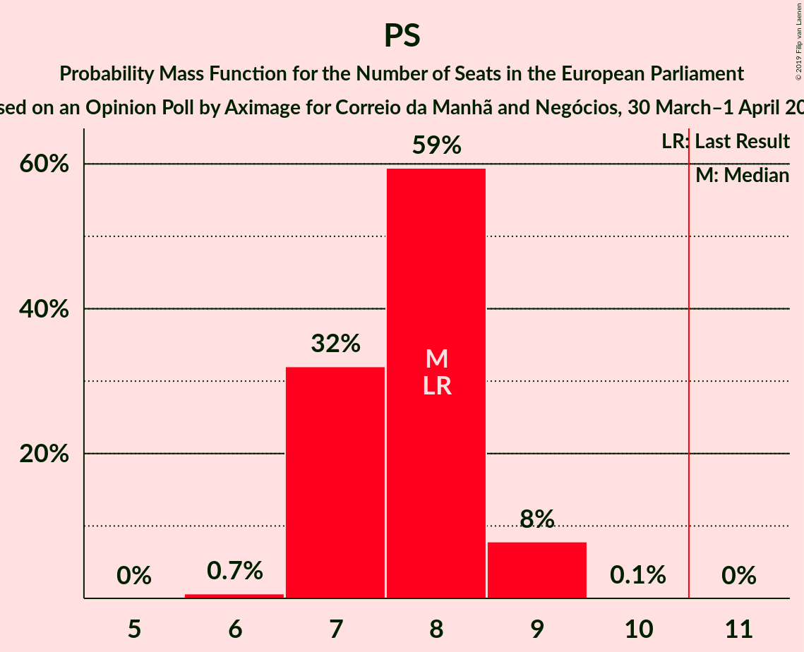

# Opinion Poll by Aximage for Correio da Manhã and Negócios, 30 March–1 April 2019

<a href="#voting-intentions">Voting Intentions</a> | <a href="#seats">Seats</a> | <a href="#coalitions">Coalitions</a> | <a href="#technical-information">Technical Information</a>

## Voting Intentions

### Confidence Intervals

| Party | Last Result | Poll Result | 80% Confidence Interval | 90% Confidence Interval | 95% Confidence Interval | 99% Confidence Interval |
|:-----:|:-----------:|:-----------:|:-----------------------:|:-----------------------:|:-----------------------:|:-----------------------:|
| Partido Socialista (S&D) | 31.5% | 33.6% | 31.2–36.1% |30.5–36.8% |29.9–37.4% |28.8–38.7% |
| Partido Social Democrata (EPP) | 27.7% | 31.1% | 28.7–33.6% |28.1–34.3% |27.5–34.9% |26.4–36.1% |
| Coligação Democrática Unitária (GUE/NGL) | 12.7% | 9.5% | 8.1–11.2% |7.7–11.7% |7.4–12.1% |6.8–12.9% |
| Bloco de Esquerda (GUE/NGL) | 4.6% | 8.0% | 6.7–9.6% |6.4–10.0% |6.1–10.4% |5.5–11.2% |
| CDS–Partido Popular (EPP) | 27.7% | 6.8% | 5.7–8.3% |5.3–8.7% |5.1–9.1% |4.6–9.9% |
| Pessoas–Animais–Natureza (Greens/EFA) | 1.7% | 1.3% | 0.9–2.1% |0.8–2.4% |0.7–2.6% |0.5–3.1% |
| Aliança (*) | 0.0% | 1.3% | 0.9–2.1% |0.8–2.4% |0.7–2.6% |0.5–3.1% |

*Note:* The poll result column reflects the actual value used in the calculations. Published results may vary slightly, and in addition be rounded to fewer digits.

## Seats

### Confidence Intervals

| Party | Last Result | Median | 80% Confidence Interval | 90% Confidence Interval | 95% Confidence Interval | 99% Confidence Interval |
|:-----:|:-----------:|:------:|:-----------------------:|:-----------------------:|:-----------------------:|:-----------------------:|
| <a href="#partido-socialista-(s&d)">Partido Socialista (S&D)</a> | 8 | 8 | 7–9 |7–9 |7–9 |6–9 |
| <a href="#partido-social-democrata-(epp)">Partido Social Democrata (EPP)</a> | 6 | 7 | 6–8 |6–8 |6–8 |6–8 |
| <a href="#coligação-democrática-unitária-(gue/ngl)">Coligação Democrática Unitária (GUE/NGL)</a> | 3 | 2 | 1–2 |1–2 |1–2 |1–3 |
| <a href="#bloco-de-esquerda-(gue/ngl)">Bloco de Esquerda (GUE/NGL)</a> | 1 | 1 | 1–2 |1–2 |1–2 |1–2 |
| <a href="#cds–partido-popular-(epp)">CDS–Partido Popular (EPP)</a> | 1 | 1 | 1–2 |1–2 |1–2 |1–2 |
| <a href="#pessoas–animais–natureza-(greens/efa)">Pessoas–Animais–Natureza (Greens/EFA)</a> | 0 | 0 | 0 |0 |0 |0 |
| <a href="#aliança-(*)">Aliança (*)</a> | 0 | 0 | 0 |0 |0 |0 |

### Partido Socialista (S&D)

*For a full overview of the results for this party, see the [Partido Socialista (S&D)](party-partidosocialistasd.html) page.*

| Number of Seats | Probability | Accumulated | Special Marks |
|:---------------:|:-----------:|:-----------:|:-------------:|
| 6 | 1.0% | 100% |  |
| 7 | 29% | 99.0% |  |
| 8 | 58% | 70% | Last Result, Median |
| 9 | 11% | 11% |  |
| 10 | 0% | 0% |  |

### Partido Social Democrata (EPP)

*For a full overview of the results for this party, see the [Partido Social Democrata (EPP)](party-partidosocialdemocrataepp.html) page.*

| Number of Seats | Probability | Accumulated | Special Marks |
|:---------------:|:-----------:|:-----------:|:-------------:|
| 6 | 14% | 100% | Last Result |
| 7 | 68% | 86% | Median |
| 8 | 18% | 18% |  |
| 9 | 0.4% | 0.4% |  |
| 10 | 0% | 0% |  |

### Coligação Democrática Unitária (GUE/NGL)

*For a full overview of the results for this party, see the [Coligação Democrática Unitária (GUE/NGL)](party-coligaçãodemocráticaunitáriaguengl.html) page.*

| Number of Seats | Probability | Accumulated | Special Marks |
|:---------------:|:-----------:|:-----------:|:-------------:|
| 1 | 13% | 100% |  |
| 2 | 86% | 87% | Median |
| 3 | 2% | 2% | Last Result |
| 4 | 0% | 0% |  |

### Bloco de Esquerda (GUE/NGL)

*For a full overview of the results for this party, see the [Bloco de Esquerda (GUE/NGL)](party-blocodeesquerdaguengl.html) page.*

| Number of Seats | Probability | Accumulated | Special Marks |
|:---------------:|:-----------:|:-----------:|:-------------:|
| 1 | 53% | 100% | Last Result, Median |
| 2 | 47% | 47% |  |
| 3 | 0.1% | 0.1% |  |
| 4 | 0% | 0% |  |

### CDS–Partido Popular (EPP)

*For a full overview of the results for this party, see the [CDS–Partido Popular (EPP)](party-cds–partidopopularepp.html) page.*

| Number of Seats | Probability | Accumulated | Special Marks |
|:---------------:|:-----------:|:-----------:|:-------------:|
| 0 | 0.1% | 100% |  |
| 1 | 88% | 99.9% | Last Result, Median |
| 2 | 12% | 12% |  |
| 3 | 0% | 0% |  |

### Pessoas–Animais–Natureza (Greens/EFA)

*For a full overview of the results for this party, see the [Pessoas–Animais–Natureza (Greens/EFA)](party-pessoas–animais–naturezagreensefa.html) page.*

| Number of Seats | Probability | Accumulated | Special Marks |
|:---------------:|:-----------:|:-----------:|:-------------:|
| 0 | 100% | 100% | Last Result, Median |

### Aliança (*)

*For a full overview of the results for this party, see the [Aliança (*)](party-aliança.html) page.*

| Number of Seats | Probability | Accumulated | Special Marks |
|:---------------:|:-----------:|:-----------:|:-------------:|
| 0 | 100% | 100% | Last Result, Median |

## Coalitions

### Confidence Intervals

| Coalition | Last Result | Median | Majority? | 80% Confidence Interval | 90% Confidence Interval | 95% Confidence Interval | 99% Confidence Interval |
|:---------:|:-----------:|:------:|:---------:|:-----------------------:|:-----------------------:|:-----------------------:|:-----------------------:|
| Partido Social Democrata (EPP) – CDS–Partido Popular (EPP) | 7 | 8 | 0% | 7–9 | 7–9 | 7–9 | 7–10 |
| Partido Socialista (S&D) | 8 | 8 | 0% | 7–9 | 7–9 | 7–9 | 6–9 |
| Coligação Democrática Unitária (GUE/NGL) – Bloco de Esquerda (GUE/NGL) | 4 | 3 | 0% | 3–4 | 3–4 | 2–4 | 2–5 |
| Aliança (*) | 0 | 0 | 0% | 0 | 0 | 0 | 0 |
| Pessoas–Animais–Natureza (Greens/EFA) | 0 | 0 | 0% | 0 | 0 | 0 | 0 |

### Partido Social Democrata (EPP) – CDS–Partido Popular (EPP)

| Number of Seats | Probability | Accumulated | Special Marks |
|:---------------:|:-----------:|:-----------:|:-------------:|
| 7 | 10% | 100% | Last Result |
| 8 | 65% | 90% | Median |
| 9 | 23% | 25% |  |
| 10 | 2% | 2% |  |
| 11 | 0% | 0% | Majority |

### Partido Socialista (S&D)

| Number of Seats | Probability | Accumulated | Special Marks |
|:---------------:|:-----------:|:-----------:|:-------------:|
| 6 | 1.0% | 100% |  |
| 7 | 29% | 99.0% |  |
| 8 | 58% | 70% | Last Result, Median |
| 9 | 11% | 11% |  |
| 10 | 0% | 0% |  |

### Coligação Democrática Unitária (GUE/NGL) – Bloco de Esquerda (GUE/NGL)

| Number of Seats | Probability | Accumulated | Special Marks |
|:---------------:|:-----------:|:-----------:|:-------------:|
| 2 | 4% | 100% |  |
| 3 | 56% | 96% | Median |
| 4 | 39% | 40% | Last Result |
| 5 | 0.7% | 0.7% |  |
| 6 | 0% | 0% |  |

### Aliança (*)

| Number of Seats | Probability | Accumulated | Special Marks |
|:---------------:|:-----------:|:-----------:|:-------------:|
| 0 | 100% | 100% | Last Result, Median |

### Pessoas–Animais–Natureza (Greens/EFA)

| Number of Seats | Probability | Accumulated | Special Marks |
|:---------------:|:-----------:|:-----------:|:-------------:|
| 0 | 100% | 100% | Last Result, Median |

## Technical Information

### Opinion Poll

+ **Polling firm:** Aximage
+ **Commissioner(s):** Correio da Manhã and Negócios
+ **Fieldwork period:** 30 March–1 April 2019

### Calculations

+ **Sample size:** 602
+ **Simulations done:** 131,072
+ **Error estimate:** 1.16%

