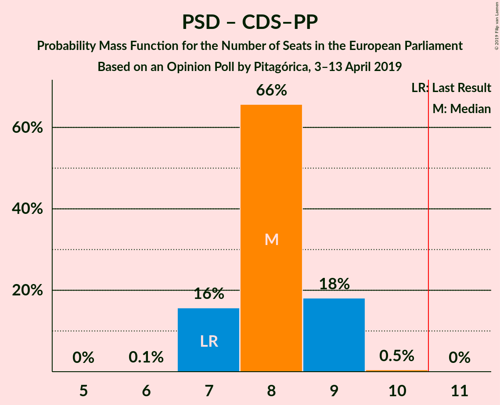

# Opinion Poll by Pitagórica, 3–13 April 2019

<a href="#voting-intentions">Voting Intentions</a> | <a href="#seats">Seats</a> | <a href="#coalitions">Coalitions</a> | <a href="#technical-information">Technical Information</a>

## Voting Intentions

### Confidence Intervals

| Party | Last Result | Poll Result | 80% Confidence Interval | 90% Confidence Interval | 95% Confidence Interval | 99% Confidence Interval |
|:-----:|:-----------:|:-----------:|:-----------------------:|:-----------------------:|:-----------------------:|:-----------------------:|
| Partido Social Democrata (EPP) | 27.7% | 30.2% | 27.9–32.7% |27.3–33.4% |26.7–34.0% |25.6–35.2% |
| Partido Socialista (S&D) | 31.5% | 27.9% | 25.7–30.4% |25.0–31.0% |24.5–31.7% |23.5–32.8% |
| Bloco de Esquerda (GUE/NGL) | 4.6% | 11.2% | 9.7–13.0% |9.3–13.6% |9.0–14.0% |8.3–14.9% |
| CDS–Partido Popular (EPP) | 27.7% | 7.6% | 6.4–9.2% |6.0–9.6% |5.7–10.0% |5.2–10.8% |
| Coligação Democrática Unitária (GUE/NGL) | 12.7% | 6.4% | 5.3–7.9% |5.0–8.3% |4.8–8.7% |4.3–9.4% |

*Note:* The poll result column reflects the actual value used in the calculations. Published results may vary slightly, and in addition be rounded to fewer digits.

## Seats

### Confidence Intervals

| Party | Last Result | Median | 80% Confidence Interval | 90% Confidence Interval | 95% Confidence Interval | 99% Confidence Interval |
|:-----:|:-----------:|:------:|:-----------------------:|:-----------------------:|:-----------------------:|:-----------------------:|
| <a href="#partido-social-democrata-(epp)">Partido Social Democrata (EPP)</a> | 6 | 7 | 6–7 |6–8 |6–8 |6–8 |
| <a href="#partido-socialista-(s&d)">Partido Socialista (S&D)</a> | 8 | 6 | 6–7 |5–7 |5–7 |5–7 |
| <a href="#bloco-de-esquerda-(gue/ngl)">Bloco de Esquerda (GUE/NGL)</a> | 1 | 2 | 2–3 |2–3 |2–3 |1–3 |
| <a href="#cds–partido-popular-(epp)">CDS–Partido Popular (EPP)</a> | 1 | 1 | 1–2 |1–2 |1–2 |1–2 |
| <a href="#coligação-democrática-unitária-(gue/ngl)">Coligação Democrática Unitária (GUE/NGL)</a> | 3 | 1 | 1 |1–2 |1–2 |1–2 |

### Partido Social Democrata (EPP)

*For a full overview of the results for this party, see the [Partido Social Democrata (EPP)](party-partidosocialdemocrataepp.html) page.*

| Number of Seats | Probability | Accumulated | Special Marks |
|:---------------:|:-----------:|:-----------:|:-------------:|
| 5 | 0.3% | 100% |  |
| 6 | 28% | 99.7% | Last Result |
| 7 | 65% | 72% | Median |
| 8 | 7% | 7% |  |
| 9 | 0% | 0% |  |

### Partido Socialista (S&D)

*For a full overview of the results for this party, see the [Partido Socialista (S&D)](party-partidosocialistasd.html) page.*

| Number of Seats | Probability | Accumulated | Special Marks |
|:---------------:|:-----------:|:-----------:|:-------------:|
| 5 | 5% | 100% |  |
| 6 | 66% | 95% | Median |
| 7 | 29% | 29% |  |
| 8 | 0.4% | 0.4% | Last Result |
| 9 | 0% | 0% |  |

### Bloco de Esquerda (GUE/NGL)

*For a full overview of the results for this party, see the [Bloco de Esquerda (GUE/NGL)](party-blocodeesquerdaguengl.html) page.*

| Number of Seats | Probability | Accumulated | Special Marks |
|:---------------:|:-----------:|:-----------:|:-------------:|
| 1 | 0.6% | 100% | Last Result |
| 2 | 81% | 99.4% | Median |
| 3 | 18% | 18% |  |
| 4 | 0% | 0% |  |

### CDS–Partido Popular (EPP)

*For a full overview of the results for this party, see the [CDS–Partido Popular (EPP)](party-cds–partidopopularepp.html) page.*

| Number of Seats | Probability | Accumulated | Special Marks |
|:---------------:|:-----------:|:-----------:|:-------------:|
| 1 | 73% | 100% | Last Result, Median |
| 2 | 27% | 27% |  |
| 3 | 0% | 0% |  |

### Coligação Democrática Unitária (GUE/NGL)

*For a full overview of the results for this party, see the [Coligação Democrática Unitária (GUE/NGL)](party-coligaçãodemocráticaunitáriaguengl.html) page.*

| Number of Seats | Probability | Accumulated | Special Marks |
|:---------------:|:-----------:|:-----------:|:-------------:|
| 0 | 0.4% | 100% |  |
| 1 | 95% | 99.6% | Median |
| 2 | 5% | 5% |  |
| 3 | 0% | 0% | Last Result |

## Coalitions

### Confidence Intervals

| Coalition | Last Result | Median | Majority? | 80% Confidence Interval | 90% Confidence Interval | 95% Confidence Interval | 99% Confidence Interval |
|:---------:|:-----------:|:------:|:---------:|:-----------------------:|:-----------------------:|:-----------------------:|:-----------------------:|
| Partido Social Democrata (EPP) – CDS–Partido Popular (EPP) | 7 | 8 | 0% | 7–9 | 7–9 | 7–9 | 7–9 |
| Partido Socialista (S&D) | 8 | 6 | 0% | 6–7 | 5–7 | 5–7 | 5–7 |
| Bloco de Esquerda (GUE/NGL) – Coligação Democrática Unitária (GUE/NGL) | 4 | 3 | 0% | 3–4 | 3–4 | 3–4 | 2–4 |

### Partido Social Democrata (EPP) – CDS–Partido Popular (EPP)

| Number of Seats | Probability | Accumulated | Special Marks |
|:---------------:|:-----------:|:-----------:|:-------------:|
| 6 | 0.1% | 100% |  |
| 7 | 17% | 99.9% | Last Result |
| 8 | 62% | 83% | Median |
| 9 | 21% | 21% |  |
| 10 | 0.4% | 0.4% |  |
| 11 | 0% | 0% | Majority |

### Partido Socialista (S&D)

| Number of Seats | Probability | Accumulated | Special Marks |
|:---------------:|:-----------:|:-----------:|:-------------:|
| 5 | 5% | 100% |  |
| 6 | 66% | 95% | Median |
| 7 | 29% | 29% |  |
| 8 | 0.4% | 0.4% | Last Result |
| 9 | 0% | 0% |  |

### Bloco de Esquerda (GUE/NGL) – Coligação Democrática Unitária (GUE/NGL)

| Number of Seats | Probability | Accumulated | Special Marks |
|:---------------:|:-----------:|:-----------:|:-------------:|
| 2 | 0.7% | 100% |  |
| 3 | 76% | 99.3% | Median |
| 4 | 22% | 23% | Last Result |
| 5 | 0.4% | 0.4% |  |
| 6 | 0% | 0% |  |

## Technical Information

### Opinion Poll

+ **Polling firm:** Pitagórica
+ **Commissioner(s):** —
+ **Fieldwork period:** 3–13 April 2019

### Calculations

+ **Sample size:** 605
+ **Simulations done:** 131,072
+ **Error estimate:** 1.04%

