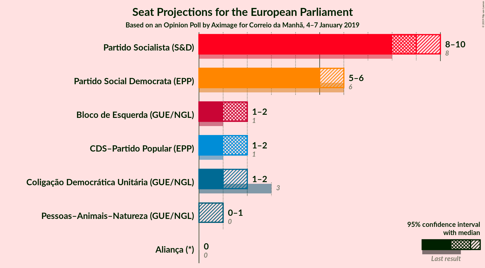

# Opinion Poll by Aximage for Correio da Manhã, 4–7 January 2019

<a href="#voting-intentions">Voting Intentions</a> | <a href="#seats">Seats</a> | <a href="#coalitions">Coalitions</a> | <a href="#technical-information">Technical Information</a>

## Voting Intentions

### Confidence Intervals

| Party | Last Result | Poll Result | 80% Confidence Interval | 90% Confidence Interval | 95% Confidence Interval | 99% Confidence Interval |
|:-----:|:-----------:|:-----------:|:-----------------------:|:-----------------------:|:-----------------------:|:-----------------------:|
| Partido Socialista (S&D) | 31.5% | 38.5% | 36.0–41.1% |35.3–41.8% |34.7–42.4% |33.5–43.7% |
| Partido Social Democrata (EPP) | 27.7% | 23.4% | 21.3–25.7% |20.7–26.3% |20.2–26.9% |19.2–28.0% |
| Coligação Democrática Unitária (GUE/NGL) | 12.7% | 13.5% | 11.8–15.4% |11.4–16.0% |11.0–16.4% |10.3–17.4% |
| CDS–Partido Popular (EPP) | 27.7% | 9.9% | 8.5–11.6% |8.1–12.1% |7.7–12.5% |7.1–13.4% |
| Bloco de Esquerda (GUE/NGL) | 4.6% | 7.4% | 6.2–8.9% |5.9–9.4% |5.6–9.8% |5.0–10.6% |
| Pessoas–Animais–Natureza (GUE/NGL) | N/A | 2.5% | 1.8–3.5% |1.6–3.8% |1.5–4.0% |1.2–4.6% |
| Aliança (*) | 0.0% | 1.5% | 1.0–2.3% |0.9–2.6% |0.8–2.8% |0.6–3.3% |

*Note:* The poll result column reflects the actual value used in the calculations. Published results may vary slightly, and in addition be rounded to fewer digits.

## Seats

### Confidence Intervals

| Party | Last Result | Median | 80% Confidence Interval | 90% Confidence Interval | 95% Confidence Interval | 99% Confidence Interval |
|:-----:|:-----------:|:------:|:-----------------------:|:-----------------------:|:-----------------------:|:-----------------------:|
| <a href="#partido-socialista-(s&d)">Partido Socialista (S&D)</a> | 8 | 9 | 8–10 |8–10 |8–10 |8–11 |
| <a href="#partido-social-democrata-(epp)">Partido Social Democrata (EPP)</a> | 6 | 5 | 5–6 |5–6 |4–6 |4–7 |
| <a href="#coligação-democrática-unitária-(gue/ngl)">Coligação Democrática Unitária (GUE/NGL)</a> | 3 | 3 | 2–3 |2–4 |2–4 |2–4 |
| <a href="#cds–partido-popular-(epp)">CDS–Partido Popular (EPP)</a> | 1 | 2 | 2 |2 |1–3 |1–3 |
| <a href="#bloco-de-esquerda-(gue/ngl)">Bloco de Esquerda (GUE/NGL)</a> | 1 | 1 | 1–2 |1–2 |1–2 |1–2 |
| <a href="#pessoas–animais–natureza-(gue/ngl)">Pessoas–Animais–Natureza (GUE/NGL)</a> | N/A | 0 | 0 |0 |0–1 |0–1 |
| <a href="#aliança-(*)">Aliança (*)</a> | 0 | 0 | 0 |0 |0 |0 |

