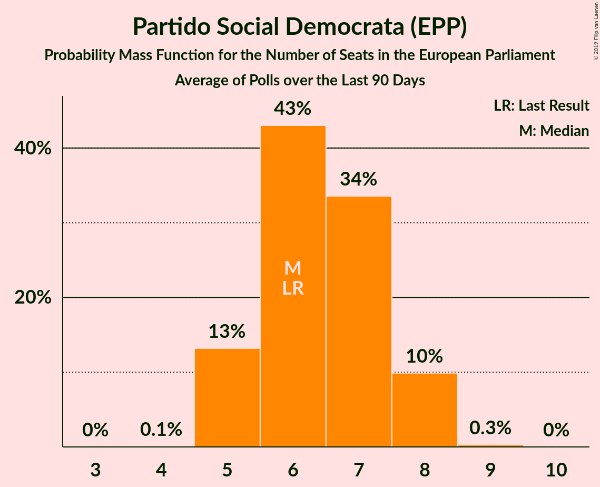
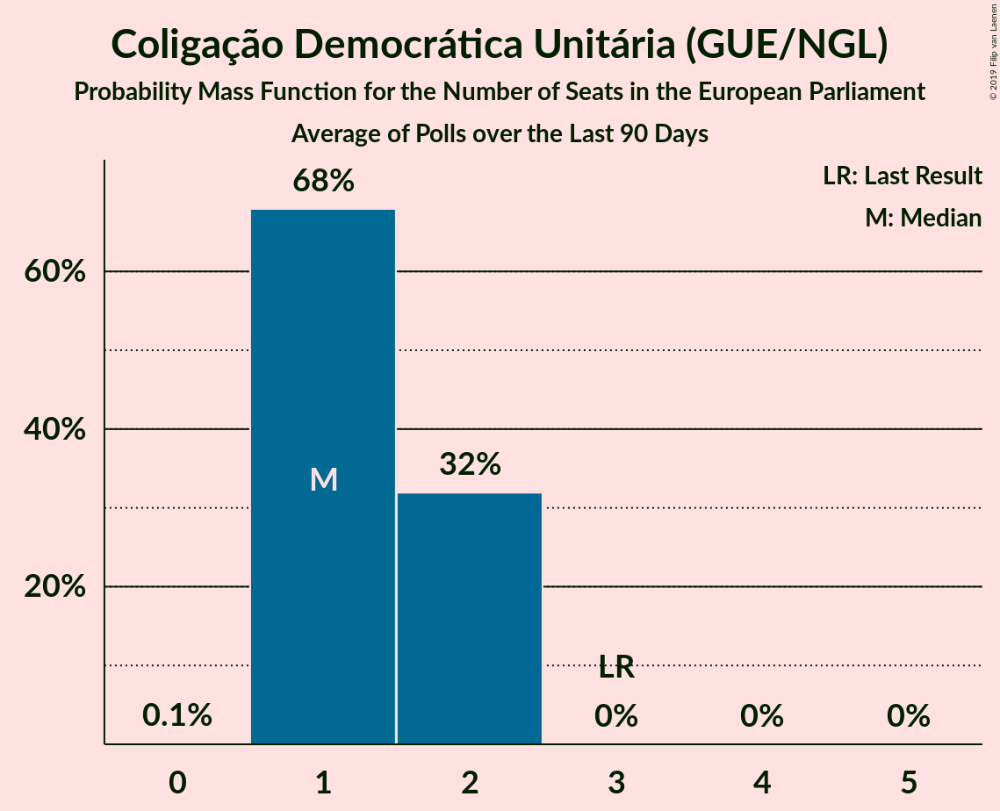
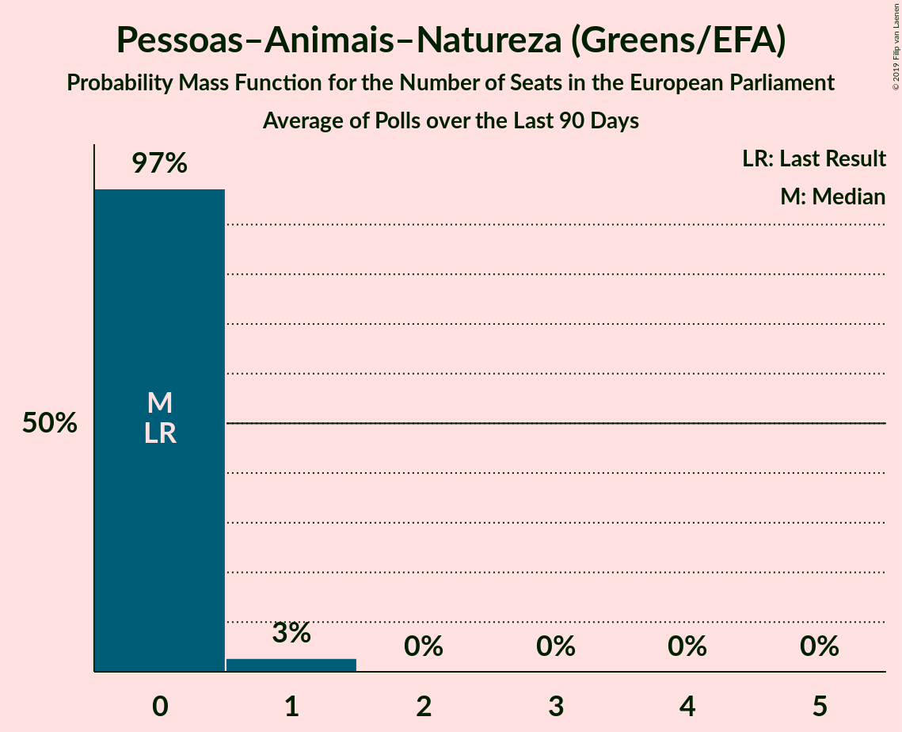
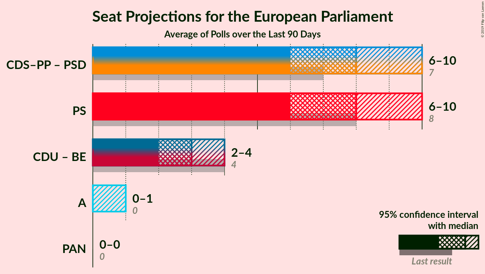
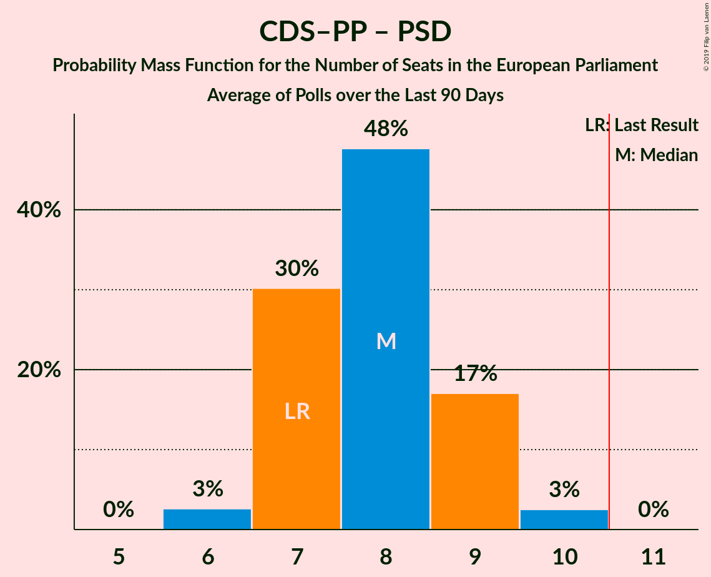
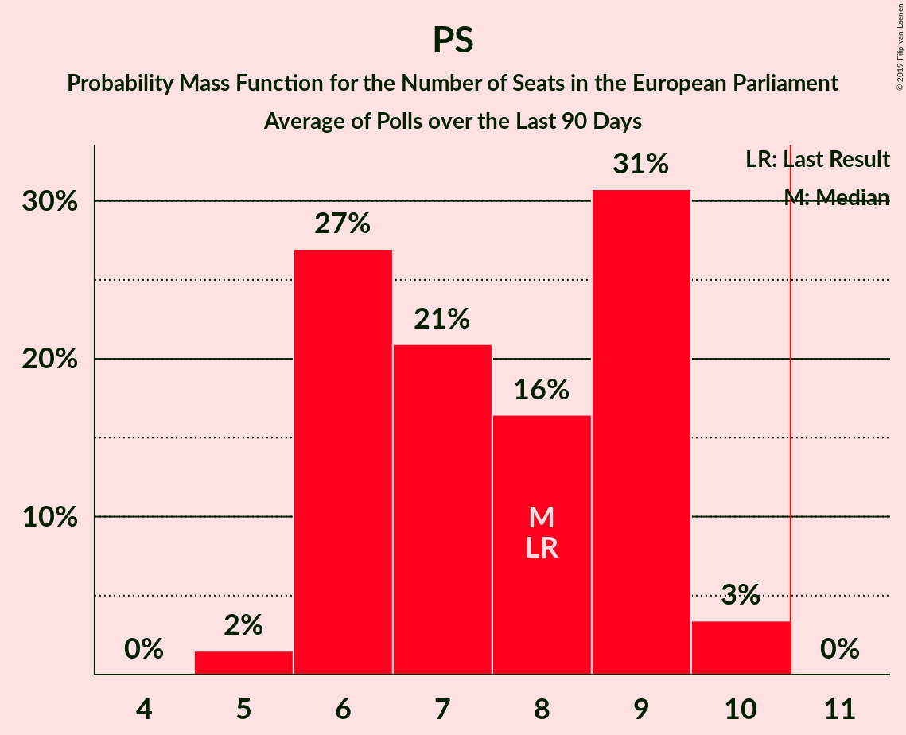
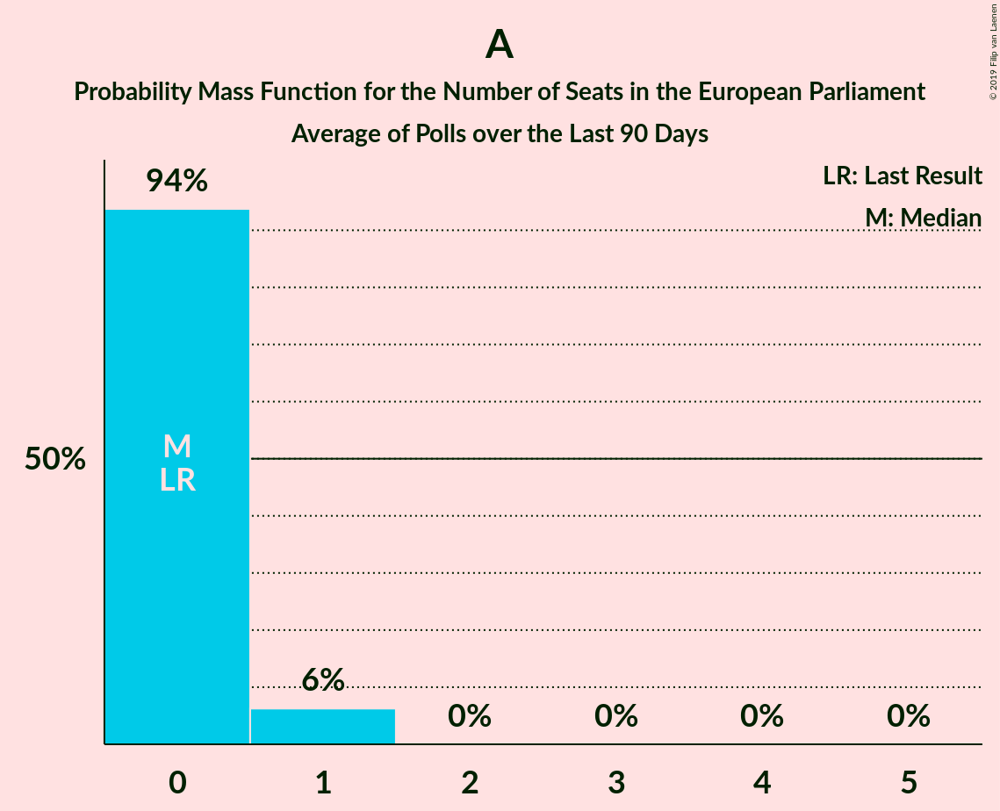
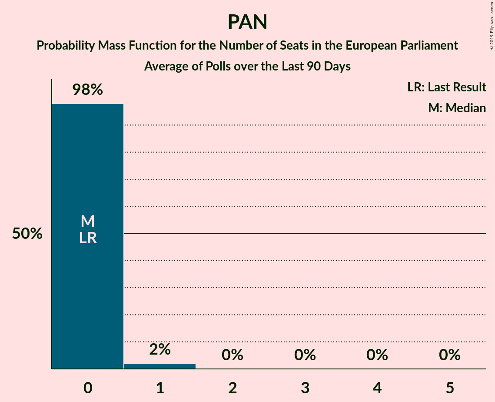

# Poll Average

<a href="#voting-intentions">Voting Intentions</a> | <a href="#seats">Seats</a> | <a href="#coalitions">Coalitions</a> | <a href="#technical-information">Technical Information</a>

## Summary

The table below lists the polls on which the average is based. They are the most recent polls (less than 90 days old) registered and analyzed so far.

| Period     | Polling firm/Commissioner(s) | PS | PSD | CDS–PP | CDU | BE | PAN | A |
|:----------:|:----------------------------:|:--:|:--:|:--:|:--:|:--:|:--:|:--:|
| 25 May 2014 | General Election | 31.5%   8 | 27.7%   6 | 27.7%   1 | 12.7%   3 | 4.6%   1 | 1.7%   0 | 0.0%   0 |
| N/A | Poll Average | 25–40%   6–10 | 23–34%   5–8 | 6–10%   1–2 | 5–10%   1–2 | 6–13%   1–3 | 1–4%   0–1 | 1–4%   0–1 |
| [13–16 April 2019](2019-04-16-Aximage.html) | Aximage   Correio da Manhã and Negócios | 25–33%   6–8 | 28–35%   6–8 | 6–10%   1–2 | 6–11%   1–2 | 6–11%   1–2 | 1–3%   0 | 1–3%   0 |
| [3–13 April 2019](2019-04-13-Pitagórica.html) | Pitagórica | 24–32%   5–7 | 27–34%   6–8 | 6–10%   1–2 | 5–9%   1–2 | 9–14%   2–3 | N/A   N/A | N/A   N/A |
| [7–11 April 2019](2019-04-11-Eurosondagem.html) | Eurosondagem   Expresso and SIC Notícias | 34–40%   8–10 | 22–28%   5–7 | 7–10%   1–2 | 6–9%   1–2 | 6–10%   1–2 | 2–4%   0 | 3–5%   0–1 |
| [9–21 February 2019](2019-02-21-GfKMetris.html) | GfK Metris   Expresso and SIC Notícias | 34–40%   8–10 | 22–28%   5–7 | 6–10%   1–2 | 6–10%   1–2 | 6–10%   1–2 | 2–4%   0–1 | 1–3%   0 |
| 25 May 2014 | General Election | 31.5%   8 | 27.7%   6 | 27.7%   1 | 12.7%   3 | 4.6%   1 | 1.7%   0 | 0.0%   0 |

Only polls for which at least the sample size has been published are included in the table above.

**Legend:**
+ **Top half of each row:** Voting intentions (95% confidence interval)
+ **Bottom half of each row:** Seat projections for the European Parliament (95% confidence interval)
+ **PS:** Partido Socialista (S&D)
+ **PSD:** Partido Social Democrata (EPP)
+ **CDS–PP:** CDS–Partido Popular (EPP)
+ **CDU:** Coligação Democrática Unitária (GUE/NGL)
+ **BE:** Bloco de Esquerda (GUE/NGL)
+ **PAN:** Pessoas–Animais–Natureza (Greens/EFA)
+ **A:** Aliança (*)
+ **N/A (single party):** Party not included the published results
+ **N/A (entire row):** Calculation for this opinion poll not started yet

## Voting Intentions

### Confidence Intervals

| Party | Last Result | Median | 80% Confidence Interval | 90% Confidence Interval | 95% Confidence Interval | 99% Confidence Interval |
|:-----:|:-----------:|:------:|:-----------------------:|:-----------------------:|:-----------------------:|:-----------------------:|
| <a href="#partido-socialista-(s&d)">Partido Socialista (S&D)</a> | 31.5% | 33.1% | 26.9–38.3% |26.1–39.0% | 25.4–39.6% | 24.2–40.8% |
| <a href="#partido-social-democrata-(epp)">Partido Social Democrata (EPP)</a> | 27.7% | 27.6% | 23.8–32.7% |23.2–33.6% | 22.7–34.4% | 21.8–35.8% |
| <a href="#cds–partido-popular-(epp)">CDS–Partido Popular (EPP)</a> | 27.7% | 8.0% | 6.7–9.4% |6.3–9.8% | 6.0–10.1% | 5.4–10.8% |
| <a href="#coligação-democrática-unitária-(gue/ngl)">Coligação Democrática Unitária (GUE/NGL)</a> | 12.7% | 7.6% | 6.1–9.2% |5.7–9.7% | 5.3–10.1% | 4.7–11.0% |
| <a href="#bloco-de-esquerda-(gue/ngl)">Bloco de Esquerda (GUE/NGL)</a> | 4.6% | 8.5% | 7.0–11.7% |6.7–12.4% | 6.4–13.0% | 5.9–14.1% |
| <a href="#pessoas–animais–natureza-(greens/efa)">Pessoas–Animais–Natureza (Greens/EFA)</a> | 1.7% | 2.4% | 1.2–3.5% |1.0–3.8% | 0.8–4.0% | 0.6–4.6% |
| <a href="#aliança-(*)">Aliança (*)</a> | 0.0% | 2.2% | 1.2–3.9% |1.0–4.2% | 0.8–4.5% | 0.6–5.0% |

### Partido Socialista (S&D)

*For a full overview of the results for this party, see the [Partido Socialista (S&D)](party-partidosocialistasd.html) page.*

| Voting Intentions | Probability | Accumulated | Special Marks |
|:-----------------:|:-----------:|:-----------:|:-------------:|
| 21.5–22.5% | 0% | 100% |  |
| 22.5–23.5% | 0.1% | 100% |  |
| 23.5–24.5% | 0.7% | 99.8% |  |
| 24.5–25.5% | 2% | 99.2% |  |
| 25.5–26.5% | 5% | 97% |  |
| 26.5–27.5% | 8% | 92% |  |
| 27.5–28.5% | 10% | 84% |  |
| 28.5–29.5% | 10% | 74% |  |
| 29.5–30.5% | 7% | 64% |  |
| 30.5–31.5% | 4% | 57% | Last Result |
| 31.5–32.5% | 2% | 53% |  |
| 32.5–33.5% | 1.3% | 51% | Median |
| 33.5–34.5% | 3% | 49% |  |
| 34.5–35.5% | 6% | 47% |  |
| 35.5–36.5% | 11% | 41% |  |
| 36.5–37.5% | 12% | 30% |  |
| 37.5–38.5% | 10% | 18% |  |
| 38.5–39.5% | 5% | 8% |  |
| 39.5–40.5% | 2% | 3% |  |
| 40.5–41.5% | 0.6% | 0.7% |  |
| 41.5–42.5% | 0.1% | 0.1% |  |
| 42.5–43.5% | 0% | 0% |  |

### Partido Social Democrata (EPP)

*For a full overview of the results for this party, see the [Partido Social Democrata (EPP)](party-partidosocialdemocrataepp.html) page.*

| Voting Intentions | Probability | Accumulated | Special Marks |
|:-----------------:|:-----------:|:-----------:|:-------------:|
| 19.5–20.5% | 0% | 100% |  |
| 20.5–21.5% | 0.3% | 100% |  |
| 21.5–22.5% | 2% | 99.7% |  |
| 22.5–23.5% | 5% | 98% |  |
| 23.5–24.5% | 11% | 93% |  |
| 24.5–25.5% | 14% | 82% |  |
| 25.5–26.5% | 11% | 68% |  |
| 26.5–27.5% | 7% | 57% |  |
| 27.5–28.5% | 5% | 50% | Last Result, Median |
| 28.5–29.5% | 7% | 45% |  |
| 29.5–30.5% | 9% | 38% |  |
| 30.5–31.5% | 10% | 30% |  |
| 31.5–32.5% | 9% | 20% |  |
| 32.5–33.5% | 6% | 11% |  |
| 33.5–34.5% | 3% | 5% |  |
| 34.5–35.5% | 1.4% | 2% |  |
| 35.5–36.5% | 0.5% | 0.7% |  |
| 36.5–37.5% | 0.1% | 0.2% |  |
| 37.5–38.5% | 0% | 0% |  |

### CDS–Partido Popular (EPP)

*For a full overview of the results for this party, see the [CDS–Partido Popular (EPP)](party-cds–partidopopularepp.html) page.*

| Voting Intentions | Probability | Accumulated | Special Marks |
|:-----------------:|:-----------:|:-----------:|:-------------:|
| 3.5–4.5% | 0% | 100% |  |
| 4.5–5.5% | 0.7% | 100% |  |
| 5.5–6.5% | 7% | 99.3% |  |
| 6.5–7.5% | 24% | 92% |  |
| 7.5–8.5% | 37% | 68% | Median |
| 8.5–9.5% | 24% | 31% |  |
| 9.5–10.5% | 7% | 8% |  |
| 10.5–11.5% | 0.9% | 1.0% |  |
| 11.5–12.5% | 0.1% | 0.1% |  |
| 12.5–13.5% | 0% | 0% |  |
| 13.5–14.5% | 0% | 0% |  |
| 14.5–15.5% | 0% | 0% |  |
| 15.5–16.5% | 0% | 0% |  |
| 16.5–17.5% | 0% | 0% |  |
| 17.5–18.5% | 0% | 0% |  |
| 18.5–19.5% | 0% | 0% |  |
| 19.5–20.5% | 0% | 0% |  |
| 20.5–21.5% | 0% | 0% |  |
| 21.5–22.5% | 0% | 0% |  |
| 22.5–23.5% | 0% | 0% |  |
| 23.5–24.5% | 0% | 0% |  |
| 24.5–25.5% | 0% | 0% |  |
| 25.5–26.5% | 0% | 0% |  |
| 26.5–27.5% | 0% | 0% |  |
| 27.5–28.5% | 0% | 0% | Last Result |

### Coligação Democrática Unitária (GUE/NGL)

*For a full overview of the results for this party, see the [Coligação Democrática Unitária (GUE/NGL)](party-coligaçãodemocráticaunitáriaguengl.html) page.*

| Voting Intentions | Probability | Accumulated | Special Marks |
|:-----------------:|:-----------:|:-----------:|:-------------:|
| 2.5–3.5% | 0% | 100% |  |
| 3.5–4.5% | 0.3% | 100% |  |
| 4.5–5.5% | 4% | 99.7% |  |
| 5.5–6.5% | 15% | 96% |  |
| 6.5–7.5% | 30% | 81% |  |
| 7.5–8.5% | 30% | 52% | Median |
| 8.5–9.5% | 16% | 22% |  |
| 9.5–10.5% | 5% | 6% |  |
| 10.5–11.5% | 1.0% | 1.2% |  |
| 11.5–12.5% | 0.1% | 0.2% |  |
| 12.5–13.5% | 0% | 0% | Last Result |

### Bloco de Esquerda (GUE/NGL)

*For a full overview of the results for this party, see the [Bloco de Esquerda (GUE/NGL)](party-blocodeesquerdaguengl.html) page.*

| Voting Intentions | Probability | Accumulated | Special Marks |
|:-----------------:|:-----------:|:-----------:|:-------------:|
| 3.5–4.5% | 0% | 100% |  |
| 4.5–5.5% | 0.1% | 100% | Last Result |
| 5.5–6.5% | 3% | 99.9% |  |
| 6.5–7.5% | 18% | 96% |  |
| 7.5–8.5% | 29% | 78% | Median |
| 8.5–9.5% | 19% | 49% |  |
| 9.5–10.5% | 10% | 30% |  |
| 10.5–11.5% | 9% | 19% |  |
| 11.5–12.5% | 6% | 11% |  |
| 12.5–13.5% | 3% | 4% |  |
| 13.5–14.5% | 1.0% | 1.3% |  |
| 14.5–15.5% | 0.2% | 0.2% |  |
| 15.5–16.5% | 0% | 0% |  |

### Pessoas–Animais–Natureza (Greens/EFA)

*For a full overview of the results for this party, see the [Pessoas–Animais–Natureza (Greens/EFA)](party-pessoas–animais–naturezagreensefa.html) page.*

| Voting Intentions | Probability | Accumulated | Special Marks |
|:-----------------:|:-----------:|:-----------:|:-------------:|
| 0.0–0.5% | 0.3% | 100% |  |
| 0.5–1.5% | 21% | 99.7% |  |
| 1.5–2.5% | 35% | 79% | Last Result, Median |
| 2.5–3.5% | 36% | 44% |  |
| 3.5–4.5% | 8% | 9% |  |
| 4.5–5.5% | 0.5% | 0.6% |  |
| 5.5–6.5% | 0% | 0% |  |

### Aliança (*)

*For a full overview of the results for this party, see the [Aliança (*)](party-aliança.html) page.*

| Voting Intentions | Probability | Accumulated | Special Marks |
|:-----------------:|:-----------:|:-----------:|:-------------:|
| 0.0–0.5% | 0.3% | 100% | Last Result |
| 0.5–1.5% | 24% | 99.7% |  |
| 1.5–2.5% | 35% | 75% | Median |
| 2.5–3.5% | 22% | 40% |  |
| 3.5–4.5% | 16% | 18% |  |
| 4.5–5.5% | 2% | 2% |  |
| 5.5–6.5% | 0.1% | 0.1% |  |
| 6.5–7.5% | 0% | 0% |  |

## Seats

### Confidence Intervals

| Party | Last Result | Median | 80% Confidence Interval | 90% Confidence Interval | 95% Confidence Interval | 99% Confidence Interval |
|:-----:|:-----------:|:------:|:-----------------------:|:-----------------------:|:-----------------------:|:-----------------------:|
| <a href="#partido-socialista-(s&d)">Partido Socialista (S&D)</a> | 8 | 8 | 6–9 |6–9 | 6–10 | 5–10 |
| <a href="#partido-social-democrata-(epp)">Partido Social Democrata (EPP)</a> | 6 | 6 | 5–8 |5–8 | 5–8 | 5–8 |
| <a href="#cds–partido-popular-(epp)">CDS–Partido Popular (EPP)</a> | 1 | 1 | 1–2 |1–2 | 1–2 | 1–2 |
| <a href="#coligação-democrática-unitária-(gue/ngl)">Coligação Democrática Unitária (GUE/NGL)</a> | 3 | 1 | 1–2 |1–2 | 1–2 | 1–2 |
| <a href="#bloco-de-esquerda-(gue/ngl)">Bloco de Esquerda (GUE/NGL)</a> | 1 | 2 | 1–2 |1–2 | 1–3 | 1–3 |
| <a href="#pessoas–animais–natureza-(greens/efa)">Pessoas–Animais–Natureza (Greens/EFA)</a> | 0 | 0 | 0 |0 | 0–1 | 0–1 |
| <a href="#aliança-(*)">Aliança (*)</a> | 0 | 0 | 0 |0–1 | 0–1 | 0–1 |

### Partido Socialista (S&D)

*For a full overview of the results for this party, see the [Partido Socialista (S&D)](party-partidosocialistasd.html) page.*

| Number of Seats | Probability | Accumulated | Special Marks |
|:---------------:|:-----------:|:-----------:|:-------------:|
| 5 | 2% | 100% |  |
| 6 | 27% | 98% |  |
| 7 | 21% | 72% |  |
| 8 | 16% | 51% | Last Result, Median |
| 9 | 31% | 34% |  |
| 10 | 3% | 3% |  |
| 11 | 0% | 0% | Majority |

### Partido Social Democrata (EPP)

*For a full overview of the results for this party, see the [Partido Social Democrata (EPP)](party-partidosocialdemocrataepp.html) page.*

| Number of Seats | Probability | Accumulated | Special Marks |
|:---------------:|:-----------:|:-----------:|:-------------:|
| 4 | 0.1% | 100% |  |
| 5 | 13% | 99.9% |  |
| 6 | 43% | 87% | Last Result, Median |
| 7 | 34% | 44% |  |
| 8 | 10% | 10% |  |
| 9 | 0.3% | 0.3% |  |
| 10 | 0% | 0% |  |

### CDS–Partido Popular (EPP)

*For a full overview of the results for this party, see the [CDS–Partido Popular (EPP)](party-cds–partidopopularepp.html) page.*

| Number of Seats | Probability | Accumulated | Special Marks |
|:---------------:|:-----------:|:-----------:|:-------------:|
| 1 | 54% | 100% | Last Result, Median |
| 2 | 46% | 46% |  |
| 3 | 0% | 0% |  |

### Coligação Democrática Unitária (GUE/NGL)

*For a full overview of the results for this party, see the [Coligação Democrática Unitária (GUE/NGL)](party-coligaçãodemocráticaunitáriaguengl.html) page.*

| Number of Seats | Probability | Accumulated | Special Marks |
|:---------------:|:-----------:|:-----------:|:-------------:|
| 0 | 0.1% | 100% |  |
| 1 | 68% | 99.9% | Median |
| 2 | 32% | 32% |  |
| 3 | 0% | 0% | Last Result |

### Bloco de Esquerda (GUE/NGL)

*For a full overview of the results for this party, see the [Bloco de Esquerda (GUE/NGL)](party-blocodeesquerdaguengl.html) page.*

| Number of Seats | Probability | Accumulated | Special Marks |
|:---------------:|:-----------:|:-----------:|:-------------:|
| 1 | 33% | 100% | Last Result |
| 2 | 62% | 67% | Median |
| 3 | 5% | 5% |  |
| 4 | 0% | 0% |  |

### Pessoas–Animais–Natureza (Greens/EFA)

*For a full overview of the results for this party, see the [Pessoas–Animais–Natureza (Greens/EFA)](party-pessoas–animais–naturezagreensefa.html) page.*

| Number of Seats | Probability | Accumulated | Special Marks |
|:---------------:|:-----------:|:-----------:|:-------------:|
| 0 | 97% | 100% | Last Result, Median |
| 1 | 3% | 3% |  |
| 2 | 0% | 0% |  |

### Aliança (*)

*For a full overview of the results for this party, see the [Aliança (*)](party-aliança.html) page.*

| Number of Seats | Probability | Accumulated | Special Marks |
|:---------------:|:-----------:|:-----------:|:-------------:|
| 0 | 92% | 100% | Last Result, Median |
| 1 | 8% | 8% |  |
| 2 | 0% | 0% |  |

## Coalitions

### Confidence Intervals

| Coalition | Last Result | Median | Majority? | 80% Confidence Interval | 90% Confidence Interval | 95% Confidence Interval | 99% Confidence Interval |
|:---------:|:-----------:|:------:|:---------:|:-----------------------:|:-----------------------:|:-----------------------:|:-----------------------:|
| CDS–Partido Popular (EPP) – Partido Social Democrata (EPP) | 7 | 8 | 0% | 7–9 | 7–9 | 6–10 | 6–10 |
| Partido Socialista (S&D) | 8 | 8 | 0% | 6–9 | 6–9 | 6–10 | 5–10 |
| Coligação Democrática Unitária (GUE/NGL) – Bloco de Esquerda (GUE/NGL) | 4 | 3 | 0% | 2–4 | 2–4 | 2–4 | 2–4 |
| Aliança (*) | 0 | 0 | 0% | 0 | 0–1 | 0–1 | 0–1 |
| Pessoas–Animais–Natureza (Greens/EFA) | 0 | 0 | 0% | 0 | 0 | 0 | 0–1 |

### CDS–Partido Popular (EPP) – Partido Social Democrata (EPP)

| Number of Seats | Probability | Accumulated | Special Marks |
|:---------------:|:-----------:|:-----------:|:-------------:|
| 6 | 3% | 100% |  |
| 7 | 30% | 97% | Last Result, Median |
| 8 | 48% | 67% |  |
| 9 | 17% | 20% |  |
| 10 | 3% | 3% |  |
| 11 | 0% | 0% | Majority |

### Partido Socialista (S&D)

| Number of Seats | Probability | Accumulated | Special Marks |
|:---------------:|:-----------:|:-----------:|:-------------:|
| 5 | 2% | 100% |  |
| 6 | 27% | 98% |  |
| 7 | 21% | 72% |  |
| 8 | 16% | 51% | Last Result, Median |
| 9 | 31% | 34% |  |
| 10 | 3% | 3% |  |
| 11 | 0% | 0% | Majority |

### Coligação Democrática Unitária (GUE/NGL) – Bloco de Esquerda (GUE/NGL)

| Number of Seats | Probability | Accumulated | Special Marks |
|:---------------:|:-----------:|:-----------:|:-------------:|
| 2 | 16% | 100% |  |
| 3 | 64% | 84% | Median |
| 4 | 19% | 20% | Last Result |
| 5 | 0.1% | 0.1% |  |
| 6 | 0% | 0% |  |

### Aliança (*)

| Number of Seats | Probability | Accumulated | Special Marks |
|:---------------:|:-----------:|:-----------:|:-------------:|
| 0 | 94% | 100% | Last Result, Median |
| 1 | 6% | 6% |  |
| 2 | 0% | 0% |  |

### Pessoas–Animais–Natureza (Greens/EFA)

| Number of Seats | Probability | Accumulated | Special Marks |
|:---------------:|:-----------:|:-----------:|:-------------:|
| 0 | 98% | 100% | Last Result, Median |
| 1 | 2% | 2% |  |
| 2 | 0% | 0% |  |

## Technical Information

+ **Number of polls included in this average:** 4
+ **Lowest number of simulations done in a poll included in this average:** 1,048,576
+ **Total number of simulations done in the polls included in this average:** 4,194,304
+ **Error estimate:** 3.06%
