# Poll Average

<a href="#voting-intentions">Voting Intentions</a> | <a href="#seats">Seats</a> | <a href="#coalitions">Coalitions</a> | <a href="#technical-information">Technical Information</a>

## Summary

The table below lists the polls on which the average is based. They are the most recent polls (less than 90 days old) registered and analyzed so far.

| Period     | Polling firm/Commissioner(s) | PS | PSD | CDS–PP | CDU | BE | PAN | L | IL | A | CH |
|:----------:|:----------------------------:|:--:|:--:|:--:|:--:|:--:|:--:|:--:|:--:|:--:|:--:|
| 26 May 2019 | General Election | 31.5%   8 | 27.7%   6 | 27.7%   1 | 12.7%   3 | 4.6%   1 | 1.7%   0 | 0.7%   0 | 0.0%   0 | 0.0%   0 | 0.0%   0 |
| N/A | Poll Average | 31–41%   7–10 | 23–31%   5–7 | 3–6%   0–1 | 5–9%   1–2 | 8–13%   1–3 | 2–8%   0–1 | 0–2%   0 | 0–4%   0 | 1–2%   0 | 1–7%   0–1 |
| [12–17 December 2019](2019-12-17-Intercampus.html) | Intercampus   Correio da Manhã and Negócios | 30–38%   7–9 | 22–29%   5–7 | 3–6%   0–1 | 5–9%   1–2 | 9–13%   2–3 | 4–8%   1–2 | 1–2%   0 | 2–4%   0–1 | N/A   N/A | 4–8%   1–2 |
| [8–12 December 2019](2019-12-12-Eurosondagem.html) | Eurosondagem | 34–40%   8–10 | 24–30%   6–7 | 3–5%   0–1 | 6–9%   1–2 | 8–11%   1–2 | 3–5%   0–1 | 0–1%   0 | 1–2%   0 | N/A   N/A | 1–3%   0 |
| [8–11 November 2019](2019-11-11-Aximage.html) | Aximage | 34–41%   8–10 | 24–31%   6–7 | 3–6%   0–1 | 5–8%   1–2 | 8–13%   2–3 | 2–5%   0–1 | 0–2%   0 | 1–2%   0 | N/A   N/A | 2–5%   0–1 |
| [30 September–3 October 2019](2019-10-03-Pitagórica.html) | Pitagórica   Jornal de Notícias | 33–41%   8–10 | 24–31%   5–8 | 3–7%   0–1 | 5–9%   1–2 | 7–12%   1–3 | 3–7%   0–1 | 0–2%   0 | 0–2%   0 | 1–2%   0 | 1–3%   0 |
| 26 May 2019 | General Election | 31.5%   8 | 27.7%   6 | 27.7%   1 | 12.7%   3 | 4.6%   1 | 1.7%   0 | 0.7%   0 | 0.0%   0 | 0.0%   0 | 0.0%   0 |

Only polls for which at least the sample size has been published are included in the table above.

**Legend:**
+ **Top half of each row:** Voting intentions (95% confidence interval)
+ **Bottom half of each row:** Seat projections for the European Parliament (95% confidence interval)
+ **PS:** Partido Socialista (S&D)
+ **PSD:** Partido Social Democrata (EPP)
+ **CDS–PP:** CDS–Partido Popular (EPP)
+ **CDU:** Coligação Democrática Unitária (GUE/NGL)
+ **BE:** Bloco de Esquerda (GUE/NGL)
+ **PAN:** Pessoas–Animais–Natureza (Greens/EFA)
+ **L:** LIVRE (Greens/EFA)
+ **IL:** Iniciativa Liberal (RE)
+ **A:** Aliança (RE)
+ **CH:** Chega (ECR)
+ **N/A (single party):** Party not included the published results
+ **N/A (entire row):** Calculation for this opinion poll not started yet

## Voting Intentions

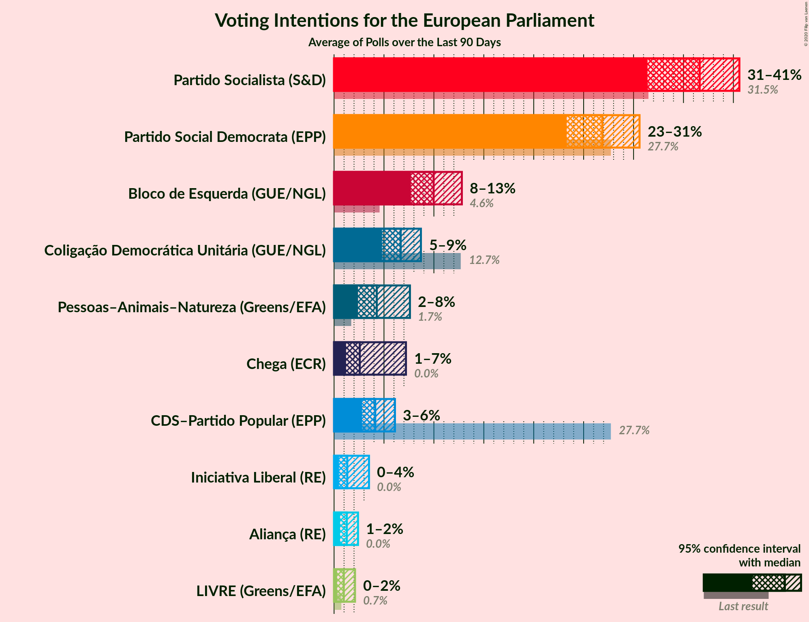

### Confidence Intervals

| Party | Last Result | Median | 80% Confidence Interval | 90% Confidence Interval | 95% Confidence Interval | 99% Confidence Interval |
|:-----:|:-----------:|:------:|:-----------------------:|:-----------------------:|:-----------------------:|:-----------------------:|
| <a href="#partido-socialista-(s&d)">Partido Socialista (S&D)</a> | 31.5% | 36.6% | 33.2–39.3% |32.2–40.0% | 31.4–40.6% | 30.0–41.9% |
| <a href="#partido-social-democrata-(epp)">Partido Social Democrata (EPP)</a> | 27.7% | 26.9% | 24.6–29.2% |23.9–29.9% | 23.3–30.6% | 22.2–31.8% |
| <a href="#cds–partido-popular-(epp)">CDS–Partido Popular (EPP)</a> | 27.7% | 4.1% | 3.2–5.4% |2.9–5.8% | 2.8–6.1% | 2.4–6.9% |
| <a href="#coligação-democrática-unitária-(gue/ngl)">Coligação Democrática Unitária (GUE/NGL)</a> | 12.7% | 6.7% | 5.4–8.0% |5.1–8.4% | 4.8–8.7% | 4.3–9.4% |
| <a href="#bloco-de-esquerda-(gue/ngl)">Bloco de Esquerda (GUE/NGL)</a> | 4.6% | 10.0% | 8.4–11.8% |8.0–12.3% | 7.7–12.8% | 7.0–13.8% |
| <a href="#pessoas–animais–natureza-(greens/efa)">Pessoas–Animais–Natureza (Greens/EFA)</a> | 1.7% | 4.3% | 2.9–6.6% |2.6–7.1% | 2.4–7.6% | 2.0–8.4% |
| <a href="#livre-(greens/efa)">LIVRE (Greens/EFA)</a> | 0.7% | 1.0% | 0.5–1.6% |0.4–1.9% | 0.3–2.1% | 0.3–2.5% |
| <a href="#iniciativa-liberal-(re)">Iniciativa Liberal (RE)</a> | 0.0% | 1.3% | 0.7–2.8% |0.6–3.2% | 0.5–3.5% | 0.3–4.1% |
| <a href="#aliança-(re)">Aliança (RE)</a> | 0.0% | 1.3% | 0.8–1.9% |0.7–2.2% | 0.6–2.4% | 0.4–2.8% |
| <a href="#chega-(ecr)">Chega (ECR)</a> | 0.0% | 2.6% | 1.5–6.1% |1.4–6.7% | 1.2–7.2% | 1.0–8.0% |

### Partido Socialista (S&D)

*For a full overview of the results for this party, see the [Partido Socialista (S&D)](party-partidosocialistasd.html) page.*

| Voting Intentions | Probability | Accumulated | Special Marks |
|:-----------------:|:-----------:|:-----------:|:-------------:|
| 27.5–28.5% | 0% | 100% |  |
| 28.5–29.5% | 0.2% | 99.9% |  |
| 29.5–30.5% | 0.7% | 99.7% |  |
| 30.5–31.5% | 2% | 99.0% | Last Result |
| 31.5–32.5% | 4% | 97% |  |
| 32.5–33.5% | 6% | 93% |  |
| 33.5–34.5% | 9% | 88% |  |
| 34.5–35.5% | 12% | 79% |  |
| 35.5–36.5% | 16% | 67% |  |
| 36.5–37.5% | 18% | 51% | Median |
| 37.5–38.5% | 15% | 33% |  |
| 38.5–39.5% | 10% | 18% |  |
| 39.5–40.5% | 5% | 8% |  |
| 40.5–41.5% | 2% | 3% |  |
| 41.5–42.5% | 0.6% | 0.8% |  |
| 42.5–43.5% | 0.2% | 0.2% |  |
| 43.5–44.5% | 0% | 0% |  |

### Partido Social Democrata (EPP)

*For a full overview of the results for this party, see the [Partido Social Democrata (EPP)](party-partidosocialdemocrataepp.html) page.*

| Voting Intentions | Probability | Accumulated | Special Marks |
|:-----------------:|:-----------:|:-----------:|:-------------:|
| 19.5–20.5% | 0% | 100% |  |
| 20.5–21.5% | 0.2% | 100% |  |
| 21.5–22.5% | 0.7% | 99.8% |  |
| 22.5–23.5% | 2% | 99.1% |  |
| 23.5–24.5% | 6% | 97% |  |
| 24.5–25.5% | 13% | 90% |  |
| 25.5–26.5% | 20% | 78% |  |
| 26.5–27.5% | 22% | 58% | Median |
| 27.5–28.5% | 18% | 36% | Last Result |
| 28.5–29.5% | 11% | 18% |  |
| 29.5–30.5% | 5% | 7% |  |
| 30.5–31.5% | 2% | 3% |  |
| 31.5–32.5% | 0.6% | 0.7% |  |
| 32.5–33.5% | 0.1% | 0.2% |  |
| 33.5–34.5% | 0% | 0% |  |

### CDS–Partido Popular (EPP)

*For a full overview of the results for this party, see the [CDS–Partido Popular (EPP)](party-cds–partidopopularepp.html) page.*

| Voting Intentions | Probability | Accumulated | Special Marks |
|:-----------------:|:-----------:|:-----------:|:-------------:|
| 0.5–1.5% | 0% | 100% |  |
| 1.5–2.5% | 1.0% | 100% |  |
| 2.5–3.5% | 22% | 99.0% |  |
| 3.5–4.5% | 45% | 77% | Median |
| 4.5–5.5% | 24% | 32% |  |
| 5.5–6.5% | 7% | 8% |  |
| 6.5–7.5% | 0.9% | 1.0% |  |
| 7.5–8.5% | 0.1% | 0.1% |  |
| 8.5–9.5% | 0% | 0% |  |
| 9.5–10.5% | 0% | 0% |  |
| 10.5–11.5% | 0% | 0% |  |
| 11.5–12.5% | 0% | 0% |  |
| 12.5–13.5% | 0% | 0% |  |
| 13.5–14.5% | 0% | 0% |  |
| 14.5–15.5% | 0% | 0% |  |
| 15.5–16.5% | 0% | 0% |  |
| 16.5–17.5% | 0% | 0% |  |
| 17.5–18.5% | 0% | 0% |  |
| 18.5–19.5% | 0% | 0% |  |
| 19.5–20.5% | 0% | 0% |  |
| 20.5–21.5% | 0% | 0% |  |
| 21.5–22.5% | 0% | 0% |  |
| 22.5–23.5% | 0% | 0% |  |
| 23.5–24.5% | 0% | 0% |  |
| 24.5–25.5% | 0% | 0% |  |
| 25.5–26.5% | 0% | 0% |  |
| 26.5–27.5% | 0% | 0% |  |
| 27.5–28.5% | 0% | 0% | Last Result |

### Coligação Democrática Unitária (GUE/NGL)

*For a full overview of the results for this party, see the [Coligação Democrática Unitária (GUE/NGL)](party-coligaçãodemocráticaunitáriaguengl.html) page.*

| Voting Intentions | Probability | Accumulated | Special Marks |
|:-----------------:|:-----------:|:-----------:|:-------------:|
| 2.5–3.5% | 0% | 100% |  |
| 3.5–4.5% | 1.2% | 100% |  |
| 4.5–5.5% | 11% | 98.8% |  |
| 5.5–6.5% | 33% | 87% |  |
| 6.5–7.5% | 35% | 55% | Median |
| 7.5–8.5% | 16% | 20% |  |
| 8.5–9.5% | 3% | 3% |  |
| 9.5–10.5% | 0.3% | 0.4% |  |
| 10.5–11.5% | 0% | 0% |  |
| 11.5–12.5% | 0% | 0% |  |
| 12.5–13.5% | 0% | 0% | Last Result |

### Bloco de Esquerda (GUE/NGL)

*For a full overview of the results for this party, see the [Bloco de Esquerda (GUE/NGL)](party-blocodeesquerdaguengl.html) page.*

| Voting Intentions | Probability | Accumulated | Special Marks |
|:-----------------:|:-----------:|:-----------:|:-------------:|
| 4.5–5.5% | 0% | 100% | Last Result |
| 5.5–6.5% | 0.1% | 100% |  |
| 6.5–7.5% | 2% | 99.9% |  |
| 7.5–8.5% | 10% | 98% |  |
| 8.5–9.5% | 25% | 88% |  |
| 9.5–10.5% | 30% | 63% | Median |
| 10.5–11.5% | 21% | 33% |  |
| 11.5–12.5% | 9% | 13% |  |
| 12.5–13.5% | 3% | 4% |  |
| 13.5–14.5% | 0.6% | 0.7% |  |
| 14.5–15.5% | 0.1% | 0.1% |  |
| 15.5–16.5% | 0% | 0% |  |

### Pessoas–Animais–Natureza (Greens/EFA)

*For a full overview of the results for this party, see the [Pessoas–Animais–Natureza (Greens/EFA)](party-pessoas–animais–naturezagreensefa.html) page.*

| Voting Intentions | Probability | Accumulated | Special Marks |
|:-----------------:|:-----------:|:-----------:|:-------------:|
| 0.5–1.5% | 0% | 100% |  |
| 1.5–2.5% | 4% | 100% | Last Result |
| 2.5–3.5% | 25% | 96% |  |
| 3.5–4.5% | 27% | 70% | Median |
| 4.5–5.5% | 18% | 44% |  |
| 5.5–6.5% | 15% | 25% |  |
| 6.5–7.5% | 8% | 10% |  |
| 7.5–8.5% | 2% | 3% |  |
| 8.5–9.5% | 0.3% | 0.4% |  |
| 9.5–10.5% | 0% | 0% |  |

### LIVRE (Greens/EFA)

*For a full overview of the results for this party, see the [LIVRE (Greens/EFA)](party-livregreensefa.html) page.*

| Voting Intentions | Probability | Accumulated | Special Marks |
|:-----------------:|:-----------:|:-----------:|:-------------:|
| 0.0–0.5% | 13% | 100% |  |
| 0.5–1.5% | 74% | 87% | Last Result, Median |
| 1.5–2.5% | 12% | 13% |  |
| 2.5–3.5% | 0.4% | 0.5% |  |
| 3.5–4.5% | 0% | 0% |  |

### Iniciativa Liberal (RE)

*For a full overview of the results for this party, see the [Iniciativa Liberal (RE)](party-iniciativaliberalre.html) page.*

| Voting Intentions | Probability | Accumulated | Special Marks |
|:-----------------:|:-----------:|:-----------:|:-------------:|
| 0.0–0.5% | 3% | 100% | Last Result |
| 0.5–1.5% | 58% | 97% | Median |
| 1.5–2.5% | 25% | 38% |  |
| 2.5–3.5% | 11% | 14% |  |
| 3.5–4.5% | 2% | 2% |  |
| 4.5–5.5% | 0.1% | 0.1% |  |
| 5.5–6.5% | 0% | 0% |  |

### Chega (ECR)

*For a full overview of the results for this party, see the [Chega (ECR)](party-chegaecr.html) page.*

| Voting Intentions | Probability | Accumulated | Special Marks |
|:-----------------:|:-----------:|:-----------:|:-------------:|
| 0.0–0.5% | 0% | 100% | Last Result |
| 0.5–1.5% | 10% | 100% |  |
| 1.5–2.5% | 38% | 90% |  |
| 2.5–3.5% | 20% | 51% | Median |
| 3.5–4.5% | 7% | 31% |  |
| 4.5–5.5% | 8% | 24% |  |
| 5.5–6.5% | 10% | 16% |  |
| 6.5–7.5% | 5% | 6% |  |
| 7.5–8.5% | 1.2% | 1.3% |  |
| 8.5–9.5% | 0.1% | 0.2% |  |
| 9.5–10.5% | 0% | 0% |  |

### Aliança (RE)

*For a full overview of the results for this party, see the [Aliança (RE)](party-aliançare.html) page.*

| Voting Intentions | Probability | Accumulated | Special Marks |
|:-----------------:|:-----------:|:-----------:|:-------------:|
| 0.0–0.5% | 2% | 100% | Last Result |
| 0.5–1.5% | 70% | 98% | Median |
| 1.5–2.5% | 27% | 28% |  |
| 2.5–3.5% | 1.4% | 1.4% |  |
| 3.5–4.5% | 0% | 0% |  |

## Seats

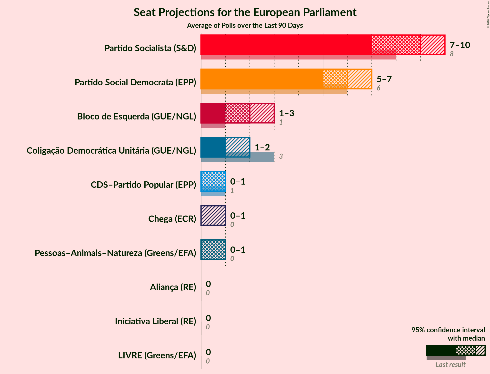

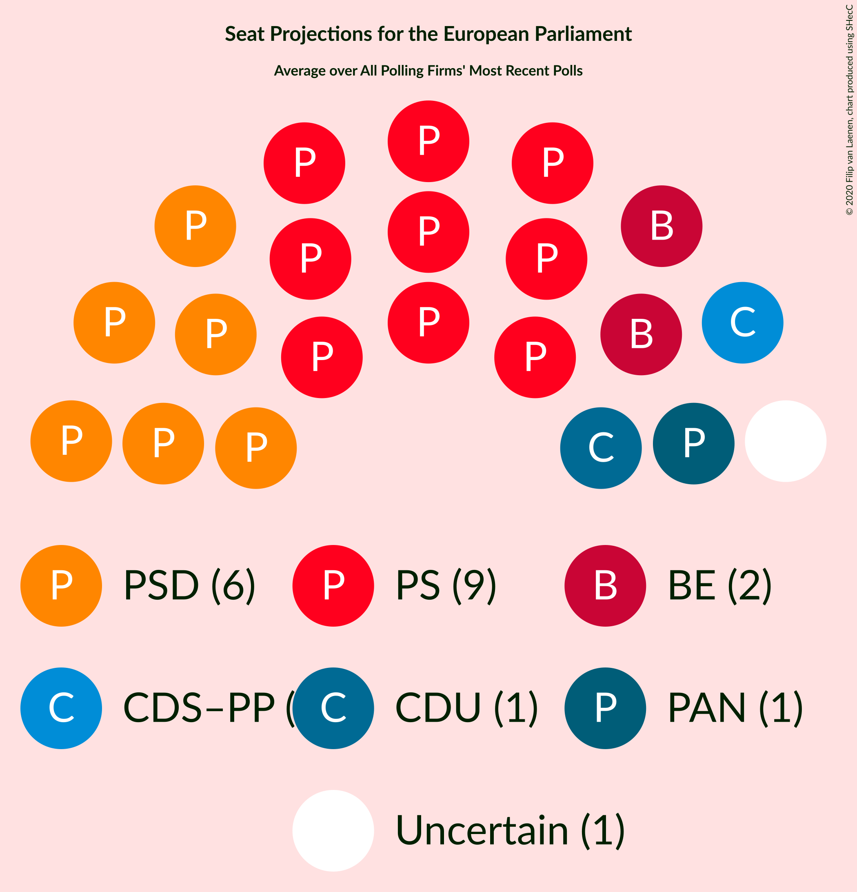

### Confidence Intervals

| Party | Last Result | Median | 80% Confidence Interval | 90% Confidence Interval | 95% Confidence Interval | 99% Confidence Interval |
|:-----:|:-----------:|:------:|:-----------------------:|:-----------------------:|:-----------------------:|:-----------------------:|
| <a href="#partido-socialista-(s&d)">Partido Socialista (S&D)</a> | 8 | 9 | 8–10 |8–10 | 7–10 | 7–10 |
| <a href="#partido-social-democrata-(epp)">Partido Social Democrata (EPP)</a> | 6 | 6 | 6–7 |6–7 | 5–7 | 5–8 |
| <a href="#cds–partido-popular-(epp)">CDS–Partido Popular (EPP)</a> | 1 | 1 | 0–1 |0–1 | 0–1 | 0–1 |
| <a href="#coligação-democrática-unitária-(gue/ngl)">Coligação Democrática Unitária (GUE/NGL)</a> | 3 | 1 | 1–2 |1–2 | 1–2 | 1–2 |
| <a href="#bloco-de-esquerda-(gue/ngl)">Bloco de Esquerda (GUE/NGL)</a> | 1 | 2 | 2–3 |2–3 | 1–3 | 1–3 |
| <a href="#pessoas–animais–natureza-(greens/efa)">Pessoas–Animais–Natureza (Greens/EFA)</a> | 0 | 1 | 0–1 |0–1 | 0–1 | 0–2 |
| <a href="#livre-(greens/efa)">LIVRE (Greens/EFA)</a> | 0 | 0 | 0 |0 | 0 | 0 |
| <a href="#iniciativa-liberal-(re)">Iniciativa Liberal (RE)</a> | 0 | 0 | 0 |0 | 0 | 0–1 |
| <a href="#aliança-(re)">Aliança (RE)</a> | 0 | 0 | 0 |0 | 0 | 0 |
| <a href="#chega-(ecr)">Chega (ECR)</a> | 0 | 0 | 0–1 |0–1 | 0–1 | 0–2 |

### Partido Socialista (S&D)

*For a full overview of the results for this party, see the [Partido Socialista (S&D)](party-partidosocialistasd.html) page.*

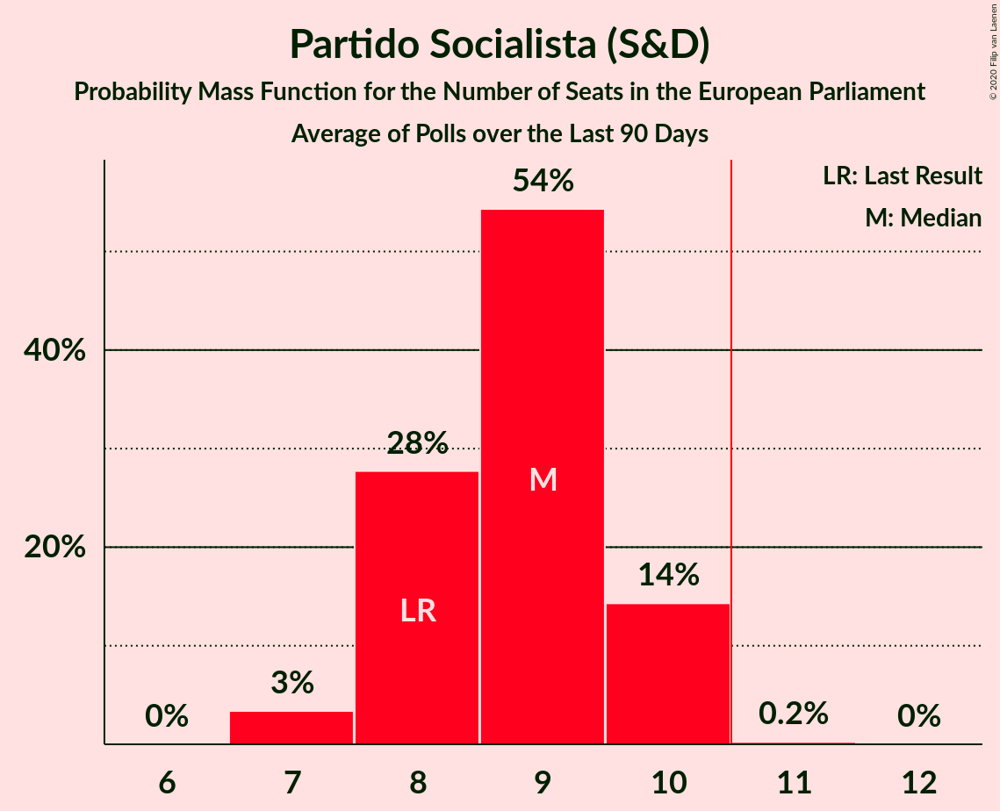

| Number of Seats | Probability | Accumulated | Special Marks |
|:---------------:|:-----------:|:-----------:|:-------------:|
| 7 | 3% | 100% |  |
| 8 | 28% | 97% | Last Result |
| 9 | 54% | 69% | Median |
| 10 | 14% | 15% |  |
| 11 | 0.2% | 0.2% | Majority |
| 12 | 0% | 0% |  |

### Partido Social Democrata (EPP)

*For a full overview of the results for this party, see the [Partido Social Democrata (EPP)](party-partidosocialdemocrataepp.html) page.*

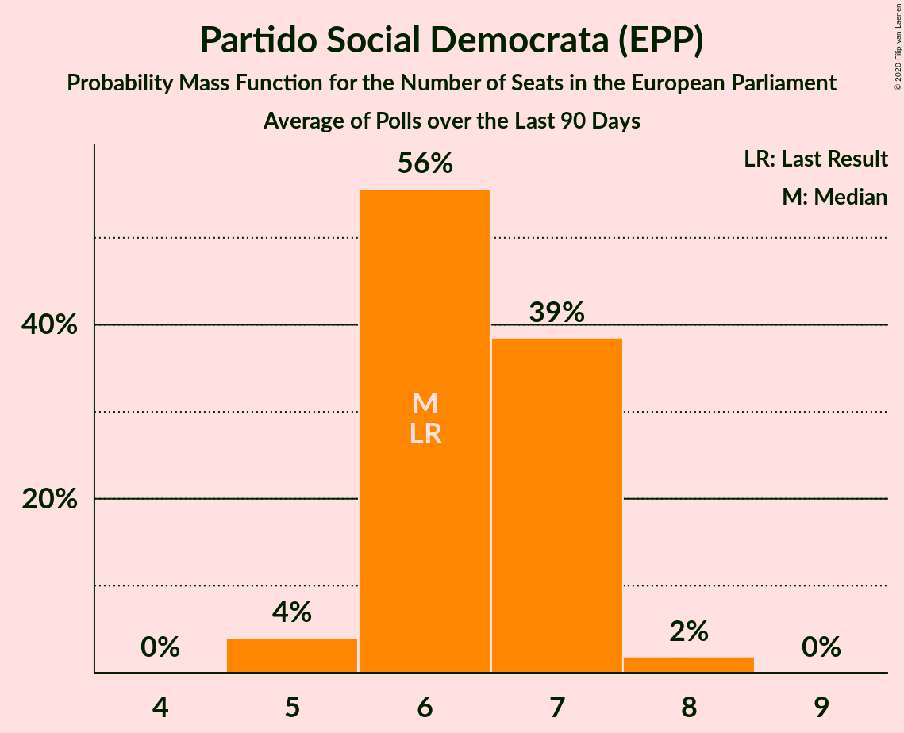

| Number of Seats | Probability | Accumulated | Special Marks |
|:---------------:|:-----------:|:-----------:|:-------------:|
| 5 | 4% | 100% |  |
| 6 | 56% | 96% | Last Result, Median |
| 7 | 39% | 40% |  |
| 8 | 2% | 2% |  |
| 9 | 0% | 0% |  |

### CDS–Partido Popular (EPP)

*For a full overview of the results for this party, see the [CDS–Partido Popular (EPP)](party-cds–partidopopularepp.html) page.*

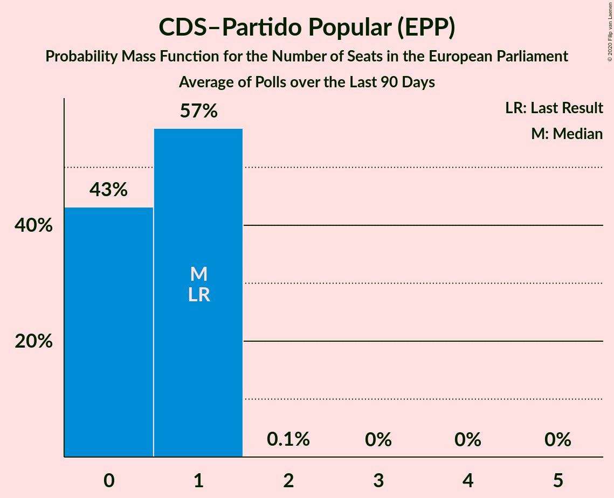

| Number of Seats | Probability | Accumulated | Special Marks |
|:---------------:|:-----------:|:-----------:|:-------------:|
| 0 | 43% | 100% |  |
| 1 | 57% | 57% | Last Result, Median |
| 2 | 0.1% | 0.1% |  |
| 3 | 0% | 0% |  |

### Coligação Democrática Unitária (GUE/NGL)

*For a full overview of the results for this party, see the [Coligação Democrática Unitária (GUE/NGL)](party-coligaçãodemocráticaunitáriaguengl.html) page.*

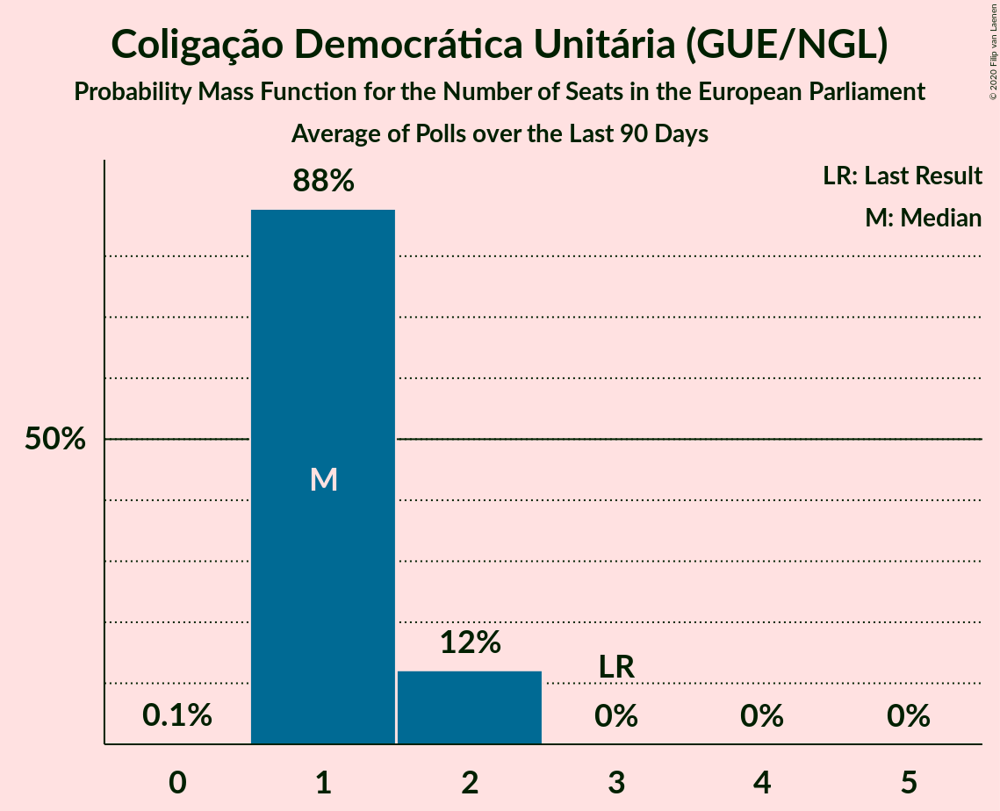

| Number of Seats | Probability | Accumulated | Special Marks |
|:---------------:|:-----------:|:-----------:|:-------------:|
| 0 | 0.1% | 100% |  |
| 1 | 88% | 99.9% | Median |
| 2 | 12% | 12% |  |
| 3 | 0% | 0% | Last Result |

### Bloco de Esquerda (GUE/NGL)

*For a full overview of the results for this party, see the [Bloco de Esquerda (GUE/NGL)](party-blocodeesquerdaguengl.html) page.*

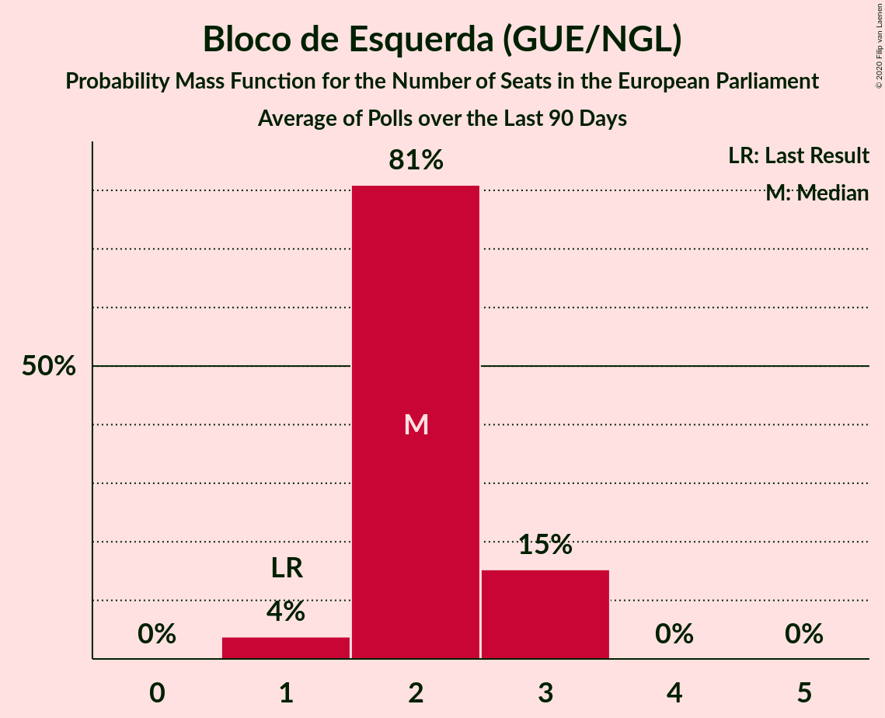

| Number of Seats | Probability | Accumulated | Special Marks |
|:---------------:|:-----------:|:-----------:|:-------------:|
| 1 | 4% | 100% | Last Result |
| 2 | 81% | 96% | Median |
| 3 | 15% | 15% |  |
| 4 | 0% | 0% |  |

### Pessoas–Animais–Natureza (Greens/EFA)

*For a full overview of the results for this party, see the [Pessoas–Animais–Natureza (Greens/EFA)](party-pessoas–animais–naturezagreensefa.html) page.*

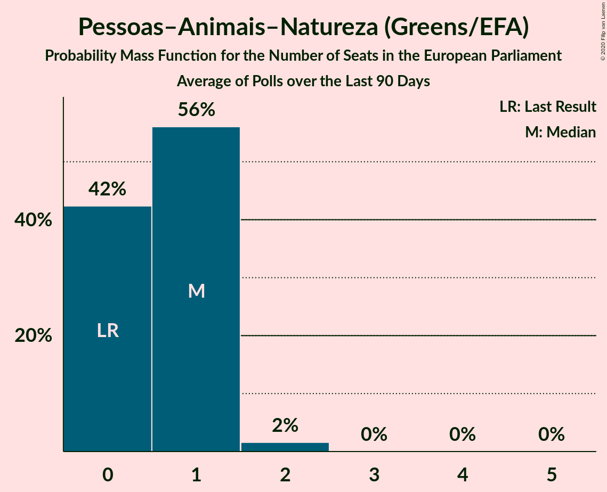

| Number of Seats | Probability | Accumulated | Special Marks |
|:---------------:|:-----------:|:-----------:|:-------------:|
| 0 | 42% | 100% | Last Result |
| 1 | 56% | 58% | Median |
| 2 | 2% | 2% |  |
| 3 | 0% | 0% |  |

### LIVRE (Greens/EFA)

*For a full overview of the results for this party, see the [LIVRE (Greens/EFA)](party-livregreensefa.html) page.*

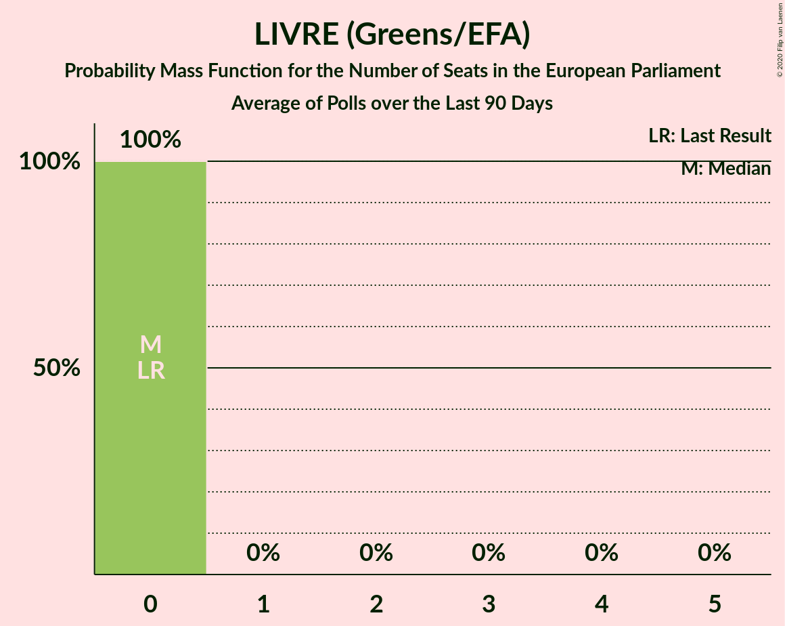

| Number of Seats | Probability | Accumulated | Special Marks |
|:---------------:|:-----------:|:-----------:|:-------------:|
| 0 | 100% | 100% | Last Result, Median |

### Iniciativa Liberal (RE)

*For a full overview of the results for this party, see the [Iniciativa Liberal (RE)](party-iniciativaliberalre.html) page.*

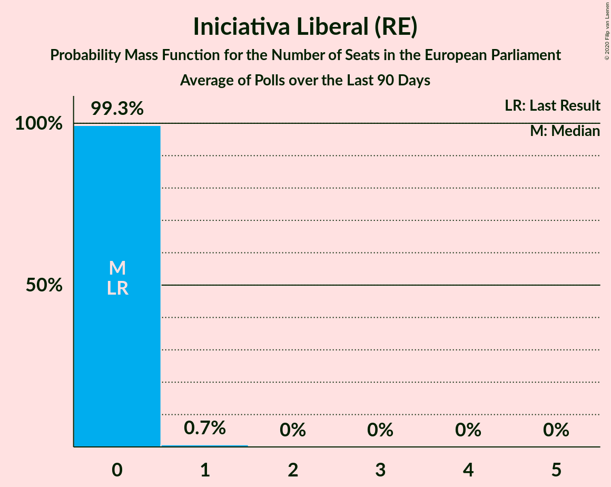

| Number of Seats | Probability | Accumulated | Special Marks |
|:---------------:|:-----------:|:-----------:|:-------------:|
| 0 | 99.3% | 100% | Last Result, Median |
| 1 | 0.7% | 0.7% |  |
| 2 | 0% | 0% |  |

### Chega (ECR)

*For a full overview of the results for this party, see the [Chega (ECR)](party-chegaecr.html) page.*

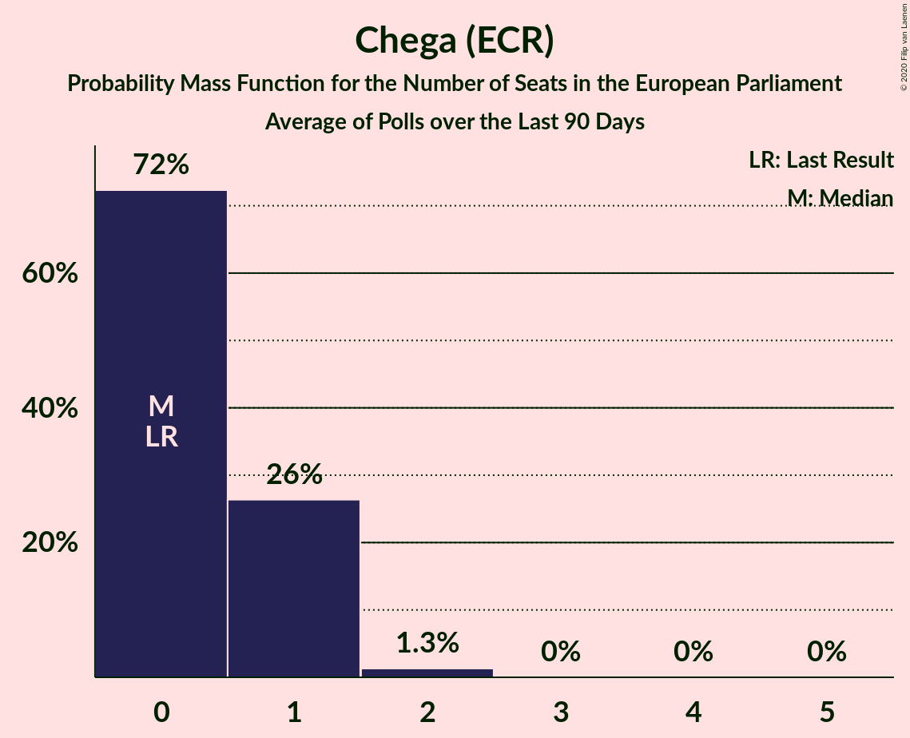

| Number of Seats | Probability | Accumulated | Special Marks |
|:---------------:|:-----------:|:-----------:|:-------------:|
| 0 | 72% | 100% | Last Result, Median |
| 1 | 26% | 28% |  |
| 2 | 1.3% | 1.3% |  |
| 3 | 0% | 0% |  |

### Aliança (RE)

*For a full overview of the results for this party, see the [Aliança (RE)](party-aliançare.html) page.*

| Number of Seats | Probability | Accumulated | Special Marks |
|:---------------:|:-----------:|:-----------:|:-------------:|
| 0 | 100% | 100% | Last Result, Median |

## Coalitions

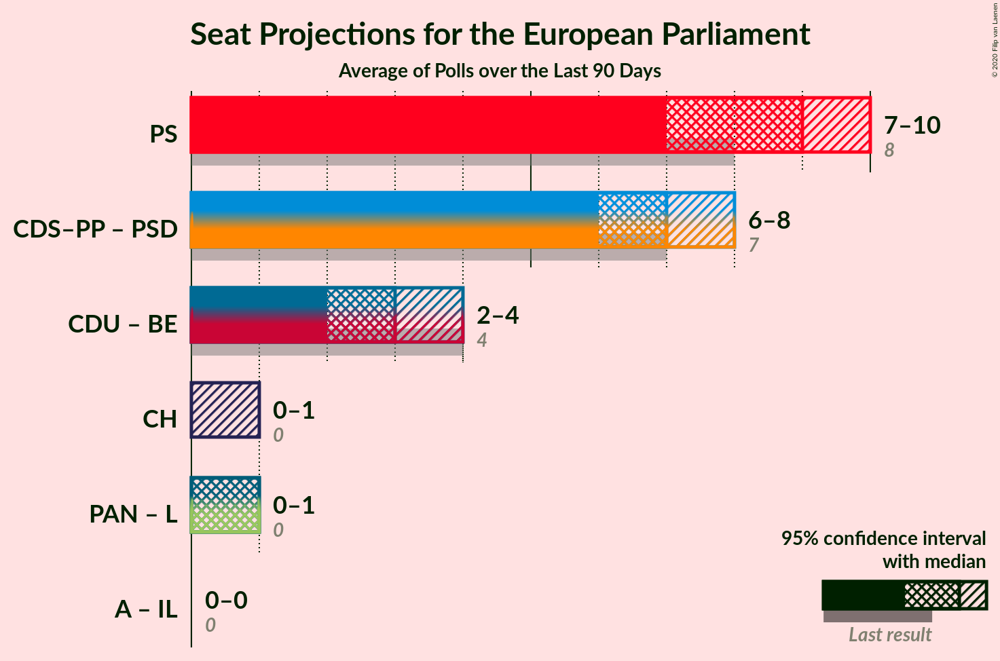

### Confidence Intervals

| Coalition | Last Result | Median | Majority? | 80% Confidence Interval | 90% Confidence Interval | 95% Confidence Interval | 99% Confidence Interval |
|:---------:|:-----------:|:------:|:---------:|:-----------------------:|:-----------------------:|:-----------------------:|:-----------------------:|
| Partido Socialista (S&D) | 8 | 9 | 0.2% | 8–10 | 8–10 | 7–10 | 7–10 |
| CDS–Partido Popular (EPP) – Partido Social Democrata (EPP) | 7 | 7 | 0% | 6–8 | 6–8 | 6–8 | 5–9 |
| Coligação Democrática Unitária (GUE/NGL) – Bloco de Esquerda (GUE/NGL) | 4 | 3 | 0% | 3–4 | 3–4 | 2–4 | 2–5 |
| Chega (ECR) | 0 | 0 | 0% | 0–1 | 0–1 | 0–1 | 0–2 |
| Pessoas–Animais–Natureza (Greens/EFA) – LIVRE (Greens/EFA) | 0 | 1 | 0% | 0–1 | 0–1 | 0–1 | 0–2 |
| Aliança (RE) – Iniciativa Liberal (RE) | 0 | 0 | 0% | 0 | 0 | 0 | 0–1 |

### Partido Socialista (S&D)

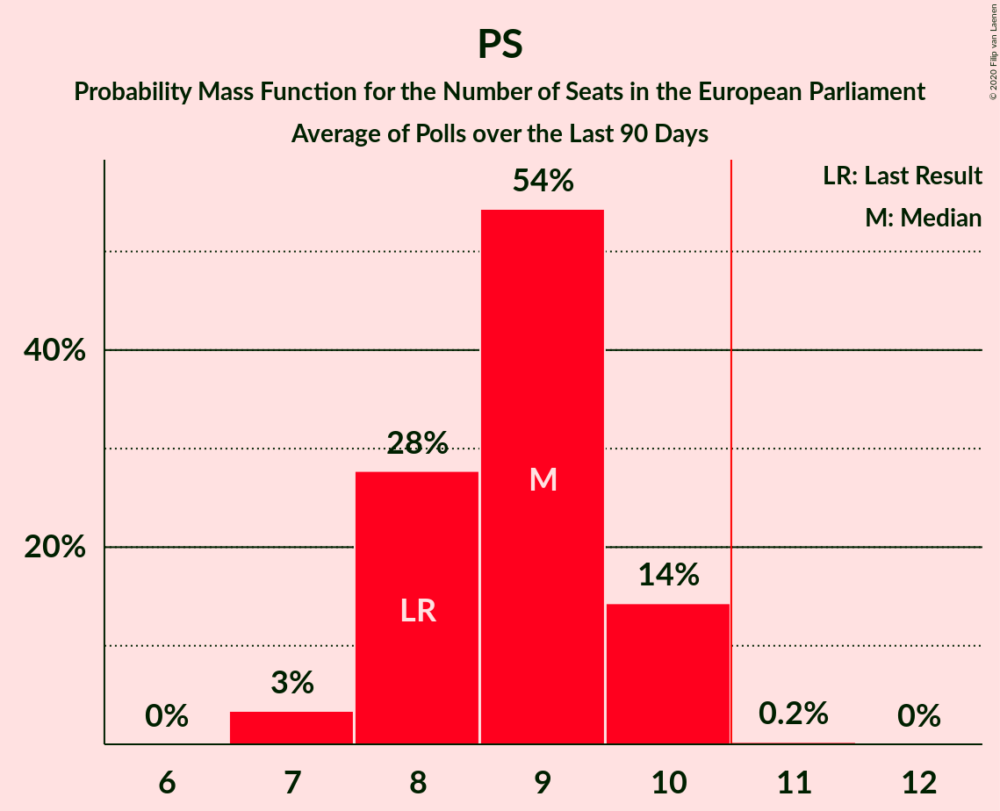

| Number of Seats | Probability | Accumulated | Special Marks |
|:---------------:|:-----------:|:-----------:|:-------------:|
| 7 | 3% | 100% |  |
| 8 | 28% | 97% | Last Result |
| 9 | 54% | 69% | Median |
| 10 | 14% | 15% |  |
| 11 | 0.2% | 0.2% | Majority |
| 12 | 0% | 0% |  |

### CDS–Partido Popular (EPP) – Partido Social Democrata (EPP)

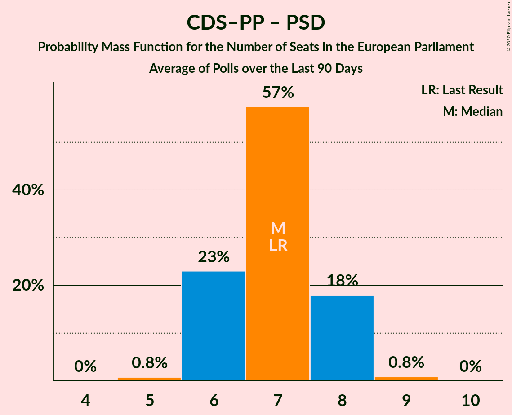

| Number of Seats | Probability | Accumulated | Special Marks |
|:---------------:|:-----------:|:-----------:|:-------------:|
| 5 | 0.8% | 100% |  |
| 6 | 23% | 99.2% |  |
| 7 | 57% | 76% | Last Result, Median |
| 8 | 18% | 19% |  |
| 9 | 0.8% | 0.8% |  |
| 10 | 0% | 0% |  |

### Coligação Democrática Unitária (GUE/NGL) – Bloco de Esquerda (GUE/NGL)

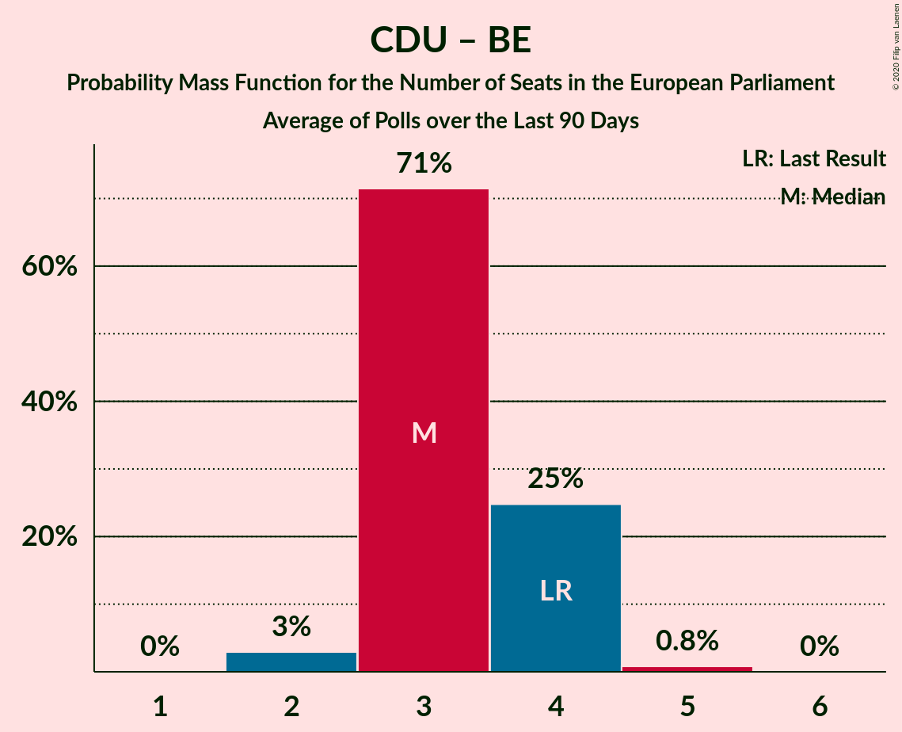

| Number of Seats | Probability | Accumulated | Special Marks |
|:---------------:|:-----------:|:-----------:|:-------------:|
| 2 | 3% | 100% |  |
| 3 | 71% | 97% | Median |
| 4 | 25% | 26% | Last Result |
| 5 | 0.8% | 0.8% |  |
| 6 | 0% | 0% |  |

### Chega (ECR)

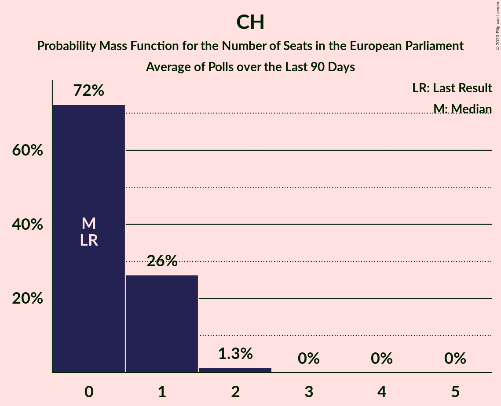

| Number of Seats | Probability | Accumulated | Special Marks |
|:---------------:|:-----------:|:-----------:|:-------------:|
| 0 | 72% | 100% | Last Result, Median |
| 1 | 26% | 28% |  |
| 2 | 1.3% | 1.3% |  |
| 3 | 0% | 0% |  |

### Pessoas–Animais–Natureza (Greens/EFA) – LIVRE (Greens/EFA)

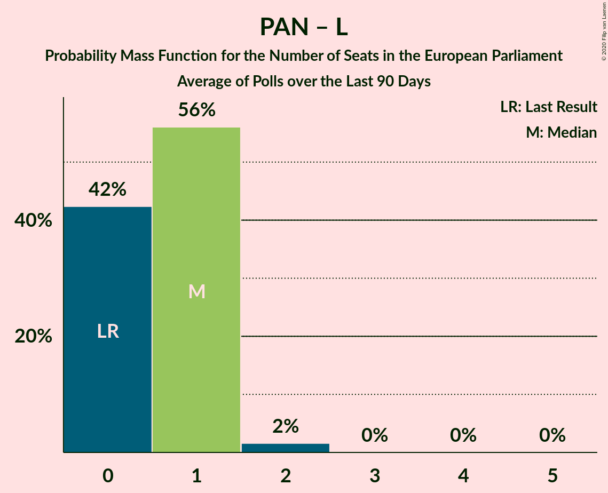

| Number of Seats | Probability | Accumulated | Special Marks |
|:---------------:|:-----------:|:-----------:|:-------------:|
| 0 | 42% | 100% | Last Result |
| 1 | 56% | 58% | Median |
| 2 | 2% | 2% |  |
| 3 | 0% | 0% |  |

### Aliança (RE) – Iniciativa Liberal (RE)

| Number of Seats | Probability | Accumulated | Special Marks |
|:---------------:|:-----------:|:-----------:|:-------------:|
| 0 | 99.3% | 100% | Last Result, Median |
| 1 | 0.7% | 0.7% |  |
| 2 | 0% | 0% |  |

## Technical Information

+ **Number of polls included in this average:** 4
+ **Lowest number of simulations done in a poll included in this average:** 1,048,576
+ **Total number of simulations done in the polls included in this average:** 4,194,304
+ **Error estimate:** 3.76%
