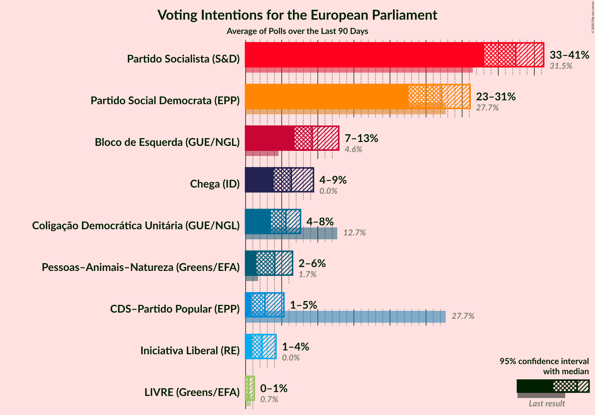
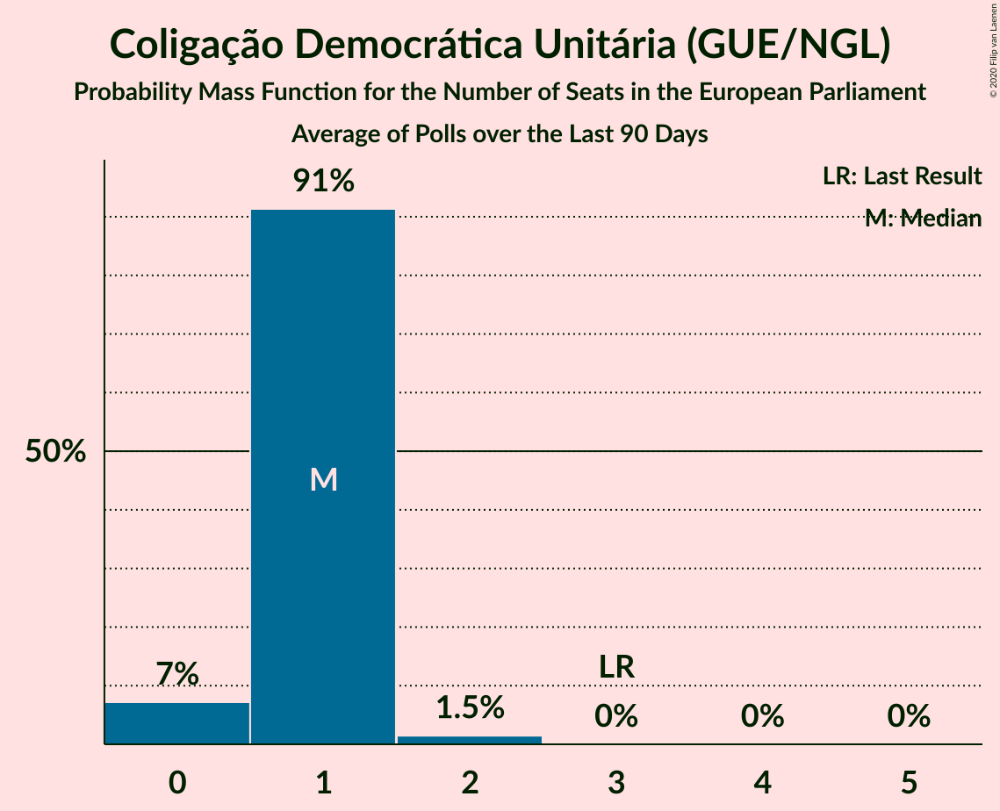
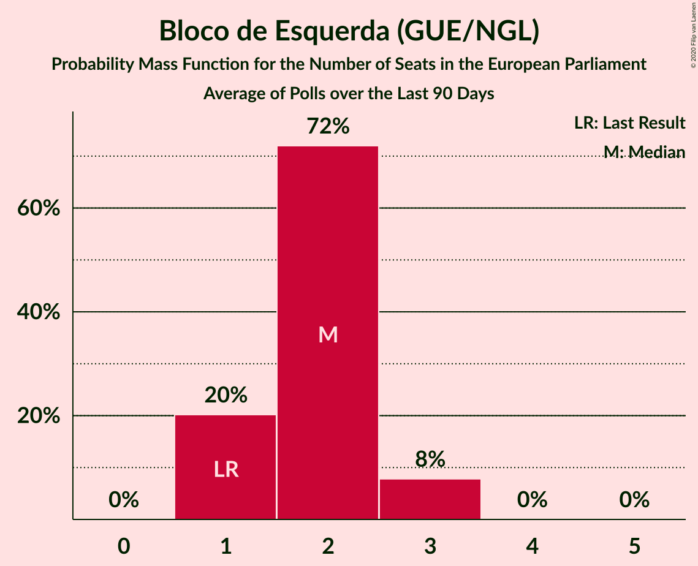
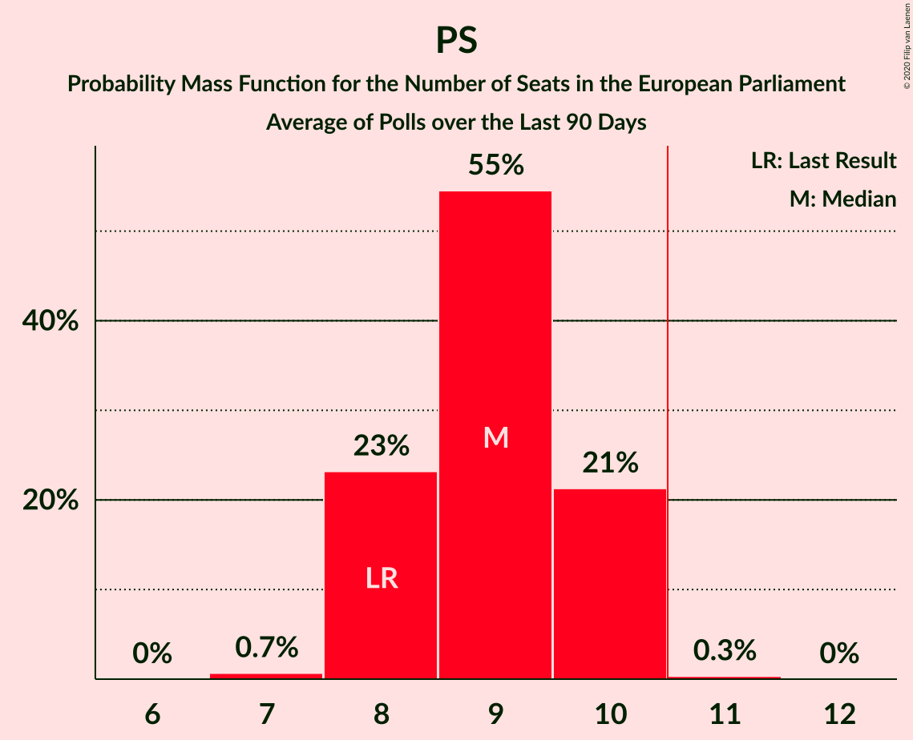
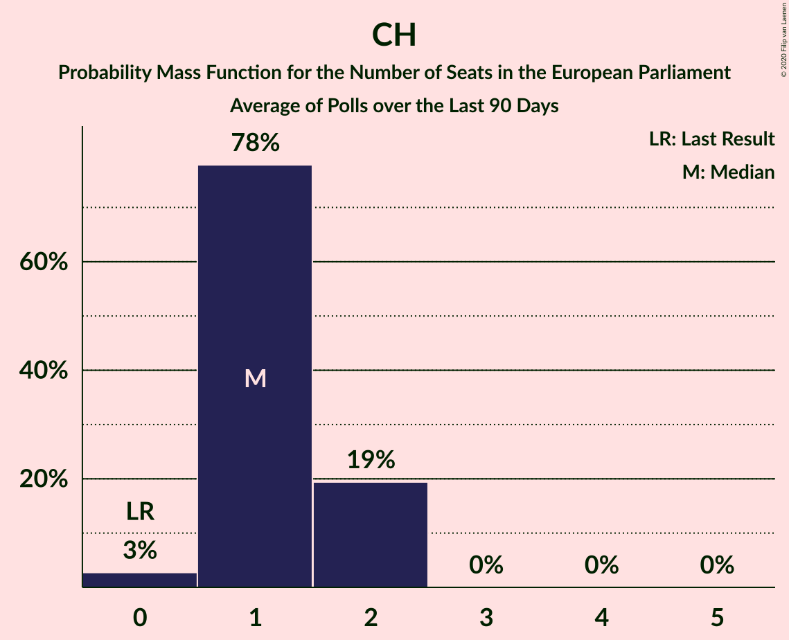

# Poll Average

<a href="#voting-intentions">Voting Intentions</a> | <a href="#seats">Seats</a> | <a href="#coalitions">Coalitions</a> | <a href="#technical-information">Technical Information</a>

## Summary

The table below lists the polls on which the average is based. They are the most recent polls (less than 90 days old) registered and analyzed so far.

| Period     | Polling firm/Commissioner(s) | PS | PSD | CDS–PP | CDU | BE | PAN | L | IL | A | CH |
|:----------:|:----------------------------:|:--:|:--:|:--:|:--:|:--:|:--:|:--:|:--:|:--:|:--:|
| 26 May 2019 | General Election | 31.5%   8 | 27.7%   6 | 27.7%   1 | 12.7%   3 | 4.6%   1 | 1.7%   0 | 0.7%   0 | 0.0%   0 | 0.0%   0 | 0.0%   0 |
| N/A | Poll Average | 33–41%   8–10 | 23–31%   5–7 | 1–5%   0–1 | 4–8%   0–1 | 7–13%   1–3 | 2–6%   0–1 | 0–1%   0 | 1–4%   0–1 | N/A   N/A | 4–9%   0–2 |
| [22–26 October 2020](2020-10-26-Aximage.html) | Aximage | 32–39%   8–9 | 24–31%   5–7 | 1–2%   0 | 4–8%   1 | 8–13%   2–3 | 4–7%   0–1 | N/A   N/A | 2–5%   0–1 | N/A   N/A | 4–7%   1 |
| [6–11 October 2020](2020-10-11-Intercampus.html) | Intercampus   Correio da Manhã and Negócios | 34–41%   8–10 | 22–28%   5–7 | 3–6%   0–1 | 3–6%   0–1 | 9–14%   2–3 | 3–6%   0–1 | 0–1%   0 | 1–4%   0 | N/A   N/A | 6–10%   1–2 |
| [5–8 October 2020](2020-10-08-Eurosondagem.html) | Eurosondagem | 36–42%   8–10 | 26–32%   6–8 | 2–5%   0–1 | 4–7%   1 | 7–10%   1–2 | 1–3%   0 | N/A   N/A | 1–2%   0 | N/A   N/A | 4–6%   0–1 |
| [14–24 September 2020](2020-09-24-ICSISCTE.html) | ICS/ISCTE | 34–41%   8–10 | 24–30%   6–7 | 1–3%   0 | 5–8%   1–2 | 6–10%   1–2 | 3–6%   0–1 | N/A   N/A | 1–3%   0 | N/A   N/A | 6–9%   1–2 |
| 26 May 2019 | General Election | 31.5%   8 | 27.7%   6 | 27.7%   1 | 12.7%   3 | 4.6%   1 | 1.7%   0 | 0.7%   0 | 0.0%   0 | 0.0%   0 | 0.0%   0 |

Only polls for which at least the sample size has been published are included in the table above.

**Legend:**
+ **Top half of each row:** Voting intentions (95% confidence interval)
+ **Bottom half of each row:** Seat projections for the European Parliament (95% confidence interval)
+ **PS:** Partido Socialista (S&D)
+ **PSD:** Partido Social Democrata (EPP)
+ **CDS–PP:** CDS–Partido Popular (EPP)
+ **CDU:** Coligação Democrática Unitária (GUE/NGL)
+ **BE:** Bloco de Esquerda (GUE/NGL)
+ **PAN:** Pessoas–Animais–Natureza (Greens/EFA)
+ **L:** LIVRE (Greens/EFA)
+ **IL:** Iniciativa Liberal (RE)
+ **A:** Aliança (RE)
+ **CH:** Chega (ID)
+ **N/A (single party):** Party not included the published results
+ **N/A (entire row):** Calculation for this opinion poll not started yet

## Voting Intentions

### Confidence Intervals

| Party | Last Result | Median | 80% Confidence Interval | 90% Confidence Interval | 95% Confidence Interval | 99% Confidence Interval |
|:-----:|:-----------:|:------:|:-----------------------:|:-----------------------:|:-----------------------:|:-----------------------:|
| <a href="#partido-socialista-(s&d)">Partido Socialista (S&D)</a> | 31.5% | 37.4% | 34.6–40.0% |33.8–40.7% | 33.1–41.3% | 31.9–42.4% |
| <a href="#partido-social-democrata-(epp)">Partido Social Democrata (EPP)</a> | 27.7% | 27.2% | 24.1–29.9% |23.3–30.5% | 22.6–31.1% | 21.4–32.1% |
| <a href="#cds–partido-popular-(epp)">CDS–Partido Popular (EPP)</a> | 27.7% | 2.7% | 1.1–4.4% |0.9–4.9% | 0.8–5.3% | 0.6–6.0% |
| <a href="#coligação-democrática-unitária-(gue/ngl)">Coligação Democrática Unitária (GUE/NGL)</a> | 12.7% | 5.6% | 4.2–6.9% |3.8–7.3% | 3.5–7.6% | 3.0–8.3% |
| <a href="#bloco-de-esquerda-(gue/ngl)">Bloco de Esquerda (GUE/NGL)</a> | 4.6% | 9.2% | 7.4–11.7% |7.0–12.4% | 6.8–12.9% | 6.2–13.9% |
| <a href="#pessoas–animais–natureza-(greens/efa)">Pessoas–Animais–Natureza (Greens/EFA)</a> | 1.7% | 4.0% | 1.9–5.6% |1.7–6.1% | 1.5–6.5% | 1.3–7.2% |
| <a href="#livre-(greens/efa)">LIVRE (Greens/EFA)</a> | 0.7% | 0.4% | 0.2–0.9% |0.1–1.0% | 0.1–1.2% | 0.1–1.5% |
| <a href="#iniciativa-liberal-(re)">Iniciativa Liberal (RE)</a> | 0.0% | 2.3% | 1.2–3.6% |1.1–3.9% | 0.9–4.2% | 0.7–4.9% |
| <a href="#aliança-(re)">Aliança (RE)</a> | 0.0% | N/A | N/A |N/A | N/A | N/A |
| <a href="#chega-(id)">Chega (ID)</a> | 0.0% | 6.3% | 4.5–8.4% |4.2–9.0% | 3.9–9.4% | 3.5–10.3% |

### Partido Socialista (S&D)

*For a full overview of the results for this party, see the [Partido Socialista (S&D)](party-partidosocialistasd.html) page.*

| Voting Intentions | Probability | Accumulated | Special Marks |
|:-----------------:|:-----------:|:-----------:|:-------------:|
| 29.5–30.5% | 0% | 100% |  |
| 30.5–31.5% | 0.2% | 99.9% | Last Result |
| 31.5–32.5% | 0.9% | 99.7% |  |
| 32.5–33.5% | 3% | 98.8% |  |
| 33.5–34.5% | 6% | 96% |  |
| 34.5–35.5% | 10% | 90% |  |
| 35.5–36.5% | 15% | 80% |  |
| 36.5–37.5% | 18% | 65% | Median |
| 37.5–38.5% | 18% | 47% |  |
| 38.5–39.5% | 15% | 29% |  |
| 39.5–40.5% | 9% | 15% |  |
| 40.5–41.5% | 4% | 6% |  |
| 41.5–42.5% | 1.3% | 2% |  |
| 42.5–43.5% | 0.3% | 0.4% |  |
| 43.5–44.5% | 0.1% | 0.1% |  |
| 44.5–45.5% | 0% | 0% |  |

### Partido Social Democrata (EPP)

*For a full overview of the results for this party, see the [Partido Social Democrata (EPP)](party-partidosocialdemocrataepp.html) page.*

| Voting Intentions | Probability | Accumulated | Special Marks |
|:-----------------:|:-----------:|:-----------:|:-------------:|
| 18.5–19.5% | 0% | 100% |  |
| 19.5–20.5% | 0.1% | 100% |  |
| 20.5–21.5% | 0.5% | 99.9% |  |
| 21.5–22.5% | 2% | 99.3% |  |
| 22.5–23.5% | 4% | 98% |  |
| 23.5–24.5% | 7% | 94% |  |
| 24.5–25.5% | 11% | 86% |  |
| 25.5–26.5% | 15% | 76% |  |
| 26.5–27.5% | 17% | 61% | Median |
| 27.5–28.5% | 17% | 43% | Last Result |
| 28.5–29.5% | 14% | 27% |  |
| 29.5–30.5% | 8% | 13% |  |
| 30.5–31.5% | 4% | 5% |  |
| 31.5–32.5% | 1.0% | 1.3% |  |
| 32.5–33.5% | 0.2% | 0.2% |  |
| 33.5–34.5% | 0% | 0% |  |

### CDS–Partido Popular (EPP)

*For a full overview of the results for this party, see the [CDS–Partido Popular (EPP)](party-cds–partidopopularepp.html) page.*

| Voting Intentions | Probability | Accumulated | Special Marks |
|:-----------------:|:-----------:|:-----------:|:-------------:|
| 0.0–0.5% | 0.4% | 100% |  |
| 0.5–1.5% | 22% | 99.6% |  |
| 1.5–2.5% | 25% | 78% |  |
| 2.5–3.5% | 25% | 53% | Median |
| 3.5–4.5% | 20% | 28% |  |
| 4.5–5.5% | 7% | 8% |  |
| 5.5–6.5% | 1.3% | 1.4% |  |
| 6.5–7.5% | 0.1% | 0.1% |  |
| 7.5–8.5% | 0% | 0% |  |
| 8.5–9.5% | 0% | 0% |  |
| 9.5–10.5% | 0% | 0% |  |
| 10.5–11.5% | 0% | 0% |  |
| 11.5–12.5% | 0% | 0% |  |
| 12.5–13.5% | 0% | 0% |  |
| 13.5–14.5% | 0% | 0% |  |
| 14.5–15.5% | 0% | 0% |  |
| 15.5–16.5% | 0% | 0% |  |
| 16.5–17.5% | 0% | 0% |  |
| 17.5–18.5% | 0% | 0% |  |
| 18.5–19.5% | 0% | 0% |  |
| 19.5–20.5% | 0% | 0% |  |
| 20.5–21.5% | 0% | 0% |  |
| 21.5–22.5% | 0% | 0% |  |
| 22.5–23.5% | 0% | 0% |  |
| 23.5–24.5% | 0% | 0% |  |
| 24.5–25.5% | 0% | 0% |  |
| 25.5–26.5% | 0% | 0% |  |
| 26.5–27.5% | 0% | 0% |  |
| 27.5–28.5% | 0% | 0% | Last Result |

### Coligação Democrática Unitária (GUE/NGL)

*For a full overview of the results for this party, see the [Coligação Democrática Unitária (GUE/NGL)](party-coligaçãodemocráticaunitáriaguengl.html) page.*

| Voting Intentions | Probability | Accumulated | Special Marks |
|:-----------------:|:-----------:|:-----------:|:-------------:|
| 1.5–2.5% | 0.1% | 100% |  |
| 2.5–3.5% | 3% | 99.9% |  |
| 3.5–4.5% | 14% | 97% |  |
| 4.5–5.5% | 31% | 83% |  |
| 5.5–6.5% | 35% | 51% | Median |
| 6.5–7.5% | 14% | 17% |  |
| 7.5–8.5% | 3% | 3% |  |
| 8.5–9.5% | 0.2% | 0.2% |  |
| 9.5–10.5% | 0% | 0% |  |
| 10.5–11.5% | 0% | 0% |  |
| 11.5–12.5% | 0% | 0% |  |
| 12.5–13.5% | 0% | 0% | Last Result |

### Bloco de Esquerda (GUE/NGL)

*For a full overview of the results for this party, see the [Bloco de Esquerda (GUE/NGL)](party-blocodeesquerdaguengl.html) page.*

| Voting Intentions | Probability | Accumulated | Special Marks |
|:-----------------:|:-----------:|:-----------:|:-------------:|
| 4.5–5.5% | 0% | 100% | Last Result |
| 5.5–6.5% | 1.4% | 100% |  |
| 6.5–7.5% | 11% | 98.5% |  |
| 7.5–8.5% | 23% | 88% |  |
| 8.5–9.5% | 21% | 65% | Median |
| 9.5–10.5% | 17% | 44% |  |
| 10.5–11.5% | 14% | 26% |  |
| 11.5–12.5% | 8% | 12% |  |
| 12.5–13.5% | 3% | 4% |  |
| 13.5–14.5% | 0.8% | 0.9% |  |
| 14.5–15.5% | 0.1% | 0.1% |  |
| 15.5–16.5% | 0% | 0% |  |

### Pessoas–Animais–Natureza (Greens/EFA)

*For a full overview of the results for this party, see the [Pessoas–Animais–Natureza (Greens/EFA)](party-pessoas–animais–naturezagreensefa.html) page.*

| Voting Intentions | Probability | Accumulated | Special Marks |
|:-----------------:|:-----------:|:-----------:|:-------------:|
| 0.0–0.5% | 0% | 100% |  |
| 0.5–1.5% | 3% | 100% |  |
| 1.5–2.5% | 19% | 97% | Last Result |
| 2.5–3.5% | 14% | 78% |  |
| 3.5–4.5% | 30% | 64% | Median |
| 4.5–5.5% | 23% | 34% |  |
| 5.5–6.5% | 9% | 11% |  |
| 6.5–7.5% | 2% | 2% |  |
| 7.5–8.5% | 0.2% | 0.2% |  |
| 8.5–9.5% | 0% | 0% |  |

### LIVRE (Greens/EFA)

*For a full overview of the results for this party, see the [LIVRE (Greens/EFA)](party-livregreensefa.html) page.*

| Voting Intentions | Probability | Accumulated | Special Marks |
|:-----------------:|:-----------:|:-----------:|:-------------:|
| 0.0–0.5% | 66% | 100% | Median |
| 0.5–1.5% | 34% | 34% | Last Result |
| 1.5–2.5% | 0.4% | 0.4% |  |
| 2.5–3.5% | 0% | 0% |  |

### Iniciativa Liberal (RE)

*For a full overview of the results for this party, see the [Iniciativa Liberal (RE)](party-iniciativaliberalre.html) page.*

| Voting Intentions | Probability | Accumulated | Special Marks |
|:-----------------:|:-----------:|:-----------:|:-------------:|
| 0.0–0.5% | 0% | 100% | Last Result |
| 0.5–1.5% | 22% | 100% |  |
| 1.5–2.5% | 39% | 78% | Median |
| 2.5–3.5% | 29% | 39% |  |
| 3.5–4.5% | 9% | 10% |  |
| 4.5–5.5% | 1.1% | 1.2% |  |
| 5.5–6.5% | 0.1% | 0.1% |  |
| 6.5–7.5% | 0% | 0% |  |

### Chega (ID)

*For a full overview of the results for this party, see the [Chega (ID)](party-chegaid.html) page.*

| Voting Intentions | Probability | Accumulated | Special Marks |
|:-----------------:|:-----------:|:-----------:|:-------------:|
| 0.0–0.5% | 0% | 100% | Last Result |
| 0.5–1.5% | 0% | 100% |  |
| 1.5–2.5% | 0% | 100% |  |
| 2.5–3.5% | 0.6% | 100% |  |
| 3.5–4.5% | 11% | 99.4% |  |
| 4.5–5.5% | 23% | 89% |  |
| 5.5–6.5% | 20% | 65% | Median |
| 6.5–7.5% | 21% | 45% |  |
| 7.5–8.5% | 16% | 25% |  |
| 8.5–9.5% | 7% | 9% |  |
| 9.5–10.5% | 2% | 2% |  |
| 10.5–11.5% | 0.3% | 0.3% |  |
| 11.5–12.5% | 0% | 0% |  |

## Seats

### Confidence Intervals

| Party | Last Result | Median | 80% Confidence Interval | 90% Confidence Interval | 95% Confidence Interval | 99% Confidence Interval |
|:-----:|:-----------:|:------:|:-----------------------:|:-----------------------:|:-----------------------:|:-----------------------:|
| <a href="#partido-socialista-(s&d)">Partido Socialista (S&D)</a> | 8 | 9 | 8–10 |8–10 | 8–10 | 7–10 |
| <a href="#partido-social-democrata-(epp)">Partido Social Democrata (EPP)</a> | 6 | 6 | 6–7 |5–7 | 5–7 | 5–8 |
| <a href="#cds–partido-popular-(epp)">CDS–Partido Popular (EPP)</a> | 1 | 0 | 0–1 |0–1 | 0–1 | 0–1 |
| <a href="#coligação-democrática-unitária-(gue/ngl)">Coligação Democrática Unitária (GUE/NGL)</a> | 3 | 1 | 1 |0–1 | 0–1 | 0–2 |
| <a href="#bloco-de-esquerda-(gue/ngl)">Bloco de Esquerda (GUE/NGL)</a> | 1 | 2 | 1–2 |1–3 | 1–3 | 1–3 |
| <a href="#pessoas–animais–natureza-(greens/efa)">Pessoas–Animais–Natureza (Greens/EFA)</a> | 0 | 1 | 0–1 |0–1 | 0–1 | 0–1 |
| <a href="#livre-(greens/efa)">LIVRE (Greens/EFA)</a> | 0 | 0 | 0 |0 | 0 | 0 |
| <a href="#iniciativa-liberal-(re)">Iniciativa Liberal (RE)</a> | 0 | 0 | 0 |0 | 0–1 | 0–1 |
| <a href="#aliança-(re)">Aliança (RE)</a> | 0 | N/A | N/A |N/A | N/A | N/A |
| <a href="#chega-(id)">Chega (ID)</a> | 0 | 1 | 1–2 |1–2 | 0–2 | 0–2 |

### Partido Socialista (S&D)

*For a full overview of the results for this party, see the [Partido Socialista (S&D)](party-partidosocialistasd.html) page.*

| Number of Seats | Probability | Accumulated | Special Marks |
|:---------------:|:-----------:|:-----------:|:-------------:|
| 7 | 0.7% | 100% |  |
| 8 | 23% | 99.3% | Last Result |
| 9 | 55% | 76% | Median |
| 10 | 21% | 22% |  |
| 11 | 0.3% | 0.3% | Majority |
| 12 | 0% | 0% |  |

### Partido Social Democrata (EPP)

*For a full overview of the results for this party, see the [Partido Social Democrata (EPP)](party-partidosocialdemocrataepp.html) page.*

| Number of Seats | Probability | Accumulated | Special Marks |
|:---------------:|:-----------:|:-----------:|:-------------:|
| 4 | 0.1% | 100% |  |
| 5 | 8% | 99.9% |  |
| 6 | 50% | 92% | Last Result, Median |
| 7 | 41% | 43% |  |
| 8 | 2% | 2% |  |
| 9 | 0% | 0% |  |

### CDS–Partido Popular (EPP)

*For a full overview of the results for this party, see the [CDS–Partido Popular (EPP)](party-cds–partidopopularepp.html) page.*

| Number of Seats | Probability | Accumulated | Special Marks |
|:---------------:|:-----------:|:-----------:|:-------------:|
| 0 | 83% | 100% | Median |
| 1 | 17% | 17% | Last Result |
| 2 | 0% | 0% |  |

### Coligação Democrática Unitária (GUE/NGL)

*For a full overview of the results for this party, see the [Coligação Democrática Unitária (GUE/NGL)](party-coligaçãodemocráticaunitáriaguengl.html) page.*

| Number of Seats | Probability | Accumulated | Special Marks |
|:---------------:|:-----------:|:-----------:|:-------------:|
| 0 | 7% | 100% |  |
| 1 | 91% | 93% | Median |
| 2 | 1.5% | 1.5% |  |
| 3 | 0% | 0% | Last Result |

### Bloco de Esquerda (GUE/NGL)

*For a full overview of the results for this party, see the [Bloco de Esquerda (GUE/NGL)](party-blocodeesquerdaguengl.html) page.*

| Number of Seats | Probability | Accumulated | Special Marks |
|:---------------:|:-----------:|:-----------:|:-------------:|
| 1 | 20% | 100% | Last Result |
| 2 | 72% | 80% | Median |
| 3 | 8% | 8% |  |
| 4 | 0% | 0% |  |

### Pessoas–Animais–Natureza (Greens/EFA)

*For a full overview of the results for this party, see the [Pessoas–Animais–Natureza (Greens/EFA)](party-pessoas–animais–naturezagreensefa.html) page.*

| Number of Seats | Probability | Accumulated | Special Marks |
|:---------------:|:-----------:|:-----------:|:-------------:|
| 0 | 49% | 100% | Last Result |
| 1 | 51% | 51% | Median |
| 2 | 0.1% | 0.1% |  |
| 3 | 0% | 0% |  |

### LIVRE (Greens/EFA)

*For a full overview of the results for this party, see the [LIVRE (Greens/EFA)](party-livregreensefa.html) page.*

| Number of Seats | Probability | Accumulated | Special Marks |
|:---------------:|:-----------:|:-----------:|:-------------:|
| 0 | 100% | 100% | Last Result, Median |

### Iniciativa Liberal (RE)

*For a full overview of the results for this party, see the [Iniciativa Liberal (RE)](party-iniciativaliberalre.html) page.*

| Number of Seats | Probability | Accumulated | Special Marks |
|:---------------:|:-----------:|:-----------:|:-------------:|
| 0 | 95% | 100% | Last Result, Median |
| 1 | 5% | 5% |  |
| 2 | 0% | 0% |  |

### Aliança (RE)

*For a full overview of the results for this party, see the [Aliança (RE)](party-aliançare.html) page.*

### Chega (ID)

*For a full overview of the results for this party, see the [Chega (ID)](party-chegaid.html) page.*

| Number of Seats | Probability | Accumulated | Special Marks |
|:---------------:|:-----------:|:-----------:|:-------------:|
| 0 | 3% | 100% | Last Result |
| 1 | 78% | 97% | Median |
| 2 | 19% | 19% |  |
| 3 | 0% | 0% |  |

## Coalitions

### Confidence Intervals

| Coalition | Last Result | Median | Majority? | 80% Confidence Interval | 90% Confidence Interval | 95% Confidence Interval | 99% Confidence Interval |
|:---------:|:-----------:|:------:|:---------:|:-----------------------:|:-----------------------:|:-----------------------:|:-----------------------:|
| Partido Socialista (S&D) | 8 | 9 | 0.3% | 8–10 | 8–10 | 8–10 | 7–10 |
| CDS–Partido Popular (EPP) – Partido Social Democrata (EPP) | 7 | 7 | 0% | 6–7 | 6–7 | 5–8 | 5–8 |
| Coligação Democrática Unitária (GUE/NGL) – Bloco de Esquerda (GUE/NGL) | 4 | 3 | 0% | 2–3 | 2–4 | 2–4 | 2–4 |
| Chega (ID) | 0 | 1 | 0% | 1–2 | 1–2 | 0–2 | 0–2 |
| Aliança (RE) – Iniciativa Liberal (RE) | 0 | 0 | 0% | 0 | 0 | 0–1 | 0–1 |
| Pessoas–Animais–Natureza (Greens/EFA) – LIVRE (Greens/EFA) | 0 | 1 | 0% | 0–1 | 0–1 | 0–1 | 0–1 |

### Partido Socialista (S&D)

| Number of Seats | Probability | Accumulated | Special Marks |
|:---------------:|:-----------:|:-----------:|:-------------:|
| 7 | 0.7% | 100% |  |
| 8 | 23% | 99.3% | Last Result |
| 9 | 55% | 76% | Median |
| 10 | 21% | 22% |  |
| 11 | 0.3% | 0.3% | Majority |
| 12 | 0% | 0% |  |

### CDS–Partido Popular (EPP) – Partido Social Democrata (EPP)

| Number of Seats | Probability | Accumulated | Special Marks |
|:---------------:|:-----------:|:-----------:|:-------------:|
| 5 | 3% | 100% |  |
| 6 | 45% | 97% | Median |
| 7 | 48% | 53% | Last Result |
| 8 | 4% | 4% |  |
| 9 | 0% | 0% |  |

### Coligação Democrática Unitária (GUE/NGL) – Bloco de Esquerda (GUE/NGL)

| Number of Seats | Probability | Accumulated | Special Marks |
|:---------------:|:-----------:|:-----------:|:-------------:|
| 1 | 0.1% | 100% |  |
| 2 | 24% | 99.9% |  |
| 3 | 69% | 76% | Median |
| 4 | 6% | 6% | Last Result |
| 5 | 0% | 0% |  |

### Chega (ID)

| Number of Seats | Probability | Accumulated | Special Marks |
|:---------------:|:-----------:|:-----------:|:-------------:|
| 0 | 3% | 100% | Last Result |
| 1 | 78% | 97% | Median |
| 2 | 19% | 19% |  |
| 3 | 0% | 0% |  |

### Aliança (RE) – Iniciativa Liberal (RE)

| Number of Seats | Probability | Accumulated | Special Marks |
|:---------------:|:-----------:|:-----------:|:-------------:|
| 0 | 95% | 100% | Last Result, Median |
| 1 | 5% | 5% |  |
| 2 | 0% | 0% |  |

### Pessoas–Animais–Natureza (Greens/EFA) – LIVRE (Greens/EFA)

| Number of Seats | Probability | Accumulated | Special Marks |
|:---------------:|:-----------:|:-----------:|:-------------:|
| 0 | 49% | 100% | Last Result |
| 1 | 51% | 51% | Median |
| 2 | 0.1% | 0.1% |  |
| 3 | 0% | 0% |  |

## Technical Information

+ **Number of polls included in this average:** 4
+ **Lowest number of simulations done in a poll included in this average:** 1,048,576
+ **Total number of simulations done in the polls included in this average:** 4,194,304
+ **Error estimate:** 1.71%
