# Poll Average

<a href="#voting-intentions">Voting Intentions</a> | <a href="#seats">Seats</a> | <a href="#coalitions">Coalitions</a> | <a href="#technical-information">Technical Information</a>

## Summary

The table below lists the polls on which the average is based. They are the most recent polls (less than 90 days old) registered and analyzed so far.

| Period     | Polling firm/Commissioner(s) | PS | PSD | CDS–PP | CDU | BE | PAN | L | IL | A | CH |
|:----------:|:----------------------------:|:--:|:--:|:--:|:--:|:--:|:--:|:--:|:--:|:--:|:--:|
| 26 May 2019 | General Election | 31.5%   8 | 27.7%   6 | 27.7%   1 | 12.7%   3 | 4.6%   1 | 1.7%   0 | 0.7%   0 | 0.0%   0 | 0.0%   0 | 0.0%   0 |
| N/A | Poll Average | 35–43%   8–10 | 23–34%   5–8 | 0–3%   0 | 4–7%   0–1 | 4–10%   1–2 | 1–6%   0–1 | 0–1%   0 | 2–6%   0–1 | N/A   N/A | 4–11%   1–2 |
| [10–15 November 2021](2021-11-15-Pitagórica.html) | Pitagórica   CNN Portugal and TVI | 35–42%   8–10 | 29–36%   6–8 | 0–2%   0 | 4–7%   0–1 | 4–8%   0–1 | 1–3%   0 | N/A   N/A | 3–6%   0–1 | N/A   N/A | 5–9%   1–2 |
| [5–11 November 2021](2021-11-11-Intercampus.html) | Intercampus   CMTV and Correio da Manhã | 35–43%   8–11 | 25–32%   6–8 | 1–3%   0 | 4–7%   0–1 | 6–10%   1–2 | 3–6%   0–1 | 0–1%   0 | 3–6%   0–1 | N/A   N/A | 5–9%   1–2 |
| [29 October–4 November 2021](2021-11-04-CESOP–UCP.html) | CESOP–UCP | 36–42%   8–10 | 27–33%   6–8 | 1–3%   0 | 4–7%   0–1 | 5–9%   1–2 | 2–4%   0–1 | N/A   N/A | 4–7%   0–1 | N/A   N/A | 4–7%   0–1 |
| [21 October–1 November 2021](2021-11-01-ICSISCTE.html) | ICS/ISCTE   Expresso and SIC Notícias | 37–43%   9–10 | 23–29%   5–7 | 1–2%   0 | 5–8%   1 | 4–7%   0–1 | 1–3%   0 | N/A   N/A | 1–3%   0 | N/A   N/A | 8–12%   2–3 |
| [28–31 October 2021](2021-10-31-Aximage.html) | Aximage   Diário de Notícias, Jornal de Notícias and TSF Rádio Notícias | 35–42%   8–10 | 22–28%   5–6 | 1–3%   0 | 3–6%   0–1 | 7–11%   1–2 | 2–4%   0–1 | N/A   N/A | 3–6%   0–1 | N/A   N/A | 6–10%   1–2 |
| 26 May 2019 | General Election | 31.5%   8 | 27.7%   6 | 27.7%   1 | 12.7%   3 | 4.6%   1 | 1.7%   0 | 0.7%   0 | 0.0%   0 | 0.0%   0 | 0.0%   0 |

Only polls for which at least the sample size has been published are included in the table above.

**Legend:**
+ **Top half of each row:** Voting intentions (95% confidence interval)
+ **Bottom half of each row:** Seat projections for the European Parliament (95% confidence interval)
+ **PS:** Partido Socialista (S&D)
+ **PSD:** Partido Social Democrata (EPP)
+ **CDS–PP:** CDS–Partido Popular (EPP)
+ **CDU:** Coligação Democrática Unitária (GUE/NGL)
+ **BE:** Bloco de Esquerda (GUE/NGL)
+ **PAN:** Pessoas–Animais–Natureza (Greens/EFA)
+ **L:** LIVRE (Greens/EFA)
+ **IL:** Iniciativa Liberal (RE)
+ **A:** Aliança (RE)
+ **CH:** Chega (ID)
+ **N/A (single party):** Party not included the published results
+ **N/A (entire row):** Calculation for this opinion poll not started yet

## Voting Intentions

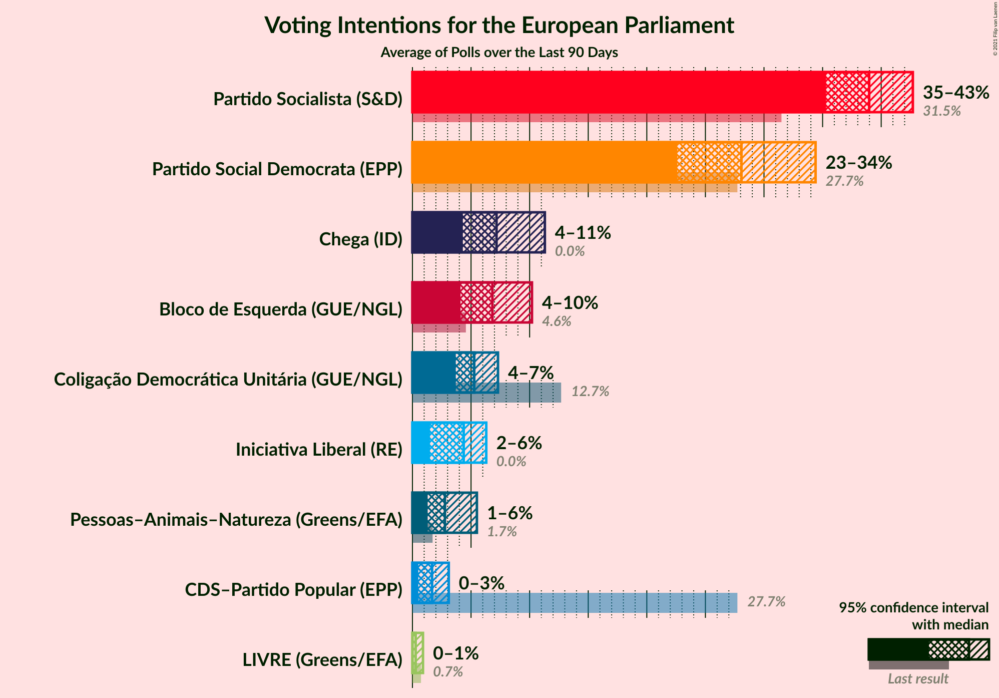

### Confidence Intervals

| Party | Last Result | Median | 80% Confidence Interval | 90% Confidence Interval | 95% Confidence Interval | 99% Confidence Interval |
|:-----:|:-----------:|:------:|:-----------------------:|:-----------------------:|:-----------------------:|:-----------------------:|
| <a href="#partido-socialista-(s&d)">Partido Socialista (S&D)</a> | 31.5% | 39.0% | 36.5–41.4% |35.9–42.1% | 35.3–42.7% | 34.1–43.9% |
| <a href="#partido-social-democrata-(epp)">Partido Social Democrata (EPP)</a> | 27.7% | 28.1% | 24.0–32.5% |23.3–33.6% | 22.6–34.4% | 21.5–35.9% |
| <a href="#cds–partido-popular-(epp)">CDS–Partido Popular (EPP)</a> | 27.7% | 1.7% | 0.8–2.6% |0.6–2.9% | 0.5–3.1% | 0.3–3.6% |
| <a href="#coligação-democrática-unitária-(gue/ngl)">Coligação Democrática Unitária (GUE/NGL)</a> | 12.7% | 5.3% | 4.2–6.6% |3.9–7.0% | 3.7–7.3% | 3.2–8.0% |
| <a href="#bloco-de-esquerda-(gue/ngl)">Bloco de Esquerda (GUE/NGL)</a> | 4.6% | 6.8% | 4.7–9.2% |4.4–9.8% | 4.1–10.2% | 3.6–11.1% |
| <a href="#pessoas–animais–natureza-(greens/efa)">Pessoas–Animais–Natureza (Greens/EFA)</a> | 1.7% | 2.8% | 1.7–4.5% |1.5–5.1% | 1.3–5.5% | 1.1–6.3% |
| <a href="#livre-(greens/efa)">LIVRE (Greens/EFA)</a> | 0.7% | 0.3% | 0.1–0.6% |0.1–0.8% | 0.0–0.9% | 0.0–1.2% |
| <a href="#iniciativa-liberal-(re)">Iniciativa Liberal (RE)</a> | 0.0% | 4.4% | 2.1–5.6% |1.8–6.0% | 1.5–6.3% | 1.2–6.9% |
| <a href="#aliança-(re)">Aliança (RE)</a> | 0.0% | N/A | N/A |N/A | N/A | N/A |
| <a href="#chega-(id)">Chega (ID)</a> | 0.0% | 7.2% | 5.0–10.1% |4.5–10.8% | 4.3–11.3% | 3.8–12.3% |

### Partido Socialista (S&D)

*For a full overview of the results for this party, see the [Partido Socialista (S&D)](party-partidosocialistasd.html) page.*

| Voting Intentions | Probability | Accumulated | Special Marks |
|:-----------------:|:-----------:|:-----------:|:-------------:|
| 30.5–31.5% | 0% | 100% | Last Result |
| 31.5–32.5% | 0% | 100% |  |
| 32.5–33.5% | 0.2% | 100% |  |
| 33.5–34.5% | 0.8% | 99.8% |  |
| 34.5–35.5% | 3% | 99.0% |  |
| 35.5–36.5% | 7% | 96% |  |
| 36.5–37.5% | 13% | 90% |  |
| 37.5–38.5% | 18% | 77% |  |
| 38.5–39.5% | 21% | 59% | Median |
| 39.5–40.5% | 18% | 38% |  |
| 40.5–41.5% | 12% | 20% |  |
| 41.5–42.5% | 6% | 9% |  |
| 42.5–43.5% | 2% | 3% |  |
| 43.5–44.5% | 0.7% | 0.9% |  |
| 44.5–45.5% | 0.2% | 0.2% |  |
| 45.5–46.5% | 0% | 0% |  |

### Partido Social Democrata (EPP)

*For a full overview of the results for this party, see the [Partido Social Democrata (EPP)](party-partidosocialdemocrataepp.html) page.*

| Voting Intentions | Probability | Accumulated | Special Marks |
|:-----------------:|:-----------:|:-----------:|:-------------:|
| 18.5–19.5% | 0% | 100% |  |
| 19.5–20.5% | 0.1% | 100% |  |
| 20.5–21.5% | 0.4% | 99.9% |  |
| 21.5–22.5% | 2% | 99.5% |  |
| 22.5–23.5% | 4% | 98% |  |
| 23.5–24.5% | 8% | 93% |  |
| 24.5–25.5% | 10% | 86% |  |
| 25.5–26.5% | 11% | 76% |  |
| 26.5–27.5% | 10% | 65% |  |
| 27.5–28.5% | 10% | 55% | Last Result, Median |
| 28.5–29.5% | 10% | 46% |  |
| 29.5–30.5% | 10% | 35% |  |
| 30.5–31.5% | 9% | 25% |  |
| 31.5–32.5% | 7% | 17% |  |
| 32.5–33.5% | 5% | 10% |  |
| 33.5–34.5% | 3% | 5% |  |
| 34.5–35.5% | 1.4% | 2% |  |
| 35.5–36.5% | 0.6% | 0.8% |  |
| 36.5–37.5% | 0.2% | 0.2% |  |
| 37.5–38.5% | 0% | 0.1% |  |
| 38.5–39.5% | 0% | 0% |  |

### CDS–Partido Popular (EPP)

*For a full overview of the results for this party, see the [CDS–Partido Popular (EPP)](party-cds–partidopopularepp.html) page.*

| Voting Intentions | Probability | Accumulated | Special Marks |
|:-----------------:|:-----------:|:-----------:|:-------------:|
| 0.0–0.5% | 3% | 100% |  |
| 0.5–1.5% | 40% | 97% |  |
| 1.5–2.5% | 44% | 56% | Median |
| 2.5–3.5% | 12% | 12% |  |
| 3.5–4.5% | 0.6% | 0.6% |  |
| 4.5–5.5% | 0% | 0% |  |
| 5.5–6.5% | 0% | 0% |  |
| 6.5–7.5% | 0% | 0% |  |
| 7.5–8.5% | 0% | 0% |  |
| 8.5–9.5% | 0% | 0% |  |
| 9.5–10.5% | 0% | 0% |  |
| 10.5–11.5% | 0% | 0% |  |
| 11.5–12.5% | 0% | 0% |  |
| 12.5–13.5% | 0% | 0% |  |
| 13.5–14.5% | 0% | 0% |  |
| 14.5–15.5% | 0% | 0% |  |
| 15.5–16.5% | 0% | 0% |  |
| 16.5–17.5% | 0% | 0% |  |
| 17.5–18.5% | 0% | 0% |  |
| 18.5–19.5% | 0% | 0% |  |
| 19.5–20.5% | 0% | 0% |  |
| 20.5–21.5% | 0% | 0% |  |
| 21.5–22.5% | 0% | 0% |  |
| 22.5–23.5% | 0% | 0% |  |
| 23.5–24.5% | 0% | 0% |  |
| 24.5–25.5% | 0% | 0% |  |
| 25.5–26.5% | 0% | 0% |  |
| 26.5–27.5% | 0% | 0% |  |
| 27.5–28.5% | 0% | 0% | Last Result |

### Coligação Democrática Unitária (GUE/NGL)

*For a full overview of the results for this party, see the [Coligação Democrática Unitária (GUE/NGL)](party-coligaçãodemocráticaunitáriaguengl.html) page.*

| Voting Intentions | Probability | Accumulated | Special Marks |
|:-----------------:|:-----------:|:-----------:|:-------------:|
| 1.5–2.5% | 0% | 100% |  |
| 2.5–3.5% | 2% | 100% |  |
| 3.5–4.5% | 20% | 98% |  |
| 4.5–5.5% | 40% | 78% | Median |
| 5.5–6.5% | 28% | 38% |  |
| 6.5–7.5% | 9% | 10% |  |
| 7.5–8.5% | 1.4% | 2% |  |
| 8.5–9.5% | 0.1% | 0.1% |  |
| 9.5–10.5% | 0% | 0% |  |
| 10.5–11.5% | 0% | 0% |  |
| 11.5–12.5% | 0% | 0% |  |
| 12.5–13.5% | 0% | 0% | Last Result |

### Bloco de Esquerda (GUE/NGL)

*For a full overview of the results for this party, see the [Bloco de Esquerda (GUE/NGL)](party-blocodeesquerdaguengl.html) page.*

| Voting Intentions | Probability | Accumulated | Special Marks |
|:-----------------:|:-----------:|:-----------:|:-------------:|
| 1.5–2.5% | 0% | 100% |  |
| 2.5–3.5% | 0.4% | 100% |  |
| 3.5–4.5% | 7% | 99.6% |  |
| 4.5–5.5% | 18% | 93% | Last Result |
| 5.5–6.5% | 19% | 75% |  |
| 6.5–7.5% | 19% | 55% | Median |
| 7.5–8.5% | 17% | 36% |  |
| 8.5–9.5% | 12% | 19% |  |
| 9.5–10.5% | 5% | 7% |  |
| 10.5–11.5% | 1.2% | 1.4% |  |
| 11.5–12.5% | 0.2% | 0.2% |  |
| 12.5–13.5% | 0% | 0% |  |

### Pessoas–Animais–Natureza (Greens/EFA)

*For a full overview of the results for this party, see the [Pessoas–Animais–Natureza (Greens/EFA)](party-pessoas–animais–naturezagreensefa.html) page.*

| Voting Intentions | Probability | Accumulated | Special Marks |
|:-----------------:|:-----------:|:-----------:|:-------------:|
| 0.0–0.5% | 0% | 100% |  |
| 0.5–1.5% | 6% | 100% |  |
| 1.5–2.5% | 35% | 94% | Last Result |
| 2.5–3.5% | 34% | 59% | Median |
| 3.5–4.5% | 16% | 26% |  |
| 4.5–5.5% | 7% | 10% |  |
| 5.5–6.5% | 2% | 2% |  |
| 6.5–7.5% | 0.3% | 0.3% |  |
| 7.5–8.5% | 0% | 0% |  |

### LIVRE (Greens/EFA)

*For a full overview of the results for this party, see the [LIVRE (Greens/EFA)](party-livregreensefa.html) page.*

| Voting Intentions | Probability | Accumulated | Special Marks |
|:-----------------:|:-----------:|:-----------:|:-------------:|
| 0.0–0.5% | 85% | 100% | Median |
| 0.5–1.5% | 15% | 15% | Last Result |
| 1.5–2.5% | 0.1% | 0.1% |  |
| 2.5–3.5% | 0% | 0% |  |

### Iniciativa Liberal (RE)

*For a full overview of the results for this party, see the [Iniciativa Liberal (RE)](party-iniciativaliberalre.html) page.*

| Voting Intentions | Probability | Accumulated | Special Marks |
|:-----------------:|:-----------:|:-----------:|:-------------:|
| 0.0–0.5% | 0% | 100% | Last Result |
| 0.5–1.5% | 3% | 100% |  |
| 1.5–2.5% | 14% | 97% |  |
| 2.5–3.5% | 11% | 84% |  |
| 3.5–4.5% | 30% | 73% | Median |
| 4.5–5.5% | 31% | 43% |  |
| 5.5–6.5% | 11% | 12% |  |
| 6.5–7.5% | 1.3% | 1.3% |  |
| 7.5–8.5% | 0.1% | 0.1% |  |
| 8.5–9.5% | 0% | 0% |  |

### Chega (ID)

*For a full overview of the results for this party, see the [Chega (ID)](party-chegaid.html) page.*

| Voting Intentions | Probability | Accumulated | Special Marks |
|:-----------------:|:-----------:|:-----------:|:-------------:|
| 0.0–0.5% | 0% | 100% | Last Result |
| 0.5–1.5% | 0% | 100% |  |
| 1.5–2.5% | 0% | 100% |  |
| 2.5–3.5% | 0.2% | 100% |  |
| 3.5–4.5% | 5% | 99.8% |  |
| 4.5–5.5% | 14% | 95% |  |
| 5.5–6.5% | 18% | 81% |  |
| 6.5–7.5% | 21% | 63% | Median |
| 7.5–8.5% | 16% | 42% |  |
| 8.5–9.5% | 11% | 25% |  |
| 9.5–10.5% | 8% | 15% |  |
| 10.5–11.5% | 5% | 7% |  |
| 11.5–12.5% | 2% | 2% |  |
| 12.5–13.5% | 0.3% | 0.3% |  |
| 13.5–14.5% | 0% | 0% |  |

## Seats

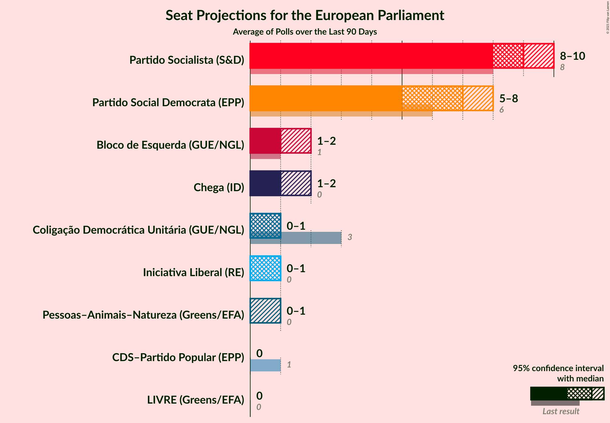

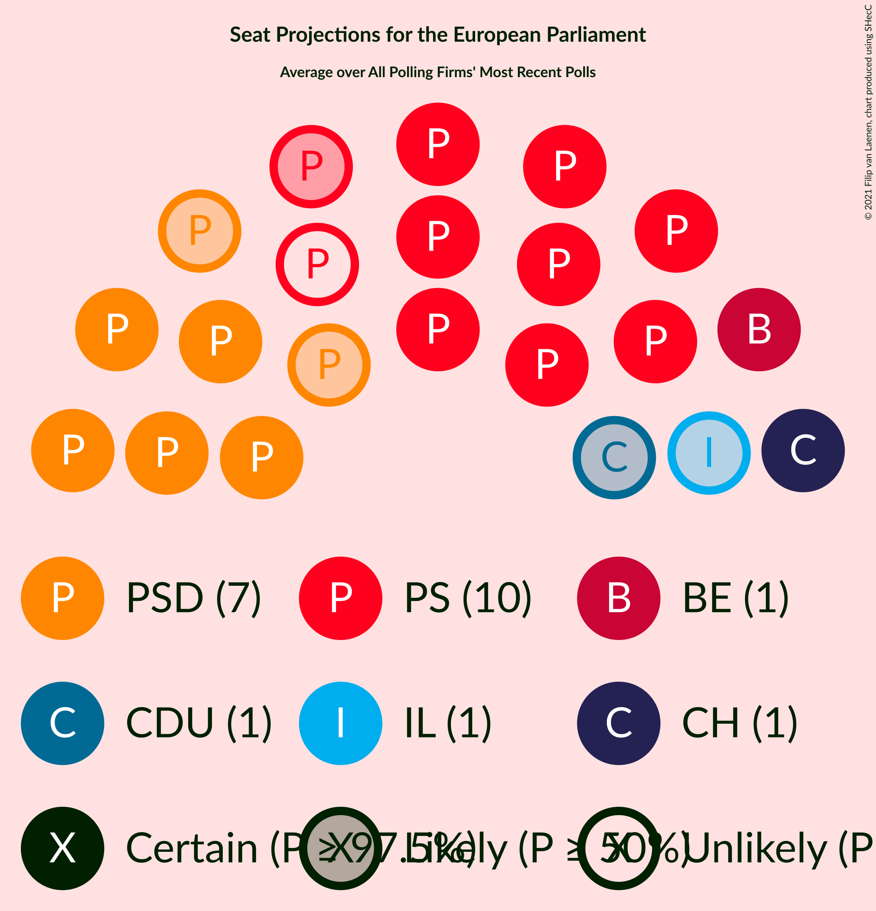

### Confidence Intervals

| Party | Last Result | Median | 80% Confidence Interval | 90% Confidence Interval | 95% Confidence Interval | 99% Confidence Interval |
|:-----:|:-----------:|:------:|:-----------------------:|:-----------------------:|:-----------------------:|:-----------------------:|
| <a href="#partido-socialista-(s&d)">Partido Socialista (S&D)</a> | 8 | 9 | 9–10 |8–10 | 8–10 | 8–11 |
| <a href="#partido-social-democrata-(epp)">Partido Social Democrata (EPP)</a> | 6 | 7 | 6–8 |5–8 | 5–8 | 5–8 |
| <a href="#cds–partido-popular-(epp)">CDS–Partido Popular (EPP)</a> | 1 | 0 | 0 |0 | 0 | 0 |
| <a href="#coligação-democrática-unitária-(gue/ngl)">Coligação Democrática Unitária (GUE/NGL)</a> | 3 | 1 | 1 |0–1 | 0–1 | 0–2 |
| <a href="#bloco-de-esquerda-(gue/ngl)">Bloco de Esquerda (GUE/NGL)</a> | 1 | 1 | 1–2 |1–2 | 1–2 | 0–2 |
| <a href="#pessoas–animais–natureza-(greens/efa)">Pessoas–Animais–Natureza (Greens/EFA)</a> | 0 | 0 | 0–1 |0–1 | 0–1 | 0–1 |
| <a href="#livre-(greens/efa)">LIVRE (Greens/EFA)</a> | 0 | 0 | 0 |0 | 0 | 0 |
| <a href="#iniciativa-liberal-(re)">Iniciativa Liberal (RE)</a> | 0 | 1 | 0–1 |0–1 | 0–1 | 0–1 |
| <a href="#aliança-(re)">Aliança (RE)</a> | 0 | N/A | N/A |N/A | N/A | N/A |
| <a href="#chega-(id)">Chega (ID)</a> | 0 | 1 | 1–2 |1–2 | 1–2 | 0–3 |

### Partido Socialista (S&D)

*For a full overview of the results for this party, see the [Partido Socialista (S&D)](party-partidosocialistasd.html) page.*

| Number of Seats | Probability | Accumulated | Special Marks |
|:---------------:|:-----------:|:-----------:|:-------------:|
| 8 | 8% | 100% | Last Result |
| 9 | 60% | 91% | Median |
| 10 | 30% | 31% |  |
| 11 | 1.3% | 1.3% | Majority |
| 12 | 0% | 0% |  |

### Partido Social Democrata (EPP)

*For a full overview of the results for this party, see the [Partido Social Democrata (EPP)](party-partidosocialdemocrataepp.html) page.*

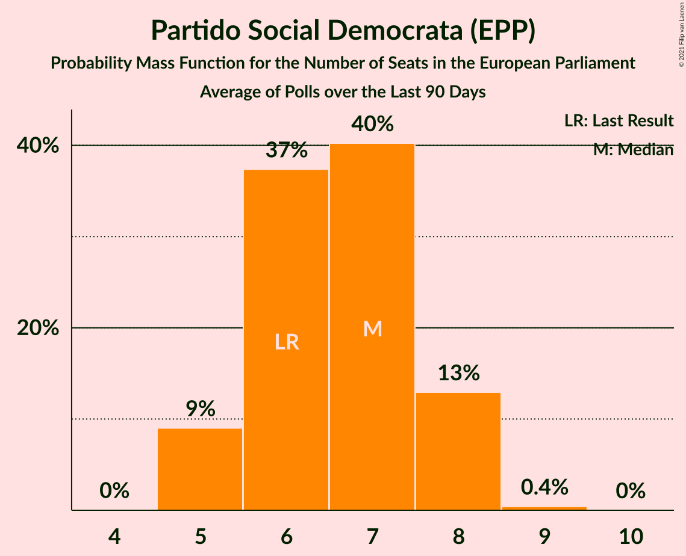

| Number of Seats | Probability | Accumulated | Special Marks |
|:---------------:|:-----------:|:-----------:|:-------------:|
| 5 | 9% | 100% |  |
| 6 | 37% | 91% | Last Result |
| 7 | 40% | 54% | Median |
| 8 | 13% | 13% |  |
| 9 | 0.4% | 0.4% |  |
| 10 | 0% | 0% |  |

### CDS–Partido Popular (EPP)

*For a full overview of the results for this party, see the [CDS–Partido Popular (EPP)](party-cds–partidopopularepp.html) page.*

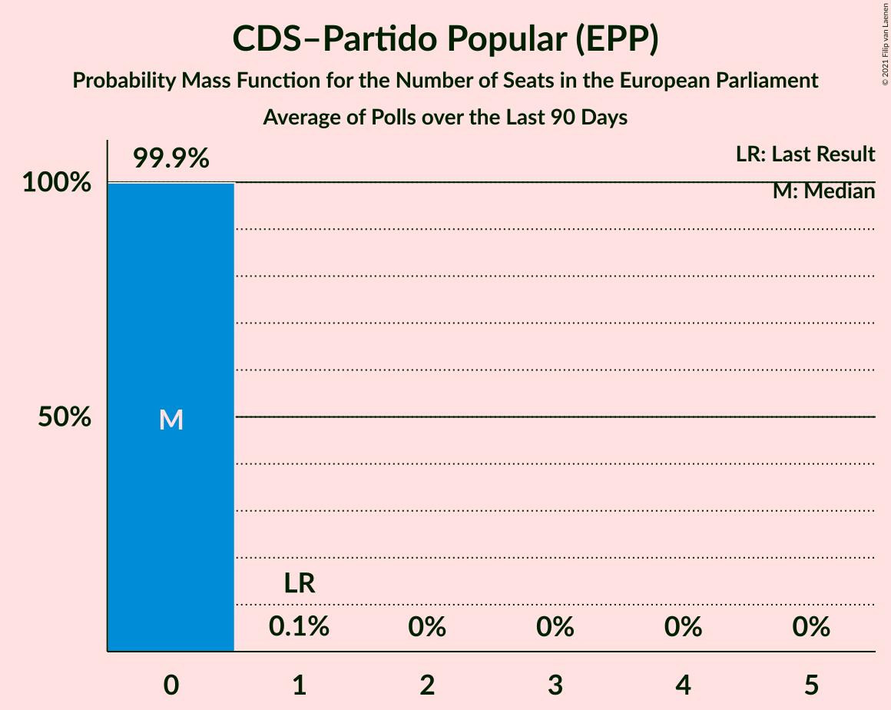

| Number of Seats | Probability | Accumulated | Special Marks |
|:---------------:|:-----------:|:-----------:|:-------------:|
| 0 | 99.9% | 100% | Median |
| 1 | 0.1% | 0.1% | Last Result |
| 2 | 0% | 0% |  |

### Coligação Democrática Unitária (GUE/NGL)

*For a full overview of the results for this party, see the [Coligação Democrática Unitária (GUE/NGL)](party-coligaçãodemocráticaunitáriaguengl.html) page.*

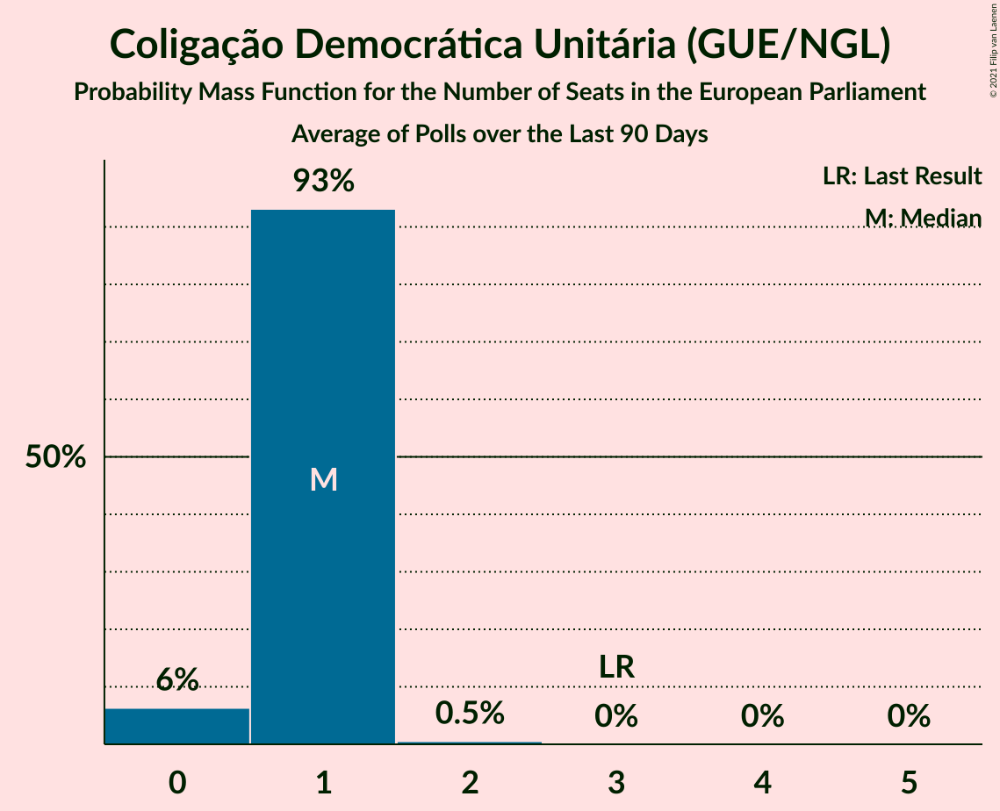

| Number of Seats | Probability | Accumulated | Special Marks |
|:---------------:|:-----------:|:-----------:|:-------------:|
| 0 | 6% | 100% |  |
| 1 | 93% | 94% | Median |
| 2 | 0.5% | 0.5% |  |
| 3 | 0% | 0% | Last Result |

### Bloco de Esquerda (GUE/NGL)

*For a full overview of the results for this party, see the [Bloco de Esquerda (GUE/NGL)](party-blocodeesquerdaguengl.html) page.*

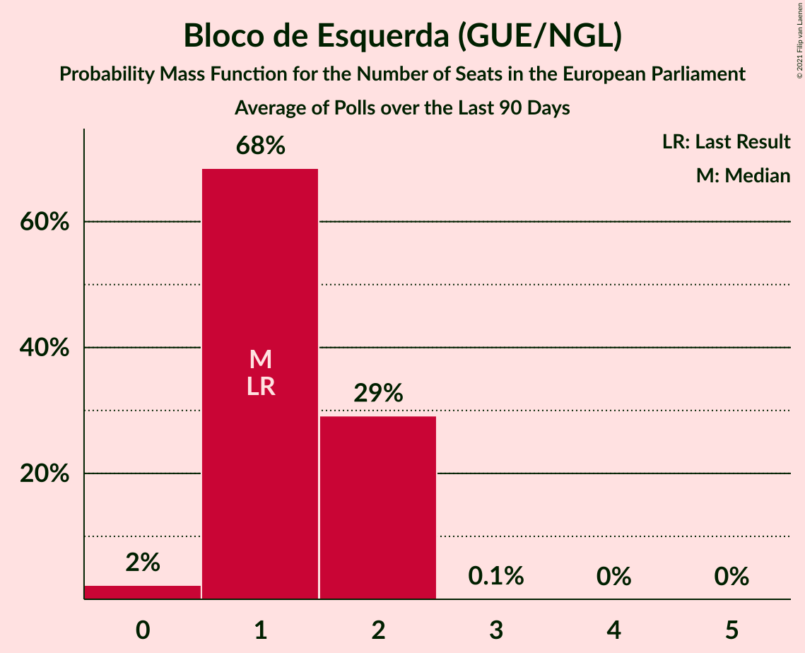

| Number of Seats | Probability | Accumulated | Special Marks |
|:---------------:|:-----------:|:-----------:|:-------------:|
| 0 | 2% | 100% |  |
| 1 | 68% | 98% | Last Result, Median |
| 2 | 29% | 29% |  |
| 3 | 0.1% | 0.1% |  |
| 4 | 0% | 0% |  |

### Pessoas–Animais–Natureza (Greens/EFA)

*For a full overview of the results for this party, see the [Pessoas–Animais–Natureza (Greens/EFA)](party-pessoas–animais–naturezagreensefa.html) page.*

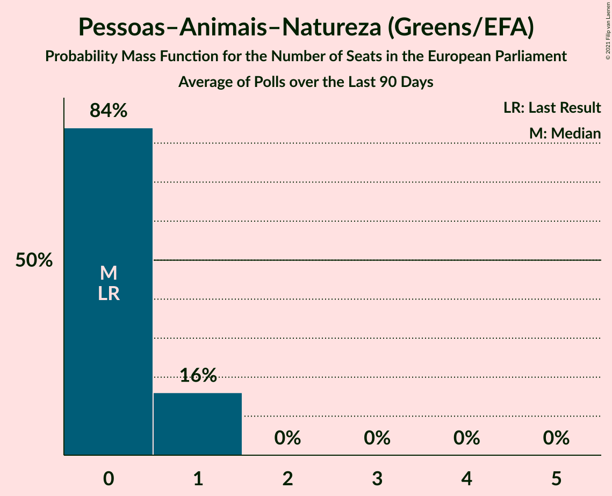

| Number of Seats | Probability | Accumulated | Special Marks |
|:---------------:|:-----------:|:-----------:|:-------------:|
| 0 | 84% | 100% | Last Result, Median |
| 1 | 16% | 16% |  |
| 2 | 0% | 0% |  |

### LIVRE (Greens/EFA)

*For a full overview of the results for this party, see the [LIVRE (Greens/EFA)](party-livregreensefa.html) page.*

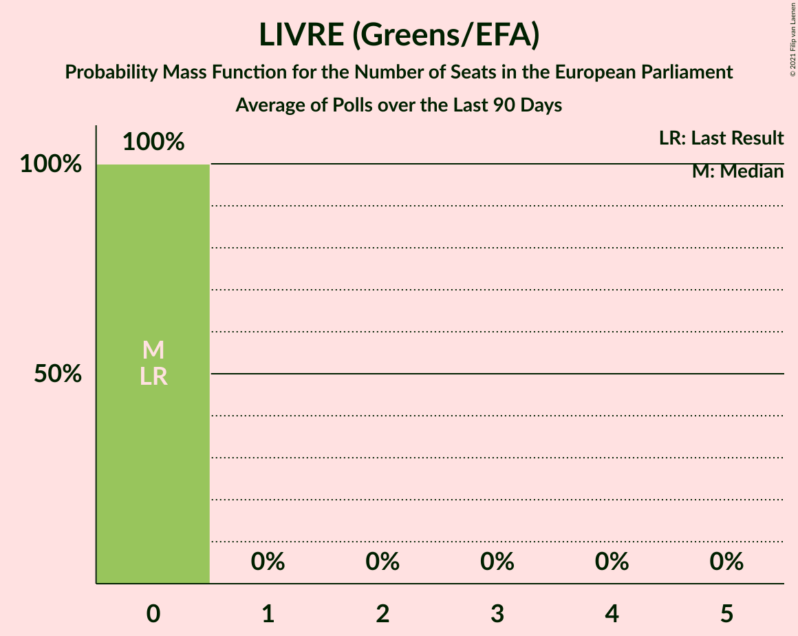

| Number of Seats | Probability | Accumulated | Special Marks |
|:---------------:|:-----------:|:-----------:|:-------------:|
| 0 | 100% | 100% | Last Result, Median |

### Iniciativa Liberal (RE)

*For a full overview of the results for this party, see the [Iniciativa Liberal (RE)](party-iniciativaliberalre.html) page.*

| Number of Seats | Probability | Accumulated | Special Marks |
|:---------------:|:-----------:|:-----------:|:-------------:|
| 0 | 37% | 100% | Last Result |
| 1 | 63% | 63% | Median |
| 2 | 0% | 0% |  |

### Aliança (RE)

*For a full overview of the results for this party, see the [Aliança (RE)](party-aliançare.html) page.*

### Chega (ID)

*For a full overview of the results for this party, see the [Chega (ID)](party-chegaid.html) page.*

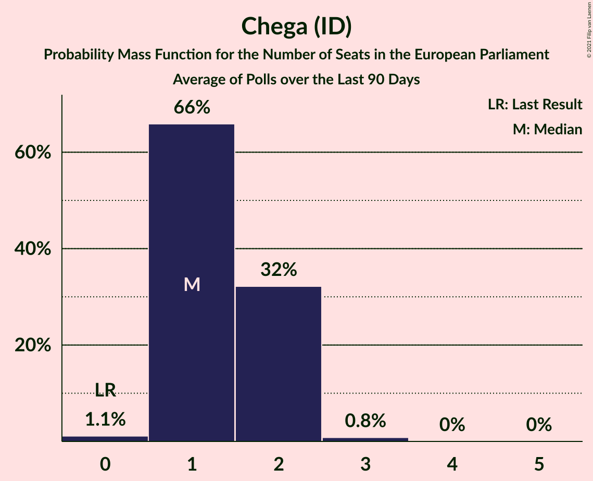

| Number of Seats | Probability | Accumulated | Special Marks |
|:---------------:|:-----------:|:-----------:|:-------------:|
| 0 | 1.1% | 100% | Last Result |
| 1 | 66% | 98.9% | Median |
| 2 | 32% | 33% |  |
| 3 | 0.8% | 0.8% |  |
| 4 | 0% | 0% |  |

## Coalitions

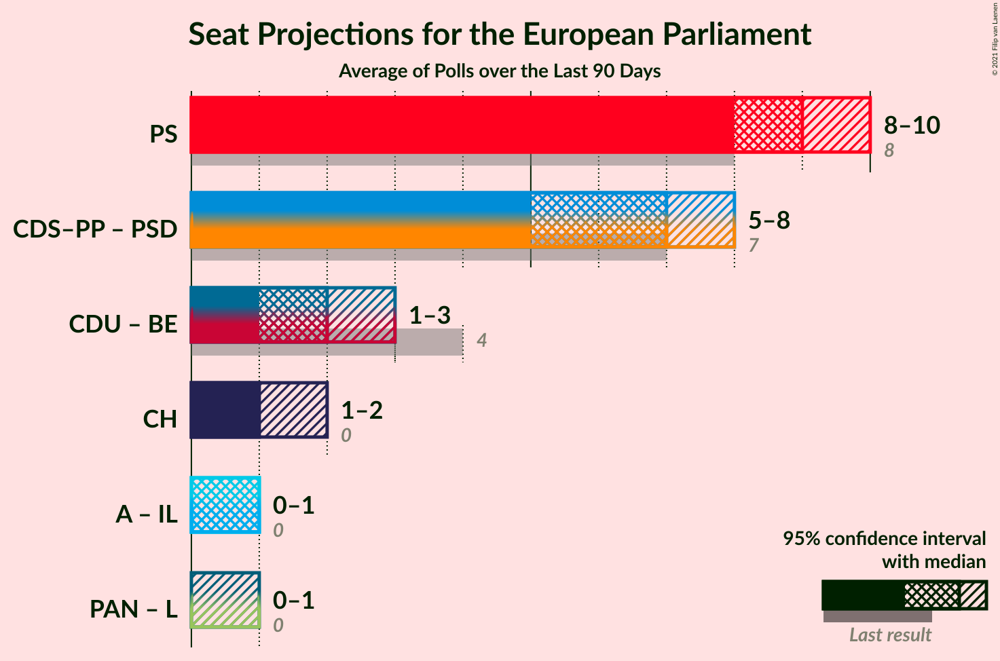

### Confidence Intervals

| Coalition | Last Result | Median | Majority? | 80% Confidence Interval | 90% Confidence Interval | 95% Confidence Interval | 99% Confidence Interval |
|:---------:|:-----------:|:------:|:---------:|:-----------------------:|:-----------------------:|:-----------------------:|:-----------------------:|
| Partido Socialista (S&D) | 8 | 9 | 1.3% | 9–10 | 8–10 | 8–10 | 8–11 |
| CDS–Partido Popular (EPP) – Partido Social Democrata (EPP) | 7 | 7 | 0% | 6–8 | 5–8 | 5–8 | 5–8 |
| Coligação Democrática Unitária (GUE/NGL) – Bloco de Esquerda (GUE/NGL) | 4 | 2 | 0% | 2–3 | 1–3 | 1–3 | 1–3 |
| Chega (ID) | 0 | 1 | 0% | 1–2 | 1–2 | 1–2 | 0–3 |
| Aliança (RE) – Iniciativa Liberal (RE) | 0 | 1 | 0% | 0–1 | 0–1 | 0–1 | 0–1 |
| Pessoas–Animais–Natureza (Greens/EFA) – LIVRE (Greens/EFA) | 0 | 0 | 0% | 0–1 | 0–1 | 0–1 | 0–1 |

### Partido Socialista (S&D)

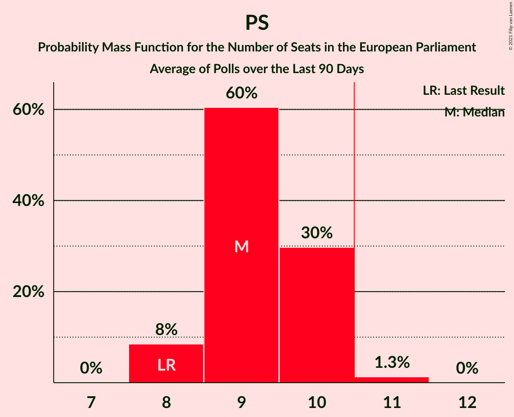

| Number of Seats | Probability | Accumulated | Special Marks |
|:---------------:|:-----------:|:-----------:|:-------------:|
| 8 | 8% | 100% | Last Result |
| 9 | 60% | 91% | Median |
| 10 | 30% | 31% |  |
| 11 | 1.3% | 1.3% | Majority |
| 12 | 0% | 0% |  |

### CDS–Partido Popular (EPP) – Partido Social Democrata (EPP)

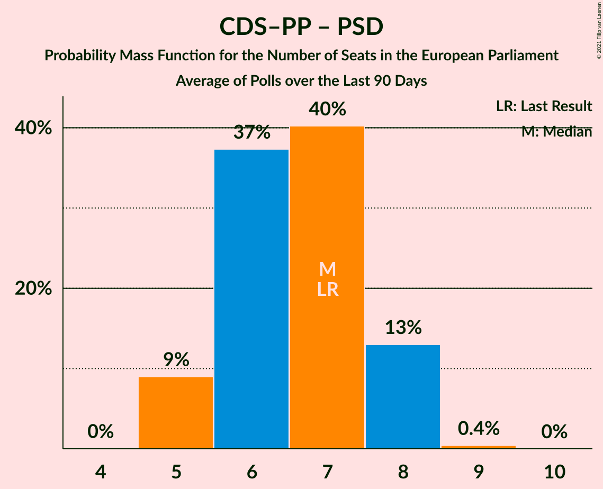

| Number of Seats | Probability | Accumulated | Special Marks |
|:---------------:|:-----------:|:-----------:|:-------------:|
| 5 | 9% | 100% |  |
| 6 | 37% | 91% |  |
| 7 | 40% | 54% | Last Result, Median |
| 8 | 13% | 13% |  |
| 9 | 0.4% | 0.4% |  |
| 10 | 0% | 0% |  |

### Coligação Democrática Unitária (GUE/NGL) – Bloco de Esquerda (GUE/NGL)

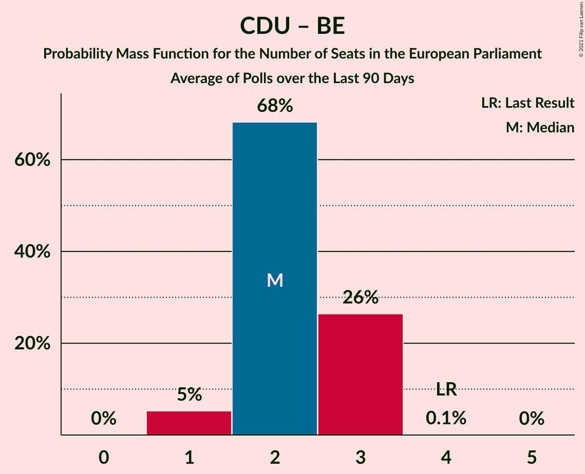

| Number of Seats | Probability | Accumulated | Special Marks |
|:---------------:|:-----------:|:-----------:|:-------------:|
| 1 | 5% | 100% |  |
| 2 | 68% | 95% | Median |
| 3 | 26% | 27% |  |
| 4 | 0.1% | 0.1% | Last Result |
| 5 | 0% | 0% |  |

### Chega (ID)

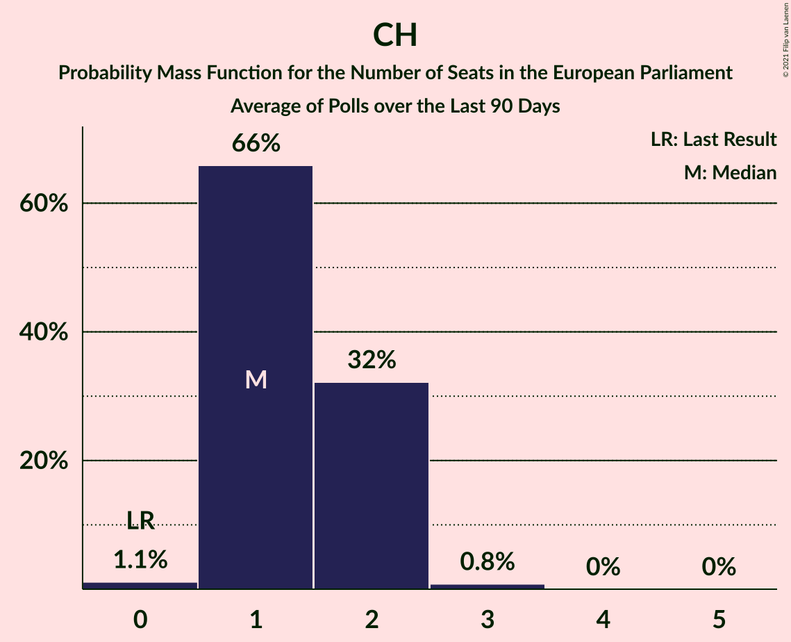

| Number of Seats | Probability | Accumulated | Special Marks |
|:---------------:|:-----------:|:-----------:|:-------------:|
| 0 | 1.1% | 100% | Last Result |
| 1 | 66% | 98.9% | Median |
| 2 | 32% | 33% |  |
| 3 | 0.8% | 0.8% |  |
| 4 | 0% | 0% |  |

### Aliança (RE) – Iniciativa Liberal (RE)

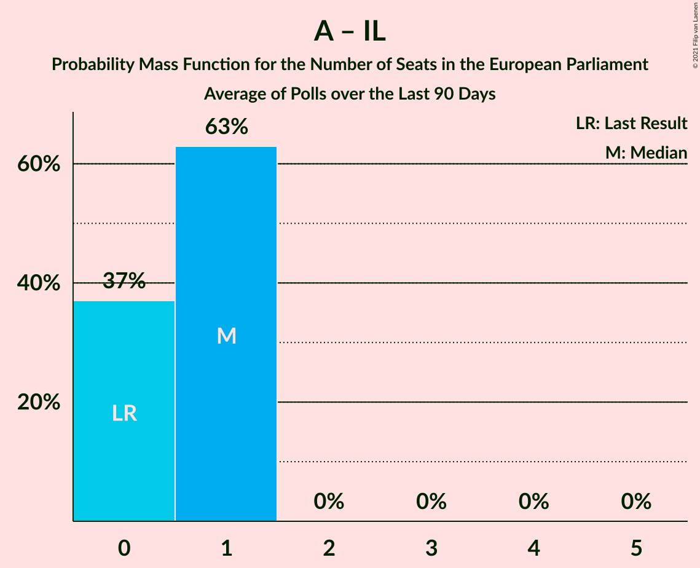

| Number of Seats | Probability | Accumulated | Special Marks |
|:---------------:|:-----------:|:-----------:|:-------------:|
| 0 | 37% | 100% | Last Result |
| 1 | 63% | 63% | Median |
| 2 | 0% | 0% |  |

### Pessoas–Animais–Natureza (Greens/EFA) – LIVRE (Greens/EFA)

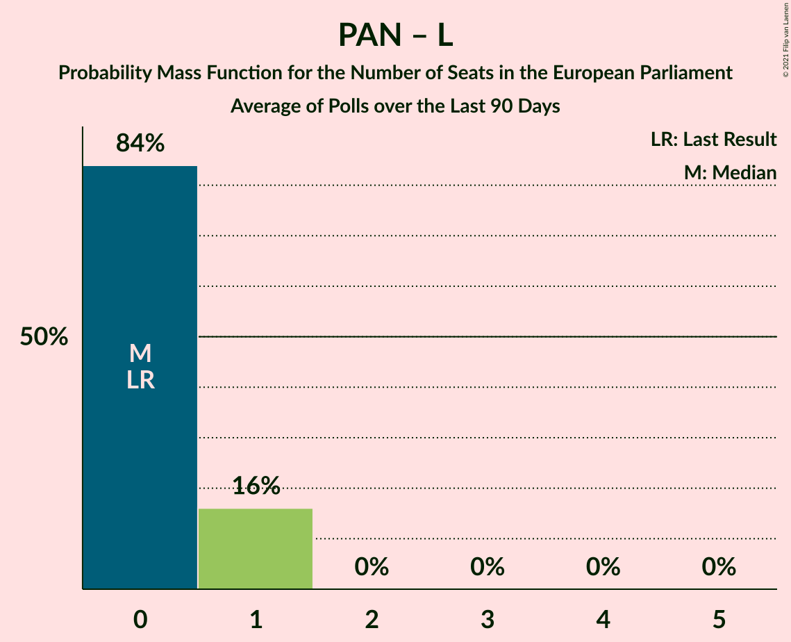

| Number of Seats | Probability | Accumulated | Special Marks |
|:---------------:|:-----------:|:-----------:|:-------------:|
| 0 | 84% | 100% | Last Result, Median |
| 1 | 16% | 16% |  |
| 2 | 0% | 0% |  |

## Technical Information

+ **Number of polls included in this average:** 5
+ **Lowest number of simulations done in a poll included in this average:** 1,048,576
+ **Total number of simulations done in the polls included in this average:** 5,242,880
+ **Error estimate:** 1.87%
