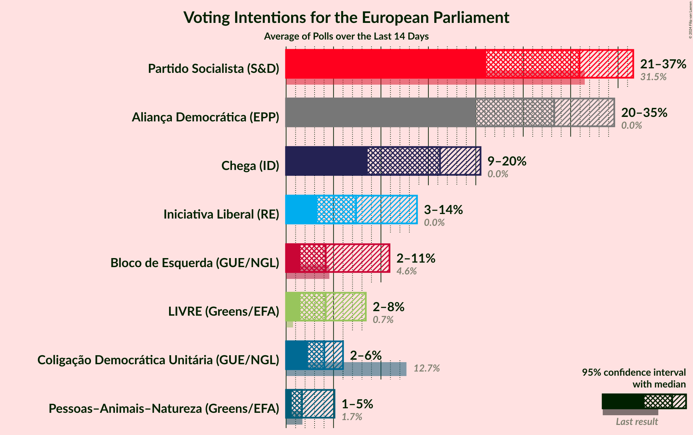
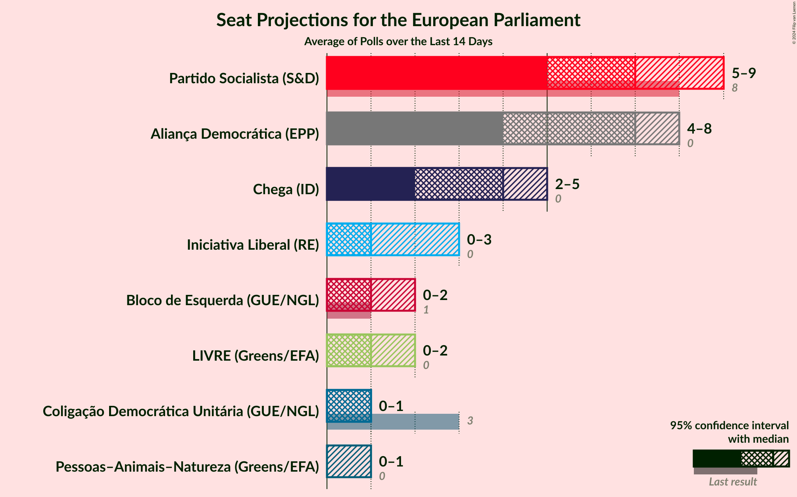
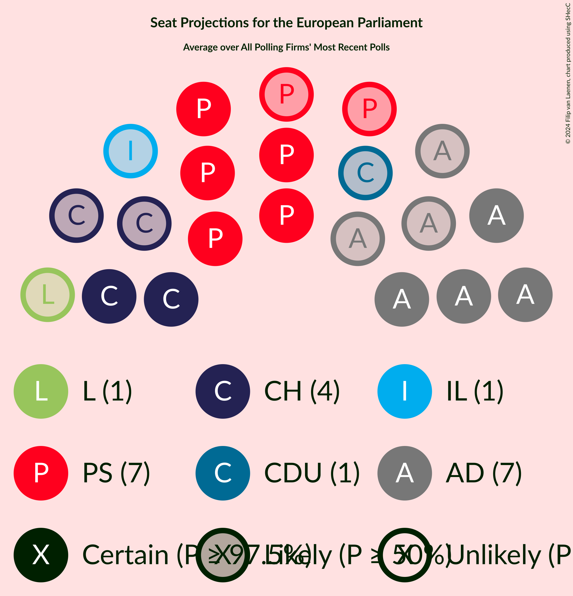
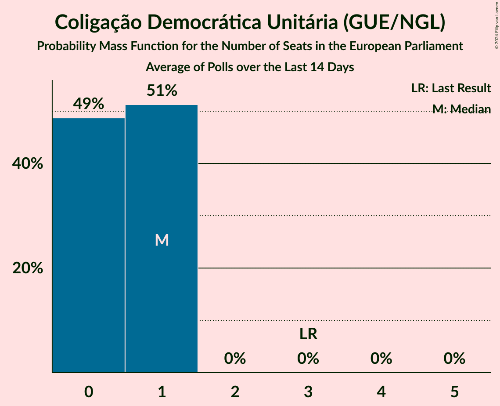
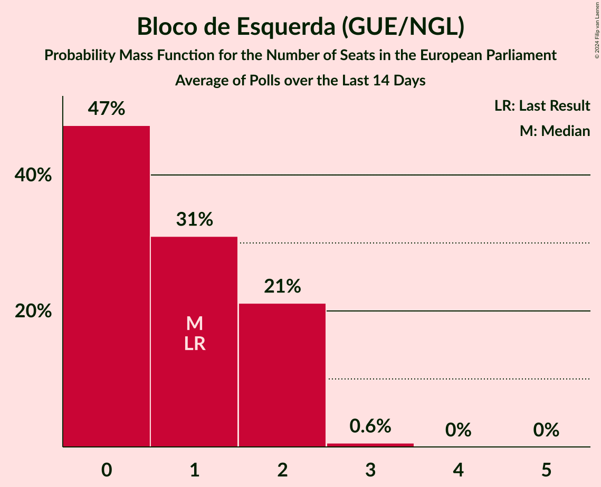
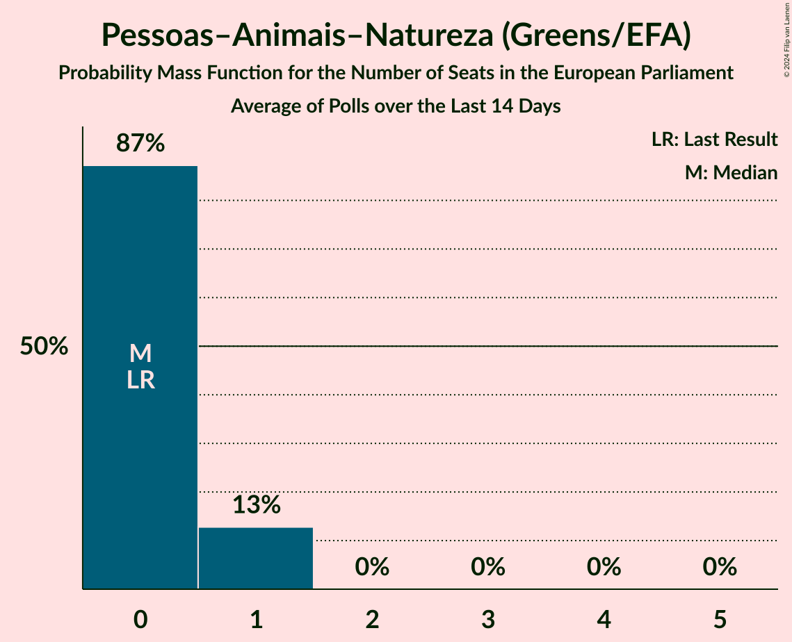
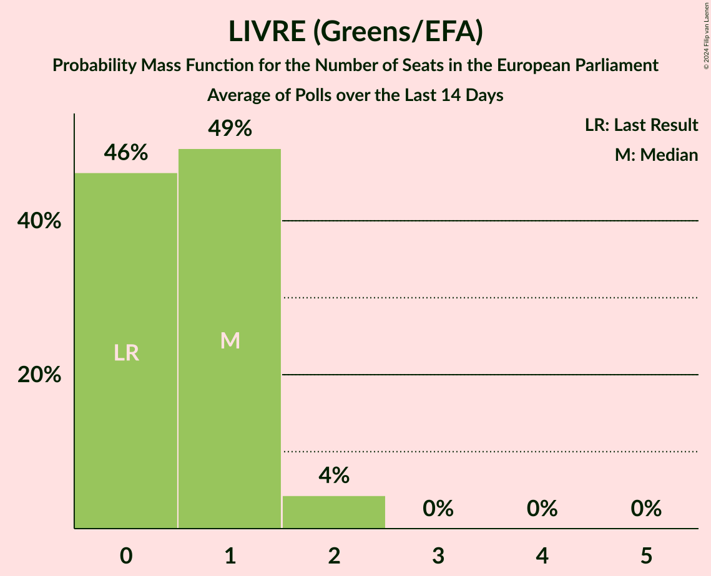
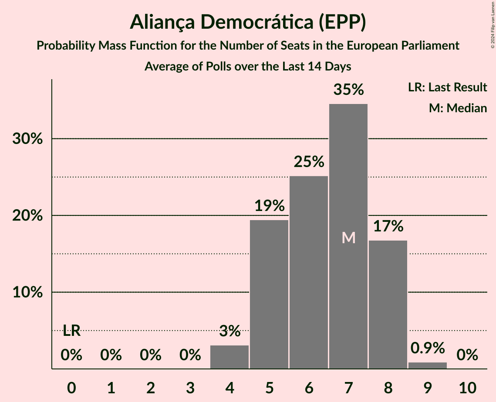

# Poll Average

<a href="#voting-intentions">Voting Intentions</a> | <a href="#seats">Seats</a> | <a href="#coalitions">Coalitions</a> | <a href="#technical-information">Technical Information</a>

## Summary

The table below lists the polls on which the average is based. They are the most recent polls (less than 14 days old) registered and analyzed so far.

| Period     | Polling firm/Commissioner(s) | PS | PSD | CDS–PP | CDU | BE | PAN | L | IL | A | CH | AD |
|:----------:|:----------------------------:|:--:|:--:|:--:|:--:|:--:|:--:|:--:|:--:|:--:|:--:|:--:|
| 26 May 2019 | General Election | 31.5%   8 | 27.7%   6 | 27.7%   1 | 12.7%   3 | 4.6%   1 | 1.7%   0 | 0.7%   0 | 0.0%   0 | 0.0%   0 | 0.0%   0 | 0.0%   0 |
| N/A | Poll Average | 21–37%   5–9 | N/A   N/A | N/A   N/A | 2–6%   0–1 | 2–11%   0–2 | 1–5%   0–1 | 2–8%   0–2 | 3–14%   0–3 | N/A   N/A | 9–20%   2–5 | 20–35%   4–8 |
| [12–20 May 2024](2024-05-20-Intercampus.html) | Intercampus   CMTV, Correio da Manhã and Negócios | 20–27%   4–6 | N/A   N/A | N/A   N/A | 3–6%   0–1 | 7–12%   1–2 | 3–6%   0–1 | 5–9%   1–2 | 10–15%   2–3 | N/A   N/A | 15–21%   3–5 | 19–25%   4–6 |
| [13–18 May 2024](2024-05-18-CESOP–UCP.html) | CESOP–UCP   Antena 1, Público and RTP | 27–33%   6–8 | N/A   N/A | N/A   N/A | 4–7%   0–1 | 4–7%   0–1 | 1–2%   0 | 4–7%   1 | 5–8%   1 | N/A   N/A | 13–17%   3–4 | 28–34%   6–8 |
| [6–13 May 2024](2024-05-13-Duplimétrica.html) | Duplimétrica   TVI | 30–38%   7–9 | N/A   N/A | N/A   N/A | 2–5%   0–1 | 2–5%   0–1 | 0–2%   0 | 2–5%   0–1 | 7–12%   1–2 | N/A   N/A | 8–13%   1–3 | 28–36%   7–9 |
| [27 April–8 May 2024](2024-05-08-ICSISCTE.html) | ICS/ISCTE   Expresso and SIC Notícias | 29–35%   7–9 | N/A   N/A | N/A   N/A | 3–5%   0–1 | 1–3%   0 | 1–3%   0 | 1–3%   0 | 3–5%   0–1 | N/A   N/A | 16–20%   3–5 | 23–29%   5–7 |
| 26 May 2019 | General Election | 31.5%   8 | 27.7%   6 | 27.7%   1 | 12.7%   3 | 4.6%   1 | 1.7%   0 | 0.7%   0 | 0.0%   0 | 0.0%   0 | 0.0%   0 | 0.0%   0 |

Only polls for which at least the sample size has been published are included in the table above.

**Legend:**
+ **Top half of each row:** Voting intentions (95% confidence interval)
+ **Bottom half of each row:** Seat projections for the European Parliament (95% confidence interval)
+ **PS:** Partido Socialista (S&D)
+ **PSD:** Partido Social Democrata (EPP)
+ **CDS–PP:** CDS–Partido Popular (EPP)
+ **CDU:** Coligação Democrática Unitária (GUE/NGL)
+ **BE:** Bloco de Esquerda (GUE/NGL)
+ **PAN:** Pessoas–Animais–Natureza (Greens/EFA)
+ **L:** LIVRE (Greens/EFA)
+ **IL:** Iniciativa Liberal (RE)
+ **A:** Aliança (RE)
+ **CH:** Chega (ID)
+ **AD:** Aliança Democrática (EPP)
+ **N/A (single party):** Party not included the published results
+ **N/A (entire row):** Calculation for this opinion poll not started yet

## Voting Intentions

### Confidence Intervals

| Party | Last Result | Median | 80% Confidence Interval | 90% Confidence Interval | 95% Confidence Interval | 99% Confidence Interval |
|:-----:|:-----------:|:------:|:-----------------------:|:-----------------------:|:-----------------------:|:-----------------------:|
| <a href="#partido-socialista-(s&d)">Partido Socialista (S&D)</a> | 31.5% | 30.9% | 22.8–34.7% |21.8–35.7% | 21.1–36.6% | 19.8–38.1% |
| <a href="#partido-social-democrata-(epp)">Partido Social Democrata (EPP)</a> | 27.7% | N/A | N/A |N/A | N/A | N/A |
| <a href="#cds–partido-popular-(epp)">CDS–Partido Popular (EPP)</a> | 27.7% | N/A | N/A |N/A | N/A | N/A |
| <a href="#coligação-democrática-unitária-(gue/ngl)">Coligação Democrática Unitária (GUE/NGL)</a> | 12.7% | 4.0% | 2.8–5.4% |2.5–5.7% | 2.3–6.0% | 1.9–6.6% |
| <a href="#bloco-de-esquerda-(gue/ngl)">Bloco de Esquerda (GUE/NGL)</a> | 4.6% | 4.2% | 1.9–9.6% |1.7–10.3% | 1.5–10.9% | 1.3–11.9% |
| <a href="#pessoas–animais–natureza-(greens/efa)">Pessoas–Animais–Natureza (Greens/EFA)</a> | 1.7% | 1.7% | 0.8–4.2% |0.7–4.7% | 0.6–5.1% | 0.4–5.9% |
| <a href="#livre-(greens/efa)">LIVRE (Greens/EFA)</a> | 0.7% | 4.2% | 1.9–7.3% |1.7–7.9% | 1.5–8.4% | 1.3–9.3% |
| <a href="#iniciativa-liberal-(re)">Iniciativa Liberal (RE)</a> | 0.0% | 7.4% | 3.9–12.4% |3.6–13.2% | 3.3–13.8% | 2.9–14.9% |
| <a href="#aliança-(re)">Aliança (RE)</a> | 0.0% | N/A | N/A |N/A | N/A | N/A |
| <a href="#chega-(id)">Chega (ID)</a> | 0.0% | 16.2% | 9.8–19.3% |9.1–19.9% | 8.6–20.5% | 7.8–21.6% |
| <a href="#aliança-democrática-(epp)">Aliança Democrática (EPP)</a> | 0.0% | 28.3% | 21.6–33.0% |20.7–33.9% | 20.0–34.6% | 18.8–36.0% |

### Partido Socialista (S&D)

*For a full overview of the results for this party, see the [Partido Socialista (S&D)](party-partidosocialistasd.html) page.*

| Voting Intentions | Probability | Accumulated | Special Marks |
|:-----------------:|:-----------:|:-----------:|:-------------:|
| 17.5–18.5% | 0% | 100% |  |
| 18.5–19.5% | 0.3% | 100% |  |
| 19.5–20.5% | 1.0% | 99.7% |  |
| 20.5–21.5% | 3% | 98.6% |  |
| 21.5–22.5% | 5% | 96% |  |
| 22.5–23.5% | 6% | 91% |  |
| 23.5–24.5% | 5% | 86% |  |
| 24.5–25.5% | 3% | 80% |  |
| 25.5–26.5% | 2% | 77% |  |
| 26.5–27.5% | 1.4% | 76% |  |
| 27.5–28.5% | 3% | 74% |  |
| 28.5–29.5% | 6% | 71% |  |
| 29.5–30.5% | 10% | 65% |  |
| 30.5–31.5% | 12% | 55% | Last Result, Median |
| 31.5–32.5% | 13% | 42% |  |
| 32.5–33.5% | 11% | 30% |  |
| 33.5–34.5% | 8% | 19% |  |
| 34.5–35.5% | 5% | 11% |  |
| 35.5–36.5% | 3% | 6% |  |
| 36.5–37.5% | 2% | 3% |  |
| 37.5–38.5% | 0.6% | 0.9% |  |
| 38.5–39.5% | 0.2% | 0.3% |  |
| 39.5–40.5% | 0.1% | 0.1% |  |
| 40.5–41.5% | 0% | 0% |  |

### Coligação Democrática Unitária (GUE/NGL)

*For a full overview of the results for this party, see the [Coligação Democrática Unitária (GUE/NGL)](party-coligaçãodemocráticaunitáriaguengl.html) page.*

| Voting Intentions | Probability | Accumulated | Special Marks |
|:-----------------:|:-----------:|:-----------:|:-------------:|
| 0.5–1.5% | 0.1% | 100% |  |
| 1.5–2.5% | 6% | 99.9% |  |
| 2.5–3.5% | 26% | 94% |  |
| 3.5–4.5% | 38% | 68% | Median |
| 4.5–5.5% | 23% | 30% |  |
| 5.5–6.5% | 7% | 7% |  |
| 6.5–7.5% | 0.6% | 0.6% |  |
| 7.5–8.5% | 0% | 0% |  |
| 8.5–9.5% | 0% | 0% |  |
| 9.5–10.5% | 0% | 0% |  |
| 10.5–11.5% | 0% | 0% |  |
| 11.5–12.5% | 0% | 0% |  |
| 12.5–13.5% | 0% | 0% | Last Result |

### Bloco de Esquerda (GUE/NGL)

*For a full overview of the results for this party, see the [Bloco de Esquerda (GUE/NGL)](party-blocodeesquerdaguengl.html) page.*

| Voting Intentions | Probability | Accumulated | Special Marks |
|:-----------------:|:-----------:|:-----------:|:-------------:|
| 0.0–0.5% | 0% | 100% |  |
| 0.5–1.5% | 3% | 100% |  |
| 1.5–2.5% | 23% | 97% |  |
| 2.5–3.5% | 17% | 74% |  |
| 3.5–4.5% | 12% | 57% | Median |
| 4.5–5.5% | 14% | 45% | Last Result |
| 5.5–6.5% | 6% | 31% |  |
| 6.5–7.5% | 2% | 25% |  |
| 7.5–8.5% | 5% | 24% |  |
| 8.5–9.5% | 8% | 18% |  |
| 9.5–10.5% | 6% | 10% |  |
| 10.5–11.5% | 3% | 4% |  |
| 11.5–12.5% | 0.7% | 0.9% |  |
| 12.5–13.5% | 0.1% | 0.1% |  |
| 13.5–14.5% | 0% | 0% |  |

### Pessoas–Animais–Natureza (Greens/EFA)

*For a full overview of the results for this party, see the [Pessoas–Animais–Natureza (Greens/EFA)](party-pessoas–animais–naturezagreensefa.html) page.*

| Voting Intentions | Probability | Accumulated | Special Marks |
|:-----------------:|:-----------:|:-----------:|:-------------:|
| 0.0–0.5% | 2% | 100% |  |
| 0.5–1.5% | 44% | 98% |  |
| 1.5–2.5% | 26% | 55% | Last Result, Median |
| 2.5–3.5% | 10% | 29% |  |
| 3.5–4.5% | 12% | 19% |  |
| 4.5–5.5% | 6% | 7% |  |
| 5.5–6.5% | 1.0% | 1.1% |  |
| 6.5–7.5% | 0.1% | 0.1% |  |
| 7.5–8.5% | 0% | 0% |  |

### LIVRE (Greens/EFA)

*For a full overview of the results for this party, see the [LIVRE (Greens/EFA)](party-livregreensefa.html) page.*

| Voting Intentions | Probability | Accumulated | Special Marks |
|:-----------------:|:-----------:|:-----------:|:-------------:|
| 0.0–0.5% | 0% | 100% |  |
| 0.5–1.5% | 3% | 100% | Last Result |
| 1.5–2.5% | 23% | 97% |  |
| 2.5–3.5% | 17% | 74% |  |
| 3.5–4.5% | 12% | 57% | Median |
| 4.5–5.5% | 15% | 45% |  |
| 5.5–6.5% | 12% | 29% |  |
| 6.5–7.5% | 10% | 17% |  |
| 7.5–8.5% | 6% | 8% |  |
| 8.5–9.5% | 2% | 2% |  |
| 9.5–10.5% | 0.3% | 0.3% |  |
| 10.5–11.5% | 0% | 0% |  |

### Chega (ID)

*For a full overview of the results for this party, see the [Chega (ID)](party-chegaid.html) page.*

| Voting Intentions | Probability | Accumulated | Special Marks |
|:-----------------:|:-----------:|:-----------:|:-------------:|
| 0.0–0.5% | 0% | 100% | Last Result |
| 0.5–1.5% | 0% | 100% |  |
| 1.5–2.5% | 0% | 100% |  |
| 2.5–3.5% | 0% | 100% |  |
| 3.5–4.5% | 0% | 100% |  |
| 4.5–5.5% | 0% | 100% |  |
| 5.5–6.5% | 0% | 100% |  |
| 6.5–7.5% | 0.3% | 100% |  |
| 7.5–8.5% | 2% | 99.7% |  |
| 8.5–9.5% | 6% | 98% |  |
| 9.5–10.5% | 8% | 92% |  |
| 10.5–11.5% | 6% | 84% |  |
| 11.5–12.5% | 3% | 78% |  |
| 12.5–13.5% | 3% | 76% |  |
| 13.5–14.5% | 6% | 73% |  |
| 14.5–15.5% | 10% | 67% |  |
| 15.5–16.5% | 11% | 57% | Median |
| 16.5–17.5% | 13% | 46% |  |
| 17.5–18.5% | 15% | 33% |  |
| 18.5–19.5% | 11% | 18% |  |
| 19.5–20.5% | 5% | 7% |  |
| 20.5–21.5% | 2% | 2% |  |
| 21.5–22.5% | 0.4% | 0.5% |  |
| 22.5–23.5% | 0.1% | 0.1% |  |
| 23.5–24.5% | 0% | 0% |  |

### Iniciativa Liberal (RE)

*For a full overview of the results for this party, see the [Iniciativa Liberal (RE)](party-iniciativaliberalre.html) page.*

| Voting Intentions | Probability | Accumulated | Special Marks |
|:-----------------:|:-----------:|:-----------:|:-------------:|
| 0.0–0.5% | 0% | 100% | Last Result |
| 0.5–1.5% | 0% | 100% |  |
| 1.5–2.5% | 0.1% | 100% |  |
| 2.5–3.5% | 5% | 99.9% |  |
| 3.5–4.5% | 15% | 95% |  |
| 4.5–5.5% | 11% | 80% |  |
| 5.5–6.5% | 13% | 69% |  |
| 6.5–7.5% | 8% | 57% | Median |
| 7.5–8.5% | 7% | 49% |  |
| 8.5–9.5% | 9% | 42% |  |
| 9.5–10.5% | 8% | 33% |  |
| 10.5–11.5% | 8% | 25% |  |
| 11.5–12.5% | 8% | 17% |  |
| 12.5–13.5% | 6% | 9% |  |
| 13.5–14.5% | 3% | 3% |  |
| 14.5–15.5% | 0.7% | 0.9% |  |
| 15.5–16.5% | 0.2% | 0.2% |  |
| 16.5–17.5% | 0% | 0% |  |

### Aliança Democrática (EPP)

*For a full overview of the results for this party, see the [Aliança Democrática (EPP)](party-aliançademocráticaepp.html) page.*

| Voting Intentions | Probability | Accumulated | Special Marks |
|:-----------------:|:-----------:|:-----------:|:-------------:|
| 0.0–0.5% | 0% | 100% | Last Result |
| 0.5–1.5% | 0% | 100% |  |
| 1.5–2.5% | 0% | 100% |  |
| 2.5–3.5% | 0% | 100% |  |
| 3.5–4.5% | 0% | 100% |  |
| 4.5–5.5% | 0% | 100% |  |
| 5.5–6.5% | 0% | 100% |  |
| 6.5–7.5% | 0% | 100% |  |
| 7.5–8.5% | 0% | 100% |  |
| 8.5–9.5% | 0% | 100% |  |
| 9.5–10.5% | 0% | 100% |  |
| 10.5–11.5% | 0% | 100% |  |
| 11.5–12.5% | 0% | 100% |  |
| 12.5–13.5% | 0% | 100% |  |
| 13.5–14.5% | 0% | 100% |  |
| 14.5–15.5% | 0% | 100% |  |
| 15.5–16.5% | 0% | 100% |  |
| 16.5–17.5% | 0% | 100% |  |
| 17.5–18.5% | 0.3% | 99.9% |  |
| 18.5–19.5% | 1.2% | 99.6% |  |
| 19.5–20.5% | 3% | 98% |  |
| 20.5–21.5% | 5% | 96% |  |
| 21.5–22.5% | 6% | 91% |  |
| 22.5–23.5% | 6% | 84% |  |
| 23.5–24.5% | 6% | 79% |  |
| 24.5–25.5% | 7% | 73% |  |
| 25.5–26.5% | 8% | 66% |  |
| 26.5–27.5% | 6% | 59% |  |
| 27.5–28.5% | 4% | 53% | Median |
| 28.5–29.5% | 5% | 49% |  |
| 29.5–30.5% | 9% | 44% |  |
| 30.5–31.5% | 11% | 35% |  |
| 31.5–32.5% | 10% | 24% |  |
| 32.5–33.5% | 7% | 14% |  |
| 33.5–34.5% | 4% | 7% |  |
| 34.5–35.5% | 2% | 3% |  |
| 35.5–36.5% | 0.7% | 0.9% |  |
| 36.5–37.5% | 0.2% | 0.3% |  |
| 37.5–38.5% | 0% | 0.1% |  |
| 38.5–39.5% | 0% | 0% |  |

## Seats

### Confidence Intervals

| Party | Last Result | Median | 80% Confidence Interval | 90% Confidence Interval | 95% Confidence Interval | 99% Confidence Interval |
|:-----:|:-----------:|:------:|:-----------------------:|:-----------------------:|:-----------------------:|:-----------------------:|
| <a href="#partido-socialista-(s&d)">Partido Socialista (S&D)</a> | 8 | 7 | 5–8 |5–9 | 5–9 | 4–9 |
| <a href="#partido-social-democrata-(epp)">Partido Social Democrata (EPP)</a> | 6 | N/A | N/A |N/A | N/A | N/A |
| <a href="#cds–partido-popular-(epp)">CDS–Partido Popular (EPP)</a> | 1 | N/A | N/A |N/A | N/A | N/A |
| <a href="#coligação-democrática-unitária-(gue/ngl)">Coligação Democrática Unitária (GUE/NGL)</a> | 3 | 1 | 0–1 |0–1 | 0–1 | 0–1 |
| <a href="#bloco-de-esquerda-(gue/ngl)">Bloco de Esquerda (GUE/NGL)</a> | 1 | 1 | 0–2 |0–2 | 0–2 | 0–3 |
| <a href="#pessoas–animais–natureza-(greens/efa)">Pessoas–Animais–Natureza (Greens/EFA)</a> | 0 | 0 | 0–1 |0–1 | 0–1 | 0–1 |
| <a href="#livre-(greens/efa)">LIVRE (Greens/EFA)</a> | 0 | 1 | 0–1 |0–1 | 0–2 | 0–2 |
| <a href="#iniciativa-liberal-(re)">Iniciativa Liberal (RE)</a> | 0 | 1 | 0–3 |0–3 | 0–3 | 0–3 |
| <a href="#aliança-(re)">Aliança (RE)</a> | 0 | N/A | N/A |N/A | N/A | N/A |
| <a href="#chega-(id)">Chega (ID)</a> | 0 | 4 | 2–4 |2–5 | 2–5 | 1–5 |
| <a href="#aliança-democrática-(epp)">Aliança Democrática (EPP)</a> | 0 | 7 | 5–8 |5–8 | 4–8 | 4–9 |

### Partido Socialista (S&D)

*For a full overview of the results for this party, see the [Partido Socialista (S&D)](party-partidosocialistasd.html) page.*

| Number of Seats | Probability | Accumulated | Special Marks |
|:---------------:|:-----------:|:-----------:|:-------------:|
| 4 | 0.9% | 100% |  |
| 5 | 15% | 99.1% |  |
| 6 | 14% | 85% |  |
| 7 | 32% | 71% | Median |
| 8 | 33% | 39% | Last Result |
| 9 | 6% | 6% |  |
| 10 | 0.1% | 0.1% |  |
| 11 | 0% | 0% | Majority |

### Partido Social Democrata (EPP)

*For a full overview of the results for this party, see the [Partido Social Democrata (EPP)](party-partidosocialdemocrataepp.html) page.*

### CDS–Partido Popular (EPP)

*For a full overview of the results for this party, see the [CDS–Partido Popular (EPP)](party-cds–partidopopularepp.html) page.*

### Coligação Democrática Unitária (GUE/NGL)

*For a full overview of the results for this party, see the [Coligação Democrática Unitária (GUE/NGL)](party-coligaçãodemocráticaunitáriaguengl.html) page.*

| Number of Seats | Probability | Accumulated | Special Marks |
|:---------------:|:-----------:|:-----------:|:-------------:|
| 0 | 49% | 100% |  |
| 1 | 51% | 51% | Median |
| 2 | 0% | 0% |  |
| 3 | 0% | 0% | Last Result |

### Bloco de Esquerda (GUE/NGL)

*For a full overview of the results for this party, see the [Bloco de Esquerda (GUE/NGL)](party-blocodeesquerdaguengl.html) page.*

| Number of Seats | Probability | Accumulated | Special Marks |
|:---------------:|:-----------:|:-----------:|:-------------:|
| 0 | 47% | 100% |  |
| 1 | 31% | 53% | Last Result, Median |
| 2 | 21% | 22% |  |
| 3 | 0.6% | 0.6% |  |
| 4 | 0% | 0% |  |

### Pessoas–Animais–Natureza (Greens/EFA)

*For a full overview of the results for this party, see the [Pessoas–Animais–Natureza (Greens/EFA)](party-pessoas–animais–naturezagreensefa.html) page.*

| Number of Seats | Probability | Accumulated | Special Marks |
|:---------------:|:-----------:|:-----------:|:-------------:|
| 0 | 87% | 100% | Last Result, Median |
| 1 | 13% | 13% |  |
| 2 | 0% | 0% |  |

### LIVRE (Greens/EFA)

*For a full overview of the results for this party, see the [LIVRE (Greens/EFA)](party-livregreensefa.html) page.*

| Number of Seats | Probability | Accumulated | Special Marks |
|:---------------:|:-----------:|:-----------:|:-------------:|
| 0 | 46% | 100% | Last Result |
| 1 | 49% | 54% | Median |
| 2 | 4% | 4% |  |
| 3 | 0% | 0% |  |

### Iniciativa Liberal (RE)

*For a full overview of the results for this party, see the [Iniciativa Liberal (RE)](party-iniciativaliberalre.html) page.*

| Number of Seats | Probability | Accumulated | Special Marks |
|:---------------:|:-----------:|:-----------:|:-------------:|
| 0 | 11% | 100% | Last Result |
| 1 | 43% | 89% | Median |
| 2 | 33% | 46% |  |
| 3 | 14% | 14% |  |
| 4 | 0.1% | 0.1% |  |
| 5 | 0% | 0% |  |

### Aliança (RE)

*For a full overview of the results for this party, see the [Aliança (RE)](party-aliançare.html) page.*

### Chega (ID)

*For a full overview of the results for this party, see the [Chega (ID)](party-chegaid.html) page.*

| Number of Seats | Probability | Accumulated | Special Marks |
|:---------------:|:-----------:|:-----------:|:-------------:|
| 0 | 0% | 100% | Last Result |
| 1 | 0.8% | 100% |  |
| 2 | 22% | 99.2% |  |
| 3 | 25% | 77% |  |
| 4 | 46% | 52% | Median |
| 5 | 6% | 6% |  |
| 6 | 0% | 0% |  |

### Aliança Democrática (EPP)

*For a full overview of the results for this party, see the [Aliança Democrática (EPP)](party-aliançademocráticaepp.html) page.*

| Number of Seats | Probability | Accumulated | Special Marks |
|:---------------:|:-----------:|:-----------:|:-------------:|
| 0 | 0% | 100% | Last Result |
| 1 | 0% | 100% |  |
| 2 | 0% | 100% |  |
| 3 | 0% | 100% |  |
| 4 | 3% | 100% |  |
| 5 | 19% | 97% |  |
| 6 | 25% | 77% |  |
| 7 | 35% | 52% | Median |
| 8 | 17% | 18% |  |
| 9 | 0.9% | 0.9% |  |
| 10 | 0% | 0% |  |

## Coalitions

### Confidence Intervals

| Coalition | Last Result | Median | Majority? | 80% Confidence Interval | 90% Confidence Interval | 95% Confidence Interval | 99% Confidence Interval |
|:---------:|:-----------:|:------:|:---------:|:-----------------------:|:-----------------------:|:-----------------------:|:-----------------------:|
| Partido Socialista (S&D) | 8 | 7 | 0% | 5–8 | 5–9 | 5–9 | 4–9 |
| CDS–Partido Popular (EPP) – Partido Social Democrata (EPP) – Aliança Democrática (EPP) | 7 | 7 | 0% | 5–8 | 5–8 | 4–8 | 4–9 |
| Chega (ID) | 0 | 4 | 0% | 2–4 | 2–5 | 2–5 | 1–5 |
| Aliança (RE) – Iniciativa Liberal (RE) | 0 | 1 | 0% | 0–3 | 0–3 | 0–3 | 0–3 |
| Coligação Democrática Unitária (GUE/NGL) – Bloco de Esquerda (GUE/NGL) | 4 | 1 | 0% | 0–2 | 0–3 | 0–3 | 0–3 |
| Pessoas–Animais–Natureza (Greens/EFA) – LIVRE (Greens/EFA) | 0 | 1 | 0% | 0–2 | 0–2 | 0–2 | 0–3 |

### Partido Socialista (S&D)

| Number of Seats | Probability | Accumulated | Special Marks |
|:---------------:|:-----------:|:-----------:|:-------------:|
| 4 | 0.9% | 100% |  |
| 5 | 15% | 99.1% |  |
| 6 | 14% | 85% |  |
| 7 | 32% | 71% | Median |
| 8 | 33% | 39% | Last Result |
| 9 | 6% | 6% |  |
| 10 | 0.1% | 0.1% |  |
| 11 | 0% | 0% | Majority |

### CDS–Partido Popular (EPP) – Partido Social Democrata (EPP) – Aliança Democrática (EPP)

| Number of Seats | Probability | Accumulated | Special Marks |
|:---------------:|:-----------:|:-----------:|:-------------:|
| 4 | 3% | 100% |  |
| 5 | 19% | 97% |  |
| 6 | 25% | 77% |  |
| 7 | 35% | 52% | Last Result, Median |
| 8 | 17% | 18% |  |
| 9 | 0.9% | 0.9% |  |
| 10 | 0% | 0% |  |

### Chega (ID)

| Number of Seats | Probability | Accumulated | Special Marks |
|:---------------:|:-----------:|:-----------:|:-------------:|
| 0 | 0% | 100% | Last Result |
| 1 | 0.8% | 100% |  |
| 2 | 22% | 99.2% |  |
| 3 | 25% | 77% |  |
| 4 | 46% | 52% | Median |
| 5 | 6% | 6% |  |
| 6 | 0% | 0% |  |

### Aliança (RE) – Iniciativa Liberal (RE)

| Number of Seats | Probability | Accumulated | Special Marks |
|:---------------:|:-----------:|:-----------:|:-------------:|
| 0 | 11% | 100% | Last Result |
| 1 | 43% | 89% | Median |
| 2 | 33% | 46% |  |
| 3 | 14% | 14% |  |
| 4 | 0.1% | 0.1% |  |
| 5 | 0% | 0% |  |

### Coligação Democrática Unitária (GUE/NGL) – Bloco de Esquerda (GUE/NGL)

| Number of Seats | Probability | Accumulated | Special Marks |
|:---------------:|:-----------:|:-----------:|:-------------:|
| 0 | 28% | 100% |  |
| 1 | 27% | 72% |  |
| 2 | 35% | 45% | Median |
| 3 | 9% | 9% |  |
| 4 | 0.2% | 0.2% | Last Result |
| 5 | 0% | 0% |  |

### Pessoas–Animais–Natureza (Greens/EFA) – LIVRE (Greens/EFA)

| Number of Seats | Probability | Accumulated | Special Marks |
|:---------------:|:-----------:|:-----------:|:-------------:|
| 0 | 46% | 100% | Last Result |
| 1 | 38% | 54% | Median |
| 2 | 14% | 15% |  |
| 3 | 2% | 2% |  |
| 4 | 0% | 0% |  |

## Technical Information

+ **Number of polls included in this average:** 4
+ **Lowest number of simulations done in a poll included in this average:** 2,097,152
+ **Total number of simulations done in the polls included in this average:** 8,388,608
+ **Error estimate:** 1.49%
