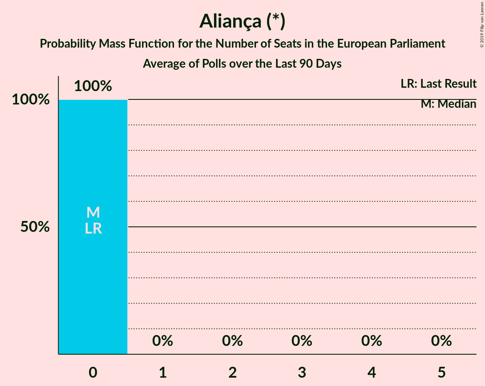

# Aliança (*)

<a href="#voting-intentions">Voting Intentions</a> | <a href="#seats">Seats</a>

## Voting Intentions

Last result: **0.0%** (General Election of 26 May 2019)

### Confidence Intervals

| Period     | Polling firm/Commissioner(s) | Median | 80% Confidence Interval | 90% Confidence Interval | 95% Confidence Interval | 99% Confidence Interval |
|:----------:|:----------------:|:-----------:|:-----------------------:|:-----------------------:|:-----------------------:|:-----------------------:|
| N/A | [Poll Average](average.html) | 0.5% | 0.2–1.1% | 0.1–1.3% | 0.1–1.5% | 0.1–1.9% |
| [24–27 September 2019](2019-09-27-Pitagórica.html) | Pitagórica   Jornal de Notícias | 0.7% | 0.4–1.3% | 0.3–1.5% | 0.3–1.7% | 0.2–2.1% |
| [23–26 September 2019](2019-09-26-Pitagórica.html) | Pitagórica   Jornal de Notícias | 0.7% | N/A | N/A | N/A | N/A |
| [22–25 September 2019](2019-09-25-Pitagórica.html) | Pitagórica   Jornal de Notícias | 0.7% | N/A | N/A | N/A | N/A |
| [21–25 September 2019](2019-09-25-Aximage.html) | Aximage   Jornal Económico | 0.0% | N/A | N/A | N/A | N/A |
| [21–24 September 2019](2019-09-24-Pitagórica.html) | Pitagórica   Jornal de Notícias | 0.5% | N/A | N/A | N/A | N/A |
| [20–23 September 2019](2019-09-23-Pitagórica.html) | Pitagórica   Jornal de Notícias | 0.5% | N/A | N/A | N/A | N/A |
| [19–22 September 2019](2019-09-22-Pitagórica.html) | Pitagórica   Jornal de Notícias | 0.7% | N/A | N/A | N/A | N/A |
| [18–21 September 2019](2019-09-21-Pitagórica.html) | Pitagórica   Jornal de Notícias | 1.0% | N/A | N/A | N/A | N/A |
| [17–20 September 2019](2019-09-20-Pitagórica.html) | Pitagórica   Jornal de Notícias | 1.2% | N/A | N/A | N/A | N/A |
| [9–12 September 2019](2019-09-12-Pitagórica.html) | Pitagórica   Jornal de Notícias | 1.5% | N/A | N/A | N/A | N/A |
| [7–12 September 2019](2019-09-12-Eurosondagem.html) | Eurosondagem | 0.0% | N/A | N/A | N/A | N/A |
| [2–11 September 2019](2019-09-11-Intercampus.html) | Intercampus   Correio da Manhã and Negócios | 0.0% | N/A | N/A | N/A | N/A |
| [1–8 September 2019](2019-09-08-Aximage.html) | Aximage | 0.0% | N/A | N/A | N/A | N/A |
| [24 August–5 September 2019](2019-09-05-GfKMetris.html) | GfK Metris   Expresso and SIC Notícias | 0.2% | 0.1–0.7% | 0.1–0.8% | 0.1–0.9% | 0.0–1.2% |
| [1–5 September 2019](2019-09-05-Eurosondagem.html) | Eurosondagem   Associação Mutualista Montepio | 1.7% | 1.2–2.3% | 1.1–2.5% | 1.0–2.7% | 0.9–3.0% |
| [12–24 August 2019](2019-08-24-Pitagórica.html) | Pitagórica   Jornal de Notícias | 1.5% | N/A | N/A | N/A | N/A |
| [18–28 July 2019](2019-07-28-Multidados.html) | Multidados   TVI | 0.0% | N/A | N/A | N/A | N/A |
| [12–15 July 2019](2019-07-15-Aximage.html) | Aximage   Correio da Manhã and Negócios | 0.0% | N/A | N/A | N/A | N/A |
| [8–14 July 2019](2019-07-14-Pitagórica.html) | Pitagórica   Jornal de Notícias | 1.2% | N/A | N/A | N/A | N/A |
| [7–11 July 2019](2019-07-11-Eurosondagem.html) | Eurosondagem   Associação Mutualista Montepio | 1.5% | 1.1–2.1% | 1.0–2.3% | 0.9–2.4% | 0.7–2.8% |
| [15–27 June 2019](2019-06-27-ICSISCTE.html) | ICS/ISCTE   Expresso and SIC Notícias | 0.2% | N/A | N/A | N/A | N/A |
| [13–19 June 2019](2019-06-19-Aximage.html) | Aximage   Correio da Manhã and Negócios | 0.8% | 0.5–1.5% | 0.4–1.7% | 0.4–1.9% | 0.2–2.3% |
| [2–6 June 2019](2019-06-06-Eurosondagem.html) | Eurosondagem | 1.9% | 1.4–2.6% | 1.3–2.8% | 1.2–2.9% | 1.0–3.3% |

### Probability Mass Function

The following table shows the probability mass function per percentage block of voting intentions for the [poll average](average.html) for Aliança (*).

| Voting Intentions | Probability | Accumulated | Special Marks |
|:-----------------:|:-----------:|:-----------:|:-------------:|
| 0.0–0.5% | 53% | 100% | Last Result |
| 0.5–1.5% | 45% | 47% | Median |
| 1.5–2.5% | 2% | 2% |  |
| 2.5–3.5% | 0% | 0% |  |

## Seats

Last result: **0** seats (General Election of 26 May 2019)

### Confidence Intervals

| Period     | Polling firm/Commissioner(s) | Median | 80% Confidence Interval | 90% Confidence Interval | 95% Confidence Interval | 99% Confidence Interval |
|:----------:|:----------------:|:------:|:-----------------------:|:-----------------------:|:-----------------------:|:-----------------------:|
| N/A | [Poll Average](average.html) | 0 | 0 | 0 | 0 | 0 |
| [24–27 September 2019](2019-09-27-Pitagórica.html) | Pitagórica   Jornal de Notícias | 0 | 0 | 0 | 0 | 0 |
| [23–26 September 2019](2019-09-26-Pitagórica.html) | Pitagórica   Jornal de Notícias |  |  |  |  |  |
| [22–25 September 2019](2019-09-25-Pitagórica.html) | Pitagórica   Jornal de Notícias |  |  |  |  |  |
| [21–25 September 2019](2019-09-25-Aximage.html) | Aximage   Jornal Económico |  |  |  |  |  |
| [21–24 September 2019](2019-09-24-Pitagórica.html) | Pitagórica   Jornal de Notícias |  |  |  |  |  |
| [20–23 September 2019](2019-09-23-Pitagórica.html) | Pitagórica   Jornal de Notícias |  |  |  |  |  |
| [19–22 September 2019](2019-09-22-Pitagórica.html) | Pitagórica   Jornal de Notícias |  |  |  |  |  |
| [18–21 September 2019](2019-09-21-Pitagórica.html) | Pitagórica   Jornal de Notícias |  |  |  |  |  |
| [17–20 September 2019](2019-09-20-Pitagórica.html) | Pitagórica   Jornal de Notícias |  |  |  |  |  |
| [9–12 September 2019](2019-09-12-Pitagórica.html) | Pitagórica   Jornal de Notícias |  |  |  |  |  |
| [7–12 September 2019](2019-09-12-Eurosondagem.html) | Eurosondagem |  |  |  |  |  |
| [2–11 September 2019](2019-09-11-Intercampus.html) | Intercampus   Correio da Manhã and Negócios |  |  |  |  |  |
| [1–8 September 2019](2019-09-08-Aximage.html) | Aximage |  |  |  |  |  |
| [24 August–5 September 2019](2019-09-05-GfKMetris.html) | GfK Metris   Expresso and SIC Notícias | 0 | 0 | 0 | 0 | 0 |
| [1–5 September 2019](2019-09-05-Eurosondagem.html) | Eurosondagem   Associação Mutualista Montepio | 0 | 0 | 0 | 0 | 0 |
| [12–24 August 2019](2019-08-24-Pitagórica.html) | Pitagórica   Jornal de Notícias |  |  |  |  |  |
| [18–28 July 2019](2019-07-28-Multidados.html) | Multidados   TVI |  |  |  |  |  |
| [12–15 July 2019](2019-07-15-Aximage.html) | Aximage   Correio da Manhã and Negócios |  |  |  |  |  |
| [8–14 July 2019](2019-07-14-Pitagórica.html) | Pitagórica   Jornal de Notícias |  |  |  |  |  |
| [7–11 July 2019](2019-07-11-Eurosondagem.html) | Eurosondagem   Associação Mutualista Montepio | 0 | 0 | 0 | 0 | 0 |
| [15–27 June 2019](2019-06-27-ICSISCTE.html) | ICS/ISCTE   Expresso and SIC Notícias |  |  |  |  |  |
| [13–19 June 2019](2019-06-19-Aximage.html) | Aximage   Correio da Manhã and Negócios | 0 | 0 | 0 | 0 | 0 |
| [2–6 June 2019](2019-06-06-Eurosondagem.html) | Eurosondagem | 0 | 0 | 0 | 0 | 0 |

### Probability Mass Function

The following table shows the probability mass function per seat for the [poll average](average.html) for Aliança (*).

| Number of Seats | Probability | Accumulated | Special Marks |
|:---------------:|:-----------:|:-----------:|:-------------:|
| 0 | 100% | 100% | Last Result, Median |

