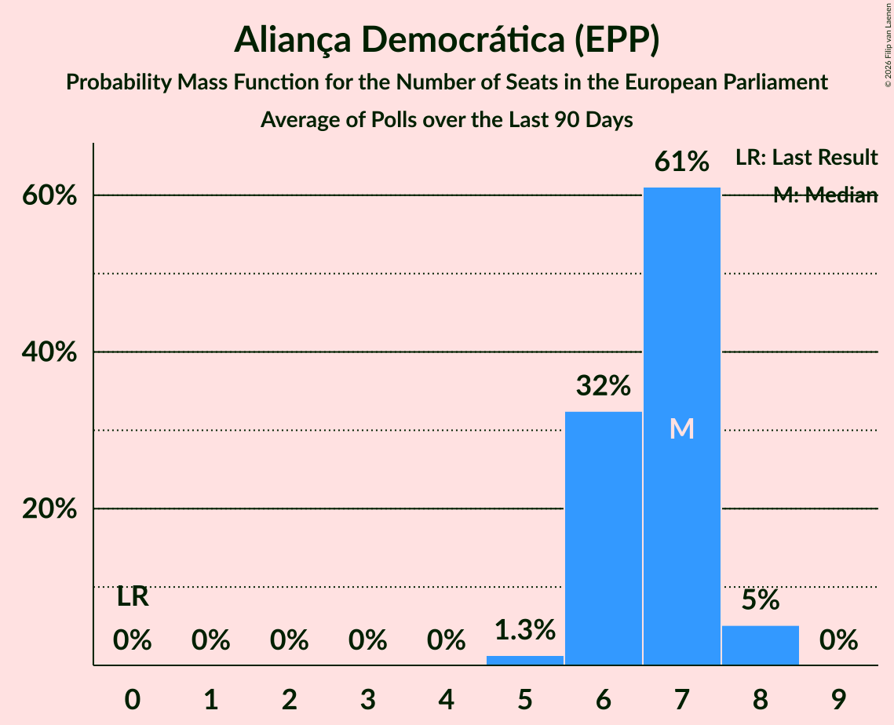

# Aliança Democrática (EPP)

<a href="#voting-intentions">Voting Intentions</a> | <a href="#seats">Seats</a>

## Voting Intentions

Last result: **0.0%** (General Election of 9 June 2024)

### Confidence Intervals

| Period     | Polling firm/Commissioner(s) | Median | 80% Confidence Interval | 90% Confidence Interval | 95% Confidence Interval | 99% Confidence Interval |
|:----------:|:----------------:|:-----------:|:-----------------------:|:-----------------------:|:-----------------------:|:-----------------------:|
| N/A | [Poll Average](average.html) | 26.4% | 24.1–28.8% | 23.4–29.5% | 22.9–30.2% | 21.8–31.4% |
| [11–18 July 2025](2025-07-18-Intercampus.html) | Intercampus   Correio da Manhã | 26.3% | 24.1–28.8% | 23.4–29.5% | 22.8–30.2% | 21.8–31.4% |
| [5–15 June 2025](2025-06-15-Intercampus.html) | Intercampus   Correio da Manhã | 29.9% | 27.5–32.4% | 26.8–33.2% | 26.2–33.8% | 25.1–35.1% |
| [12–15 May 2025](2025-05-15-Pitagórica.html) | Pitagórica   CNN Portugal, Jornal de Notícias, TSF and TVI | 33.2% | 31.1–35.4% | 30.5–36.0% | 30.0–36.5% | 29.1–37.6% |
| [11–14 May 2025](2025-05-14-Pitagórica.html) | Pitagórica   CNN Portugal, Jornal de Notícias, TSF and TVI | 31.9% | 29.8–34.0% | 29.2–34.6% | 28.7–35.1% | 27.8–36.2% |
| [10–13 May 2025](2025-05-13-Pitagórica.html) | Pitagórica   CNN Portugal, Jornal de Notícias, TSF and TVI | 31.5% | 29.4–33.6% | 28.9–34.2% | 28.4–34.8% | 27.4–35.8% |
| [6–13 May 2025](2025-05-13-Consulmark2.html) | Consulmark2   Euronews and Sol | 33.1% | 30.7–35.7% | 30.0–36.4% | 29.4–37.0% | 28.3–38.3% |
| [6–13 May 2025](2025-05-13-CESOP–UCP.html) | CESOP–UCP   Público and RTP | 34.0% | 32.6–35.5% | 32.2–35.9% | 31.8–36.3% | 31.1–37.0% |
| [9–12 May 2025](2025-05-12-Pitagórica.html) | Pitagórica   CNN Portugal, Jornal de Notícias, TSF and TVI | 33.1% | 31.0–35.3% | 30.4–35.9% | 29.9–36.4% | 29.0–37.5% |
| [8–11 May 2025](2025-05-11-Pitagórica.html) | Pitagórica   CNN Portugal, Jornal de Notícias, TSF and TVI | 32.0% | 29.9–34.1% | 29.3–34.8% | 28.9–35.3% | 27.9–36.3% |
| [7–10 May 2025](2025-05-10-Pitagórica.html) | Pitagórica   CNN Portugal, Jornal de Notícias, TSF and TVI | 33.1% | N/A | N/A | N/A | N/A |
| [6–9 May 2025](2025-05-09-Pitágorica.html) | Pitágorica   CNN Portugal, Jornal de Notícias, TSF and TVI | 33.7% | 31.6–35.9% | 31.0–36.5% | 30.5–37.0% | 29.5–38.1% |
| [5–8 May 2025](2025-05-08-Pitagórica.html) | Pitagórica   CNN Portugal, Jornal de Notícias, TSF and TVI | 33.7% | 31.6–35.9% | 31.0–36.5% | 30.5–37.0% | 29.5–38.1% |
| [4–7 May 2025](2025-05-07-Pitagórica.html) | Pitagórica   CNN Portugal, Jornal de Notícias, TSF and TVI | 34.2% | N/A | N/A | N/A | N/A |
| [3–6 May 2025](2025-05-06-Pitagórica.html) | Pitagórica   CNN Portugal, Jornal de Notícias, TSF and TVI | 34.9% | 32.8–37.1% | 32.2–37.8% | 31.7–38.3% | 30.7–39.4% |
| [28 April–6 May 2025](2025-05-06-CESOP–UCP.html) | CESOP–UCP   Público and RTP | 32.0% | 30.4–33.6% | 30.0–34.0% | 29.6–34.4% | 28.9–35.2% |
| [2–5 May 2025](2025-05-05-Pitagórica.html) | Pitagórica   CNN Portugal, Jornal de Notícias, TSF and TVI | 34.8% | 32.7–37.0% | 32.1–37.6% | 31.6–38.2% | 30.6–39.2% |
| [24 April–5 May 2025](2025-05-05-Intercampus.html) | Intercampus   Correio da Manhã | 28.8% | 27.0–30.7% | 26.5–31.2% | 26.1–31.7% | 25.2–32.6% |
| [25 April–5 May 2025](2025-05-05-ICSISCTE.html) | ICS/ISCTE   Expresso and SIC Notícias | 32.0% | 30.2–34.0% | 29.7–34.5% | 29.2–35.0% | 28.3–35.9% |
| [1–5 May 2025](2025-05-05-Aximage.html) | Aximage   Diário de Notícias | 28.4% | 26.3–30.8% | 25.6–31.4% | 25.1–32.0% | 24.1–33.2% |
| [1–4 May 2025](2025-05-04-Pitagórica.html) | Pitagórica   CNN Portugal, Jornal de Notícias, TSF and TVI | 35.8% | N/A | N/A | N/A | N/A |
| [30 April–3 May 2025](2025-05-03-Pitagórica.html) | Pitagórica   CNN Portugal, Jornal de Notícias, TSF and TVI | 35.6% | N/A | N/A | N/A | N/A |
| [29 April–2 May 2025](2025-05-02-Pitagórica.html) | Pitagórica   CNN Portugal, Jornal de Notícias, TSF and TVI | 34.4% | 32.3–36.6% | 31.7–37.3% | 31.2–37.8% | 30.3–38.9% |
| [28 April–1 May 2025](2025-05-01-Pitagórica.html) | Pitagórica   CNN Portugal, Jornal de Notícias, TSF and TVI | 34.0% | N/A | N/A | N/A | N/A |
| [21–24 April 2025](2025-04-24-CESOP–UCP.html) | CESOP–UCP   Público and RTP | 32.0% | 30.3–33.8% | 29.9–34.3% | 29.4–34.7% | 28.7–35.5% |
| [14–22 April 2025](2025-04-22-Consulmark2.html) | Consulmark2   Euronews and Sol | 34.1% | 31.6–36.7% | 30.9–37.4% | 30.3–38.1% | 29.1–39.4% |
| [14–21 April 2025](2025-04-21-Pitagórica.html) | Pitagórica   CNN Portugal, Jornal de Notícias, TSF and TVI | 34.8% | 32.9–36.8% | 32.4–37.3% | 31.9–37.8% | 31.0–38.8% |
| [5–14 April 2025](2025-04-14-ICSISCTE.html) | ICS/ISCTE   Expresso and SIC Notícias | 33.0% | 30.9–35.2% | 30.3–35.8% | 29.8–36.3% | 28.9–37.4% |
| [4–9 April 2025](2025-04-09-Intercampus.html) | Intercampus   Correio da Manhã | 27.3% | 24.8–29.9% | 24.1–30.6% | 23.6–31.3% | 22.5–32.5% |
| [4–8 April 2025](2025-04-08-Aximage.html) | Aximage   Diário de Notícias | 27.1% | 25.0–29.4% | 24.4–30.1% | 23.9–30.7% | 22.9–31.8% |
| [1–6 April 2025](2025-04-06-Aximage.html) | Aximage   Folha Nacional | 28.5% | N/A | N/A | N/A | N/A |
| [27 March–3 April 2025](2025-04-03-Consulmark2.html) | Consulmark2   Euronews and Sol | 33.3% | 30.8–35.8% | 30.1–36.6% | 29.6–37.2% | 28.4–38.5% |
| [24–29 March 2025](2025-03-29-Pitagórica.html) | Pitagórica   CNN Portugal, Jornal de Notícias, TSF and TVI | 34.4% | 32.5–36.4% | 32.0–36.9% | 31.5–37.4% | 30.6–38.4% |
| [20–26 March 2025](2025-03-26-Intercampus.html) | Intercampus   Correio da Manhã | 30.7% | 28.2–33.4% | 27.5–34.2% | 26.9–34.8% | 25.7–36.1% |
| [17–26 March 2025](2025-03-26-CESOP–UCP.html) | CESOP–UCP   Público and RTP | 29.0% | 27.4–30.7% | 26.9–31.2% | 26.5–31.7% | 25.8–32.5% |
| [15–24 March 2025](2025-03-24-GfKMetris.html) | GfK Metris | 30.0% | 28.2–31.9% | 27.7–32.5% | 27.3–32.9% | 26.5–33.9% |
| [17–21 March 2025](2025-03-21-Aximage.html) | Aximage   Folha Nacional | 28.0% | 26.2–29.9% | 25.7–30.5% | 25.3–30.9% | 24.4–31.9% |
| [12–17 March 2025](2025-03-17-ICSISCTE.html) | ICS/ISCTE   Expresso and SIC Notícias | 37.6% | 34.7–40.7% | 33.9–41.6% | 33.2–42.4% | 31.8–43.8% |
| [11–13 March 2025](2025-03-13-Intercampus.html) | Intercampus   Correio da Manhã | 26.1% | 23.8–28.7% | 23.1–29.4% | 22.6–30.0% | 21.5–31.3% |
| [6–12 March 2025](2025-03-12-Consulmark2.html) | Consulmark2   Euronews and Sol | 32.2% | 29.8–34.7% | 29.1–35.4% | 28.5–36.0% | 27.4–37.3% |
| [4–10 March 2025](2025-03-10-Intercampus.html) | Intercampus   Correio da Manhã | 27.0% | 24.6–29.5% | 24.0–30.3% | 23.4–30.9% | 22.3–32.1% |
| [6–8 March 2025](2025-03-08-Aximage.html) | Aximage   Diário de Notícias | 25.8% | 23.6–28.2% | 23.0–28.9% | 22.5–29.4% | 21.4–30.6% |
| [3–6 March 2025](2025-03-06-Pitagórica.html) | Pitagórica   CNN Portugal, Jornal de Notícias, TSF and TVI | 33.4% | 31.1–35.9% | 30.4–36.6% | 29.8–37.2% | 28.7–38.4% |
| [23–27 February 2025](2025-02-27-Pitagórica.html) | Pitagórica   CNN Portugal, Jornal de Notícias, TSF and TVI | 35.5% | 32.5–38.7% | 31.7–39.5% | 31.0–40.3% | 29.6–41.8% |
| [23–28 January 2025](2025-01-28-Aximage.html) | Aximage   Diário de Notícias | 29.2% | 27.3–31.4% | 26.7–32.0% | 26.2–32.5% | 25.3–33.5% |
| [21–26 January 2025](2025-01-26-Pitagórica.html) | Pitagórica   CNN Portugal, Jornal de Notícias, TSF and TVI | 33.0% | 30.1–36.1% | 29.3–37.0% | 28.6–37.8% | 27.2–39.3% |
| [21–26 January 2025](2025-01-26-Intercampus.html) | Intercampus   Correio da Manhã | 27.9% | 25.5–30.4% | 24.9–31.1% | 24.3–31.7% | 23.2–33.0% |
| [16–21 January 2025](2025-01-21-Aximage.html) | Aximage   Folha Nacional | 29.1% | N/A | N/A | N/A | N/A |
| [9–20 January 2025](2025-01-20-ICSISCTE.html) | ICS/ISCTE   Expresso and SIC Notícias | 33.0% | 31.0–35.2% | 30.4–35.8% | 29.9–36.4% | 28.9–37.4% |
| [28 December 2024–5 January 2025](2025-01-05-Pitagórica.html) | Pitagórica   CNN Portugal, Jornal de Notícias, TSF and TVI | 33.0% | 30.1–36.1% | 29.3–37.0% | 28.6–37.8% | 27.2–39.3% |
| [21–27 November 2024](2024-11-27-Intercampus.html) | Intercampus   CMTV | 28.8% | 26.5–31.2% | 25.8–31.9% | 25.3–32.5% | 24.2–33.7% |
| [15–22 November 2024](2024-11-22-Aximage.html) | Aximage   Folha Nacional | 28.1% | 26.2–30.2% | 25.6–30.8% | 25.1–31.4% | 24.2–32.4% |
| [13–19 November 2024](2024-11-19-Aximage.html) | Aximage   Diário de Notícias | 29.8% | N/A | N/A | N/A | N/A |
| [17–23 October 2024](2024-10-23-CESOP–UCP.html) | CESOP–UCP   Antena 1, Público and RTP | 33.0% | 31.1–34.9% | 30.6–35.5% | 30.2–35.9% | 29.3–36.9% |
| [4–10 October 2024](2024-10-10-Intercampus.html) | Intercampus   Correio da Manhã and Negócios | 28.3% | 26.0–30.7% | 25.4–31.4% | 24.8–32.0% | 23.8–33.2% |
| [30 September–5 October 2024](2024-10-05-Aximage.html) | Aximage   Diário de Notícias | 32.0% | 30.0–34.2% | 29.4–34.8% | 28.9–35.4% | 27.9–36.4% |
| [29 August–4 September 2024](2024-09-04-Intercampus.html) | Intercampus   CMTV | 29.5% | 27.2–31.9% | 26.5–32.6% | 26.0–33.2% | 24.9–34.4% |
| [19–26 July 2024](2024-07-26-Intercampus.html) | Intercampus   CMTV, Correio da Manhã and Negócios | 28.7% | 26.5–31.2% | 25.8–31.9% | 25.3–32.5% | 24.2–33.7% |
| [7–13 July 2024](2024-07-13-CESOP–UCP.html) | CESOP–UCP   RTP | 31.0% | 29.2–33.0% | 28.6–33.6% | 28.2–34.0% | 27.3–35.0% |
| [3–8 July 2024](2024-07-08-Aximage.html) | Aximage   Diário de Notícias, Jornal de Notícias and TSF Rádio Notícias | 27.6% | 25.6–29.7% | 25.1–30.3% | 24.6–30.8% | 23.7–31.8% |

### Probability Mass Function

The following table shows the probability mass function per percentage block of voting intentions for the [poll average](average.html) for Aliança Democrática (EPP).

| Voting Intentions | Probability | Accumulated | Special Marks |
|:-----------------:|:-----------:|:-----------:|:-------------:|
| 0.0–0.5% | 0% | 100% | Last Result |
| 0.5–1.5% | 0% | 100% |  |
| 1.5–2.5% | 0% | 100% |  |
| 2.5–3.5% | 0% | 100% |  |
| 3.5–4.5% | 0% | 100% |  |
| 4.5–5.5% | 0% | 100% |  |
| 5.5–6.5% | 0% | 100% |  |
| 6.5–7.5% | 0% | 100% |  |
| 7.5–8.5% | 0% | 100% |  |
| 8.5–9.5% | 0% | 100% |  |
| 9.5–10.5% | 0% | 100% |  |
| 10.5–11.5% | 0% | 100% |  |
| 11.5–12.5% | 0% | 100% |  |
| 12.5–13.5% | 0% | 100% |  |
| 13.5–14.5% | 0% | 100% |  |
| 14.5–15.5% | 0% | 100% |  |
| 15.5–16.5% | 0% | 100% |  |
| 16.5–17.5% | 0% | 100% |  |
| 17.5–18.5% | 0% | 100% |  |
| 18.5–19.5% | 0% | 100% |  |
| 19.5–20.5% | 0% | 100% |  |
| 20.5–21.5% | 0.3% | 100% |  |
| 21.5–22.5% | 1.3% | 99.7% |  |
| 22.5–23.5% | 4% | 98% |  |
| 23.5–24.5% | 10% | 94% |  |
| 24.5–25.5% | 16% | 84% |  |
| 25.5–26.5% | 21% | 68% | Median |
| 26.5–27.5% | 20% | 47% |  |
| 27.5–28.5% | 14% | 27% |  |
| 28.5–29.5% | 8% | 13% |  |
| 29.5–30.5% | 3% | 5% |  |
| 30.5–31.5% | 1.2% | 2% |  |
| 31.5–32.5% | 0.3% | 0.4% |  |
| 32.5–33.5% | 0.1% | 0.1% |  |
| 33.5–34.5% | 0% | 0% |  |

## Seats

Last result: **0** seats (General Election of 9 June 2024)

### Confidence Intervals

| Period     | Polling firm/Commissioner(s) | Median | 80% Confidence Interval | 90% Confidence Interval | 95% Confidence Interval | 99% Confidence Interval |
|:----------:|:----------------:|:------:|:-----------------------:|:-----------------------:|:-----------------------:|:-----------------------:|
| N/A | [Poll Average](average.html) | 6 | 6–7 | 5–7 | 5–7 | 5–8 |
| [11–18 July 2025](2025-07-18-Intercampus.html) | Intercampus   Correio da Manhã | 6 | 6–7 | 5–7 | 5–7 | 5–8 |
| [5–15 June 2025](2025-06-15-Intercampus.html) | Intercampus   Correio da Manhã | 7 | 6–8 | 6–8 | 6–8 | 6–8 |
| [12–15 May 2025](2025-05-15-Pitagórica.html) | Pitagórica   CNN Portugal, Jornal de Notícias, TSF and TVI | 8 | 7–8 | 7–9 | 7–9 | 7–9 |
| [11–14 May 2025](2025-05-14-Pitagórica.html) | Pitagórica   CNN Portugal, Jornal de Notícias, TSF and TVI | 8 | 7–8 | 7–8 | 7–8 | 6–9 |
| [10–13 May 2025](2025-05-13-Pitagórica.html) | Pitagórica   CNN Portugal, Jornal de Notícias, TSF and TVI | 7 | 7–8 | 7–8 | 7–8 | 6–9 |
| [6–13 May 2025](2025-05-13-Consulmark2.html) | Consulmark2   Euronews and Sol | 8 | 7–9 | 7–9 | 7–9 | 7–9 |
| [6–13 May 2025](2025-05-13-CESOP–UCP.html) | CESOP–UCP   Público and RTP | 8 | 8–9 | 8–9 | 8–9 | 7–9 |
| [9–12 May 2025](2025-05-12-Pitagórica.html) | Pitagórica   CNN Portugal, Jornal de Notícias, TSF and TVI | 8 | 7–8 | 7–9 | 7–9 | 7–9 |
| [8–11 May 2025](2025-05-11-Pitagórica.html) | Pitagórica   CNN Portugal, Jornal de Notícias, TSF and TVI | 8 | 7–8 | 7–8 | 7–9 | 6–9 |
| [7–10 May 2025](2025-05-10-Pitagórica.html) | Pitagórica   CNN Portugal, Jornal de Notícias, TSF and TVI |  |  |  |  |  |
| [6–9 May 2025](2025-05-09-Pitágorica.html) | Pitágorica   CNN Portugal, Jornal de Notícias, TSF and TVI | 8 | 8–9 | 7–9 | 7–9 | 7–9 |
| [5–8 May 2025](2025-05-08-Pitagórica.html) | Pitagórica   CNN Portugal, Jornal de Notícias, TSF and TVI | 8 | 8–9 | 7–9 | 7–9 | 7–9 |
| [4–7 May 2025](2025-05-07-Pitagórica.html) | Pitagórica   CNN Portugal, Jornal de Notícias, TSF and TVI |  |  |  |  |  |
| [3–6 May 2025](2025-05-06-Pitagórica.html) | Pitagórica   CNN Portugal, Jornal de Notícias, TSF and TVI | 8 | 8–9 | 8–9 | 7–9 | 7–10 |
| [28 April–6 May 2025](2025-05-06-CESOP–UCP.html) | CESOP–UCP   Público and RTP | 8 | 7–8 | 7–8 | 7–8 | 7–9 |
| [2–5 May 2025](2025-05-05-Pitagórica.html) | Pitagórica   CNN Portugal, Jornal de Notícias, TSF and TVI | 8 | 8–9 | 7–9 | 7–9 | 7–10 |
| [24 April–5 May 2025](2025-05-05-Intercampus.html) | Intercampus   Correio da Manhã | 7 | 6–7 | 6–8 | 6–8 | 6–8 |
| [25 April–5 May 2025](2025-05-05-ICSISCTE.html) | ICS/ISCTE   Expresso and SIC Notícias | 8 | 7–8 | 7–8 | 7–9 | 7–9 |
| [1–5 May 2025](2025-05-05-Aximage.html) | Aximage   Diário de Notícias | 7 | 6–7 | 6–8 | 6–8 | 6–8 |
| [1–4 May 2025](2025-05-04-Pitagórica.html) | Pitagórica   CNN Portugal, Jornal de Notícias, TSF and TVI |  |  |  |  |  |
| [30 April–3 May 2025](2025-05-03-Pitagórica.html) | Pitagórica   CNN Portugal, Jornal de Notícias, TSF and TVI |  |  |  |  |  |
| [29 April–2 May 2025](2025-05-02-Pitagórica.html) | Pitagórica   CNN Portugal, Jornal de Notícias, TSF and TVI | 8 | 8–9 | 7–9 | 7–9 | 7–10 |
| [28 April–1 May 2025](2025-05-01-Pitagórica.html) | Pitagórica   CNN Portugal, Jornal de Notícias, TSF and TVI |  |  |  |  |  |
| [21–24 April 2025](2025-04-24-CESOP–UCP.html) | CESOP–UCP   Público and RTP | 8 | 7–8 | 7–8 | 7–8 | 7–9 |
| [14–22 April 2025](2025-04-22-Consulmark2.html) | Consulmark2   Euronews and Sol | 8 | 7–9 | 7–9 | 7–9 | 7–10 |
| [14–21 April 2025](2025-04-21-Pitagórica.html) | Pitagórica   CNN Portugal, Jornal de Notícias, TSF and TVI | 8 | 8–9 | 8–9 | 7–9 | 7–9 |
| [5–14 April 2025](2025-04-14-ICSISCTE.html) | ICS/ISCTE   Expresso and SIC Notícias | 8 | 7–8 | 7–9 | 7–9 | 7–9 |
| [4–9 April 2025](2025-04-09-Intercampus.html) | Intercampus   Correio da Manhã | 6 | 6–7 | 6–7 | 5–8 | 5–8 |
| [4–8 April 2025](2025-04-08-Aximage.html) | Aximage   Diário de Notícias | 6 | 6–7 | 6–7 | 6–7 | 5–8 |
| [1–6 April 2025](2025-04-06-Aximage.html) | Aximage   Folha Nacional |  |  |  |  |  |
| [27 March–3 April 2025](2025-04-03-Consulmark2.html) | Consulmark2   Euronews and Sol | 8 | 7–9 | 7–9 | 7–9 | 7–9 |
| [24–29 March 2025](2025-03-29-Pitagórica.html) | Pitagórica   CNN Portugal, Jornal de Notícias, TSF and TVI | 8 | 8–9 | 7–9 | 7–9 | 7–9 |
| [20–26 March 2025](2025-03-26-Intercampus.html) | Intercampus   Correio da Manhã | 7 | 7–8 | 6–8 | 6–8 | 6–9 |
| [17–26 March 2025](2025-03-26-CESOP–UCP.html) | CESOP–UCP   Público and RTP | 7 | 6–7 | 6–7 | 6–8 | 6–8 |
| [15–24 March 2025](2025-03-24-GfKMetris.html) | GfK Metris | 7 | 6–7 | 6–8 | 6–8 | 6–8 |
| [17–21 March 2025](2025-03-21-Aximage.html) | Aximage   Folha Nacional | 7 | 6–7 | 6–7 | 6–8 | 6–8 |
| [12–17 March 2025](2025-03-17-ICSISCTE.html) | ICS/ISCTE   Expresso and SIC Notícias | 9 | 8–10 | 8–10 | 8–10 | 7–11 |
| [11–13 March 2025](2025-03-13-Intercampus.html) | Intercampus   Correio da Manhã | 6 | 5–7 | 5–7 | 5–7 | 5–7 |
| [6–12 March 2025](2025-03-12-Consulmark2.html) | Consulmark2   Euronews and Sol | 8 | 7–8 | 7–9 | 7–9 | 6–9 |
| [4–10 March 2025](2025-03-10-Intercampus.html) | Intercampus   Correio da Manhã | 6 | 6–7 | 6–7 | 5–7 | 5–8 |
| [6–8 March 2025](2025-03-08-Aximage.html) | Aximage   Diário de Notícias | 6 | 5–7 | 5–7 | 5–7 | 5–7 |
| [3–6 March 2025](2025-03-06-Pitagórica.html) | Pitagórica   CNN Portugal, Jornal de Notícias, TSF and TVI | 8 | 7–9 | 7–9 | 7–9 | 7–10 |
| [23–27 February 2025](2025-02-27-Pitagórica.html) | Pitagórica   CNN Portugal, Jornal de Notícias, TSF and TVI | 8 | 8–9 | 7–9 | 7–10 | 7–10 |
| [23–28 January 2025](2025-01-28-Aximage.html) | Aximage   Diário de Notícias | 7 | 6–8 | 6–8 | 6–8 | 6–8 |
| [21–26 January 2025](2025-01-26-Pitagórica.html) | Pitagórica   CNN Portugal, Jornal de Notícias, TSF and TVI | 8 | 7–9 | 7–9 | 7–9 | 6–10 |
| [21–26 January 2025](2025-01-26-Intercampus.html) | Intercampus   Correio da Manhã | 7 | 6–7 | 6–8 | 6–8 | 5–8 |
| [16–21 January 2025](2025-01-21-Aximage.html) | Aximage   Folha Nacional |  |  |  |  |  |
| [9–20 January 2025](2025-01-20-ICSISCTE.html) | ICS/ISCTE   Expresso and SIC Notícias | 8 | 7–9 | 7–9 | 7–9 | 7–9 |
| [28 December 2024–5 January 2025](2025-01-05-Pitagórica.html) | Pitagórica   CNN Portugal, Jornal de Notícias, TSF and TVI | 8 | 7–9 | 7–9 | 7–9 | 6–10 |
| [21–27 November 2024](2024-11-27-Intercampus.html) | Intercampus   CMTV | 7 | 6–8 | 6–8 | 6–8 | 6–8 |
| [15–22 November 2024](2024-11-22-Aximage.html) | Aximage   Folha Nacional | 7 | 6–7 | 6–7 | 6–7 | 6–8 |
| [13–19 November 2024](2024-11-19-Aximage.html) | Aximage   Diário de Notícias |  |  |  |  |  |
| [17–23 October 2024](2024-10-23-CESOP–UCP.html) | CESOP–UCP   Antena 1, Público and RTP | 8 | 7–9 | 7–9 | 7–9 | 7–9 |
| [4–10 October 2024](2024-10-10-Intercampus.html) | Intercampus   Correio da Manhã and Negócios | 7 | 6–7 | 6–8 | 6–8 | 5–8 |
| [30 September–5 October 2024](2024-10-05-Aximage.html) | Aximage   Diário de Notícias | 8 | 7–8 | 7–9 | 7–9 | 7–9 |
| [29 August–4 September 2024](2024-09-04-Intercampus.html) | Intercampus   CMTV | 7 | 6–8 | 6–8 | 6–8 | 6–8 |
| [19–26 July 2024](2024-07-26-Intercampus.html) | Intercampus   CMTV, Correio da Manhã and Negócios | 7 | 6–8 | 6–8 | 6–8 | 6–8 |
| [7–13 July 2024](2024-07-13-CESOP–UCP.html) | CESOP–UCP   RTP | 8 | 7–8 | 7–8 | 7–8 | 6–9 |
| [3–8 July 2024](2024-07-08-Aximage.html) | Aximage   Diário de Notícias, Jornal de Notícias and TSF Rádio Notícias | 7 | 6–7 | 6–7 | 6–7 | 5–8 |

### Probability Mass Function

The following table shows the probability mass function per seat for the [poll average](average.html) for Aliança Democrática (EPP).

| Number of Seats | Probability | Accumulated | Special Marks |
|:---------------:|:-----------:|:-----------:|:-------------:|
| 0 | 0% | 100% | Last Result |
| 1 | 0% | 100% |  |
| 2 | 0% | 100% |  |
| 3 | 0% | 100% |  |
| 4 | 0% | 100% |  |
| 5 | 6% | 100% |  |
| 6 | 61% | 94% | Median |
| 7 | 32% | 33% |  |
| 8 | 1.1% | 1.1% |  |
| 9 | 0% | 0% |  |

