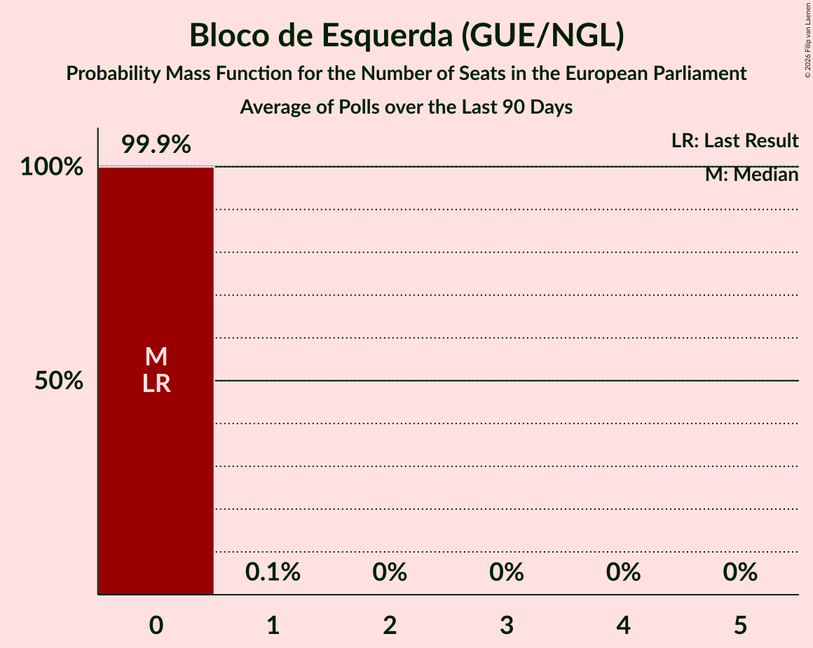

# Bloco de Esquerda (GUE/NGL)

<a href="#voting-intentions">Voting Intentions</a> | <a href="#seats">Seats</a>

## Voting Intentions

Last result: **4.6%** (General Election of 26 May 2019)

### Confidence Intervals

| Period     | Polling firm/Commissioner(s) | Median | 80% Confidence Interval | 90% Confidence Interval | 95% Confidence Interval | 99% Confidence Interval |
|:----------:|:----------------:|:-----------:|:-----------------------:|:-----------------------:|:-----------------------:|:-----------------------:|
| N/A | [Poll Average](average.html) | 7.5% | 6.1–9.7% | 5.8–10.3% | 5.5–10.8% | 5.0–11.7% |
| [11–14 January 2021](2021-01-14-Eurosondagem.html) | Eurosondagem   Porto Canal and Sol | 6.5% | 5.6–7.6% | 5.3–7.9% | 5.1–8.2% | 4.7–8.7% |
| [11–14 January 2021](2021-01-14-CESOP–UCP.html) | CESOP–UCP   Público and RTP | 7.0% | 6.3–7.8% | 6.1–8.0% | 6.0–8.2% | 5.6–8.6% |
| [29 December 2020–10 January 2021](2021-01-10-Pitagórica.html) | Pitagórica   Observador and TVI | 7.2% | 6.0–8.6% | 5.7–9.1% | 5.4–9.4% | 4.9–10.2% |
| [4–7 January 2021](2021-01-07-Intercampus.html) | Intercampus | 9.1% | 7.8–10.8% | 7.4–11.3% | 7.1–11.7% | 6.5–12.5% |
| [22 December 2020–3 January 2021](2021-01-03-Pitagórica.html) | Pitagórica   Observador and TVI | 7.3% | 6.1–8.8% | 5.8–9.3% | 5.5–9.6% | 5.0–10.4% |
| [17–27 December 2020](2020-12-27-Pitagórica.html) | Pitagórica   Observador and TVI | 5.6% | 4.5–6.9% | 4.3–7.3% | 4.0–7.7% | 3.6–8.4% |
| [19–22 December 2020](2020-12-22-Aximage.html) | Aximage   Diário de Notícias, Jornal de Notícias and TSF Rádio Notícias | 8.5% | 7.4–9.9% | 7.0–10.3% | 6.8–10.6% | 6.2–11.3% |
| [17–20 December 2020](2020-12-20-Pitagórica.html) | Pitagórica   Observador and TVI | 5.6% | 4.5–6.9% | 4.3–7.3% | 4.0–7.7% | 3.6–8.4% |
| [14–18 December 2020](2020-12-18-Intercampus.html) | Intercampus   Correio da Manhã and Negócios | 7.3% | 6.1–8.8% | 5.8–9.3% | 5.5–9.7% | 5.0–10.5% |
| [10–13 December 2020](2020-12-13-Pitagórica.html) | Pitagórica   Observador and TVI | 6.7% | 5.5–8.1% | 5.2–8.6% | 5.0–8.9% | 4.5–9.7% |
| [4–11 December 2020](2020-12-11-CESOP–UCP.html) | CESOP–UCP   Público and RTP | 7.0% | 6.2–8.0% | 5.9–8.3% | 5.7–8.5% | 5.4–9.0% |
| [7–10 December 2020](2020-12-10-Eurosondagem.html) | Eurosondagem   Porto Canal and Sol | 7.2% | 6.2–8.3% | 5.9–8.6% | 5.7–8.9% | 5.3–9.5% |
| [23–26 November 2020](2020-11-26-Aximage.html) | Aximage | 7.9% | 6.7–9.4% | 6.3–9.8% | 6.1–10.2% | 5.5–11.0% |
| [11–25 November 2020](2020-11-25-ICSISCTE.html) | ICS/ISCTE | 8.0% | 6.9–9.3% | 6.6–9.7% | 6.3–10.1% | 5.8–10.8% |
| [9–16 November 2020](2020-11-16-Intercampus.html) | Intercampus   Correio da Manhã and Negócios | 7.7% | 6.5–9.3% | 6.2–9.7% | 5.9–10.1% | 5.3–10.9% |
| [2–5 November 2020](2020-11-05-Eurosondagem.html) | Eurosondagem   Porto Canal and Sol | 8.3% | 7.3–9.5% | 7.0–9.9% | 6.8–10.2% | 6.3–10.8% |
| [22–26 October 2020](2020-10-26-Aximage.html) | Aximage | 10.1% | 8.7–11.7% | 8.4–12.2% | 8.1–12.6% | 7.5–13.4% |
| [6–11 October 2020](2020-10-11-Intercampus.html) | Intercampus   Correio da Manhã and Negócios | 11.0% | 9.5–12.8% | 9.1–13.3% | 8.8–13.7% | 8.1–14.6% |
| [5–8 October 2020](2020-10-08-Eurosondagem.html) | Eurosondagem | 8.1% | 7.1–9.3% | 6.8–9.7% | 6.6–10.0% | 6.1–10.6% |
| [14–24 September 2020](2020-09-24-ICSISCTE.html) | ICS/ISCTE | 8.1% | 7.0–9.5% | 6.7–9.9% | 6.4–10.2% | 5.9–10.9% |
| [12–15 September 2020](2020-09-15-Aximage.html) | Aximage | 8.3% | 7.0–9.9% | 6.6–10.4% | 6.3–10.8% | 5.8–11.6% |
| [7–10 September 2020](2020-09-10-Eurosondagem.html) | Eurosondagem | 8.3% | 7.3–9.5% | 7.0–9.9% | 6.8–10.2% | 6.3–10.8% |
| [4–9 September 2020](2020-09-09-Intercampus.html) | Intercampus   Correio da Manhã and Negócios | 9.9% | 8.5–11.6% | 8.1–12.1% | 7.8–12.6% | 7.2–13.4% |
| [6–11 August 2020](2020-08-11-Intercampus.html) | Intercampus   Correio da Manhã and Negócios | 8.5% | 7.2–10.1% | 6.8–10.6% | 6.5–11.0% | 5.9–11.8% |
| [13–18 July 2020](2020-07-18-CESOP–UCP.html) | CESOP–UCP   Público and RTP | 7.0% | 6.2–7.9% | 6.0–8.2% | 5.8–8.4% | 5.5–8.9% |
| [8–13 July 2020](2020-07-13-Intercampus.html) | Intercampus   Correio da Manhã and Negócios | 10.5% | 9.1–12.2% | 8.6–12.7% | 8.3–13.2% | 7.7–14.0% |
| [5–8 July 2020](2020-07-08-Aximage.html) | Aximage   Jornal Económico | 8.5% | 7.2–10.1% | 6.9–10.5% | 6.6–11.0% | 6.0–11.8% |
| [29 June–2 July 2020](2020-07-02-Eurosondagem.html) | Eurosondagem | 8.4% | 7.4–9.6% | 7.1–10.0% | 6.8–10.3% | 6.4–10.9% |
| [9–13 June 2020](2020-06-13-Intercampus.html) | Intercampus   Correio da Manhã and Negócios | 9.8% | 8.4–11.6% | 8.0–12.0% | 7.7–12.5% | 7.1–13.3% |
| [5–8 June 2020](2020-06-08-Aximage.html) | Aximage   Jornal Económico | 8.1% | 6.5–10.2% | 6.1–10.9% | 5.7–11.4% | 5.0–12.5% |
| [1–4 June 2020](2020-06-04-Eurosondagem.html) | Eurosondagem | 8.0% | 7.0–9.2% | 6.8–9.6% | 6.5–9.9% | 6.1–10.5% |
| [16–24 May 2020](2020-05-24-Pitagórica.html) | Pitagórica   Jornal de Notícias | 6.1% | 5.2–7.3% | 4.9–7.7% | 4.6–8.0% | 4.2–8.6% |
| [17–20 May 2020](2020-05-20-Eurosondagem.html) | Eurosondagem | 8.1% | 7.4–8.9% | 7.2–9.2% | 7.0–9.4% | 6.7–9.8% |
| [5–9 May 2020](2020-05-09-Intercampus.html) | Intercampus   Correio da Manhã and Negócios | 9.0% | 7.7–10.7% | 7.3–11.1% | 7.0–11.6% | 6.4–12.4% |
| [4–7 May 2020](2020-05-07-Eurosondagem.html) | Eurosondagem | 8.3% | 7.2–9.5% | 7.0–9.8% | 6.7–10.1% | 6.2–10.7% |
| [15–26 April 2020](2020-04-26-Pitagórica.html) | Pitagórica   Jornal de Notícias | 8.1% | 6.8–9.7% | 6.5–10.2% | 6.2–10.6% | 5.6–11.4% |
| [9–14 April 2020](2020-04-14-Intercampus.html) | Intercampus   Correio da Manhã and Negócios | 11.9% | 10.3–13.7% | 9.9–14.2% | 9.6–14.7% | 8.9–15.6% |
| [29 March–2 April 2020](2020-04-02-Eurosondagem.html) | Eurosondagem | 9.0% | 8.0–10.3% | 7.7–10.7% | 7.4–11.0% | 6.9–11.6% |
| [13–21 March 2020](2020-03-21-Pitagórica.html) | Pitagórica   Jornal de Notícias | 8.6% | 7.3–10.2% | 6.9–10.7% | 6.6–11.1% | 6.0–11.9% |
| [13–19 March 2020](2020-03-19-Intercampus.html) | Intercampus   Correio da Manhã and Negócios | 14.6% | 12.9–16.5% | 12.4–17.1% | 12.0–17.6% | 11.2–18.6% |
| [1–5 March 2020](2020-03-05-Eurosondagem.html) | Eurosondagem | 8.8% | 7.8–10.1% | 7.5–10.4% | 7.2–10.7% | 6.7–11.3% |
| [14–18 February 2020](2020-02-18-Aximage.html) | Aximage | 7.7% | 6.7–9.1% | 6.4–9.4% | 6.1–9.8% | 5.6–10.4% |
| [11–17 February 2020](2020-02-17-Intercampus.html) | Intercampus   Correio da Manhã and Negócios | 13.2% | 11.6–15.1% | 11.1–15.6% | 10.7–16.1% | 10.0–17.1% |
| [2–6 February 2020](2020-02-06-Eurosondagem.html) | Eurosondagem | 9.0% | 7.9–10.3% | 7.6–10.6% | 7.4–10.9% | 6.9–11.6% |
| [22 January–5 February 2020](2020-02-05-ICSISCTE.html) | ICS/ISCTE | 9.0% | 7.8–10.4% | 7.5–10.8% | 7.2–11.2% | 6.7–11.9% |
| [19–24 January 2020](2020-01-24-Intercampus.html) | Intercampus   Correio da Manhã and Negócios | 12.0% | 10.4–13.8% | 10.0–14.3% | 9.6–14.8% | 8.9–15.7% |
| [5–9 January 2020](2020-01-09-Eurosondagem.html) | Eurosondagem | 9.6% | 8.5–10.9% | 8.2–11.3% | 7.9–11.6% | 7.4–12.2% |
| [12–17 December 2019](2019-12-17-Intercampus.html) | Intercampus   Correio da Manhã and Negócios | 10.7% | 9.3–12.5% | 8.9–13.0% | 8.5–13.5% | 7.8–14.3% |
| [8–12 December 2019](2019-12-12-Eurosondagem.html) | Eurosondagem | 9.5% | 8.4–10.8% | 8.1–11.2% | 7.9–11.5% | 7.4–12.1% |
| [20–26 November 2019](2019-11-26-Intercampus.html) | Intercampus   Correio da Manhã and Negócios | 10.8% | 9.3–12.5% | 8.9–13.0% | 8.5–13.5% | 7.9–14.4% |
| [17–21 November 2019](2019-11-21-Eurosondagem.html) | Eurosondagem | 10.1% | 9.0–11.4% | 8.6–11.8% | 8.4–12.1% | 7.9–12.8% |
| [8–11 November 2019](2019-11-11-Aximage.html) | Aximage | 10.3% | 8.9–12.0% | 8.5–12.5% | 8.2–12.9% | 7.6–13.8% |
| [22–28 October 2019](2019-10-28-Intercampus.html) | Intercampus   Correio da Manhã and Negócios | 11.1% | 9.6–12.9% | 9.2–13.4% | 8.8–13.9% | 8.2–14.8% |
| [30 September–3 October 2019](2019-10-03-Pitagórica.html) | Pitagórica   Jornal de Notícias | 9.2% | 7.8–10.9% | 7.4–11.3% | 7.1–11.8% | 6.5–12.6% |
| [29 September–2 October 2019](2019-10-02-Pitagórica.html) | Pitagórica   Jornal de Notícias | 9.2% | 7.8–10.9% | 7.4–11.3% | 7.1–11.8% | 6.5–12.6% |
| [26 September–2 October 2019](2019-10-02-Aximage.html) | Aximage   Jornal Económico | 10.7% | 9.9–11.6% | 9.6–11.8% | 9.4–12.1% | 9.1–12.5% |
| [28 September–1 October 2019](2019-10-01-Pitagórica.html) | Pitagórica   Jornal de Notícias | 8.8% | 7.5–10.5% | 7.1–11.0% | 6.8–11.4% | 6.2–12.2% |
| [26 September–1 October 2019](2019-10-01-Intercampus.html) | Intercampus   Correio da Manhã and Negócios | 8.7% | 7.7–10.0% | 7.3–10.3% | 7.1–10.6% | 6.6–11.2% |
| [25 September–1 October 2019](2019-10-01-Eurosondagem.html) | Eurosondagem   Porto Canal | 9.6% | 8.8–10.5% | 8.6–10.7% | 8.4–11.0% | 8.0–11.4% |
| [27–30 September 2019](2019-09-30-Pitagórica.html) | Pitagórica   Jornal de Notícias | 9.5% | 8.1–11.2% | 7.7–11.7% | 7.4–12.1% | 6.8–13.0% |
| [26–29 September 2019](2019-09-29-Pitagórica.html) | Pitagórica   Jornal de Notícias | 9.2% | 7.8–10.9% | 7.4–11.3% | 7.1–11.8% | 6.5–12.6% |
| [23–29 September 2019](2019-09-29-GfKMetris.html) | GfK Metris   Expresso and SIC Notícias | 10.2% | 9.2–11.3% | 8.9–11.6% | 8.6–11.9% | 8.2–12.5% |
| [26–29 September 2019](2019-09-29-CESOP–UCP.html) | CESOP–UCP   Público and RTP | 9.9% | 9.2–10.6% | 9.1–10.8% | 8.9–11.0% | 8.6–11.3% |
| [25–28 September 2019](2019-09-28-Pitagórica.html) | Pitagórica   Jornal de Notícias | 10.0% | 8.6–11.7% | 8.2–12.2% | 7.8–12.7% | 7.2–13.5% |
| [24–27 September 2019](2019-09-27-Pitagórica.html) | Pitagórica   Jornal de Notícias | 10.3% | 8.9–12.1% | 8.5–12.6% | 8.1–13.0% | 7.5–13.9% |
| [23–26 September 2019](2019-09-26-Pitagórica.html) | Pitagórica   Jornal de Notícias | 10.2% | 8.7–11.9% | 8.3–12.4% | 8.0–12.8% | 7.4–13.7% |
| [22–25 September 2019](2019-09-25-Pitagórica.html) | Pitagórica   Jornal de Notícias | 10.7% | 9.2–12.5% | 8.8–13.0% | 8.4–13.4% | 7.8–14.3% |
| [21–25 September 2019](2019-09-25-Aximage.html) | Aximage   Jornal Económico | 11.0% | 9.5–12.8% | 9.1–13.3% | 8.7–13.8% | 8.1–14.7% |
| [21–24 September 2019](2019-09-24-Pitagórica.html) | Pitagórica   Jornal de Notícias | 10.7% | 9.2–12.5% | 8.8–13.0% | 8.4–13.4% | 7.8–14.3% |
| [20–23 September 2019](2019-09-23-Pitagórica.html) | Pitagórica   Jornal de Notícias | 10.5% | 9.0–12.3% | 8.6–12.8% | 8.3–13.2% | 7.6–14.1% |
| [19–22 September 2019](2019-09-22-Pitagórica.html) | Pitagórica   Jornal de Notícias | 10.3% | 8.9–12.1% | 8.5–12.6% | 8.1–13.0% | 7.5–13.9% |
| [18–21 September 2019](2019-09-21-Pitagórica.html) | Pitagórica   Jornal de Notícias | 9.7% | 8.3–11.4% | 7.9–11.9% | 7.5–12.3% | 6.9–13.2% |
| [17–20 September 2019](2019-09-20-Pitagórica.html) | Pitagórica   Jornal de Notícias | 8.8% | 7.5–10.5% | 7.1–11.0% | 6.8–11.4% | 6.2–12.2% |
| [9–12 September 2019](2019-09-12-Pitagórica.html) | Pitagórica   Jornal de Notícias | 10.1% | 8.7–11.8% | 8.3–12.3% | 7.9–12.7% | 7.3–13.6% |
| [7–12 September 2019](2019-09-12-Eurosondagem.html) | Eurosondagem | 9.5% | 8.7–10.4% | 8.5–10.7% | 8.3–10.9% | 8.0–11.3% |
| [2–11 September 2019](2019-09-11-Intercampus.html) | Intercampus   Correio da Manhã and Negócios | 9.7% | 8.5–11.2% | 8.2–11.6% | 7.9–12.0% | 7.3–12.7% |
| [1–8 September 2019](2019-09-08-Aximage.html) | Aximage | 10.2% | 9.0–11.5% | 8.7–11.9% | 8.4–12.2% | 7.9–12.9% |
| [24 August–5 September 2019](2019-09-05-GfKMetris.html) | GfK Metris   Expresso and SIC Notícias | 8.9% | 7.7–10.3% | 7.4–10.7% | 7.1–11.1% | 6.6–11.8% |
| [1–5 September 2019](2019-09-05-Eurosondagem.html) | Eurosondagem   Associação Mutualista Montepio | 9.0% | 7.9–10.3% | 7.7–10.6% | 7.4–10.9% | 6.9–11.6% |
| [12–24 August 2019](2019-08-24-Pitagórica.html) | Pitagórica   Jornal de Notícias | 10.0% | 9.1–11.1% | 8.8–11.4% | 8.6–11.6% | 8.2–12.2% |
| [18–28 July 2019](2019-07-28-Multidados.html) | Multidados   TVI | 14.8% | 13.2–16.5% | 12.8–17.0% | 12.5–17.4% | 11.8–18.2% |
| [12–15 July 2019](2019-07-15-Aximage.html) | Aximage   Correio da Manhã and Negócios | 9.3% | 8.0–11.0% | 7.6–11.5% | 7.2–11.9% | 6.6–12.8% |
| [8–14 July 2019](2019-07-14-Pitagórica.html) | Pitagórica   Jornal de Notícias | 9.2% | 8.0–10.7% | 7.7–11.1% | 7.4–11.5% | 6.9–12.2% |
| [7–11 July 2019](2019-07-11-Eurosondagem.html) | Eurosondagem   Associação Mutualista Montepio | 9.0% | 7.9–10.3% | 7.6–10.6% | 7.4–10.9% | 6.9–11.6% |
| [15–27 June 2019](2019-06-27-ICSISCTE.html) | ICS/ISCTE   Expresso and SIC Notícias | 10.9% | 9.6–12.4% | 9.2–12.8% | 8.9–13.2% | 8.3–14.0% |
| [13–19 June 2019](2019-06-19-Aximage.html) | Aximage   Correio da Manhã and Negócios | 8.9% | 7.6–10.6% | 7.2–11.1% | 6.9–11.5% | 6.3–12.3% |
| [2–6 June 2019](2019-06-06-Eurosondagem.html) | Eurosondagem | 9.1% | 8.0–10.4% | 7.8–10.8% | 7.5–11.1% | 7.0–11.7% |

### Probability Mass Function

The following table shows the probability mass function per percentage block of voting intentions for the [poll average](average.html) for Bloco de Esquerda (GUE/NGL).

| Voting Intentions | Probability | Accumulated | Special Marks |
|:-----------------:|:-----------:|:-----------:|:-------------:|
| 3.5–4.5% | 0.1% | 100% |  |
| 4.5–5.5% | 3% | 99.9% | Last Result |
| 5.5–6.5% | 17% | 97% |  |
| 6.5–7.5% | 31% | 80% |  |
| 7.5–8.5% | 22% | 49% | Median |
| 8.5–9.5% | 16% | 27% |  |
| 9.5–10.5% | 8% | 11% |  |
| 10.5–11.5% | 3% | 3% |  |
| 11.5–12.5% | 0.6% | 0.7% |  |
| 12.5–13.5% | 0.1% | 0.1% |  |
| 13.5–14.5% | 0% | 0% |  |

## Seats

Last result: **1** seats (General Election of 26 May 2019)

### Confidence Intervals

| Period     | Polling firm/Commissioner(s) | Median | 80% Confidence Interval | 90% Confidence Interval | 95% Confidence Interval | 99% Confidence Interval |
|:----------:|:----------------:|:------:|:-----------------------:|:-----------------------:|:-----------------------:|:-----------------------:|
| N/A | [Poll Average](average.html) | 1 | 1–2 | 1–2 | 1–2 | 1–3 |
| [11–14 January 2021](2021-01-14-Eurosondagem.html) | Eurosondagem   Porto Canal and Sol | 1 | 1 | 1 | 1–2 | 1–2 |
| [11–14 January 2021](2021-01-14-CESOP–UCP.html) | CESOP–UCP   Público and RTP | 1 | 1 | 1–2 | 1–2 | 1–2 |
| [29 December 2020–10 January 2021](2021-01-10-Pitagórica.html) | Pitagórica   Observador and TVI | 1 | 1–2 | 1–2 | 1–2 | 1–2 |
| [4–7 January 2021](2021-01-07-Intercampus.html) | Intercampus | 2 | 1–2 | 1–2 | 1–3 | 1–3 |
| [22 December 2020–3 January 2021](2021-01-03-Pitagórica.html) | Pitagórica   Observador and TVI | 1 | 1–2 | 1–2 | 1–2 | 1–2 |
| [17–27 December 2020](2020-12-27-Pitagórica.html) | Pitagórica   Observador and TVI | 1 | 1 | 1 | 1 | 0–2 |
| [19–22 December 2020](2020-12-22-Aximage.html) | Aximage   Diário de Notícias, Jornal de Notícias and TSF Rádio Notícias | 2 | 1–2 | 1–2 | 1–2 | 1–2 |
| [17–20 December 2020](2020-12-20-Pitagórica.html) | Pitagórica   Observador and TVI | 1 | 1 | 1 | 1 | 0–2 |
| [14–18 December 2020](2020-12-18-Intercampus.html) | Intercampus   Correio da Manhã and Negócios | 1 | 1–2 | 1–2 | 1–2 | 1–2 |
| [10–13 December 2020](2020-12-13-Pitagórica.html) | Pitagórica   Observador and TVI | 1 | 1–2 | 1–2 | 1–2 | 1–2 |
| [4–11 December 2020](2020-12-11-CESOP–UCP.html) | CESOP–UCP   Público and RTP | 1 | 1–2 | 1–2 | 1–2 | 1–2 |
| [7–10 December 2020](2020-12-10-Eurosondagem.html) | Eurosondagem   Porto Canal and Sol | 1 | 1–2 | 1–2 | 1–2 | 1–2 |
| [23–26 November 2020](2020-11-26-Aximage.html) | Aximage | 2 | 1–2 | 1–2 | 1–2 | 1–2 |
| [11–25 November 2020](2020-11-25-ICSISCTE.html) | ICS/ISCTE | 2 | 1–2 | 1–2 | 1–2 | 1–2 |
| [9–16 November 2020](2020-11-16-Intercampus.html) | Intercampus   Correio da Manhã and Negócios | 1 | 1–2 | 1–2 | 1–2 | 1–2 |
| [2–5 November 2020](2020-11-05-Eurosondagem.html) | Eurosondagem   Porto Canal and Sol | 2 | 1–2 | 1–2 | 1–2 | 1–2 |
| [22–26 October 2020](2020-10-26-Aximage.html) | Aximage | 2 | 2 | 2–3 | 2–3 | 1–3 |
| [6–11 October 2020](2020-10-11-Intercampus.html) | Intercampus   Correio da Manhã and Negócios | 2 | 2–3 | 2–3 | 2–3 | 2–3 |
| [5–8 October 2020](2020-10-08-Eurosondagem.html) | Eurosondagem | 2 | 1–2 | 1–2 | 1–2 | 1–2 |
| [14–24 September 2020](2020-09-24-ICSISCTE.html) | ICS/ISCTE | 2 | 1–2 | 1–2 | 1–2 | 1–2 |
| [12–15 September 2020](2020-09-15-Aximage.html) | Aximage | 2 | 1–2 | 1–2 | 1–2 | 1–2 |
| [7–10 September 2020](2020-09-10-Eurosondagem.html) | Eurosondagem | 2 | 1–2 | 1–2 | 1–2 | 1–2 |
| [4–9 September 2020](2020-09-09-Intercampus.html) | Intercampus   Correio da Manhã and Negócios | 2 | 2 | 2–3 | 1–3 | 1–3 |
| [6–11 August 2020](2020-08-11-Intercampus.html) | Intercampus   Correio da Manhã and Negócios | 2 | 1–2 | 1–2 | 1–2 | 1–3 |
| [13–18 July 2020](2020-07-18-CESOP–UCP.html) | CESOP–UCP   Público and RTP | 1 | 1–2 | 1–2 | 1–2 | 1–2 |
| [8–13 July 2020](2020-07-13-Intercampus.html) | Intercampus   Correio da Manhã and Negócios | 2 | 2–3 | 2–3 | 2–3 | 1–3 |
| [5–8 July 2020](2020-07-08-Aximage.html) | Aximage   Jornal Económico | 2 | 1–2 | 1–2 | 1–2 | 1–2 |
| [29 June–2 July 2020](2020-07-02-Eurosondagem.html) | Eurosondagem | 2 | 1–2 | 1–2 | 1–2 | 1–2 |
| [9–13 June 2020](2020-06-13-Intercampus.html) | Intercampus   Correio da Manhã and Negócios | 2 | 2–3 | 2–3 | 1–3 | 1–3 |
| [5–8 June 2020](2020-06-08-Aximage.html) | Aximage   Jornal Económico | 1 | 1–2 | 1–2 | 1–2 | 1–3 |
| [1–4 June 2020](2020-06-04-Eurosondagem.html) | Eurosondagem | 2 | 1–2 | 1–2 | 1–2 | 1–2 |
| [16–24 May 2020](2020-05-24-Pitagórica.html) | Pitagórica   Jornal de Notícias | 1 | 1 | 1 | 1–2 | 1–2 |
| [17–20 May 2020](2020-05-20-Eurosondagem.html) | Eurosondagem | 2 | 1–2 | 1–2 | 1–2 | 1–2 |
| [5–9 May 2020](2020-05-09-Intercampus.html) | Intercampus   Correio da Manhã and Negócios | 2 | 1–2 | 1–2 | 1–2 | 1–3 |
| [4–7 May 2020](2020-05-07-Eurosondagem.html) | Eurosondagem | 2 | 1–2 | 1–2 | 1–2 | 1–2 |
| [15–26 April 2020](2020-04-26-Pitagórica.html) | Pitagórica   Jornal de Notícias | 2 | 1–2 | 1–2 | 1–2 | 1–2 |
| [9–14 April 2020](2020-04-14-Intercampus.html) | Intercampus   Correio da Manhã and Negócios | 3 | 2–3 | 2–3 | 2–3 | 2–3 |
| [29 March–2 April 2020](2020-04-02-Eurosondagem.html) | Eurosondagem | 2 | 2 | 1–2 | 1–2 | 1–3 |
| [13–21 March 2020](2020-03-21-Pitagórica.html) | Pitagórica   Jornal de Notícias | 2 | 1–2 | 1–2 | 1–2 | 1–3 |
| [13–19 March 2020](2020-03-19-Intercampus.html) | Intercampus   Correio da Manhã and Negócios | 3 | 3–4 | 3–4 | 3–4 | 2–4 |
| [1–5 March 2020](2020-03-05-Eurosondagem.html) | Eurosondagem | 2 | 1–2 | 1–2 | 1–2 | 1–2 |
| [14–18 February 2020](2020-02-18-Aximage.html) | Aximage | 2 | 1–2 | 1–2 | 1–2 | 1–2 |
| [11–17 February 2020](2020-02-17-Intercampus.html) | Intercampus   Correio da Manhã and Negócios | 3 | 2–3 | 2–4 | 2–4 | 2–4 |
| [2–6 February 2020](2020-02-06-Eurosondagem.html) | Eurosondagem | 2 | 2 | 1–2 | 1–2 | 1–2 |
| [22 January–5 February 2020](2020-02-05-ICSISCTE.html) | ICS/ISCTE | 2 | 1–2 | 1–2 | 1–2 | 1–3 |
| [19–24 January 2020](2020-01-24-Intercampus.html) | Intercampus   Correio da Manhã and Negócios | 3 | 2–3 | 2–3 | 2–3 | 2–4 |
| [5–9 January 2020](2020-01-09-Eurosondagem.html) | Eurosondagem | 2 | 2 | 2 | 2–3 | 1–3 |
| [12–17 December 2019](2019-12-17-Intercampus.html) | Intercampus   Correio da Manhã and Negócios | 2 | 2–3 | 2–3 | 2–3 | 1–3 |
| [8–12 December 2019](2019-12-12-Eurosondagem.html) | Eurosondagem | 2 | 2 | 2 | 1–2 | 1–3 |
| [20–26 November 2019](2019-11-26-Intercampus.html) | Intercampus   Correio da Manhã and Negócios | 2 | 2–3 | 2–3 | 2–3 | 2–3 |
| [17–21 November 2019](2019-11-21-Eurosondagem.html) | Eurosondagem | 2 | 2 | 2 | 2–3 | 1–3 |
| [8–11 November 2019](2019-11-11-Aximage.html) | Aximage | 2 | 2–3 | 2–3 | 2–3 | 1–3 |
| [22–28 October 2019](2019-10-28-Intercampus.html) | Intercampus   Correio da Manhã and Negócios | 2 | 2–3 | 2–3 | 2–3 | 2–3 |
| [30 September–3 October 2019](2019-10-03-Pitagórica.html) | Pitagórica   Jornal de Notícias | 2 | 1–2 | 1–2 | 1–3 | 1–3 |
| [29 September–2 October 2019](2019-10-02-Pitagórica.html) | Pitagórica   Jornal de Notícias | 2 | 2 | 1–2 | 1–2 | 1–3 |
| [26 September–2 October 2019](2019-10-02-Aximage.html) | Aximage   Jornal Económico | 2 | 2–3 | 2–3 | 2–3 | 2–3 |
| [28 September–1 October 2019](2019-10-01-Pitagórica.html) | Pitagórica   Jornal de Notícias | 2 | 1–2 | 1–2 | 1–2 | 1–3 |
| [26 September–1 October 2019](2019-10-01-Intercampus.html) | Intercampus   Correio da Manhã and Negócios | 2 | 1–2 | 1–2 | 1–2 | 1–2 |
| [25 September–1 October 2019](2019-10-01-Eurosondagem.html) | Eurosondagem   Porto Canal | 2 | 2 | 2 | 2 | 1–2 |
| [27–30 September 2019](2019-09-30-Pitagórica.html) | Pitagórica   Jornal de Notícias | 2 | 2 | 2–3 | 1–3 | 1–3 |
| [26–29 September 2019](2019-09-29-Pitagórica.html) | Pitagórica   Jornal de Notícias | 2 | 1–2 | 1–2 | 1–3 | 1–3 |
| [23–29 September 2019](2019-09-29-GfKMetris.html) | GfK Metris   Expresso and SIC Notícias | 2 | 2 | 2 | 2 | 2–3 |
| [26–29 September 2019](2019-09-29-CESOP–UCP.html) | CESOP–UCP   Público and RTP | 2 | 2 | 2 | 2 | 2 |
| [25–28 September 2019](2019-09-28-Pitagórica.html) | Pitagórica   Jornal de Notícias | 2 | 2 | 2–3 | 2–3 | 1–3 |
| [24–27 September 2019](2019-09-27-Pitagórica.html) | Pitagórica   Jornal de Notícias | 2 | 2–3 | 2–3 | 2–3 | 1–3 |
| [23–26 September 2019](2019-09-26-Pitagórica.html) | Pitagórica   Jornal de Notícias | 2 | 2 | 2–3 | 2–3 | 1–3 |
| [22–25 September 2019](2019-09-25-Pitagórica.html) | Pitagórica   Jornal de Notícias | 2 | 2–3 | 2–3 | 2–3 | 2–3 |
| [21–25 September 2019](2019-09-25-Aximage.html) | Aximage   Jornal Económico | 2 | 2–3 | 2–3 | 2–3 | 2–3 |
| [21–24 September 2019](2019-09-24-Pitagórica.html) | Pitagórica   Jornal de Notícias | 2 | 2–3 | 2–3 | 2–3 | 1–3 |
| [20–23 September 2019](2019-09-23-Pitagórica.html) | Pitagórica   Jornal de Notícias | 2 | 2–3 | 2–3 | 2–3 | 1–3 |
| [19–22 September 2019](2019-09-22-Pitagórica.html) | Pitagórica   Jornal de Notícias | 2 | 2–3 | 2–3 | 2–3 | 1–3 |
| [18–21 September 2019](2019-09-21-Pitagórica.html) | Pitagórica   Jornal de Notícias | 2 | 2 | 2 | 1–2 | 1–3 |
| [17–20 September 2019](2019-09-20-Pitagórica.html) | Pitagórica   Jornal de Notícias | 2 | 1–2 | 1–2 | 1–2 | 1–3 |
| [9–12 September 2019](2019-09-12-Pitagórica.html) | Pitagórica   Jornal de Notícias | 2 | 2 | 2–3 | 1–3 | 1–3 |
| [7–12 September 2019](2019-09-12-Eurosondagem.html) | Eurosondagem | 2 | 2 | 2 | 2 | 1–2 |
| [2–11 September 2019](2019-09-11-Intercampus.html) | Intercampus   Correio da Manhã and Negócios | 2 | 2 | 1–2 | 1–2 | 1–3 |
| [1–8 September 2019](2019-09-08-Aximage.html) | Aximage | 2 | 2 | 2 | 2 | 1–3 |
| [24 August–5 September 2019](2019-09-05-GfKMetris.html) | GfK Metris   Expresso and SIC Notícias | 2 | 2 | 1–2 | 1–2 | 1–3 |
| [1–5 September 2019](2019-09-05-Eurosondagem.html) | Eurosondagem   Associação Mutualista Montepio | 2 | 1–2 | 1–2 | 1–2 | 1–2 |
| [12–24 August 2019](2019-08-24-Pitagórica.html) | Pitagórica   Jornal de Notícias | 2 | 2 | 2 | 2–3 | 2–3 |
| [18–28 July 2019](2019-07-28-Multidados.html) | Multidados   TVI | 3 | 3–4 | 3–4 | 3–4 | 2–4 |
| [12–15 July 2019](2019-07-15-Aximage.html) | Aximage   Correio da Manhã and Negócios | 2 | 1–2 | 1–2 | 1–2 | 1–3 |
| [8–14 July 2019](2019-07-14-Pitagórica.html) | Pitagórica   Jornal de Notícias | 2 | 2 | 1–2 | 1–2 | 1–3 |
| [7–11 July 2019](2019-07-11-Eurosondagem.html) | Eurosondagem   Associação Mutualista Montepio | 2 | 1–2 | 1–2 | 1–2 | 1–2 |
| [15–27 June 2019](2019-06-27-ICSISCTE.html) | ICS/ISCTE   Expresso and SIC Notícias | 2 | 2–3 | 2–3 | 2–3 | 2–3 |
| [13–19 June 2019](2019-06-19-Aximage.html) | Aximage   Correio da Manhã and Negócios | 2 | 1–2 | 1–2 | 1–2 | 1–3 |
| [2–6 June 2019](2019-06-06-Eurosondagem.html) | Eurosondagem | 2 | 2 | 1–2 | 1–2 | 1–2 |

### Probability Mass Function

The following table shows the probability mass function per seat for the [poll average](average.html) for Bloco de Esquerda (GUE/NGL).

| Number of Seats | Probability | Accumulated | Special Marks |
|:---------------:|:-----------:|:-----------:|:-------------:|
| 1 | 62% | 100% | Last Result, Median |
| 2 | 37% | 38% |  |
| 3 | 0.8% | 0.8% |  |
| 4 | 0% | 0% |  |

