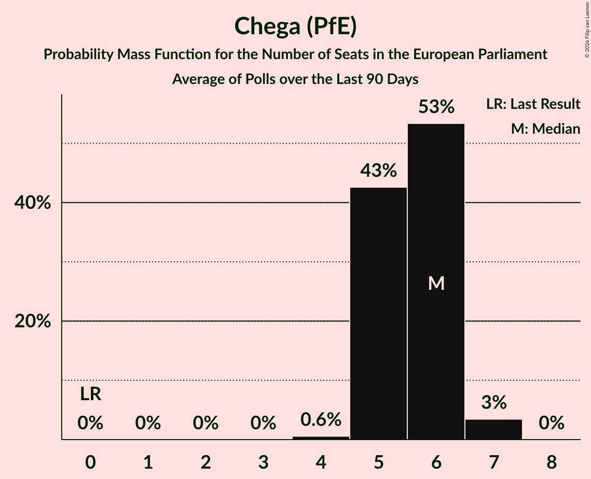

# Chega (PfE)

<a href="#voting-intentions">Voting Intentions</a> | <a href="#seats">Seats</a>

## Voting Intentions

Last result: **0.0%** (General Election of 9 June 2024)

### Confidence Intervals

| Period     | Polling firm/Commissioner(s) | Median | 80% Confidence Interval | 90% Confidence Interval | 95% Confidence Interval | 99% Confidence Interval |
|:----------:|:----------------:|:-----------:|:-----------------------:|:-----------------------:|:-----------------------:|:-----------------------:|
| N/A | [Poll Average](average.html) | 22.2% | 20.0–24.5% | 19.4–25.1% | 18.9–25.7% | 17.9–26.8% |
| [23–27 October 2025](2025-10-27-Aximage.html) | Aximage   Diário de Notícias | 21.9% | N/A | N/A | N/A | N/A |
| [2–5 September 2025](2025-09-05-Aximage.html) | Aximage   Diário de Notícias | 26.8% | 24.6–29.3% | 23.9–30.0% | 23.4–30.6% | 22.3–31.8% |
| [7–14 August 2025](2025-08-14-Intercampus.html) | Intercampus   Correio da Manhã | 22.1% | 20.0–24.5% | 19.4–25.1% | 18.9–25.7% | 17.9–26.9% |
| [11–18 July 2025](2025-07-18-Intercampus.html) | Intercampus   Correio da Manhã | 20.3% | 18.2–22.6% | 17.6–23.2% | 17.1–23.8% | 16.2–24.9% |
| [5–15 June 2025](2025-06-15-Intercampus.html) | Intercampus   Correio da Manhã | 21.8% | 19.6–24.1% | 19.0–24.8% | 18.5–25.4% | 17.5–26.6% |
| [12–15 May 2025](2025-05-15-Pitagórica.html) | Pitagórica   CNN Portugal, Jornal de Notícias, TSF and TVI | 19.3% | 17.6–21.1% | 17.1–21.7% | 16.7–22.1% | 15.9–23.0% |
| [11–14 May 2025](2025-05-14-Pitagórica.html) | Pitagórica   CNN Portugal, Jornal de Notícias, TSF and TVI | 19.1% | 17.5–21.0% | 17.0–21.5% | 16.6–22.0% | 15.8–22.9% |
| [10–13 May 2025](2025-05-13-Pitagórica.html) | Pitagórica   CNN Portugal, Jornal de Notícias, TSF and TVI | 18.3% | 16.6–20.1% | 16.2–20.6% | 15.8–21.1% | 15.0–22.0% |
| [6–13 May 2025](2025-05-13-Consulmark2.html) | Consulmark2   Euronews and Sol | 15.6% | 13.8–17.7% | 13.3–18.3% | 12.9–18.8% | 12.1–19.8% |
| [6–13 May 2025](2025-05-13-CESOP–UCP.html) | CESOP–UCP   Público and RTP | 19.0% | 17.8–20.3% | 17.5–20.6% | 17.2–20.9% | 16.7–21.5% |
| [9–12 May 2025](2025-05-12-Pitagórica.html) | Pitagórica   CNN Portugal, Jornal de Notícias, TSF and TVI | 17.8% | 16.1–19.6% | 15.7–20.1% | 15.3–20.6% | 14.5–21.5% |
| [8–11 May 2025](2025-05-11-Pitagórica.html) | Pitagórica   CNN Portugal, Jornal de Notícias, TSF and TVI | 18.0% | 16.4–19.9% | 15.9–20.4% | 15.5–20.8% | 14.8–21.7% |
| [7–10 May 2025](2025-05-10-Pitagórica.html) | Pitagórica   CNN Portugal, Jornal de Notícias, TSF and TVI | 16.0% | N/A | N/A | N/A | N/A |
| [6–9 May 2025](2025-05-09-Pitágorica.html) | Pitágorica   CNN Portugal, Jornal de Notícias, TSF and TVI | 15.3% | 13.8–17.0% | 13.4–17.5% | 13.0–18.0% | 12.3–18.8% |
| [5–8 May 2025](2025-05-08-Pitagórica.html) | Pitagórica   CNN Portugal, Jornal de Notícias, TSF and TVI | 15.7% | 14.1–17.4% | 13.7–17.9% | 13.3–18.4% | 12.6–19.2% |
| [4–7 May 2025](2025-05-07-Pitagórica.html) | Pitagórica   CNN Portugal, Jornal de Notícias, TSF and TVI | 16.0% | N/A | N/A | N/A | N/A |
| [3–6 May 2025](2025-05-06-Pitagórica.html) | Pitagórica   CNN Portugal, Jornal de Notícias, TSF and TVI | 16.7% | 15.1–18.5% | 14.6–19.0% | 14.3–19.4% | 13.5–20.3% |
| [28 April–6 May 2025](2025-05-06-CESOP–UCP.html) | CESOP–UCP   Público and RTP | 20.0% | 18.7–21.4% | 18.4–21.8% | 18.0–22.1% | 17.4–22.8% |
| [2–5 May 2025](2025-05-05-Pitagórica.html) | Pitagórica   CNN Portugal, Jornal de Notícias, TSF and TVI | 16.8% | 15.2–18.6% | 14.8–19.1% | 14.4–19.5% | 13.6–20.4% |
| [24 April–5 May 2025](2025-05-05-Intercampus.html) | Intercampus   Correio da Manhã | 17.4% | 16.0–19.0% | 15.5–19.5% | 15.2–19.9% | 14.5–20.7% |
| [25 April–5 May 2025](2025-05-05-ICSISCTE.html) | ICS/ISCTE   Expresso and SIC Notícias | 19.0% | 17.4–20.6% | 17.0–21.1% | 16.6–21.5% | 15.9–22.3% |
| [1–5 May 2025](2025-05-05-Aximage.html) | Aximage   Diário de Notícias | 18.0% | 16.2–20.1% | 15.7–20.7% | 15.3–21.2% | 14.4–22.2% |
| [1–4 May 2025](2025-05-04-Pitagórica.html) | Pitagórica   CNN Portugal, Jornal de Notícias, TSF and TVI | 16.5% | N/A | N/A | N/A | N/A |
| [30 April–3 May 2025](2025-05-03-Pitagórica.html) | Pitagórica   CNN Portugal, Jornal de Notícias, TSF and TVI | 16.2% | N/A | N/A | N/A | N/A |
| [29 April–2 May 2025](2025-05-02-Pitagórica.html) | Pitagórica   CNN Portugal, Jornal de Notícias, TSF and TVI | 15.7% | 14.1–17.4% | 13.7–17.9% | 13.3–18.4% | 12.6–19.2% |
| [28 April–1 May 2025](2025-05-01-Pitagórica.html) | Pitagórica   CNN Portugal, Jornal de Notícias, TSF and TVI | 16.5% | N/A | N/A | N/A | N/A |
| [21–24 April 2025](2025-04-24-CESOP–UCP.html) | CESOP–UCP   Público and RTP | 19.0% | 17.6–20.5% | 17.2–21.0% | 16.9–21.3% | 16.2–22.1% |
| [14–22 April 2025](2025-04-22-Consulmark2.html) | Consulmark2   Euronews and Sol | 15.1% | 13.3–17.2% | 12.8–17.8% | 12.4–18.3% | 11.6–19.3% |
| [14–21 April 2025](2025-04-21-Pitagórica.html) | Pitagórica   CNN Portugal, Jornal de Notícias, TSF and TVI | 15.2% | 13.8–16.8% | 13.4–17.2% | 13.1–17.6% | 12.5–18.3% |
| [5–14 April 2025](2025-04-14-ICSISCTE.html) | ICS/ISCTE   Expresso and SIC Notícias | 21.0% | 19.3–23.0% | 18.8–23.5% | 18.4–24.0% | 17.5–25.0% |
| [4–9 April 2025](2025-04-09-Intercampus.html) | Intercampus   Correio da Manhã | 17.2% | 15.1–19.4% | 14.6–20.1% | 14.1–20.6% | 13.2–21.8% |
| [4–8 April 2025](2025-04-08-Aximage.html) | Aximage   Diário de Notícias | 18.6% | 16.8–20.6% | 16.2–21.2% | 15.8–21.7% | 15.0–22.7% |
| [1–6 April 2025](2025-04-06-Aximage.html) | Aximage   Folha Nacional | 20.5% | N/A | N/A | N/A | N/A |
| [27 March–3 April 2025](2025-04-03-Consulmark2.html) | Consulmark2   Euronews and Sol | 13.6% | 11.9–15.5% | 11.4–16.1% | 11.0–16.6% | 10.3–17.6% |
| [24–29 March 2025](2025-03-29-Pitagórica.html) | Pitagórica   CNN Portugal, Jornal de Notícias, TSF and TVI | 14.9% | 13.5–16.4% | 13.2–16.9% | 12.8–17.3% | 12.2–18.0% |
| [20–26 March 2025](2025-03-26-Intercampus.html) | Intercampus   Correio da Manhã | 14.2% | 12.4–16.3% | 11.9–16.9% | 11.5–17.5% | 10.7–18.5% |
| [17–26 March 2025](2025-03-26-CESOP–UCP.html) | CESOP–UCP   Público and RTP | 17.0% | 15.7–18.5% | 15.3–18.9% | 15.0–19.2% | 14.4–20.0% |
| [15–24 March 2025](2025-03-24-GfKMetris.html) | GfK Metris | 18.0% | 16.5–19.6% | 16.1–20.1% | 15.8–20.5% | 15.1–21.3% |
| [17–21 March 2025](2025-03-21-Aximage.html) | Aximage   Folha Nacional | 20.2% | 18.6–21.9% | 18.1–22.4% | 17.8–22.8% | 17.0–23.7% |
| [12–17 March 2025](2025-03-17-ICSISCTE.html) | ICS/ISCTE   Expresso and SIC Notícias | 16.2% | 14.1–18.7% | 13.5–19.4% | 13.0–20.1% | 12.1–21.3% |
| [11–13 March 2025](2025-03-13-Intercampus.html) | Intercampus   Correio da Manhã | 18.4% | 16.4–20.7% | 15.8–21.4% | 15.3–21.9% | 14.4–23.1% |
| [6–12 March 2025](2025-03-12-Consulmark2.html) | Consulmark2   Euronews and Sol | 16.5% | 14.7–18.6% | 14.2–19.2% | 13.7–19.7% | 12.9–20.7% |
| [4–10 March 2025](2025-03-10-Intercampus.html) | Intercampus   Correio da Manhã | 17.4% | 15.4–19.6% | 14.9–20.3% | 14.4–20.8% | 13.5–21.9% |
| [6–8 March 2025](2025-03-08-Aximage.html) | Aximage   Diário de Notícias | 17.3% | 15.5–19.4% | 14.9–20.0% | 14.5–20.5% | 13.6–21.6% |
| [3–6 March 2025](2025-03-06-Pitagórica.html) | Pitagórica   CNN Portugal, Jornal de Notícias, TSF and TVI | 13.4% | 11.8–15.3% | 11.4–15.9% | 11.0–16.4% | 10.3–17.3% |
| [23–27 February 2025](2025-02-27-Pitagórica.html) | Pitagórica   CNN Portugal, Jornal de Notícias, TSF and TVI | 17.5% | 15.3–20.1% | 14.6–20.9% | 14.1–21.5% | 13.1–22.8% |
| [23–28 January 2025](2025-01-28-Aximage.html) | Aximage   Diário de Notícias | 18.4% | 16.7–20.2% | 16.2–20.8% | 15.8–21.2% | 15.1–22.1% |
| [21–26 January 2025](2025-01-26-Pitagórica.html) | Pitagórica   CNN Portugal, Jornal de Notícias, TSF and TVI | 16.8% | 14.6–19.4% | 13.9–20.1% | 13.4–20.7% | 12.4–22.0% |
| [21–26 January 2025](2025-01-26-Intercampus.html) | Intercampus   Correio da Manhã | 17.3% | 15.4–19.5% | 14.9–20.1% | 14.4–20.7% | 13.5–21.8% |
| [16–21 January 2025](2025-01-21-Aximage.html) | Aximage   Folha Nacional | 20.4% | N/A | N/A | N/A | N/A |
| [9–20 January 2025](2025-01-20-ICSISCTE.html) | ICS/ISCTE   Expresso and SIC Notícias | 17.0% | 15.4–18.8% | 15.0–19.3% | 14.6–19.8% | 13.8–20.7% |
| [28 December 2024–5 January 2025](2025-01-05-Pitagórica.html) | Pitagórica   CNN Portugal, Jornal de Notícias, TSF and TVI | 16.2% | 14.1–18.8% | 13.5–19.6% | 13.0–20.2% | 12.0–21.5% |
| [21–27 November 2024](2024-11-27-Intercampus.html) | Intercampus   CMTV | 16.2% | 14.4–18.3% | 13.9–18.8% | 13.5–19.4% | 12.7–20.4% |
| [15–22 November 2024](2024-11-22-Aximage.html) | Aximage   Folha Nacional | 20.9% | 19.1–22.8% | 18.6–23.4% | 18.2–23.8% | 17.4–24.8% |
| [13–19 November 2024](2024-11-19-Aximage.html) | Aximage   Diário de Notícias | 18.2% | N/A | N/A | N/A | N/A |
| [17–23 October 2024](2024-10-23-CESOP–UCP.html) | CESOP–UCP   Antena 1, Público and RTP | 18.0% | 16.6–19.7% | 16.2–20.1% | 15.8–20.5% | 15.1–21.3% |
| [4–10 October 2024](2024-10-10-Intercampus.html) | Intercampus   Correio da Manhã and Negócios | 14.1% | 12.4–16.0% | 11.9–16.6% | 11.5–17.0% | 10.8–18.0% |
| [30 September–5 October 2024](2024-10-05-Aximage.html) | Aximage   Diário de Notícias | 15.1% | 13.6–16.8% | 13.1–17.3% | 12.8–17.7% | 12.1–18.6% |
| [29 August–4 September 2024](2024-09-04-Intercampus.html) | Intercampus   CMTV | 14.7% | 13.0–16.7% | 12.5–17.3% | 12.1–17.8% | 11.4–18.8% |
| [19–26 July 2024](2024-07-26-Intercampus.html) | Intercampus   CMTV, Correio da Manhã and Negócios | 15.4% | 13.7–17.5% | 13.2–18.0% | 12.8–18.5% | 12.0–19.5% |
| [7–13 July 2024](2024-07-13-CESOP–UCP.html) | CESOP–UCP   RTP | 14.0% | 12.7–15.5% | 12.3–16.0% | 11.9–16.4% | 11.3–17.1% |
| [3–8 July 2024](2024-07-08-Aximage.html) | Aximage   Diário de Notícias, Jornal de Notícias and TSF Rádio Notícias | 17.5% | 15.9–19.3% | 15.4–19.8% | 15.0–20.3% | 14.3–21.2% |

### Probability Mass Function

The following table shows the probability mass function per percentage block of voting intentions for the [poll average](average.html) for Chega (PfE).

| Voting Intentions | Probability | Accumulated | Special Marks |
|:-----------------:|:-----------:|:-----------:|:-------------:|
| 0.0–0.5% | 0% | 100% | Last Result |
| 0.5–1.5% | 0% | 100% |  |
| 1.5–2.5% | 0% | 100% |  |
| 2.5–3.5% | 0% | 100% |  |
| 3.5–4.5% | 0% | 100% |  |
| 4.5–5.5% | 0% | 100% |  |
| 5.5–6.5% | 0% | 100% |  |
| 6.5–7.5% | 0% | 100% |  |
| 7.5–8.5% | 0% | 100% |  |
| 8.5–9.5% | 0% | 100% |  |
| 9.5–10.5% | 0% | 100% |  |
| 10.5–11.5% | 0% | 100% |  |
| 11.5–12.5% | 0% | 100% |  |
| 12.5–13.5% | 0% | 100% |  |
| 13.5–14.5% | 0% | 100% |  |
| 14.5–15.5% | 0% | 100% |  |
| 15.5–16.5% | 0% | 100% |  |
| 16.5–17.5% | 0.2% | 100% |  |
| 17.5–18.5% | 1.2% | 99.8% |  |
| 18.5–19.5% | 4% | 98.6% |  |
| 19.5–20.5% | 11% | 94% |  |
| 20.5–21.5% | 19% | 83% |  |
| 21.5–22.5% | 23% | 64% | Median |
| 22.5–23.5% | 20% | 42% |  |
| 23.5–24.5% | 13% | 22% |  |
| 24.5–25.5% | 6% | 9% |  |
| 25.5–26.5% | 2% | 3% |  |
| 26.5–27.5% | 0.6% | 0.8% |  |
| 27.5–28.5% | 0.1% | 0.2% |  |
| 28.5–29.5% | 0% | 0% |  |

## Seats

Last result: **0** seats (General Election of 9 June 2024)

### Confidence Intervals

| Period     | Polling firm/Commissioner(s) | Median | 80% Confidence Interval | 90% Confidence Interval | 95% Confidence Interval | 99% Confidence Interval |
|:----------:|:----------------:|:------:|:-----------------------:|:-----------------------:|:-----------------------:|:-----------------------:|
| N/A | [Poll Average](average.html) | 5 | 5–6 | 4–6 | 4–6 | 4–6 |
| [23–27 October 2025](2025-10-27-Aximage.html) | Aximage   Diário de Notícias |  |  |  |  |  |
| [2–5 September 2025](2025-09-05-Aximage.html) | Aximage   Diário de Notícias | 6 | 6–7 | 6–7 | 5–7 | 5–8 |
| [7–14 August 2025](2025-08-14-Intercampus.html) | Intercampus   Correio da Manhã | 5 | 5–6 | 4–6 | 4–6 | 4–6 |
| [11–18 July 2025](2025-07-18-Intercampus.html) | Intercampus   Correio da Manhã | 5 | 4–5 | 4–6 | 4–6 | 4–6 |
| [5–15 June 2025](2025-06-15-Intercampus.html) | Intercampus   Correio da Manhã | 5 | 4–6 | 4–6 | 4–6 | 4–6 |
| [12–15 May 2025](2025-05-15-Pitagórica.html) | Pitagórica   CNN Portugal, Jornal de Notícias, TSF and TVI | 4 | 4–5 | 4–5 | 4–5 | 3–5 |
| [11–14 May 2025](2025-05-14-Pitagórica.html) | Pitagórica   CNN Portugal, Jornal de Notícias, TSF and TVI | 4 | 4–5 | 4–5 | 4–5 | 3–5 |
| [10–13 May 2025](2025-05-13-Pitagórica.html) | Pitagórica   CNN Portugal, Jornal de Notícias, TSF and TVI | 4 | 4–5 | 4–5 | 3–5 | 3–5 |
| [6–13 May 2025](2025-05-13-Consulmark2.html) | Consulmark2   Euronews and Sol | 3 | 3–4 | 3–4 | 3–4 | 3–5 |
| [6–13 May 2025](2025-05-13-CESOP–UCP.html) | CESOP–UCP   Público and RTP | 4 | 4–5 | 4–5 | 4–5 | 4–5 |
| [9–12 May 2025](2025-05-12-Pitagórica.html) | Pitagórica   CNN Portugal, Jornal de Notícias, TSF and TVI | 4 | 4 | 3–5 | 3–5 | 3–5 |
| [8–11 May 2025](2025-05-11-Pitagórica.html) | Pitagórica   CNN Portugal, Jornal de Notícias, TSF and TVI | 4 | 4–5 | 4–5 | 3–5 | 3–5 |
| [7–10 May 2025](2025-05-10-Pitagórica.html) | Pitagórica   CNN Portugal, Jornal de Notícias, TSF and TVI |  |  |  |  |  |
| [6–9 May 2025](2025-05-09-Pitágorica.html) | Pitágorica   CNN Portugal, Jornal de Notícias, TSF and TVI | 3 | 3–4 | 3–4 | 3–4 | 3–4 |
| [5–8 May 2025](2025-05-08-Pitagórica.html) | Pitagórica   CNN Portugal, Jornal de Notícias, TSF and TVI | 4 | 3–4 | 3–4 | 3–4 | 3–4 |
| [4–7 May 2025](2025-05-07-Pitagórica.html) | Pitagórica   CNN Portugal, Jornal de Notícias, TSF and TVI |  |  |  |  |  |
| [3–6 May 2025](2025-05-06-Pitagórica.html) | Pitagórica   CNN Portugal, Jornal de Notícias, TSF and TVI | 4 | 3–4 | 3–4 | 3–4 | 3–5 |
| [28 April–6 May 2025](2025-05-06-CESOP–UCP.html) | CESOP–UCP   Público and RTP | 5 | 4–5 | 4–5 | 4–5 | 4–5 |
| [2–5 May 2025](2025-05-05-Pitagórica.html) | Pitagórica   CNN Portugal, Jornal de Notícias, TSF and TVI | 4 | 3–4 | 3–4 | 3–4 | 3–5 |
| [24 April–5 May 2025](2025-05-05-Intercampus.html) | Intercampus   Correio da Manhã | 4 | 4 | 3–5 | 3–5 | 3–5 |
| [25 April–5 May 2025](2025-05-05-ICSISCTE.html) | ICS/ISCTE   Expresso and SIC Notícias | 4 | 4–5 | 4–5 | 4–5 | 4–5 |
| [1–5 May 2025](2025-05-05-Aximage.html) | Aximage   Diário de Notícias | 4 | 4–5 | 4–5 | 3–5 | 3–5 |
| [1–4 May 2025](2025-05-04-Pitagórica.html) | Pitagórica   CNN Portugal, Jornal de Notícias, TSF and TVI |  |  |  |  |  |
| [30 April–3 May 2025](2025-05-03-Pitagórica.html) | Pitagórica   CNN Portugal, Jornal de Notícias, TSF and TVI |  |  |  |  |  |
| [29 April–2 May 2025](2025-05-02-Pitagórica.html) | Pitagórica   CNN Portugal, Jornal de Notícias, TSF and TVI | 3 | 3–4 | 3–4 | 3–4 | 3–4 |
| [28 April–1 May 2025](2025-05-01-Pitagórica.html) | Pitagórica   CNN Portugal, Jornal de Notícias, TSF and TVI |  |  |  |  |  |
| [21–24 April 2025](2025-04-24-CESOP–UCP.html) | CESOP–UCP   Público and RTP | 4 | 4–5 | 4–5 | 4–5 | 4–5 |
| [14–22 April 2025](2025-04-22-Consulmark2.html) | Consulmark2   Euronews and Sol | 3 | 3–4 | 3–4 | 3–4 | 2–4 |
| [14–21 April 2025](2025-04-21-Pitagórica.html) | Pitagórica   CNN Portugal, Jornal de Notícias, TSF and TVI | 3 | 3–4 | 3–4 | 3–4 | 3–4 |
| [5–14 April 2025](2025-04-14-ICSISCTE.html) | ICS/ISCTE   Expresso and SIC Notícias | 5 | 4–5 | 4–5 | 4–6 | 4–6 |
| [4–9 April 2025](2025-04-09-Intercampus.html) | Intercampus   Correio da Manhã | 4 | 3–4 | 3–5 | 3–5 | 3–5 |
| [4–8 April 2025](2025-04-08-Aximage.html) | Aximage   Diário de Notícias | 4 | 4–5 | 4–5 | 4–5 | 3–5 |
| [1–6 April 2025](2025-04-06-Aximage.html) | Aximage   Folha Nacional |  |  |  |  |  |
| [27 March–3 April 2025](2025-04-03-Consulmark2.html) | Consulmark2   Euronews and Sol | 3 | 2–3 | 2–4 | 2–4 | 2–4 |
| [24–29 March 2025](2025-03-29-Pitagórica.html) | Pitagórica   CNN Portugal, Jornal de Notícias, TSF and TVI | 3 | 3–4 | 3–4 | 3–4 | 3–4 |
| [20–26 March 2025](2025-03-26-Intercampus.html) | Intercampus   Correio da Manhã | 3 | 3–4 | 2–4 | 2–4 | 2–4 |
| [17–26 March 2025](2025-03-26-CESOP–UCP.html) | CESOP–UCP   Público and RTP | 4 | 3–4 | 3–4 | 3–4 | 3–5 |
| [15–24 March 2025](2025-03-24-GfKMetris.html) | GfK Metris | 4 | 4 | 3–5 | 3–5 | 3–5 |
| [17–21 March 2025](2025-03-21-Aximage.html) | Aximage   Folha Nacional | 5 | 4–5 | 4–5 | 4–5 | 4–6 |
| [12–17 March 2025](2025-03-17-ICSISCTE.html) | ICS/ISCTE   Expresso and SIC Notícias | 4 | 3–4 | 3–4 | 3–4 | 2–5 |
| [11–13 March 2025](2025-03-13-Intercampus.html) | Intercampus   Correio da Manhã | 4 | 4–5 | 3–5 | 3–5 | 3–5 |
| [6–12 March 2025](2025-03-12-Consulmark2.html) | Consulmark2   Euronews and Sol | 4 | 3–4 | 3–4 | 3–5 | 3–5 |
| [4–10 March 2025](2025-03-10-Intercampus.html) | Intercampus   Correio da Manhã | 4 | 3–5 | 3–5 | 3–5 | 3–5 |
| [6–8 March 2025](2025-03-08-Aximage.html) | Aximage   Diário de Notícias | 4 | 3–4 | 3–5 | 3–5 | 3–5 |
| [3–6 March 2025](2025-03-06-Pitagórica.html) | Pitagórica   CNN Portugal, Jornal de Notícias, TSF and TVI | 3 | 3–4 | 2–4 | 2–4 | 2–4 |
| [23–27 February 2025](2025-02-27-Pitagórica.html) | Pitagórica   CNN Portugal, Jornal de Notícias, TSF and TVI | 4 | 3–5 | 3–5 | 3–5 | 3–5 |
| [23–28 January 2025](2025-01-28-Aximage.html) | Aximage   Diário de Notícias | 4 | 4–5 | 4–5 | 3–5 | 3–5 |
| [21–26 January 2025](2025-01-26-Pitagórica.html) | Pitagórica   CNN Portugal, Jornal de Notícias, TSF and TVI | 4 | 3–4 | 3–5 | 3–5 | 3–5 |
| [21–26 January 2025](2025-01-26-Intercampus.html) | Intercampus   Correio da Manhã | 4 | 3–5 | 3–5 | 3–5 | 3–5 |
| [16–21 January 2025](2025-01-21-Aximage.html) | Aximage   Folha Nacional |  |  |  |  |  |
| [9–20 January 2025](2025-01-20-ICSISCTE.html) | ICS/ISCTE   Expresso and SIC Notícias | 4 | 3–4 | 3–4 | 3–5 | 3–5 |
| [28 December 2024–5 January 2025](2025-01-05-Pitagórica.html) | Pitagórica   CNN Portugal, Jornal de Notícias, TSF and TVI | 4 | 3–4 | 3–4 | 3–5 | 2–5 |
| [21–27 November 2024](2024-11-27-Intercampus.html) | Intercampus   CMTV | 4 | 3–4 | 3–4 | 3–4 | 3–5 |
| [15–22 November 2024](2024-11-22-Aximage.html) | Aximage   Folha Nacional | 5 | 4–5 | 4–5 | 4–6 | 4–6 |
| [13–19 November 2024](2024-11-19-Aximage.html) | Aximage   Diário de Notícias |  |  |  |  |  |
| [17–23 October 2024](2024-10-23-CESOP–UCP.html) | CESOP–UCP   Antena 1, Público and RTP | 4 | 4–5 | 4–5 | 4–5 | 3–5 |
| [4–10 October 2024](2024-10-10-Intercampus.html) | Intercampus   Correio da Manhã and Negócios | 3 | 3–4 | 3–4 | 2–4 | 2–4 |
| [30 September–5 October 2024](2024-10-05-Aximage.html) | Aximage   Diário de Notícias | 3 | 3–4 | 3–4 | 3–4 | 3–4 |
| [29 August–4 September 2024](2024-09-04-Intercampus.html) | Intercampus   CMTV | 3 | 3–4 | 3–4 | 3–4 | 2–4 |
| [19–26 July 2024](2024-07-26-Intercampus.html) | Intercampus   CMTV, Correio da Manhã and Negócios | 3 | 3–4 | 3–4 | 3–4 | 3–5 |
| [7–13 July 2024](2024-07-13-CESOP–UCP.html) | CESOP–UCP   RTP | 3 | 3–4 | 3–4 | 3–4 | 2–4 |
| [3–8 July 2024](2024-07-08-Aximage.html) | Aximage   Diário de Notícias, Jornal de Notícias and TSF Rádio Notícias | 4 | 3–4 | 3–5 | 3–5 | 3–5 |

### Probability Mass Function

The following table shows the probability mass function per seat for the [poll average](average.html) for Chega (PfE).

| Number of Seats | Probability | Accumulated | Special Marks |
|:---------------:|:-----------:|:-----------:|:-------------:|
| 0 | 0% | 100% | Last Result |
| 1 | 0% | 100% |  |
| 2 | 0% | 100% |  |
| 3 | 0% | 100% |  |
| 4 | 8% | 100% |  |
| 5 | 69% | 92% | Median |
| 6 | 22% | 22% |  |
| 7 | 0.2% | 0.2% |  |
| 8 | 0% | 0% |  |

