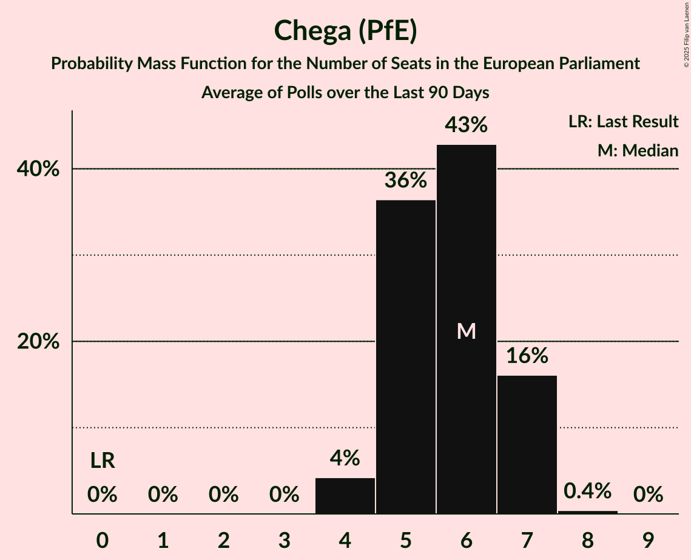

# Chega (PfE)

<a href="#voting-intentions">Voting Intentions</a> | <a href="#seats">Seats</a>

## Voting Intentions

Last result: **0.0%** (General Election of 9 June 2024)

### Confidence Intervals

| Period     | Polling firm/Commissioner(s) | Median | 80% Confidence Interval | 90% Confidence Interval | 95% Confidence Interval | 99% Confidence Interval |
|:----------:|:----------------:|:-----------:|:-----------------------:|:-----------------------:|:-----------------------:|:-----------------------:|
| N/A | [Poll Average](average.html) | 15.6% | 13.2–18.7% | 12.6–19.4% | 12.1–19.9% | 11.3–20.8% |
| [17–23 October 2024](2024-10-23-CESOP–UCP.html) | CESOP–UCP   Antena 1, Público and RTP | 18.0% | 16.6–19.7% | 16.2–20.1% | 15.8–20.5% | 15.1–21.3% |
| [4–10 October 2024](2024-10-10-Intercampus.html) | Intercampus   Correio da Manhã and Negócios | 14.1% | 12.4–16.0% | 11.9–16.6% | 11.5–17.0% | 10.8–18.0% |
| [30 September–5 October 2024](2024-10-05-Aximage.html) | Aximage   Diário de Notícias | 15.1% | 13.6–16.8% | 13.1–17.3% | 12.8–17.7% | 12.1–18.6% |
| [29 August–4 September 2024](2024-09-04-Intercampus.html) | Intercampus   CMTV | 14.7% | 13.0–16.7% | 12.5–17.3% | 12.1–17.8% | 11.4–18.8% |
| [19–26 July 2024](2024-07-26-Intercampus.html) | Intercampus   CMTV, Correio da Manhã and Negócios | 15.4% | 13.7–17.5% | 13.2–18.0% | 12.8–18.5% | 12.0–19.5% |
| [7–13 July 2024](2024-07-13-CESOP–UCP.html) | CESOP–UCP   RTP | 14.0% | 12.7–15.5% | 12.3–16.0% | 11.9–16.4% | 11.3–17.1% |
| [3–8 July 2024](2024-07-08-Aximage.html) | Aximage   Diário de Notícias, Jornal de Notícias and TSF Rádio Notícias | 17.5% | 15.9–19.3% | 15.4–19.8% | 15.0–20.3% | 14.3–21.2% |

### Probability Mass Function

The following table shows the probability mass function per percentage block of voting intentions for the [poll average](average.html) for Chega (PfE).

| Voting Intentions | Probability | Accumulated | Special Marks |
|:-----------------:|:-----------:|:-----------:|:-------------:|
| 0.0–0.5% | 0% | 100% | Last Result |
| 0.5–1.5% | 0% | 100% |  |
| 1.5–2.5% | 0% | 100% |  |
| 2.5–3.5% | 0% | 100% |  |
| 3.5–4.5% | 0% | 100% |  |
| 4.5–5.5% | 0% | 100% |  |
| 5.5–6.5% | 0% | 100% |  |
| 6.5–7.5% | 0% | 100% |  |
| 7.5–8.5% | 0% | 100% |  |
| 8.5–9.5% | 0% | 100% |  |
| 9.5–10.5% | 0.1% | 100% |  |
| 10.5–11.5% | 0.8% | 99.9% |  |
| 11.5–12.5% | 4% | 99.1% |  |
| 12.5–13.5% | 10% | 95% |  |
| 13.5–14.5% | 17% | 86% |  |
| 14.5–15.5% | 18% | 69% |  |
| 15.5–16.5% | 14% | 51% | Median |
| 16.5–17.5% | 12% | 36% |  |
| 17.5–18.5% | 12% | 24% |  |
| 18.5–19.5% | 8% | 12% |  |
| 19.5–20.5% | 3% | 4% |  |
| 20.5–21.5% | 0.7% | 0.8% |  |
| 21.5–22.5% | 0.1% | 0.1% |  |
| 22.5–23.5% | 0% | 0% |  |

## Seats

Last result: **0** seats (General Election of 9 June 2024)

### Confidence Intervals

| Period     | Polling firm/Commissioner(s) | Median | 80% Confidence Interval | 90% Confidence Interval | 95% Confidence Interval | 99% Confidence Interval |
|:----------:|:----------------:|:------:|:-----------------------:|:-----------------------:|:-----------------------:|:-----------------------:|
| N/A | [Poll Average](average.html) | 4 | 3–4 | 3–4 | 3–5 | 2–5 |
| [17–23 October 2024](2024-10-23-CESOP–UCP.html) | CESOP–UCP   Antena 1, Público and RTP | 4 | 4–5 | 4–5 | 4–5 | 3–5 |
| [4–10 October 2024](2024-10-10-Intercampus.html) | Intercampus   Correio da Manhã and Negócios | 3 | 3–4 | 3–4 | 2–4 | 2–4 |
| [30 September–5 October 2024](2024-10-05-Aximage.html) | Aximage   Diário de Notícias | 3 | 3–4 | 3–4 | 3–4 | 3–4 |
| [29 August–4 September 2024](2024-09-04-Intercampus.html) | Intercampus   CMTV | 3 | 3–4 | 3–4 | 3–4 | 2–4 |
| [19–26 July 2024](2024-07-26-Intercampus.html) | Intercampus   CMTV, Correio da Manhã and Negócios | 3 | 3–4 | 3–4 | 3–4 | 3–5 |
| [7–13 July 2024](2024-07-13-CESOP–UCP.html) | CESOP–UCP   RTP | 3 | 3–4 | 3–4 | 3–4 | 2–4 |
| [3–8 July 2024](2024-07-08-Aximage.html) | Aximage   Diário de Notícias, Jornal de Notícias and TSF Rádio Notícias | 4 | 3–4 | 3–5 | 3–5 | 3–5 |

### Probability Mass Function

The following table shows the probability mass function per seat for the [poll average](average.html) for Chega (PfE).

| Number of Seats | Probability | Accumulated | Special Marks |
|:---------------:|:-----------:|:-----------:|:-------------:|
| 0 | 0% | 100% | Last Result |
| 1 | 0% | 100% |  |
| 2 | 2% | 100% |  |
| 3 | 48% | 98% |  |
| 4 | 45% | 50% | Median |
| 5 | 5% | 5% |  |
| 6 | 0% | 0% |  |

