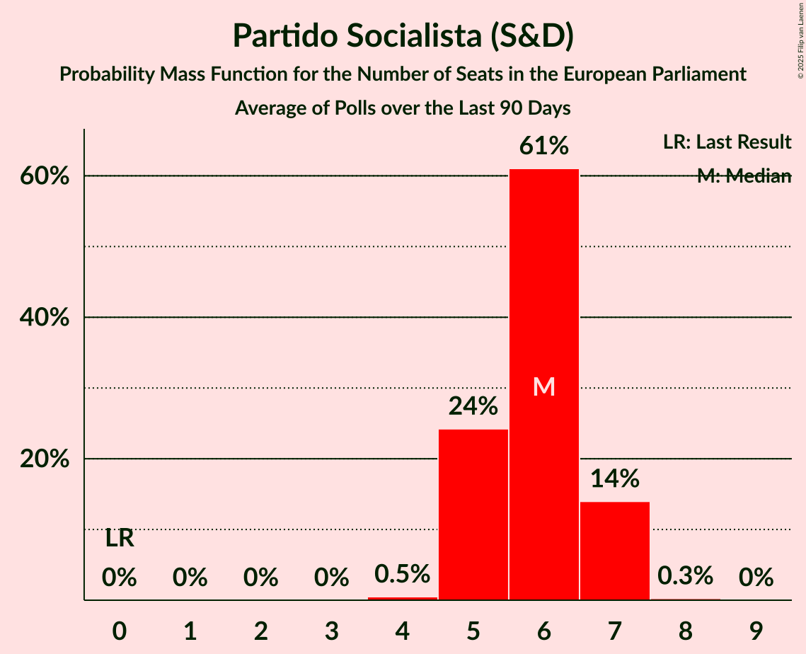

# Partido Socialista (S&D)

<a href="#voting-intentions">Voting Intentions</a> | <a href="#seats">Seats</a>

## Voting Intentions

Last result: **31.5%** (General Election of 26 May 2019)

### Confidence Intervals

| Period     | Polling firm/Commissioner(s) | Median | 80% Confidence Interval | 90% Confidence Interval | 95% Confidence Interval | 99% Confidence Interval |
|:----------:|:----------------:|:-----------:|:-----------------------:|:-----------------------:|:-----------------------:|:-----------------------:|
| N/A | [Poll Average](average.html) | 37.6% | 35.4–39.8% | 34.7–40.5% | 34.2–41.1% | 33.0–42.3% |
| [12–15 July 2019](2019-07-15-Aximage.html) | Aximage   Correio da Manhã and Negócios | 37.4% | 34.9–40.0% | 34.3–40.8% | 33.7–41.4% | 32.5–42.6% |
| [7–11 July 2019](2019-07-11-Eurosondagem.html) | Eurosondagem   Associação Mutualista Montepio | 37.3% | 35.4–39.3% | 34.8–39.8% | 34.4–40.3% | 33.4–41.3% |
| [15–27 June 2019](2019-06-27-ICSISCTE.html) | ICS/ISCTE   Expresso and SIC Notícias | 38.0% | 35.8–40.2% | 35.2–40.8% | 34.6–41.4% | 33.6–42.4% |
| [13–19 June 2019](2019-06-19-Aximage.html) | Aximage   Correio da Manhã and Negócios | 35.5% | 33.1–38.1% | 32.4–38.8% | 31.8–39.4% | 30.7–40.7% |
| [2–6 June 2019](2019-06-06-Eurosondagem.html) | Eurosondagem | 37.4% | 35.5–39.4% | 34.9–39.9% | 34.5–40.4% | 33.5–41.4% |

### Probability Mass Function

The following table shows the probability mass function per percentage block of voting intentions for the [poll average](average.html) for Partido Socialista (S&D).

| Voting Intentions | Probability | Accumulated | Special Marks |
|:-----------------:|:-----------:|:-----------:|:-------------:|
| 30.5–31.5% | 0% | 100% | Last Result |
| 31.5–32.5% | 0.2% | 100% |  |
| 32.5–33.5% | 0.8% | 99.8% |  |
| 33.5–34.5% | 3% | 98.9% |  |
| 34.5–35.5% | 8% | 96% |  |
| 35.5–36.5% | 16% | 88% |  |
| 36.5–37.5% | 22% | 72% |  |
| 37.5–38.5% | 21% | 50% | Median |
| 38.5–39.5% | 16% | 29% |  |
| 39.5–40.5% | 8% | 13% |  |
| 40.5–41.5% | 3% | 5% |  |
| 41.5–42.5% | 1.1% | 1.4% |  |
| 42.5–43.5% | 0.3% | 0.3% |  |
| 43.5–44.5% | 0.1% | 0.1% |  |
| 44.5–45.5% | 0% | 0% |  |

## Seats

Last result: **8** seats (General Election of 26 May 2019)

### Confidence Intervals

| Period     | Polling firm/Commissioner(s) | Median | 80% Confidence Interval | 90% Confidence Interval | 95% Confidence Interval | 99% Confidence Interval |
|:----------:|:----------------:|:------:|:-----------------------:|:-----------------------:|:-----------------------:|:-----------------------:|
| N/A | [Poll Average](average.html) | 9 | 8–9 | 8–10 | 8–10 | 7–10 |
| [12–15 July 2019](2019-07-15-Aximage.html) | Aximage   Correio da Manhã and Negócios | 9 | 8–9 | 8–9 | 8–10 | 7–10 |
| [7–11 July 2019](2019-07-11-Eurosondagem.html) | Eurosondagem   Associação Mutualista Montepio | 9 | 8–9 | 8–10 | 8–10 | 8–10 |
| [15–27 June 2019](2019-06-27-ICSISCTE.html) | ICS/ISCTE   Expresso and SIC Notícias | 9 | 8–9 | 8–10 | 8–10 | 8–10 |
| [13–19 June 2019](2019-06-19-Aximage.html) | Aximage   Correio da Manhã and Negócios | 8 | 8–9 | 7–9 | 7–9 | 7–10 |
| [2–6 June 2019](2019-06-06-Eurosondagem.html) | Eurosondagem | 9 | 8–9 | 8–9 | 8–10 | 8–10 |

### Probability Mass Function

The following table shows the probability mass function per seat for the [poll average](average.html) for Partido Socialista (S&D).

| Number of Seats | Probability | Accumulated | Special Marks |
|:---------------:|:-----------:|:-----------:|:-------------:|
| 7 | 0.8% | 100% |  |
| 8 | 33% | 99.2% | Last Result |
| 9 | 61% | 67% | Median |
| 10 | 6% | 6% |  |
| 11 | 0% | 0% | Majority |

